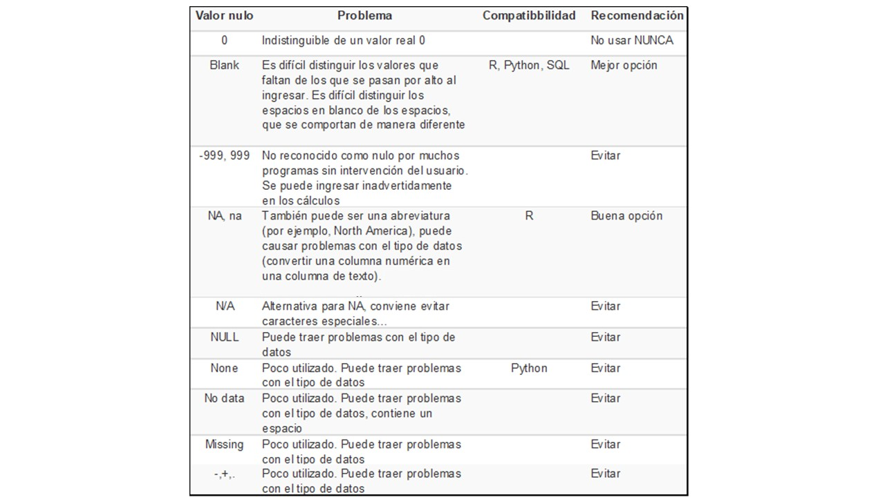
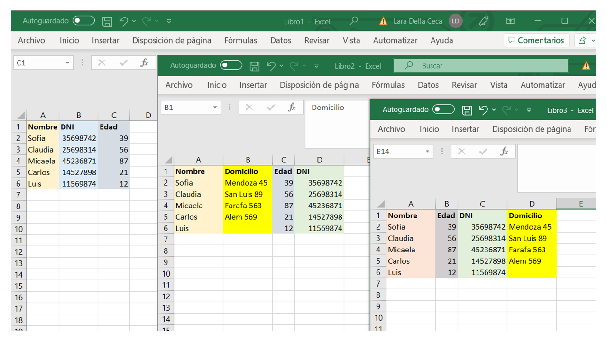
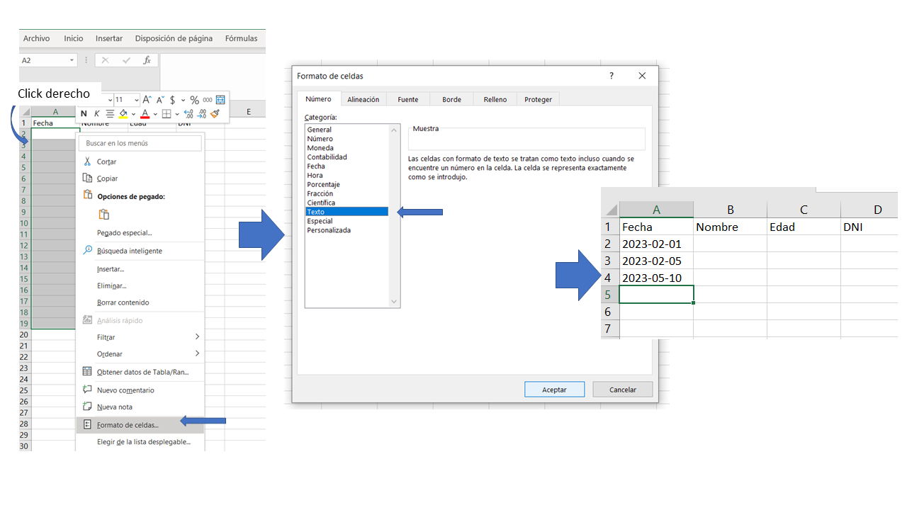
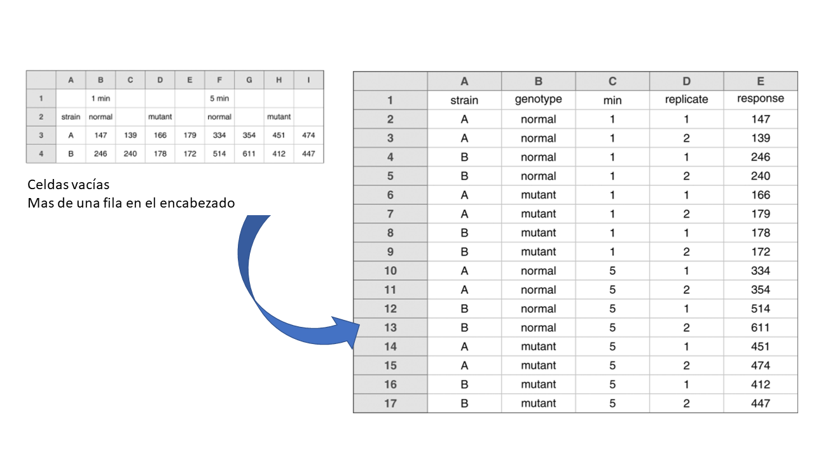
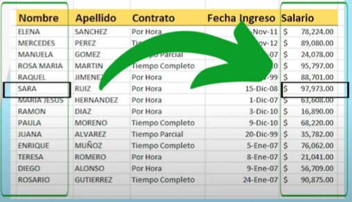

# Unidad 1 - Planilla de Cálculo

Los software de hojas de cálculo (tales como Microsoft Excel, Google Sheets y LibreOffice Calc, entre otros) son herramientas valiosas para ingresar, organizar y almacenar datos. También se pueden utilizar para cálculos, análisis y visualizaciones.

.png)

Algunos software ejemplo basados en hojas de cálculo

### Las más conocidas, Excel 365, Google Sheets y LibreOffice Calc: ¿cuál es la mejor opción?

Excel 365, Google Sheets y LibreOffice son programas de hojas de cálculo que permiten a los usuarios trabajar con datos numéricos y realizar cálculos complejos. Aunque todos ofrecen características similares, existen algunas diferencias notables entre ellos.

**Excel 365** es una aplicación de Microsoft Office que se ejecuta en el escritorio de la computadora y también en línea a través de la nube. Es conocido por su amplia gama de funciones y su capacidad para trabajar con grandes cantidades de datos. Excel 365 tiene una interfaz intuitiva y personalizable, lo que lo hace fácil de usar para usuarios principiantes y avanzados. Además, Excel 365 tiene una gran cantidad de plantillas y herramientas integradas que pueden ayudar a los usuarios a crear informes, gráficos y tablas dinámicas de manera rápida y sencilla. También es compatible con una amplia gama de formatos de archivo, lo que facilita la importación y exportación de datos.

Por otro lado, **Google Sheets** es una aplicación de hojas de cálculo en línea que se ejecuta en la nube de Google, es parte de Google Drive y Google Workspace. Es parte de la suite de oficina gratuita y accesible desde cualquier dispositivo con acceso a Internet. A diferencia de Excel 365, Google Sheets es una aplicación web, lo que significa que no requiere instalación en la computadora. Google Sheets se destaca por su capacidad para colaborar en tiempo real, lo que permite a los usuarios trabajar en una hoja de cálculo con otras personas simultáneamente. Además, Google Sheets tiene una amplia gama de herramientas de colaboración, como comentarios y permisos de edición, que lo hacen ideal para el trabajo en equipo. También es fácil de usar y tiene una interfaz simple e intuitiva.

Por último, **LibreOffice** es una suite de oficina gratuita y de código abierto que incluye una aplicación de hojas de cálculo llamada **Calc**. Al igual que Excel 365, Calc es una aplicación de escritorio que se ejecuta en la computadora. Aunque no tiene la misma cantidad de funciones que Excel 365, Calc es una buena opción para aquellos que buscan una alternativa gratuita y de código abierto. Tiene una interfaz similar a la de Excel 365 y es compatible con una amplia gama de formatos de archivo. Sin embargo, a diferencia de Excel 365, Calc no tiene tantas plantillas y herramientas integradas.

Además de estas características generales, en algunos casos es necesario conocer las limitaciones más específicas de cada programa. Esto se debe a que dependiendo del volumen de datos o los tiempos de procesamiento necesarios en el trabajo realizado, o si se requiere conocer la compatibilidad entre uno u otro para trabajar, pueden presentarse diferencias y limitaciones.

Por lo tanto, para realizar una comparación más detallada, es recomendable consultar algunos enlaces especializados en el tema que dejamos a continuación:

- Microsoft Excel 365, ver [acá](https://support.microsoft.com/en-us/office/excel-specifications-and-limits-16c69c74-3d6a-4aaf-ba35-e6eb276e8eaa)
- Google Sheets, ver [acá](https://support.google.com/docs/answer/37603?hl=en)
- LibreOffice Calc, ver [acá](https://www.notion.so/Unidad-1-Planilla-de-C-lculo-5782f4482d034ef3be50bd049a11e431?pvs=21)

<aside>
💡 Como se puede observar, cada programa tiene sus propias fortalezas y debilidades técnicas, por lo que la elección depende en gran medida de las necesidades y preferencias individuales de cada usuario.

</aside>

## Evitando dolores de cabeza: consejos para usar hojas de cálculo de manera más efectiva y sin cometer errores.

Las hojas de cálculo desempeñan un papel importante en los flujos de trabajo de distintas disciplinas y está claro que constituyen una herramienta valiosa que es poco probable que se abandone por completo.

Las hojas de cálculo se utilizan, en la mayoría de los casos, como una herramienta multipropósito para la entrada, el almacenamiento, el análisis y la visualización de datos. La mayoría de los programas de hojas de cálculo permiten a los usuarios realizar todas estas tareas.
Sin embargo, **desde el punto de vista del científico de datos, es conveniente que las hojas de cálculo se utilicen únicamente para la entrada y el almacenamiento de datos, y que el análisis y la visualización se realice por separado** (en otro programa o al menos en una copia separada del archivo de datos). Esto permitirá proteger la integridad de los datos (reduce el riesgo de contaminar o destruir los datos sin procesar en la hoja de cálculo) y facilitar el análisis posterior.

El análisis de los datos se simplifica si la disposición inicial de los mismos en los archivos se planifica pensando en el procesamiento que se realizará posteriormente (con algún otro software o con algún lenguaje de programación).

A continuación, se describirán algunos principios considerados ‘buenas prácticas’ que serán de utilidad para proyectos futuros ([Broman & Wo, 2017](https://www.tandfonline.com/doi/full/10.1080/00031305.2017.1375989)). Los mismos permitirán crear hojas de cálculo menos propensas a errores, más fáciles de procesar con distintos lenguajes de programación y más fáciles de compartir con colaboradores y el público.

### Mantener la consistencia/coherencia de:

1. **Los códigos de las variables categóricas**
Seleccionar una opción, y usar siempre la misma. Por ejemplo, en la variable *sexo* podemos seleccionar entre:

| 
  Femenino
   | 
  Masculino
   | 
  No_binario
   |
| --- | --- | --- |
| 
  femenino
   | 
  masculino
   | 
  no_binario
   |
| 
  f
   | 
  m
   | 
  nb
   |
| 
  F
   | 
  M
   | 
  X
   |
| 
  Fem
   | 
  Masc
   | 
  Nobin
   |
1. **Los nombres de las variables:**
Si en un archivo tenemos una variable llamada ‘Provincias’, usar el mismo nombre para la variable en otros archivos (no usar:  ‘Provincia’, ‘Prov’, etc). 
Por ejemplo, si en archivos que guardamos datos de experimentos de un laboratorio registro los datos de ‘glucosa en sangre después de 3 horas’ como ‘Glucosa_3horas’ en unos, ‘Gluc_3h’ y ‘Glucosa 3 horas’ en otros, el analista de datos tendrá que averiguar que todas estas variables corresponden a los mismos datos.
2. **El código utilizado para las celdas con datos faltantes**

1. **El diseño de los datos en múltiples archivos**
Si los datos están en distintos archivos y no tienen el mismo diseño (nombre de variables, posición de las columnas, etc.), combinar la información para poder realizar algún análisis tendrá mucho trabajo extra… y será más difícil automatizar el proceso.

Archivos con datos del mismo tipo pero con distinto diseño (orden de las columnas, variables)

## Otras buenas prácticas

1. **El nombre de los archivos**
    
    Establezca algún sistema para nombrar archivos. 
    
    Si un archivo se llama "Incendios_por_provincia_2015.csv", entonces no llame al archivo para el siguiente año "Incendios_2016_por_provincia.csv" sino "Incendios_por_provincia_2016.csv".
    Mantener un esquema de nomenclatura de archivos coherente ayudará a garantizar que los archivos permanezcan bien organizados y facilitará el procesamiento por lotes en caso de ser necesario.
    
    .png)
    
    Nombre de archivos que contienen información similar y no mantienen la coherencia
    
2. **El formato de las variables que contengan fechas** 
    
    Preferiblemente se utiliza con el formato estándar YYYY-MM-DD (basado en la [ISO 8601](https://es.wikipedia.org/wiki/ISO_8601)), por ejemplo 2023-01-20.  Si a veces escribe 20/1/2023 y a veces 20-1-23, será más difícil usar las fechas en los análisis o visualizaciones de datos.
    
3. **Las notas en la columna de *Observaciones* (si existe)
NUNCA agregar comentarios en las celdas ¡!** Mejor agregar una columna con notas/observaciones.
Si un comentario es ‘por debajo del nivel de detección’, siempre use el mismo (no lo modifique por, por ejemplo, ‘por debajo del niv de det.’).

.png)

Los comentarios en las celdas no pueden ser leidos por los lenguajes de programación.

### **Tener cuidado con los espacios en blanco extra en las celdas**

Una celda en blanco no es lo mismo que una celda que contiene un espacio, “femenino” es distinto de “ femenino “ (con un espacio antes y después).

### Elegir buenos nombres (de archivos y variables)

Tanto para nombres de variables como de archivos la mejor opción para un nombre es que sea **corto, pero significativo** (o sea que no sea tan corto…).

Reglas generales:

- **No usar espacios, ni en nombres de variables ni en nombres de archivos.** Hacen más difícil su lectura con los lenguajes de programación. Pueden usarse guiones en su remplazo, por ejemplo: glucosa_3_horas o glucosa-3-horas. No mezclar – con _ !!! (p. ej: glucosa**_**3**-**horas)
- **Evitar los caracteres especiales**, excepto los guiones. Algunos otros símbolos (por ejemplo: $,@,%,#,&,*,(,),!,/) suelen tener un significado especial en los lenguajes de programación
- **Cuidado con los espacios extra…**

| **Buen nombre** | **Buena alternativa** | **Evitar** |
| --- | --- | --- |
| Max_temp_C | MaxTemp | Maximum Temp (°C) |
| Precipitation_mm | Precipitation | precmm |
| Mean_year_growth | MeanYearGrowth | Mean growth/year |
| sex | sex | M/F |
| weight | weight | w. |
| cell_type | CellType | Cell Type |
| Observation_01 | first_observation | 1st Obs |

### **Escribir fechas en el formato YYYY-MM-DD (formato estándar global [ISO 8601](https://es.wikipedia.org/wiki/ISO_8601))**

Excel guarda las fechas internamente como un número, con distintas convenciones en la versión de Windows y Mac. Por lo tanto, es conveniente chequear la integridad de los datos de las fechas cuando provienen de Excel.

En general conviene setear la/s columna/s que contendrán fechas como celdas con tipo de dato Texto. Para ello: se selecciona toda la columna, en la barra de Menu se selecciona Formato →Celdas: Elegir “Texto”. Sin embargo si se realiza esto para una columna que ya contiene datos de fechas (con otro formato de celda) Excel convertirá en texto el número representativo con el que guardó esos datos.

Dar formato de texto a las columnas que contengan fechas para poder incluirlas en formato YYYY-MM-DD

De manera alternativa se pueden crear tres columnas separadas, una para el año, otra para el mes y otra para el día. En ese caso, los datos serán números y Excel no traerá problemas. También podrían representarse como un número de 8 dígitos con los valores YYYYMMDD, por ejemplo 20230101 correspondería a 2023-01-01.

### No dejar celdas vacías

Rellenar todas las celdas. Usar un valor común para los datos faltantes. Permite reconocer y dejar claro cuando el dato no está porque no se registró. Si no, no sabría si quien completó la tabla se olvidó de poner el dato o realmente no había dato que poner en dicha celda.

### Colocar un único dato por celda

Por ejemplo, si precisamos una columna que contenga un período de tiempo, conviene dividir esta variable en dos, una columna para *Periodo_inicio* y otra para *Periodo_fin*.

O si deseamos incluir las unidades, por ejemplo ‘3505 g’, podría colocarse la unidad en el nombre de la columna, p. ej. *Peso_nacimiento_g*.

Tampoco deben unirse celdas… no cumple con la regla de no dejar celdas vacías!

### Diseño rectangular

El mejor diseño para contener datos dentro de una hoja de cálculo es un solo rectángulo cuyas filas contengan casos y las columnas variables.
La primera fila debe contener nombres de variables, no utilizar más de una fila para los nombres de variables.

En general, en un mismo archivo de Excel encontramos tablas de datos en distintas hojas de cálculo. Es preferible tener múltiples archivos con una sola hoja de cálculo para poder guardar más fácilmente los datos como archivos csv.

Diseño rectangular simple, facilita la lectura de la información con lenguajes de programación.

### **Crear un diccionario de los datos**

Es útil tener un archivo separado que explique a qué corresponde cada variable. Y es útil que el mismo este presentado en forma rectangular, para que el analista de datos pueda usarlo en los análisis. Dicho *diccionario de datos* podría contener:

- el nombre exacto de la variable como existe en el archivo de datos
- una versión del nombre de la variable que podría usarse en visualizaciones de datos
- una explicación más detallada de lo que significa la variable
- las unidades de medida
- los valores mínimos y máximos esperados

Esto es parte lo que suele denominarse metadatos: información sobre los datos.

.png)

Ejemplo de diccionario de datos sobre las variables de un archivo.

### No hacer cálculos en los archivos

A menudo, los archivos de Excel incluyen todo tipo de cálculos y gráficos. El archivo de datos principal debería contener solo los datos y nada más: sin cálculos, sin gráficos.
El archivo de datos primario debería almacenar los datos prístinos. Es conveniente protegerlo contra escritura y hacer una copia de seguridad. Si se desea hacer algunos análisis en Excel, se puede crear una copia del archivo y hacer los cálculos y gráficos en la copia.

### **NO usar colores de fuente o resaltado como información**

El formato de las celdas es agradable visualmente, pero es difícil extraer esa información para usarla en un análisis posterior. Los programas de análisis pueden manejar mucho más fácilmente los datos almacenados en una columna que los datos codificados como un formato diferente (resaltado de celda, fuente, negrita, etc.). Esa información, lo más probable es que se pierda completamente.

Es preferible incluir una columna de *Observaciones.*

### Hacer backups..

### Utilizar la validación de datos para evitar errores

La validación de datos es una función que permite controlar qué tipo de datos son ingresados en una celda o un grupo de celdas. Esta función se utiliza para evitar el registro de datos erróneos en las hojas de cálculo y permite establecer parámetros (rangos de fechas, valores límite, etc.) para que una misma columna o grupo de celdas conserven las mismas características o se encuentren dentro de un mismo intervalo.

[Cómo validar datos en una columna con Google Sheets](https://docs.google.com/presentation/d/1Xg5bBjX8sNoQtC6ATa6h9o_Ptmx7OPmbGN6kkuFheC0/edit?usp=sharing)

Cómo validar datos en una columna con Google Sheets

## Funciones útiles de búsqueda en planillas de cálculo.

Una función es una fórmula predefinida que realiza cálculos utilizando valores específicos en un orden particular.
En [este link](https://support.google.com/docs/table/25273?hl=es) pueden encontrar la lista de funciones disponibles a utilizar en Google Sheets.

A continuación se describen algunas funciones que consideramos útiles conocer.

### VLOOKUP

La función **VLOOKUP(BUSCARV)** o búsqueda vertical, es útil para buscar un valor específico en una columna de una tabla y recuperar un valor relacionado en otra columna. 

Esta función recibe los datos de referencia como parámetros, incluyendo el valor que se busca en la primera columna (valor de búsqueda) y el rango de celdas que contiene la tabla de referencia (rango). También se especifica el número de columna donde se encuentra el valor deseado (índice) en la fila encontrada. Es importante saber que el índice indica cual es la primer columna en el rango deseado dado que la función revuelve el valor correspondiente a la fila en esa primera columna. 

Así, si las columnas de arriba se ordenan de A hasta E y el rango ocupa toda la planilla. La referencia a E debe ser la primer columna indicada por el índice, índice (4)

La forma general:

=**VLOOKUP(valor_búsqueda, rango, Índice, [está_ordenada])**

En el ejemplo

=**VLOOKUP(A6, A1:E14, 4)** 

<aside>
💡 Nota: **[está_ordenada] ([is_sorted])** Es un valor lógico que indica si se desea una coincidencia exacta o no. Si este argumento se omite o se establece en VERDADERO, se realizará una búsqueda aproximada y se devolverá el valor más cercano al valor buscado. Si se establece en FALSO o 0, se realizará una búsqueda exacta y solo se devolverá el valor si se encuentra una coincidencia exacta.

</aside>

[Podemos pasar el nombre como referencia o como string](https://docs.google.com/presentation/d/1VS6vrbyXIt7uMIVFn8l0xTFyESO6hlcQkztSrrbG9fQ/edit#slide=id.g214ea5c67ad_0_52)

Podemos pasar el nombre como referencia o como string

Se puede buscar un valor en un rango de celdas que pertenece a otra hoja de Excel utilizando la función **VLOOKUP**. Para hacerlo, se debe especificar el nombre de la hoja donde se encuentra el rango de celdas en la referencia de la tabla.

Por ejemplo, supongamos que se tiene una hoja llamada "Hoja1" donde se encuentra el valor buscado en la celda A1 y se desea buscar ese valor en un rango de celdas que se encuentra en la hoja "Hoja2" y devolver un valor en la columna B de esa hoja. La fórmula VLOOKUP sería la siguiente:

**=VLOOKUP(Hoja1!A1,Hoja2!A:B,2,FALSE)**

Tener en cuenta que el nombre de la hoja debe estar escrito exactamente igual que como se encuentra en el libro de Google Sheets y debe estar separado por un signo de exclamación (!) de la referencia de la celda o del rango de celdas.

Sin embargo, **VLOOKUP** tiene una limitación importante en cuanto a su búsqueda. Dado que la clave de búsqueda (valor_buscado) debe estar en la primera columna del rango (matriz de tabla).

Otra limitación es que, en su forma básica, no puede buscar hacia la izquierda. 

<aside>
💡

**HLOOKUP** funciona en filas.

</aside>

### INDEX + MATCH

La principal diferencia con **VLOOKUP** es la referencia de la columna estática.  Con esta relación entre INDICE y COINCIDIR podemos determinar la columna específica de la que queremos obtener el valor. También **VLOOKUP** es mucho más lenta en tablas muy grandes al usar todo el rango para la búsqueda.  

La función **INDEX (INDICE)**  devuelve el valor de una celda en un rango pasando una dimensión (rango de búsqueda = columna o fila) o dos (rango de búsqueda = matriz o tabla).

[Esta búsqueda no necesita especificar indice de columna porque hay una sola. ](https://docs.google.com/presentation/d/1iooid_p3-ezDwxkr_VOSBLJKvymm2SziItrlXSr4OZw/edit#slide=id.p)

Esta búsqueda no necesita especificar indice de columna porque hay una sola. 

La función **MATCH (COINCIDIR)** devuelve la posición de un valor dado dentro de un rango, por lo que no suele utilizarse sola. 

[ **False** es igual a **0**, búsqueda exacta.](https://docs.google.com/presentation/d/1tJrmzDhLD4V388v-4G5fBFZGOAz9vwqkRiurHYQL0ac/edit#slide=id.g215a933b4d9_0_0)

 **False** es igual a **0**, búsqueda exacta.

 

El uso conjunto de las funciones **INDICE** y **COINCIDIR** permite una flexibilidad mayor que la función de busqueda vertical. 

### Ejercicio comparando VLOOKUP vs INDEX+MATCH

[https://docs.google.com/presentation/d/1FHrV3WKldcXO5-jVQodrLiWCSQUMf-BCXycB9lIh7rs/edit#slide=id.g215cab9648b_0_38](https://docs.google.com/presentation/d/1FHrV3WKldcXO5-jVQodrLiWCSQUMf-BCXycB9lIh7rs/edit#slide=id.g215cab9648b_0_38)

### 4 razones principales para usar INDEX MATCH en lugar de VLOOKUP

**1)** Búsqueda de derecha a izquierda. **VLOOKUP** no puede mirar a su izquierda, lo que significa que su valor de búsqueda siempre debe residir en la columna más a la izquierda de la tabla. **INDEX+ MATCH** puede realizar búsquedas a la izquierda con facilidad.

**2)** Inserta o elimina columnas de forma segura. Las fórmulas de **VLOOKUP**  se rompen o entregan resultados incorrectos cuando se elimina o agrega una nueva columna a una tabla de búsqueda porque la sintaxis de **VLOOKUP**  requiere especificar el número de índice relativo de la columna de la que desea extraer los datos. Naturalmente, cuando agrega o elimina columnas, el número de índice cambia. Con **INDEX+MATCH**, especifica el rango de columna de retorno, no un número de índice. Como resultado, puede insertar y eliminar tantas columnas como desee sin preocuparse por actualizar cada fórmula asociada.

**3)** No hay límite para el tamaño de un valor de búsqueda. Al usar la función **VLOOKUP** , la longitud total de sus criterios de búsqueda no puede exceder los 255 caracteres; de lo contrario, terminará teniendo el #VALOR. error. Entonces, si su conjunto de datos contiene cadenas largas, **INDEX+ MATCH** es la única solución que funciona.

**4)** Mayor velocidad de procesamiento. Si sus tablas son relativamente pequeñas, apenas habrá una diferencia significativa en el rendimiento de Excel. Pero si sus hojas de trabajo contienen cientos o miles de filas y, en consecuencia, cientos o miles de fórmulas, **INDEX+MATCH** funcionará mucho más rápido que **VLOOKUP** porque Excel tendrá que procesar solo las columnas de búsqueda y devolución en lugar de toda la matriz de la tabla.

### XLOOKUP

Esta función es muy nueva en google sheet , se empezó a implementar en el año 2022. Y aumenta la complejidad y flexibilidad de VLOOKUP. 

La Función **XLOOKUP** le permite buscar en una columna o fila específica y devolver un valor de la misma fila o columna. A diferencia de la función VLOOKUP anterior se puede especificar la columna y no tomar todo el rango. Esto permite buscar a la izquierda cosa que no era posible en VLOOKUP.

Además tiene algunas otras ventajas, por ejemplo si cambiamos el rango de columnas no cambia el resultado y limita la posibilidad de error. 

 

<aside>
💡 Nota: Pero entonces…. ¿por qué aprender tantos usos parecidos? Simplemente porque en el trabajo diario comunmente se utilizan planillas de cálculos ya generadas y seguramente algunas tendrán soluciones planteadas con VLOOKUP o con INDEX+MATCH en su mayoría. Para entender como funcionan y modificarlas o reparar errores es necesario conocerlas. Tal vez, en caso de iniciar una planilla de cálculo, es mejor pensar en esta nueva función.

</aside>

**Manejo de errores**

Otra característica interesante es la posibilidad de inidicar un valor de retorno cuando la función encuentra error. Esto mismo puede realizarse con la función IFERROR anidando a VLOOKUP:

**=IFERROR( VLOOKUP(**…,…,…**) ,**  “No se encuentra el valor buscado” **)**

O sea, utilizando una función condicional que mediante un input error (en este caso resultado de VLOOKUP) permite indicar un mensaje o valor de reemplazo como retorno alternativo al error. Una buena práctica para utilizar con estas funciones.  

**Busquedas parciales** 

Hablamos del parámetro donde introducimos **0** para especificar que lo que queremos es una búsqueda exacta. También en XLOOKUP podemos aplicar el parametro **2** (comodín) para traer todo lo que puede contener el valor a buscar pasado en el primer parámetro **que debe ser pasado entre asteriscos.**

<aside>
💡 *Existen otras nuevas funciones y flexibilidades del uso de esta función pero las trataremos en esta introducción. Dejamos abierta la inquietud para quienes encuentren interés en el tema y puedan profundizar en las mismas, ya que en la web existe mucho material al respecto. Y discuciones en torno a el mejor uso posible y eficiencia en la implementación de cada una.*

</aside>

## Tablas dinámicas

Una tabla dinámica (o pivot table en inglés) en Excel es una herramienta avanzada para calcular, resumir y analizar grandes cantidades de datos de manera interactiva y visual en una hoja de cálculo. Es creada a partir de un rango de datos en la hoja de cálculo que contiene varias columnas con información**.** 
Las tablas dinámicas funcionan de forma un poco distinta dependiendo de la plataforma que use para ejecutar Excel (software de escritorio o Google Sheets).

Las tablas dinámicas o tablas pivote permiten:

- Consultar y realizar cálculos de grandes cantidades de datos de manera sencilla y rápida
- Visualizar los datos por categorías o subcategorías
- Expandir y contraer datos
- Filtrar, ordenar y agrupar datos
- Obtener distintos resúmenes de los datos: trasladar filas a columnas y viceversa

<aside>
💡 La tabla dinámica de las hojas de cálculo son similares a los resultados obtenidos con Groupby

</aside>

Las tablas dinámicas nos permiten pasar de una DB con este formato

| id_empleado | nombre | antigüedad | categoría | género |
| --- | --- | --- | --- | --- |
| 1 | Ivana | 4 | administrativo | F |
| 2 | Néstor | 3 | administrativo | M |
| 3 | Francisca | 10 | gerente | F |
| … | … | … | … |  |
| 123 | Claudio | 4 | operario | M |
| 124 | Julio | 6 | operario | M |

A una tabla resumen donde podemos mostrar la cantidad de empleados por categoría y género

| **Género** |  |  |
| --- | --- | --- |
| **Categoría** | **Femenino** | **Masculino** |
| **Administrativo** | 10 | 18 |
| **Operario** | 20 | 66 |
| **Gerente** | 5 | 6 |
| **Total** | 35 | 88 |

En la tabla dinámica se puede arrastrar y soltar las columnas que se desean analizar y se pueden seleccionar diferentes tipos de medidas resumen, como sumas, promedios, conteos, etc. También, se pueden aplicar filtros para mostrar solo ciertos datos, y se puede cambiar la organización y la presentación de la tabla dinámica de manera interactiva y visual.

 
<iframe src="https://docs.google.com/presentation/d/e/2PACX-1vRRpZf133Ylr9PfNRYQxw9TqstZecGNmuMH7QLxN8eK7D5dgaHB6cHBIrIT7uJEeW1YSTRSo13tuFAG/pub?start=false&loop=false&delayms=3000" width="800" height="450" allowfullscreen></iframe>