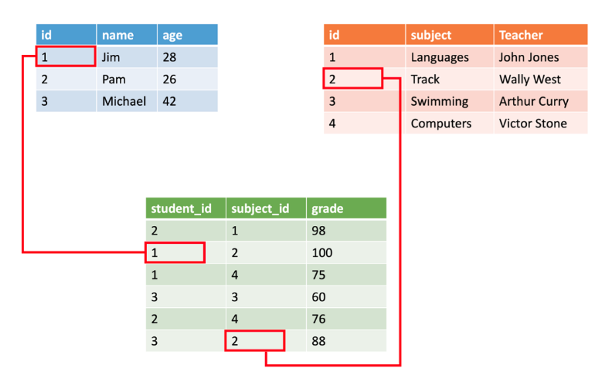
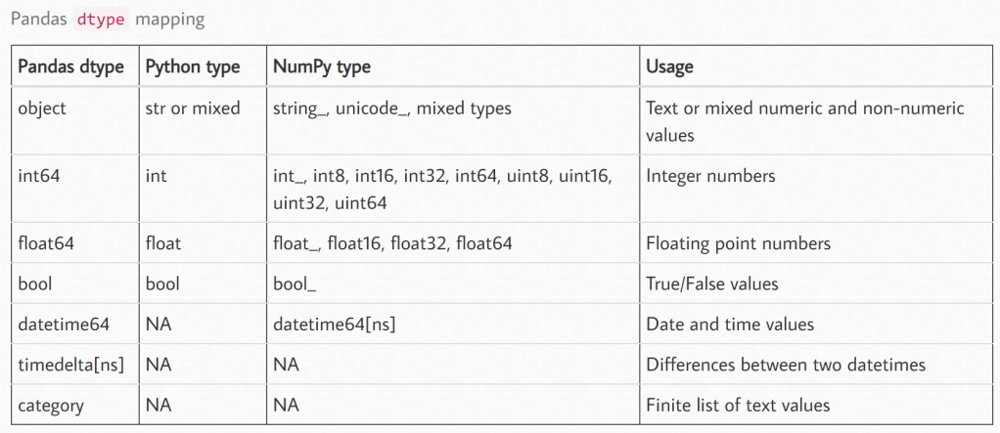
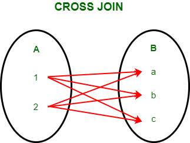

# Unidad 2 - Manipulación de datos

## ¿Qué son los datos?

Los datos son una porción de información de algún tema en particular que se guardan para ser utilizados en futuros análisis. Los datos pueden venir de tres formas: estructurados, no estructurados y semi-estructurados. Durante este curso, vamos a utilizar mayormente datos estructurados y algunos semi-estructurados.

## Datos estructurados, no estructurados y semi-estructurados


### Datos estructurados

Los datos estructurados son aquellos que poseen un formato estandarizado o claramente definido, lo que permite que tanto los sistemas informáticos como las personas puedan almacenarlos, procesarlos y analizarlos de manera eficiente. 

Habitualmente, este tipo de datos se organiza en forma de tablas compuestas por filas y columnas, donde cada fila representa un registro (u observación) y cada columna representa un atributo (o variable). Cada atributo tiene asociado un tipo de dato específico (por ejemplo, numérico, texto, fecha, lógico) y un formato consistente, lo que facilita su validación, consulta y análisis.

**Características más importantes:**

**Atributos definibles.** Los datos estructurados comparten un esquema fijo: todos los registros presentan el mismo conjunto de atributos y cada atributo cumple un rol claramente establecido.

**Atributos relacionales.** Las tablas de datos estructurados suelen contener campos comunes (claves o *keys*) que permiten establecer relaciones entre diferentes tablas, posibilitando la integración de múltiples conjuntos de datos.



**Almacenamiento.** Los datos estructurados se almacenan típicamente en bases de datos relacionales y se gestionan mediante sistemas de gestión de bases de datos. Su consulta y manipulación se realiza de forma estándar a través de lenguajes como SQL (*Structured Query Language*).

### Datos no estructurados

Los datos no estructurados son información que no posee un modelo de datos predefinido ni un esquema fijo, y cuya organización interna no sigue una estructura tabular. Por esta razón, no pueden representarse naturalmente mediante filas y columnas. Este tipo de datos suele presentarse en formatos libres o complejos, donde el significado está implícito en el contenido más que en una estructura explícita.

Ejemplos: correos electrónicos, mensajes de chat, documentos de texto, imágenes, audio, video, publicaciones en redes sociales, páginas web.

**Algunas diferencias respecto a los datos estructurados:**

**Facilidad de análisis.** Es considerablemente más difícil organizar, limpiar y analizar datos no estructurados, ya que no cuentan con un esquema explícito. Su procesamiento suele requerir técnicas específicas como procesamiento de lenguaje natural, visión por computadora o reconocimiento de patrones.

**Capacidad de búsqueda.** En los datos estructurados es sencillo realizar búsquedas y filtros porque los valores se almacenan en campos bien definidos (columnas), lo que permite aplicar condiciones precisas, por ejemplo: buscar todas las filas donde *edad > 30* o donde *ciudad = "Córdoba"*.

En los datos no estructurados, en cambio, no existen campos explícitos. Por ello, la búsqueda suele realizarse mediante:

- Búsqueda de texto completo (*full-text search*): se analizan los documentos como texto, identificando palabras o frases dentro del contenido completo (por ejemplo, buscar la palabra contrato dentro de miles de documentos PDF o correos electrónicos).

- Uso de metadatos: se agregan o extraen descriptores asociados a los archivos, como fecha de creación, autor, tipo de archivo, idioma o etiquetas asignadas manual o automáticamente, que permiten filtrar información sin analizar directamente el contenido principal.

- Técnicas de indexación: se construyen estructuras especiales (índices) que permiten localizar rápidamente términos, patrones o características dentro de grandes volúmenes de datos, reduciendo el tiempo de búsqueda y habilitando funcionalidades como ranking de relevancia o coincidencias aproximadas.

Como resultado, mientras que en los datos estructurados la búsqueda se apoya principalmente en el esquema y los campos, en los datos no estructurados la búsqueda depende de procesar el contenido, extraer información auxiliar y utilizar estructuras adicionales.

**Flexibilidad.** Los datos no estructurados presentan menos restricciones sobre su formato, lo que facilita la incorporación de nueva información sin necesidad de modificar un esquema preexistente.

```{dropdown} La era de los datos no estructurados
:class: seealso

Se estima que **más del 80 % de los datos generados a nivel mundial son *no estructurados***, y que una proporción significativa corresponde a datos textuales, como correos electrónicos, publicaciones en redes sociales, documentos y noticias.
```

### Datos semi-estructurados

Los datos semi-estructurados constituyen una categoría intermedia entre los datos estructurados y los no estructurados. Poseen una organización interna reconocible, pero no siguen un esquema rígido como el de las tablas en una base de datos relacional. Utilizan marcas, etiquetas (*tags*) o pares clave–valor para describir los datos, lo que permite representar jerarquías y relaciones simples.

Ejemplos típicos: archivos XML, JSON y YAML.

### XML

XML es un formato basado en texto que utiliza etiquetas para describir la información. Es legible tanto por humanos como por computadoras y permite representar estructuras jerárquicas.

El siguiente código representa el registro de una persona:

```xml
<Person Age="23">
    <FirstName>Quinn</FirstName>
    <LastName>Anderson</LastName>
    <Hobbies>
        <Hobby Type="Sports">Golf</Hobby>
        <Hobby Type="Leisure">Reading</Hobby>
        <Hobby Type="Leisure">Guitar</Hobby>
   </Hobbies>
</Person>

```

Resulta intuitivo observar que el ejemplo anterior contiene información sobre el nombre, apellido, edad y una lista de hobbies, donde cada hobby posee un tipo asociado (*Sports* o *Leisure*).

XML utiliza ***tags*** para darle forma a los datos. Los tags pueden ser:

- **Elementos,** como `<First Name>`.

- **Atributos,** como `Age='23'`. 

A su vez, los elementos pueden tener elementos hijos que permiten expresar relaciones, como `Hobby` dentro del elemento `Hobbies`.

### JSON (JavaScript Object Notation)

JSON es un formato de datos liviano, ampliamente utilizado para almacenar e intercambiar información, especialmente en aplicaciones web y APIs. Está basado en una **estructura de pares clave–valor**, admite listas (arreglos) y soporta estructuras jerárquicas.

Utiliza llaves `{}` para delimitar objetos y corchetes `[]` para listas.

A continuación, un ejemplo conocido:

```json
{
    "firstName": "Quinn",
    "lastName": "Anderson",
    "age": "23",
    "hobbies": [
        { "type": "Sports", "value": "Golf" },
        { "type": "Leisure", "value": "Reading" },
        { "type": "Leisure", "value": "Guitar" }
    ]
}
```

### YAML (YAML Ain’t Markup Language)

YAML es un lenguaje de serialización de datos diseñado para ser altamente legible para humanos. La estructura se define principalmente mediante indentación y saltos de línea, reduciendo el uso de caracteres especiales.

Ejemplo:

```yaml
firstName: Quinn
lastName: Anderson
age: 23
hobbies:
    - type: Sports
      value: Golf
    - type: Leisure
      value: Reading
    - type: Leisure
      value: Guitar
```

```{admonition} **XML vs. JSON vs. YAML**
:class: note

**XML.**
Formato basado en etiquetas. Más verboso. Usado históricamente en integración de sistemas y documentos estructurados.

**JSON.**
Formato liviano basado en pares clave–valor y listas. Estándar de facto para intercambio de datos en la web y servicios REST.

**YAML.**
Formato orientado a la legibilidad humana. Muy utilizado en archivos de configuración y automatización.
```

## Datos tabulares

Aunque una gran proporción de los datos generados en el mundo real es no estructurada, en el análisis de datos es muy común trabajar con información representada en formato tabular, es decir, organizada en filas y columnas. Este será el tipo de datos con el que trabajaremos principalmente a lo largo de esta asignatura.

Los datos tabulares pueden almacenarse en distintos tipos de archivos, entre ellos:

- `.csv`

- `.json`

- `.txt`

- `.html`

- `.parquet`


### Archivos orientados a filas y orientados a columnas

Antes de revisar cada tipo de archivo en particular, es preciso establecer una diferenciación entre las formas generales de organizar físicamente los datos tabulares en un archivo o sistema de almacenamiento:

#### Archivos orientados a filas (*row-oriented*)

Los datos se organizan por registros. Todos los valores correspondientes a una misma fila se almacenan juntos. Esto resulta eficiente cuando se necesita leer registros completos o insertar o modificar filas individuales.

Sin embargo, realizar consultas sobre un atributo específico para muchos registros (por ejemplo, leer solo la columna `anio_nacimiento` para todas las personas) puede ser menos eficiente, ya que es necesario leer también otros datos del registro que no se utilizarán.

#### Archivos orientados a columnas (*column-oriented*)

Los datos se organizan por columnas (campos o variables). Todos los valores de una misma columna se almacenan juntos. Esto es eficiente cuando se necesita acceder a una o pocas columnas o realizar operaciones analíticas sobre variables específicas.

Además, como todos los valores de una columna suelen ser del mismo tipo, estos formatos permiten una mejor compresión del archivo.

Para ilustrar lo anterior, supongamos que tenemos la siguiente tabla con información sobre un grupo de personas:

| dni | nombre | apellido | año_nacimiento |
| --- | --- | --- | --- |
| 40576890 | Pedro | Aguirre | 1995 |
| 32492645 | Julia | Martinez | 1988 |
| 30298710 | Camila | Suarez | 1985 |

Si el archivo se guarda **orientado a filas** tendrá esta forma:

| row | value |
| --- | --- |
| row 1 | 40576890 |
|  | Pedro |
|  | Aguirre |
|  | 1995 |
| row 2 | 32492645 |
|  | Julia |
|  | Martinez |
|  | 1988 |
| row 3 | 30298710 |
|  | Camila |
|  | Suarez |
|  | 1985 |

Por este motivo, desde un punto de vista conceptual, los datos se almacenarían de la siguiente manera:

Fila 1 →
40576890, Pedro, Aguirre, 1995

Fila 2 →
32492645, Julia, Martinez, 1988

Es decir, cada registro contiene todos sus atributos consecutivos.

Por el contrario, si el archivo se guarda **orientado a columnas** tendrá esta otra forma:

| column | value |
| --- | --- |
| dni | 40576890 |
|  | 32492645 |
|  | 40576890 |
| nombre | Pedro |
|  | Julia |
|  | Camila |
| apellido | Aguirre |
|  | Martinez |
|  | Suarez |
| año_nacimiento | 1995 |
|  | 1988 |
|  | 1985 |

Conceptualmente, los datos se almacenarían así:

Columna dni →
40576890, 32492645

Columna nombre →
Pedro, Julia

Columna apellido →
Aguirre, Martinez

Columna anio_nacimiento →
1995, 1988

Es decir, cada columna almacena consecutivamente los valores de ese atributo.

```{dropdown} Más info
:class: seealso

Los formatos de archivo orientados a columnas (más adelante se verá que Parquet es uno de ellos) son ampliamente utilizados en entornos de análisis y big data, mientras que muchos formatos tradicionales (como CSV) son esencialmente orientados a filas.

El siguiente [post](https://dataschool.com/data-modeling-101/row-vs-column-oriented-databases/#:~:text=Row%20oriented%20databases%20are%20databases,benefits%20for%20storing%20data%20quickly) muestra de forma clara las ventajas y desventajas de cada tipo de archivo.
```
### Tipos de archivos para el almacenamiento de datos tabulares

#### CSV

*Comma-Separated Values* (CSV) es un tipo de archivo que sirve para guardar y transferir datos tabulares. Los diferentes registros (las filas) se separan entre sí mediante saltos de líneas, mientras que los atributos/variables (las columnas) se separan usando la coma (también se pueden usar otros símbolos como el punto y coma o el *tab*). Hoy en día es uno de los formatos más utilizados en el análisis de datos.

```
Name, Age, Gender
John, 25, Male
Jane, 30, Female
Bob, 40, Male
```

*Ejemplo de archivo CSV*

**Aplicación**: el formato CSV se usa comúnmente para pequeños conjuntos de datos y como formato estándar para el intercambio de datos entre diferentes aplicaciones.

**Ventajas**:

- Casi todos los softwares que realizan tratamiento de datos pueden leerlos y escribirlos con facilidad, y además son fáciles de leer para las personas. Además, resulta sencillo generarlos desde casi cualquier lenguaje de programación.
- Se puede importar fácilmente a una amplia gama de herramientas de análisis de datos.

**Desventajas**:

- No es eficiente para almacenar grandes conjuntos de datos con tipos de datos complejos.
- Puede provocar la pérdida de datos si los valores contienen comas o saltos de línea.
Soporte limitado para la codificación.
- El formato está orientado a filas y por lo tanto realizar consultas de agregación, que interesan en la ciencia de datos, tiende a ser poco eficiente.
- Los archivos CSV no guardan información acerca del tipo de dato de su contenido puesto que todo se guarda en texto simple. Por lo tanto, el tipo de dato debe ser especificado al leer el archivo.
- Si bien los archivos CSV son de rápida lectura, cuando tienen un tamaño considerable (por contener un gran número de registros y/o columnas) este proceso puede volverse bastante lento.

#### TXT

El tipo de archivo de texto sin formato, también conocido como formato .txt, es uno de los formatos más simples y ampliamente utilizados para el almacenamiento de datos. Este formato se utiliza con frecuencia en el campo de la ciencia de datos debido a su facilidad de uso y compatibilidad con una amplia variedad de herramientas y lenguajes de programación. Cuando se almacenan datos tabulares, los archivos TXT suelen ser muy similares a CSV.

**Aplicaciones**

El formato .txt se utiliza comúnmente para almacenar grandes conjuntos de datos de texto, como documentos, transcripciones, registros de chat, mensajes de correo electrónico, etc.
Se utiliza en el procesamiento de lenguaje natural (NLP) para almacenar y analizar conjuntos de texto, como textos médicos, noticias, redes sociales, entre otros.
También es utilizado para el almacenamiento y procesamiento de datos estructurados, y también en el etiquetado de conjuntos de datos para procesamiento en el ámbito del *machine learning*.

**Ventajas**:

- Los archivos .txt son simples, lo que los hace fáciles de crear y manipular con una variedad de herramientas de programación.
- El formato es legible por humanos, lo que permite una fácil inspección y edición de datos.
- Los archivos de texto sin formato son adecuados para el intercambio de datos entre sistemas, dada la simplicidad para leerlos y generarlos, aunque es necesario conocer como están estructurados los datos para poder luego procesar su información.

**Desventajas**:

- La falta de estructura en los archivos de texto sin formato puede dificultar su procesamiento automatizado. Esto puede hacer que el análisis de datos sea más lento y menos preciso en algunos casos y que se requiera de validaciones o de la construcción de funciones especiales para interpretarlos (parseo).
- El formato .txt no es adecuado para almacenar datos complejos o información multimedia, como imágenes, audio o video. Tampoco resulta eficiente para almacenar grandes cantidades de datos con una alta densidad de información.

#### Apache Parquet

Parquet es un formato para el almacenamiento de datos tabulares orientado a columnas y está optimizado para grandes cargas de datos. En este sentido, es de uso común en sistemas de procesamiento de *Big Data* basados en [Hadoop](https://hadoop.apache.org/)**,** como [Hive](https://hive.apache.org/), [Impala](https://impala.apache.org/) y [Spark](https://spark.apache.org/). ****Fue desarrollado por Cloudera y Twitter en 2013 como un proyecto de código abierto. 

Parquet se basa en una representación de datos en columnas comprimidas, lo que lo hace muy eficiente para consultas analíticas que involucran grandes cantidades de datos, en comparación con otros formatos como CSV. 

**Aplicaciones**: 

Parquet es un formato popular para el procesamiento de *Big Data* y se utiliza en una variedad de aplicaciones analíticas y de ciencia de datos. Algunos casos de uso específico incluyen:

- Almacenamiento y procesamiento de conjuntos de datos a gran escala en sistemas basados en Hadoop como Hive e Impala, y en plataformas de almacenamiento en la nube como AWS S3.
- Análisis de datos con Spark y otros sistemas de procesamiento de *Big Data*.
- Aplicaciones de almacenamiento de datos e inteligencia empresarial que implican el análisis de grandes conjuntos de datos.

**Ventajas**:

- Compresión eficiente: Parquet es muy eficiente en lo que respecta a la compresión. Utiliza varios algoritmos de compresión como Snappy, LZO y Gzip para comprimir datos, lo que reduce los requisitos de almacenamiento y mejora el rendimiento de las consultas.
- Almacenamiento en columnas: Parquet almacena datos en columnas en lugar de filas, lo que lo hace más eficiente para consultas analíticas que generalmente implican leer sólo un subconjunto de columnas de un gran conjunto de datos.
- Evolución del esquema: Parquet admite la evolución del esquema, lo que significa que puede agregar, eliminar o modificar columnas sin romper la compatibilidad con los datos existentes. Esto facilita la actualización de los modelos de datos a lo largo del tiempo.
- Soporte multiplataforma: Parquet es un proyecto de código abierto y es compatible con una variedad de sistemas de procesamiento de *Big Data*, incluidos Hadoop, Spark e Impala.

**Desventajas**:

- Rendimiento de escritura: el formato de almacenamiento en columnas de Parquet puede ser más lento que los formatos basados en filas para escrituras, especialmente cuando se agregan datos a columnas existentes.
- No apto para conjuntos de datos pequeños: Parquet está optimizado para consultas analíticas a gran escala y no es adecuado para conjuntos de datos pequeños.
- Sobrecarga de planificación de consultas: el almacenamiento en columnas requiere más sobrecarga de planificación de consultas que los formatos de almacenamiento basados en filas. Esto puede aumentar el tiempo de planificación de la consulta y hacerla más compleja.

#### JSON

Explicados en detalle en la sección de datos semi-estructurados

#### HTML

El formato HTML (Lenguaje de Marcado de Hipertexto o *HyperText Markup Language*) es un lenguaje utilizado principalmente para crear páginas web y documentos de hipertexto. En el campo de la ciencia de datos, se puede utilizar como un formato de almacenamiento de datos estructurados y no estructurados.

```html
<html>
	<head></head>
	<body>
		<table id="customers">
		  <tbody>
				<tr>
			    <th>Company</th>
			    <th>Contact</th>
			    <th>Country</th>
			  </tr>
			  <tr>
			    <td>Alfreds Futterkiste</td>
			    <td>Maria Anders</td>
			    <td>Germany</td>
			  </tr>
			  <tr>
			    <td>Centro comercial Moctezuma</td>
			    <td>Francisco Chang</td>
			    <td>Mexico</td>
			  </tr>
			  <tr>
			    <td>Ernst Handel</td>
			    <td>Roland Mendel</td>
			    <td>Austria</td>
			  </tr>
			  <tr>
			    <td>Island Trading</td>
			    <td>Helen Bennett</td>
			    <td>UK</td>
			  </tr>
			</tbody>
		</table>
	</body>
</html>
```

**Aplicaciones**:

- El formato HTML se puede utilizar para almacenar datos de páginas web y documentos de hipertexto, como artículos, noticias, blogs, etc. Esto lo convierte en una opción popular para el análisis de medios sociales, análisis de sentimientos y análisis de opiniones en línea.
- El formato HTML se puede combinar con CSS (*Cascading Style Sheets*) y JavaScript para crear visualizaciones interactivas y aplicaciones web.
- Dado que HTML es el formato de las páginas Web, es común realizar *Web Scraping,* la cual es una técnica para extraer información de las mismas.

**Ventajas**:

- HTML es un lenguaje ampliamente utilizado y bien documentado, lo que lo hace fácil de entender y manipular.
- HTML es compatible con una amplia variedad de herramientas y lenguajes de programación, lo que lo hace una opción conveniente para la integración en flujos de trabajo de ciencia de datos.
- Los datos HTML se pueden analizar para extraer información estructurada y no estructurada.

**Desventajas**:

- El formato HTML puede ser complejo, lo que puede dificultar la extracción de datos específicos de páginas web grandes y complejas.
- El formato HTML puede ser susceptible a cambios en la estructura de la página, lo que puede afectar la calidad y la precisión de los datos extraídos.
- HTML no es un formato de almacenamiento de datos óptimo para grandes cantidades de datos o datos no estructurados.

### Lectura de archivos con datos tabulares

Existen muchas formas de leer archivos en Python. Hasta el momento, en cursos anteriores vimos como leer archivos .csv usando el paquete `csv` y `pandas`

#### Paquete csv

El siguiente código muestra cómo abrir el archivo de `listings.csv` de Airbnb, que usamos en Programación I, a través del paquete `csv`. Aquí podemos ver con claridad que el archivo .csv es un archivo orientado a filas, ya que, para poder acceder a los datos que se encuentran en su interior, `csv` tiene que recorrer con un *for-loop* cada una de las filas del archivo. Por ejemplo, para calcular el precio promedio de los alojamientos, debe entrar a cada registro, extraer el precio (que se encuentra en la posición #9) y guardarlo en la lista `lista_precios`. Sólo una vez que se ha completado esta secuencia de pasos, puede calcularse el precio promedio como la suma de todos los precios dividida entre la longitud de la lista.

```python
import csv
lista_precios = []

with open('listings.csv') as File:
    next(File)
    reader = csv.reader(File, delimiter=',')
    for fila in reader:
        precio = float(fila[9].replace('$', '').replace(',',''))
        lista_precios.append(precio)
precio_prom = sum(lista_precios)/len(lista_precios)
```

#### Paquete pandas

El paquete `pandas` que aprendimos a usar en Programación II nos permite leer los datos de un archivo .csv de una forma mucho más sencilla. Si bien el archivo .csv sigue siendo orientado a filas, la librería se encarga de ponerlo dentro de un objeto **DataFrame**, que nos evita tener que escribir el código necesario para extraer la información, como en el caso anterior.

```python
import pandas as pd
data = pd.read_csv('listings.csv')
data.price.mean()
```

`pd.read_csv` también nos permite leer archivos .txt.

`pandas` también nos permite leer archivos de Excel, `.xlsx` o `.xls`. Si el archivo en cuestión tiene más de una hoja, se debe especificar el nombre de la hoja con la que se quiere trabajar.

```python
import pandas as pd
data = pd.read_excel('archivo_excel.xlsx', sheet_name = 'hoja1')
```

Los archivos en formato `parquet` también pueden leerse usando la librería `pandas`. Según la documentación, se realiza de la siguiente manera:

```python
pandas.read_parquet(path, engine = 'auto', columns = None, 
storage_options = None, use_nullable_dtypes = False, **kwargs)
```

El parámetro `engine` nos permite seleccionar la librería específica de `parquet` para leer el archivo: io.parquet.engine (’auto’), ‘pyarrow’, ‘fastparquet’. 

#### Paquete JSON

La librería nativa `json` en Python proporciona herramientas para trabajar con datos JSON (Notación de Objetos JavaScript), que es un formato de intercambio de datos muy utilizado en aplicaciones web y móviles. 

**Para leer un archivo JSON**, primero se debe abrir el archivo en modo de lectura y luego utilizar la función **`load()`** de la librería `json` para cargar los datos JSON del archivo en un objeto Python. Por ejemplo:

```python
import json

# Abrir archivo JSON en modo lectura
with open('datos.json', 'r') as f:
    # Cargar los datos JSON del archivo en un objeto Python
    datos = json.load(f)

# Mostrar los datos cargados
print(datos)
```

**Para escribir un archivo JSON**, primero se debe abrir el archivo en modo de escritura y luego utilizar la función **`dump()`**de la librería `json`. Por ejemplo:

```python
import json

# Datos a escribir en el archivo
datos = [
					{'nombre': 'Juan', 'edad': 30, 'ciudad': 'Rosario'},
					{'nombre': 'Marisa', 'edad': 50, 'ciudad': 'San Lorenzo'}
				]

# Abrir archivo JSON en modo escritura
with open('datos.json', 'w') as f:
    # Escribir los datos Python en formato JSON en el archivo
    json.dump(datos, f)

# Leer el archivo JSON recién escrito
with open('datos.json', 'r') as f:
    datos_leidos = json.load(f)

# Mostrar los datos leídos
print(datos_leidos)
```

En este ejemplo, se ha creado un diccionario Python llamado `datos` y se ha utilizado la función **`dump()`** para escribir los datos en un archivo **`datos.json`**. Luego, se ha utilizado la función **`load()`** para cargar los datos del archivo en un nuevo objeto Python `datos_leidos` y se han mostrado los datos en la consola.

También es posible leer archivos JSON utilizando la librería `pandas` y la función **`read_json()`**. A continuación, se muestra un ejemplo de cómo leer un archivo JSON:

```python
import pandas as pd

# Leer archivo JSON con Pandas
datos = pd.read_json('datos.json')

# Mostrar los datos cargados con Pandas
print(datos)
```

En este ejemplo, el archivo `datos.json` es leído utilizando la función **`read_json()`** de `pandas` y se almacena en un objeto Pandas **DataFrame** llamado **`datos`**. La función **`read_json()`** convierte automáticamente los datos JSON en un **DataFrame** de `pandas` . Esto permite que podamos cargar los datos en la memoria, para luego realizar diversas operaciones y análisis con nuestros datos, como el filtrado de datos, el cálculo de estadísticas y la construcción de gráficos.

### Escritura de datos tabulares en archivos

Desde Python, es posible realizar la escritura de datos tabulares (filas/columnas) en formatos como CSV y Parquet. 

#### Escritura de datos en formato CSV

Para escribir datos en un archivo CSV, primero debemos importar la librería `csv`. A continuación, podemos abrir el archivo en modo de escritura utilizando la función **`open()`**. Luego, creamos un objeto `csv.writer` que nos permitirá escribir los datos en el archivo en formato CSV. Por último, escribimos los datos en el archivo utilizando el método **`writerow()` .**

```python
import csv

# Datos a escribir en el archivo CSV
datos = [
    ['Nombre', 'Edad', 'Ciudad'],    # Agregamos los nombres de las columnas en la primer file. Algunos CSV no lo utilizan
    ['Juan', 30, 'Rosario'],
    ['Ana', 25, 'Madrid'],
    ['Pedro', 40, 'Lima']
]

# Escribir los datos en un archivo CSV
with open('datos.csv', mode='w') as archivo:
    # Nota: Para sistemas Windows es conveniente usar lineterminator='\n'
    writer = csv.writer(archivo, lineterminator='\n')
    for fila in datos:
        writer.writerow(fila)
```

En este ejemplo, se han creado los datos a escribir en formato de una lista de listas. Luego, se ha utilizado la librería `csv` para escribir los datos en un archivo CSV llamado `datos.csv`.

Otra forma de hacerlo, es empleando la librería `pandas`:

```python
import pandas as pd
datos = [
    ['Nombre', 'Edad', 'Ciudad'],    # Agregamos los nombres de las columnas en la primer file. Algunos CSV no lo utilizan
    ['Juan', 30, 'Rosario'],
    ['Ana', 25, 'Madrid'],
    ['Pedro', 40, 'Lima']
]

df = pd.DataFrame(index = [], columns = datos[0]) #creamos un DataFrame vacío con las columnas necesarias
j = 0
for i in datos[1:]:
    df.loc[j] = i #cargamos cada fila
    j+=1

df.to_csv('datos.csv', index = False) #guardamos los datos sin el índice 

print(pd.read_csv('datos.csv'))
```

#### **Escritura de datos en formato Parquet:**

Para escribir datos en un archivo Parquet, primero debemos importar la librería `pyarrow`. A continuación, podemos convertir los datos en un objeto `pandas.DataFrame`. Luego, utilizamos el método **`to_parquet()`** para escribir los datos en el archivo en formato Parquet.

```python
import pandas as pd
import pyarrow as pa
import pyarrow.parquet as pq

# Creamos un Dataframe de pandas a partir de un diccionario Python
# Son los datos a escribir en el archivo Parquet
datos = pd.DataFrame({
    'nombre': ['Juan', 'Ana', 'Pedro'],
    'edad': [30, 25, 40],
    'ciudad': ['Rosario', 'Madrid', 'Lima']
})

# Utilizamos pyarrow para escribir los datos en un archivo Parquet
tabla = pa.Table.from_pandas(datos)
pq.write_table(tabla, 'datos.parquet')
```

En este ejemplo, se han creado los datos en formato `pandas.DataFrame` ****. Luego, se ha utilizado la librería `pyarrow` para convertir los datos en un objeto `pa.Table` y, posteriormente, utilizar el método **`pq.write_table()`** para escribir los datos en un archivo Parquet llamado **`datos.parquet`** . El archivo resultante puede ser leído por cualquier aplicación que soporte el formato Parquet.

## Tipos de datos

Como se comentó anteriormente, los archivos .csv no guardan información sobre el tipo de datos que contienen, ya que toda la información se guarda en texto simple. Cuando leemos un archivo con el paquete `csv` , todo se lee como texto, mientras que cuando lo abrimos con `pandas` , la librería misma asigna un tipo de dato, o bien nosotros podemos explicitarlo mediante un parámetro en el comando de lectura. Por ejemplo:

```python
pd.read_csv('listings.csv', dtype = {'price': 'float'})
```

También es posible inspeccionar los tipo de datos de las columnas de un Dataframe `pandas` :

```python
import pandas as pd

# Descarga el dataset "titanic.csv" y lo carga en un DataFrame
df = pd.read_csv('https://raw.githubusercontent.com/datasciencedojo/datasets/master/titanic.csv')

# Imprime información del DataFrame
print(df.info())
```

 Obtenemos el siguiente resultado:

```python
<class 'pandas.core.frame.DataFrame'>
RangeIndex: 891 entries, 0 to 890
Data columns (total 12 columns):
 #   Column       Non-Null Count  Dtype  
---  ------       --------------  -----  
 0   PassengerId  891 non-null    int64  
 1   Survived     891 non-null    int64  
 2   Pclass       891 non-null    int64  
 3   Name         891 non-null    object 
 4   Sex          891 non-null    object 
 5   Age          714 non-null    float64
 6   SibSp        891 non-null    int64  
 7   Parch        891 non-null    int64  
 8   Ticket       891 non-null    object 
 9   Fare         891 non-null    float64
 10  Cabin        204 non-null    object 
 11  Embarked     889 non-null    object 
dtypes: float64(2), int64(5), object(5)
memory usage: 83.7+ KB
None

Process finished with exit code 0
```

**Tipo de datos *object* vs. *str*.**

En `pandas`, las columnas que contienen valores de texto se representan como el tipo de datos **`object`** en lugar del tipo de datos **`str`**. Esto se debe a que `str` es un tipo de datos específico en Python que sólo puede contener caracteres alfanuméricos y algunos caracteres especiales, mientras que **`object`** puede contener cualquier tipo de objeto de Python, incluyendo cadenas de texto.

Además, las columnas de texto en un **DataFrame** de `pandas` pueden contener valores faltantes (por ejemplo, NaN), y **`object`** es un tipo de datos compatible con valores faltantes, lo que permite que una columna de texto contenga valores faltantes sin afectar su tipo de datos.

En resumen, aunque las columnas de texto se pueden representar como **`str`** en Python, en `pandas` se representan como **`object`** para permitir la inclusión de valores faltantes y cualquier otro tipo de objeto de Python.

### Tipos de datos usuales

Los tipos de datos que más van a utilizar son:

- **`int`**: para representar valores enteros. En general, el tipo de dato entero puede ser *byte*, *short*, *int* o *long,* y cada uno se corresponde con el volumen de memoria que puede ocupar el dato: 8, 16, 32 o 64 bits respectivamente. A partir de Python 3, todos los enteros son de formato `long`, es decir que ocupan 64 bits de memoria. Sin embargo, algunas librerías tienen sus propios tipos de datos y utilizan diferentes tipos de enteros. Por ejemplo, la librería **Numpy** tiene el tipo de dato **`np.int32`** e **`np.int64`**. [Este post](https://numpy.org/doc/stable/user/basics.types.html#overflow-errors) de la documentación de **Numpy** explica, por ejemplo, el comportamiento de los enteros de **Numpy** en comparación de los enteros nativos de Python ante un error de overflow.
- **`float`**: para representar valores reales de coma flotante. Existe el `float` *single precision* (32 bits) y el *double precision* (64 bits).
- **`str`**: sirve para representar texto.
- **`bool`**: para representar valores booleanos de True/False
- NaN/None

### **Diferencias Clave (NaN/None/NA)**

- **Tipo de Datos**: **`NaN`** es específico para valores de punto flotante y se utiliza en cálculos numéricos. Tiene la particularidad de no ser igual a si mismo, es decir la comparacion NaN == NaN es Falsa. Se utiliza para resultado de operaciones indefinidas o erroneas como dividir por cero. **`None`** es un valor nulo en Python que puede representar la ausencia de cualquier tipo de datos. **`NA`** es utilizado en análisis de datos para representar valores faltantes en cualquier tipo de datos, no solo numéricos.
- **Contexto de Uso**: **`NaN`** se encuentra en contextos de cálculo y análisis numérico. **`None`** es más general y se utiliza en programación para indicar la ausencia de valor. **`NA`** se utiliza específicamente en análisis de datos y estadísticas para manejar datos faltantes de manera explícita.
- **Lenguajes y Herramientas**: **`NaN`** y **`None`** son conceptos presentes en varios lenguajes de programación, aunque **`None`** es específico de Python. **`NA`** es más común en el contexto de R y se ha incorporado en herramientas de análisis de datos en Python como pandas.

Python tiene tipos de datos nativos y luego cada librería tiene sus tipos de datos. Por ejemplo, arriba comentamos que la librería **Numpy** tiene los enteros **`np.int32`** y **`np.int64`** y que **Pandas**, por su parte, tiene un tipo de dato llamado **`object`** . Este último aparece, por lo general, cuando esta librería interpreta un archivo y se encuentra con una columna con texto. Como **Pandas** no sabe cómo asignar automáticamente el tipo de datos, utiliza **`object`** como genérico, y luego nosotros debemos indicar que se interprete a esa columna como un **`str`** o el tipo que corresponda.

También vamos a encontrarnos con el tipo de columna **`object`** cuando tenemos datos de diferente tipo en una misma columna (*mixed*):

```python
# Creamos un Dataframe. La columna 'rank' tiene datos mixtos
df = pd.DataFrame([('sparrow', 30.0, 2),
                   ('tiger', 90.5, '1')],
                  columns=('name', 'max_speed', 'rank'))

# Chequear el tipo de dato de la columna rank
print(df['rank'].dtype)  # rank es de tipo 'object' ya que tiene los valores '1' y 2

print(df['rank'][0], type(df['rank'][0]))  
# Imprime: 2 <class 'int'>
# Para Python, el valor rank del primer registro (0) es 2 y del tipo <class 'int'>

print(df['rank'][1], type(df['rank'][1]))  
# Imprime: 1 <class 'str'>
# Para Python, el valor rank del primer registro (1) es '1' y del tipo <class 'str'>
```

En muchas oportunidades vamos a intentar pasar de un tipo de dato a otro. Para eso podemos usar el método **`astype()` .** En el ejemplo a continuación, convertimos los datos de una columna llamada ‘columna’ al tipo **`int`.**

```python
data['columna'] = data['columna'].astype('int')
```

Definir el tipo de dato para una columna es intuitivo la mayoría de las veces. Incluso **Pandas** o algún otro paquete con el que leamos el archivo nos va a ayudar en la tarea. A continuación enumeramos algunos problemas que se presentan en la práctica basados en nuestra experiencia:

- **Perder datos por no leerlos con el tipo de dato apropiado.** Es posible que, en la práctica, nos encontremos con sets de datos formados por columnas que contienen datos con una longitud fija de dígitos numéricos. Por ejemplo, una columna de 6 dígitos que indique la localización del dato, con una estructura como la siguiente: `xxxxxx` . Además, esta estructura puede estar constituida por la combinación de dos valores diferentes: los primeros 2 dígitos indican la ciudad, y los últimos 4 el distrito: `ccdddd`. Si el código de la ciudad puede comenzar con el valor 0 y leemos el dato como **`int`**, entonces perderemos el primer caracter. Por ejemplo, para un dato proveniente de la ciudad `01`, en vez de leer `013349` (dato correcto) vamos a leer `13349`. Luego, cuando queramos recuperar la ciudad de donde proviene un dato a partir de la columna de localización extrayendo los primeros 2 dígitos, obtendremos el valor `13` en lugar del `01`esperado y estaremos accediento a información errónea. En este caso, el tipo de dato óptimo es el **`str`** .
- **Intentar convertir todos los datos de una columna a `str`cuando existen valores faltantes en una columna de un `pd.DataFrame`.** Los valores faltantes pueden coexistir con los valores numéricos pero no con las cadenas. Una recomendación para estos casos es darle un trato a los valores nulos primero (*ver más adelante*) y luego definir el tipo de dato como **`str`** .

### Datetime

En la práctica, es común encontrarse con sets de datos que contienen información relativa a la fecha, hora o fecha y hora correspondiente a algún registro o evento particular. La forma más conveniente para manipular y utilizar estos datos es usar el tipo de dato específico para los mismos. El módulo `datetime` de Python nos provee clases para manipular fechas y horas (puede consultarse la documentación correspondiente en el siguiente [link](https://docs.python.org/3/library/datetime.html)).

Los objetos de fecha y hora pueden ser categorizados como **aware** o **naive**, dependiendo de si incluyen o no información sobre el huso horario. En términos simples, un objeto de fecha y hora **aware** contiene información sobre la zona horaria, lo que lo hace inequívoco en cuanto a la representación de un momento específico en el tiempo. De esta forma, para crear este tipo de objetos es necesaria la ayuda de la librería `pytz` .

```python
from datetime import datetime
import pytz

zona_horaria = pytz.timezone('America/Argentina/Buenos_Aires')
fecha_naive = datetime(2024, 2, 12, 11, 30, 0)
fecha_aware = zona_horaria.localize(fecha_naive)

print(fecha_aware) 
```

El código anterior crea un objeto de fecha y hora **aware** que representa el 12 de febrero de 2024 a las 11:30 am., hora de Buenos Aires. La lista de husos horarios incluida dentro del módulo `pytz` puede consultarse en el siguiente [link](https://gist.github.com/heyalexej/8bf688fd67d7199be4a1682b3eec7568).

Por el contrario, un objeto de fecha y hora **naive** no contiene información sobre el huso horario. Representa una fecha y hora determinadas, pero no está claro a qué zona horaria se refiere.

```python
from datetime import datetime

fecha_naive = datetime(2024, 2, 12, 11, 30, 0)

print(fecha_naive) # 2024-02-12 11:30:00
```

En este punto, vale la pena destacar que los objetos de fecha y hora **aware** siempre están en tiempo [UTC](https://es.wikipedia.org/wiki/Tiempo_universal_coordinado), y se ajustan a la zona horaria especificada cuando se muestran o se utilizan en cálculos. Esto implica que pueden compararse directamente objetos de fecha y hora aware de diferentes zonas horarias, ya que ambos se representan internamente utilizando el mismo tiempo de referencia. De esta forma, resulta ventajoso utilizar, siempre que sea posible, objetos de fecha y hora de este tipo, especialmente en aplicaciones que manejan datos de varias zonas horarias.

### Manejo de fechas en Pandas

Cuando importamos un archivo CSV que contiene una columna con fechas utilizando Pandas, la librería le asigna automáticamente el tipo **`object`** . Por lo tanto, para un correcto tratamiento de esta información, es preciso indicar a **Pandas** que la columna en cuestión es del tipo **`datetime64`**. Por ejemplo, si tenemos el siguiente dataset almacenado en un archivo llamado `datos.csv`:

```python
fecha,valor
2022-03-01,100
2022-03-02,150
2022-03-03,200
2022-03-04,250
2022-03-05,300
2022-03-06,350
```

Luego de importarlo utilizando la función `read_csv()` podemos indicar que la columna ‘fecha’ es de tipo **`datetime64`** utilizando el método **`pd.to_datetime()`:**

```python
import pandas as pd
from datetime import datetime

# Cargar los datos en un dataframe de Pandas
df = pd.read_csv('datos.csv')

# Verificar el tipo de datos de la columna "fecha"
print(df['fecha'].dtype)  # Tipo object

# Convertir la columna "fecha" a un tipo datetime64
df['fecha'] = pd.to_datetime(df['fecha'])

# Verificar el tipo de datos de la columna "fecha"
print(df['fecha'].dtype)  # Tipo datetime64[ns]
```

El código anterior carga los datos en un **DataFrame** de **Pandas**, convierte la columna "fecha" a un tipo **`datetime64`** con el método **`pd.to_datetime()`**, y verifica que el tipo de datos de la columna sea correcto utilizando la propiedad `dtype`. Al convertir la columna a **`datetime64`**, se facilitará el tratamiento desde Python, ya que podríamos, por ejemplo, calcular la diferencia entre fechas de una manera más sencilla y directa que si la columna fuera considerada como una cadena de texto. La salida del programa es la siguiente:

```
object
datetime64[ns]
```

**`datetime64`** es un tipo de datos de Pandas que representa una fecha y hora con precisión de nanosegundos. Este tipo de datos se puede usar para almacenar fechas y horas en un formato compacto y eficiente, lo que lo hace ideal para trabajar con grandes conjuntos de datos. La precisión de **`datetime64`** se basa en el tipo de datos de arrays de **NumPy**, ya que **Pandas** se construye sobre esta biblioteca. **NumPy** también proporciona un tipo de datos similar llamado **`datetime64`**, que se utiliza para representar fechas y horas con precisión de nanosegundos.

**`datetime64`** es un tipo de datos numérico que se representa internamente como un número entero de 64 bits. Cada unidad de fecha y hora (año, mes, día, hora, minuto, segundo, nanosegundo) se convierte en un número entero que representa la cantidad de esa unidad desde una fecha de referencia, que es el **1 de enero de 1970**. Esta fecha de referencia se utiliza como base para el cálculo de todas las demás fechas y horas.

La precisión de **`datetime64`** se puede controlar mediante los modificadores de unidades de tiempo. Por ejemplo, **`datetime64[s]`** representa una fecha y hora con precisión de segundos, **`datetime64[ms]`** representa una fecha y hora con precisión de milisegundos y **`datetime64[us]`** representa una fecha y hora con precisión de microsegundos.

### **Equivalencias de tipos de datos**

En la siguiente tabla se puede ver cómo compatibilizar los tipos de datos de las diferentes librerías:



## Manipulación de datos

El *Data Wrangling,* por su nombre en inglés, es el proceso de preparar los datos y ponerlos en el formato necesario para poder realizar un posterior análisis de los mismos. 


### Datos en forma larga o ancha

Reformar un **DataFrame** de `pandas` es una de las tareas de manipulación de datos más comunes en el mundo del análisis de datos y consiste en su transposición desde un formato ancho (*wide*) a uno largo (*long*) o viceversa.

Una forma sencilla de entender la forma larga o ancha es con un ejemplo como el de abajo, en el que contamos con la información de una encuesta de movilidad en la que a cada persona se le pregunta cuál es el tiempo de viaje para ir de su casa al trabajo para 4 modos de transporte diferentes: auto, moto, bus y bici, y cuál es el modo elegido por la persona. En el **formato ancho** podemos ver que tenemos un solo registro por persona, mientras que en el **formato largo** tenemos un registro por cada persona y cada modo de transporte por el cual fue consultada. 

Los datos en **forma ancha** son aquellos en los que la columna que identifica al dato no tiene valores repetidos, en nuestro ejemplo la `persona_id`:

| **persona_id** | **tiempo_viaje_auto** | **tiempo_viaje_moto** | **tiempo_viaje_bus** | **tiempo_viaje_bici** | **modo_elegido** |
| --- | --- | --- | --- | --- | --- |
| 1 | 10 | 8 | 15 | 20 | bici |
| 2 | 20 | 15 | 45 | 50 | auto |

Por el contrario, en la **forma larga** la columna que identifica al registro (persona_id) tiene valores repetidos y ya no puede utilizarse por sí misma como identificación inequívoca del registro, sino que debe combinarse con otra columna, en este caso, el modo. 

| **persona_id** | **modo** | **tiempo_viaje** | **modo_elegido** |
| --- | --- | --- | --- |
| 1 | auto | 10 | bici |
| 1 | moto | 8 | bici |
| 1 | bus | 15 | bici |
| 1 | bici | 20 | bici |
| 2 | auto | 20 | auto |
| 2 | moto | 15 | auto |
| 2 | bus | 45 | auto |
| 2 | bici | 50 | auto |

**Cómo pasar de un formato al otro**

Para pasar nuestra tabla **de formato ancho a formato largo** podemos utilizar la operación `pd.melt` de **Pandas** que nos permite agrupar varias columnas en una sola, produciendo un DataFrame que es más largo que el de partida. 

```python
import pandas as pd
import random

## Generamos datos "de juguete" para el ejemplo que están en formato ancho
data = pd.DataFrame(index = range(100), columns=['tiempo_viaje_auto', 'tiempo_viaje_moto', 'tiempo_viaje_bus', 'tiempo_viaje_bici', 'modo_elegido'])
data['tiempo_viaje_auto'] = [random.randint(1,100) for x in range(0,100)]
data['tiempo_viaje_moto'] = [random.randint(1,100) for x in range(0,100)]
data['tiempo_viaje_bus'] = [random.randint(1,100) for x in range(0,100)]
data['tiempo_viaje_bici'] = [random.randint(1,100) for x in range(0,100)]
data['modo_elegido'] = [random.randint(1,4) for x in range(0,100)]
data.index.name = 'person_id'
data.reset_index(inplace = True)

## Generamos la tabla en formato largo usando el método melt()
df = pd.melt(data, id_vars = ['person_id','modo_elegido'], value_vars = ['tiempo_viaje_auto','tiempo_viaje_moto','tiempo_viaje_bus','tiempo_viaje_bici']).set_index('person_id')

## Renombramos las columnas 
df.rename(columns = {'variable': 'modo', 'value': 'tiempo_viaje'}, inplace = True)

## Corregimos la información presentada en la columna 'modo'
df['modo'] = df['modo'].str.replace('tiempo_viaje_','')

## Mostramos cómo queda el dataset en formato largo:
print(df)

					 modo_elegido  modo  tiempo_viaje
person_id                                  
0                     4  auto            17
1                     3  auto            29
2                     2  auto            79
3                     1  auto            86
4                     2  auto            78
...                 ...   ...           ...
95                    1  bici            84
96                    1  bici            34
97                    2  bici            40
98                    3  bici            59
99                    3  bici            84

[400 rows x 3 columns]
```

<aside>
🤔 **Para pensar…**
¿Por qué el DataFrame en formato largo contiene 400 filas si contamos con la información de sólo 100 personas?

</aside>

En algunas ocasiones, puede ser más dificultoso trabajar con los datos en este formato y puede preferirse el **formato ancho**. Para pasar **de formato largo a formato ancho** podemos usar la operación de **Pandas** llamada `pivot` , que realiza esta transformación sobre un DataFrame. Continuando con nuestro ejemplo de arriba:

```python
					 modo_elegido  modo  tiempo_viaje
person_id                                  
0                     4  auto            17
1                     3  auto            29
2                     2  auto            79
3                     1  auto            86
4                     2  auto            78
...                 ...   ...           ...
95                    1  bici            84
96                    1  bici            34
97                    2  bici            40
98                    3  bici            59
99                    3  bici            84

[400 rows x 3 columns]

## Reseteamos el índice
df.reset_index(inplace = True)

## Pivoteamos la tabla. Notar que se genera una columna multinivel
pivoteada = df.pivot(index = 'person_id', columns = 'modo', values = ['tiempo_viaje'])

## La operación anterior nos hizo perder el modo que eligió cada persona. 
df.drop_duplicates('person_id', inplace = True)
df.set_index('person_id', inplace = True)
pivoteada['modo_elegido'] = df['modo_elegido']
print(pivoteada)

         tiempo_viaje               modo_elegido
modo              auto bici bus moto             
person_id                                        
0                   33  100  61   95            4
1                   60   21  18   35            2
2                    6   78  21   88            1
3                   99   43  11   30            2
4                   83   76  41   41            2
...                ...  ...  ..  ...          ...
95                  39   21  48   36            3
96                   4   30  78   30            4
97                  37   75  97   24            2
98                 100    9  30   47            3
99                  67   64  21   53            3

[100 rows x 5 columns]
```

### Manejo de datos faltantes

Es común que en el análisis de datos nos encontremos con columnas con datos faltantes. Su presencia en los datasets puede venir ligada a errores en la recolección de datos o en la elaboración de la base, o simplemente están allí porque no es esperable que el registro tenga un valor para esa columna. Por ejemplo, si tenemos una tabla con información acerca de las personas que viven en un hogar, no es esperable que los niños informen cantidad de horas trabajadas en la semana. 

Dependiendo del origen de los datos faltantes, el tratamiento que les demos va a ser diferente. A continuación listamos algunas de los recursos que podemos utilizar para lidiar con los datos faltantes.

**Eliminar registros con datos faltantes**

Esta opción es la más sencilla, ya que implica eliminar cualquier registro que tenga algún dato de interés faltante. Sin embargo, esta opción reduce el tamaño de nuestra muestra, por lo tanto es viable cuando el número de registros con datos faltantes no es elevado.

Supongamos que realizamos una encuesta para recolectar datos con el objetivo de estimar un modelo que nos informe la probabilidad de que una persona compre un celular. En la encuesta se pregunta acerca del ingreso mensual de cada persona, puesto que es un atributo que esperamos que sea una buena variable explicativa de la decisión de comprar o no un celular. Sin embargo, también sabemos que muchas personas deciden no contestar preguntas relacionadas a sus ingresos. Por lo tanto, cuando estemos estimando el modelo, vamos a descartar a todas las personas que no incluyeron su ingreso en su respuesta. Esta es una forma de hacerlo:

```python
import pandas as pd
data = pd.read_csv('compra_celular.csv')
#eliminamos los registros con valores nulos
data = data[data.ingreso.notnull()].copy() 
```

Otra forma de remover registros con datos faltantes es utilizar el método **`dropna()`** . Por default, este método elimina **cualquier fila del DataFrame que contenga, al menos, un valor faltante**:

```python
import numpy as np
import pandas as pd

# Definimos DataFrame "de juguete"
data = pd.DataFrame([[1., 6.5, 3.], [1., np.nan, np.nan], [np.nan, np.nan, np.nan], [np.nan, 6.5, 3.]],
columns = ['ColA', 'ColB', 'ColC'])

# Vemos cómo luce nuestro set de datos
print(data)

	 ColA  ColB  ColC
0   1.0   6.5   3.0
1   1.0   NaN   NaN
2   NaN   NaN   NaN
3   NaN   6.5   3.0

# Si aplicamos dropna() sobre data, el resultado es el siguiente:
print(data.dropna())

	 ColA  ColB  ColC
0   1.0   6.5   3.0
```

Si agregamos el argumento `how = 'all'` , eliminaremos únicamente aquellos registros que están formados por completo por NaN. Y si estamos interesados en realizar la misma operación por columnas, debemos incluir `axis = 'columns'`.

**Reemplazar los datos faltantes por algún valor resumen**

En lugar de eliminar los registros con datos faltantes y potencialmente descartar otros datos junto con ellos, podríamos “llenar” los huecos, reemplazando los valores faltantes por medidas de resumen o, de forma más general, por cualquier valor particular.

Por ejemplo, supongamos que tenemos una muestra de hogares de la ciudad de Rosario y una de las variables con datos faltantes es `precio_alquiler`. Entonces, podríamos pensar en imputar los datos que nos faltan con el precio medio de los alquileres del resto de la muestra. También podríamos imputar los valores faltantes usando la mediana, o la moda o algún otro valor resumen que se adapte a nuestro estudio y que tenga sentido.

<aside>
💡 Antes de realizar esta operación (al igual que la siguiente) hay que evaluar cuántos datos hay disponibles para calcular la medida de resumen. Si tenemos pocos valores para calcular la medida de resumen, esta puede no ser una opción viable, ya que podríamos alterar considerablemente la información que contiene el dataset.

</aside>

```python
import pandas as pd

# Importamos el dataset hogares.csv
data = pd.read_csv('hogares.csv')

# Calculamos el precio de alquiler promedio
alquiler_medio = data[data['precio_alquiler'].notnull()].mean()

# Reemplazamos los valores faltantes con el precio de alquiler promedio
data.precio_alquiler.fillna(alquiler_medio, inplace = True)
```

<aside>
👌 En relación al código anterior, es preciso destacar que una de las potencialidades de `pandas` es que facilita el trabajo con valores faltantes, y permite realizar el cálculo de todas medidas resumen descriptivas (media, mediana, desviación estándar, etc.) excluyendo ese tipo de datos por *default.*
En este sentido, en la línea en la que se calcula el precio de alquiler promedio, podría haberse omitido el **`.notnull()`** para filtrar los registros con datos faltantes.

</aside>

**Reemplazar por valor más cercano**

Podemos mejorar el tratamiento anterior si en lugar de imputar los valores faltantes usando una medida de resumen extraída de la muestra general (en nuestro caso, la media aritmética),  lo hacemos a través de una medida de resumen calculada para puntos **“cercanos”** a dichos valores faltantes. En nuestro ejemplo, si el valor faltante pertenece a un hogar de Barrio Alberdi, para imputar el valor nos conviene usar el `precio_alquiler`informado por otros hogares de ese mismo barrio y no de Rosario en general. Siguiendo el ejemplo anterior, podemos hacer esto con el siguiente código:

```python
# Importamos el dataset
data = pd.read_csv('hogares.csv')

# Imputamos los valores faltantes en 'precio_alquiler' utilizando la media calculada por barrio
data['precio_alquiler'] = df['precio_alquiler'].fillna(df.groupby('barrio')['precio_alquiler'].transform('mean'))
```

La idea de “cercanía” es un concepto muy utilizado en el análisis de datos y no sólo hace referencia a una cercanía espacial o en distancia, sino que para definir la cercanía se pueden considerar diferentes aristas. También podemos pensarlo como clases/segmentos en los que dividimos el espacio. A continuación listamos algunos ejemplos de cercanía que pueden considerarse juntos o separados a la hora de imputar datos:

- **Cercanía espacial**: dos puntos de medición se encuentran a una distancia X uno de otro. Si la distancia X no supera un límite establecido anteriormente, esos dos puntos pueden considerarse cercanos y usar los datos de uno para imputar datos faltantes del otro
- **Clase socioeconómica**: dos datos pueden considerarse cercanos si pertenecen al mismo segmento socioeconómico. Los segmentos se definen de forma arbitraria o puede usarse algún modelo acorde al estudio que se esté realizando. Por ejemplo, un segmento podría incluir a aquellas personas de entre 25-35 años que son mujeres y no tienen hijos.
- **Cercanía temporal**: dos puntos de datos pueden considerarse cercanos si fueron recolectados o registrados en momentos similares. Por ejemplo, en un estudio sobre las temperaturas diarias de una ciudad, los datos de las temperaturas registradas en días consecutivos podrían considerarse cercanos temporalmente. Este tipo de cercanía es particularmente útil en series temporales y análisis de tendencias, donde los cambios en el tiempo pueden influir en las observaciones.

<aside>
🤔 **Para pensar…**
¿Cómo resolvería por cercanía cuando en un dataset de valores de propiedades nos falta el valor de mercado de una casa o un departamento?

</aside>

**Estimar una función y predecir valor**

Otra forma de reemplazar los valores faltantes es estimar un modelo que tenga como variable dependiente a la variable con datos faltantes. Luego, podremos predecir los valores nulos utilizando el modelo estimado. 

### Interpolación numérica

Supongamos que tenemos un conjunto de datos $(x_{1},y_{1}), (x_{2},y_{2}) ...(x_{n+1},y_{n+1})$ que fueron generados con una función desconocida. También supongamos que tenemos un valor de $x_{i}$ y queremos saber cuál es el correspondiente valor $y_{i}$. Para obtener el resultado vamos a buscar una función o un conjunto funciones que nos permitan calcular el valor deseado.

**Interpolación lineal**

Es la forma más sencilla de realizar una interpolación. 

Teniendo dos puntos $(x_{0}, y_{0}),(x_{1}, y_{1})$ podemos calcular una única recta que pase por los mismos. La función obtenida sirve para calcular el valor de $y$ para cualquier valor de $x$ perteneciente al intervalo $[x_{0}, x_{1}]$:

$$
\frac{x_{1} - x_{0}}{x_{i}-x_{0}} = \frac{y_{1} - y_{0}}{y_{i}-y_{0}}
$$


<aside>
💡 Si el valor de x que queremos usar en la predicción se encuentra por fuera del rango establecido, esto deja de ser una interpolación y será una **extrapolación**.

</aside>

**Interpolación polinómica**

Esta interpolación es global y va a buscar un polinomio que pase por todos los puntos que tenemos como dato para obtener una ecuación que estime $y_{i}$ como $f(x_{i})$. Dependiendo de la cantidad de puntos va a ser el grado del polinomio:

- 2 puntos: una recta, polinomio de grado 1
- 3 puntos NO alineados: una parábola, polinomio de grado 2
- 4 puntos NO alineados: un polinomio de grado 3
- n + 1 puntos NO alineados: un polinomio de grado n


<aside>
💡 Existen diversos métodos de interpolación no lineales, por ejemplo: Método de Newton, de Lagrange, interpolación de spline, etc. De acuerdo al método elegido, se pueden obtener valores de $y_{i}$ similares o por el contrario, bastante diferentes. Por eso es importante analizar en cada caso el método más apropiado.

</aside>

**Interpolación por intervalos**

La interpolación que vimos arriba es global, es decir, utilizan todos los datos para generar una sola función. Existe otro tipo de interpolación llamada interpolación por intervalos en la que generaremos, como su nombre lo indica, una función para cada intervalo de los datos.

Supongamos que tenemos los datos $(x_{1},y_{1}), (x_{2},y_{2}) ...(x_{n+1},y_{n+1})$  vamos a generar $n$ funciones. Estas funciones pueden ser lineales y para generarlas se sigue la misma lógica que vimos en la sección de interpolación lineal. A continuación mostramos la definición general: 

$$
y = f_{i}(x) \qquad , \qquad x_{i}\lt x \lt x_{i+1} 
$$

Por ejemplo, supongamos que tenemos 3 puntos $(x_{1},y_{1}), (x_{2},y_{2}),(x_{3},y_{3})$ las ecuaciones para realizar la interpolación serán:

$$
f_{1}(x) = y_{0} + \frac{y_{1}-y_{0}}{x_{1} - x_{0}}(x_{i} - x_{0})\qquad , \qquad x_{0}\lt x_{i} \lt x_{1} 
$$

$$
f_{2}(x) = y_{1} + \frac{y_{2}-y_{1}}{x_{2} - x_{1}}(x_{i} - x_{1})\qquad , \qquad x_{1}\lt x_{i} \lt x_{2} 
$$


## Convenciones de nombres y buenas prácticas

Las convenciones de nombres y buenas prácticas en ciencia de datos y manipulación de datos son importantes para conservar un código organizado, fácil de entender y de mantener. Python cuenta con una guía de estilo para facilitar la lectura y mantenimiento del código (***PEP 8 – Style Guide for Python Code*)** y puede consultarse en el siguiente [link](https://peps.python.org/pep-0008/)**.**

Algunas de las convenciones y buenas prácticas más comunes son:

- **Utilizar nombres en minúscula y separados por guiones bajos.** En Python se utilizan nombres bajo la convención “[Snake Case](https://es.wikipedia.org/wiki/Snake_case)”, donde los nombres de las variables deben estar en minúscula y separados por guiones bajos. Por ejemplo, **`edad_promedio`** en lugar de **`EdadPromedio`** o **`edadpromedio`**.

```python
# Convenciones de nombres inconsistentes
ListaDePalabras = ["hola", "mundo"]
DICCIONARIO_DE_DATOS = {"clave1": 1, "clave2": 2}

# Convenciones de nombres bien utilizadas
lista_numeros = [1, 2, 3, 4, 5]
lista_palabras = ["hola", "mundo"]
diccionario_datos = {"clave1": 1, "clave2": 2}
```

- **Nombrar variables de manera descriptiva.** Los nombres de las variables deben ser descriptivos y explicar claramente lo que representan. Los nombres deben ser cortos pero no demasiado abreviados.

```python
# Mal nombre de variable. Demasiado corto
x = [1, 2, 3, 4, 5]

# Buen nombre de variable
lista_numeros = [1, 2, 3, 4, 5]

# Mal nombre de variable. Demasiado largo.
esto_es_una_lista_de_numeros_enteros = [1, 2, 3, 4, 5]
```

- **Documentar el código.** Es muy importante documentar el código para que sea fácil de entender para otras personas que puedan leerlo en el futuro. Esto incluye agregar comentarios descriptivos y explicativos en el código. En Python se utilizan los caracteres “#” para comentarios, o bien las “”” para bloques de comentarios.

```python
# Este es un comentario en una sola línea
nombre = "Juan"  # Este es un comentario en una línea de código
edad = 30

"""
Este es un bloque de texto de comentarios más grande.
Aquí se pueden agregar notas y explicaciones más detalladas
sobre el código.
"""
nombre = "Juan"
edad = 30
```

- **Agregar espacios en blanco para mejorar la legibilidad del código.** Agregar líneas en blanco entre bloques de código o después de las declaraciones de funciones, o separar variables y operadores con espacios:

```python
# Buen uso de espacios y líneas en blanco
def suma(a, b):
    resultado = a + b
    return resultado

# Mal uso de espacios y líneas en blanco
def suma(a,b):
    resultado=a+b
    return resultado

# Buen uso de líneas en blanco: Utilizar una línea en blanco después de la definición de funciones y clases
class Persona:
    
    def __init__(self, nombre, edad):
        self.nombre = nombre
        self.edad = edad
        
    def saludar(self):
        print(f"Hola, mi nombre es {self.nombre} y tengo {self.edad} años.")
```

- **Evitar nombres de variables reservadas.** Es importante evitar utilizar nombres de variables que están reservados en el lenguaje de programación que se está utilizando. Algunas palabras reservadas en Python son: **`and`**, **`as`**, **`assert`**, **`break`**, **`class`**, **`continue`**, **`def`**, **`del`**, **`elif`**, **`else`**, **`except`**, **`False`**, **`finally`**, **`for`**, **`from`**, **`global`**, **`if`**, **`import`**, **`in`**, **`is`**, **`lambda`**, **`None`**, **`nonlocal`**, **`not`**, **`or`**, **`pass`**, **`raise`**, **`return`**, **`True`**, **`try`**, **`while`**, **`with`**, **`yield`**.

```python
# Ejemplo 1: utilizar una palabra reservada como nombre de variable
def = 10  # Error de sintaxis, 'def' es una palabra reservada

# Ejemplo 2: utilizar una palabra reservada como nombre de función
def lambda():  # Error de sintaxis, 'lambda' es una palabra reservada
    pass

# Ejemplo 3: utilizar una palabra reservada como nombre de argumento en una función
def multiplicar(a, in):
    return a * in  # Error de sintaxis, 'in' es una palabra reservada
```

- **Utilizar constantes en mayúsculas.** Las constantes deben estar en mayúsculas para indicar que son valores fijos que no deben cambiar. Por ejemplo, **`PI`** en lugar de **`pi`** o **`Pi`**.

```python
# Ejemplo 1: utilizar una constante en mayúsculas
PI = 3.14159  # Se utiliza PI como una constante en mayúsculas

radio = 10
area = PI * radio**2

print("El área del círculo es:", area)

# Ejemplo 2: utilizar varias constantes en mayúsculas
DAYS_IN_A_WEEK = 7
HOURS_IN_A_DAY = 24
SECONDS_IN_A_MINUTE = 60

segundos_en_un_dia = SECONDS_IN_A_MINUTE * 60 * HOURS_IN_A_DAY
print("Segundos en un día:", segundos_en_un_dia)
```


## Expresiones regulares

Las expresiones regulares proporcionan una manera flexible de buscar o hacer coincidir patrones de cadenas en un texto. Una expresión única, comúnmente llamada *regex*, es una cadena formada según el lenguaje de expresiones regulares que especifica un patrón de búsqueda determinado. Por ejemplo, vamos a poder saber si la sub-cadena `rr` coincide de alguna manera con la cadena `r con r guitarra, r con r barril, r con r que rápido ruedan las ruedas del ferrocarril` . La coincidencia puede ser simple, es decir si la `rr`aparece en algún lugar de la cadena, o puede ser más compleja, por ejemplo si la `rr`aparece al principio o al final de la cadena.

A continuación listamos algunos ejemplos de *regex:*

- **Caracter**: todos los caracteres, excepto los especiales según RE, coinciden con ellos mismos, como en el ejemplo de arriba.
- **Secuencia de caracteres:** buscar la coincidencia de una cadena dentro de otra. Por ejemplo, buscar `casa` dentro de otra cadena como `Mi casa es naranja` o `Mis flores florecieron`. En el primer caso tenemos una coincidencia y en el segundo ninguna.
- **Caracteres especiales:**

| **Caracter** | **Descripción** | **Ejemplos** |
| --- | --- | --- |
| \ | Para evadir a los caracteres especiales. |  + es un caracter especial, pero si deseamos buscarlo con una *regex* podemos hacerlo usando `\+`. Del mismo modo, si deseamos buscar a `\`debemos usar `\\` |
| [ ] | Conjunto de caracteres.  | **[0-9]** acepta la coincidencia con cualquier caracter dentro del rango 0 a 9.
**[0 3 9]** busca la coincidencia con 0, 3 y/o 9
**[^ 0 3 9]** acepta a cualquiera que NO sea 0, 3 ó 9 |
| . | Cualquier caracter excepto una nueva línea | **“c.sa”** acepta la coincidencia “cosa”, “casa”, etc.  |
| ^ | Comienza con | **“^camino”** acepta cadenas que comienzan con la palabra camino |
| $ | Termina con | **“camino$”** acepta cadenas que terminan con la palabra camino |
| * | Cero o más ocurrencias | **“ca.*e”** acepta la cadena “calle” |
| + | Una o más ocurrencias | **“ca.+e”** acepta la cadena “calle” |
| ? | Cero o una ocurrencia | **“ca.?e”** NO acepta la cadena “calle” |
| {} | Solamente el número especificado de ocurrencias | **“ca.{2}e”** acepta la cadena “calle, mientras que **”ca.{4}”** no la acepta |
| | | Una o la otra | **“cuatro|4”** acepta la cadena “cuatro” o “4” |
| \A | Devuelve un match si la coincidencia ocurre al principio de la cadena | **“\ALa”** acepta la cadena “La casa” |
| \b  | Devuelve un match si el patrón aparece al principio o final de una palabra | **“\bsa”** NO acepta la palabra “cosa”
**”sa\b”** acepta la palabra “cosa” |
| \d | Devuelve un match si la cadena contiene dígitos | **“\d”** acepta “1” |
| \D | Devuelve un match si la cadena NO contiene dígitos | **“\D”** no acepta “1” |
| \w | Devuelve un match si la cadena contiene caracteres de palabras | **“\w”** acepta “A” |
| \W | Devuelve un match si la cadena NO contiene caracteres de palabras | **“\W”** NO acepta “A” pero sí acepta “!!!” |

**Raw String Notation**

La raw string notation, `r"texto"` , permite que las expresiones regulares sean interpretadas tal cual fueron escritas. Sin esto, la barra `\`sería interpretada como un caracter especial y deberíamos agregarle otra barra para escapar del mismo.

**Cómo aplicar *regex* en Python**

Python cuenta con un paquete llamado `re` que incluye un conjunto de funciones para el trabajo con expresiones regulares, que pueden agruparse dentro de tres categorías diferentes: **coincidencia de patrones**, **sustitución** y **división,** aunque naturalmente están todas relacionadas.  Aquí presentaremos sólo algunas, pero puede consultarse la respectiva [documentación](https://docs.python.org/es/3/library/re.html) para conocer más al respecto. 

- **re.search(pattern, string, flags = 0)**
Busca la primera ocurrencia del patrón `pattern` en la cadena `string` y devuelve un objeto del tipo match.
- **re.split(pattern, string, maxsplit = 0, flags = 0)**
Parte la cadena en cada ocurrencia del patrón. Si el patrón está entre paréntesis, también se devuelve el texto en cada ocurrencia. Si `maxsplit` se configura como un valor diferente a cero, entonces, se devuelven como máximo ese número de *maxsplits* y el resto se devuelve como una cadena.
- **re.findall(pattern, string, flags = 0)**
Devuelve todas las ocurrencias del patrón encontradas en la cadena como una lista o una tupla.
- **re.sub(pattern, repl, string, count = 0, flags = 0):**
Se utiliza para realizar reemplazos en una cadena. Devuelve una cadena en la cual se produjo el reemplazo de cada ocurrencia del patrón `pattern` por el valor *repl*. Si no se encontró ningún valor, entonces se devuelve la cadena original sin modificar.

Veamos un ejemplo:

```python
import re

>>> re.search(r'\D+', 'Se necesitan 30 azulejos para revestir 1 m2')
<re.Match object; span=(0, 13), match='Se necesitan '>

>>> re.search(r'\d+', 'Se necesitan 30 azulejos para revestir 1 m2')
<re.Match object; span=(13, 15), match='30'>

>>> re.findall(r'\D+', 'Se necesitan 30 azulejos para revestir 1 m2')
['Se necesitan ', ' azulejos para revestir ', ' m']

>>> re.findall(r'\d+', 'Se necesitan 30 azulejos para revestir 1 m2')
['30', '1', '2']

>>> re.split(r'\D+', 'Se necesitan 30 azulejos para revestir 1 m2')
['', '30', '1', '2']

>>> re.split(r'\d+', 'Se necesitan 30 azulejos para revestir 1 m2')
['Se necesitan ', ' azulejos para revestir ', ' m', '']

>>> re.sub(r'm2', 'sqm', 'Se necesitan 30 azulejos para revestir 1 m2')
'Se necesitan 30 azulejos para revestir 1 sqm'
```

La *regex* `r'\D+'` va a buscar todo lo que **NO** sea un dígito que ocurra una o más veces, mientras que `r'\d+'` busca dígitos que ocurran una o más veces.

**Editores de RegEx online**

Dado que construir expresiones regulares pueden resultar tedioso según la complejidad de la búsqueda, es posible utilizar asistentes que facilitan el testeo de manera interactiva. Existen diversos sitios online que permiten probar expresiones, por ejemplo:

- [https://regexr.com/](https://regexr.com/)
- [https://regex101.com/](https://regex101.com/)
- [https://www.regextester.com/](https://www.regextester.com/)

Una vez construída la expresión regular, podremos trasladarla a Python sin inconvenientes.

**Otras alternativas**

RegEx no es la única manera de realizar búsquedas. Existen otras librerías de Python que pueden resultar más intuitivas, por ejemplo:

- **pyparsing**: [https://github.com/pyparsing/pyparsing/](https://github.com/pyparsing/pyparsing/)
- **simplematch**: [https://github.com/tfeldmann/simplematch](https://github.com/tfeldmann/simplematch)
- **kleenexp:** [https://github.com/sonoflilit/kleenexp](https://github.com/sonoflilit/kleenexp)
- **parse**: [https://github.com/r1chardj0n3s/parse](https://github.com/r1chardj0n3s/parse)
- **pygrok**: [https://github.com/garyelephant/pygrok](https://github.com/garyelephant/pygrok)

La ventaja de RegEx es su popularidad y soporte en la mayoría de los lenguajes de programación de hoy en día.

## Combinaciones de conjuntos de datos

Son operaciones que se realizan entre diferentes datasets para ampliar la información disponible para el análisis. Supongamos que queremos calcular el porcentaje del ingreso que una persona gastaría en promedio en transporte público por provincia. Para realizar el cálculo, tenemos una tabla con una muestra de personas de toda Argentina con sus ingresos y provincia y, por otro lado, una tabla con el costo promedio del pasaje en transporte público por provincia. Si unimos la información de estas dos tablas vamos a poder realizar el cálculo deseado. 

**Tabla de personas**

| **id_persona** | **ingreso** | **id_provincia** |
| --- | --- | --- |
| 1 | 100.000 | 1 |
| 2 | 150.000 | 5 |
| 3 | 300.000 | 8 |

**Tabla de costos**

| **id_provincia** | **costo_boleto** |
| --- | --- |
| 1 | 100 |
| 2 | 90 |

**Resultado final deseado**

| **id_persona** | **ingreso** | **id_provincia** | **costo_boleto** |
| --- | --- | --- | --- |
| 1 | 100.000 | 1 | 100 |
| 2 | 150.000 | 5 | NaN |
| 3 | 300.000 | 8 | NaN |

### Métodos más comunes de combinación de datos

**Pandas** ofrece varios métodos de combinación de DataFrames. Aquí están algunos de los más comunes:

1. **`merge()`**: el método **`merge()`** combina dos DataFrames basados en una o varias columnas compartidas. Es similar a la operación de "JOIN" en SQL. Puede especificar el tipo de unión (por ejemplo, 'inner', 'outer', 'left' o 'right') y cómo tratar los valores perdidos.
2. **`concat()`**: el método **`concat()`** combina dos o más DataFrames uno encima del otro o uno al lado del otro a lo largo de un eje determinado (fila o columna). Los DataFrames deben tener la misma forma en el eje de concatenación.
3. **`join()`**: el método **`join()`** combina dos DataFrames basándose en el índice de las filas. Es similar a la operación de "JOIN" en SQL. Puede especificar el tipo de unión (por ejemplo, 'inner', 'outer', 'left' o 'right') y cómo tratar los valores perdidos.
4. **`merge_ordered()`**: el método **`merge_ordered()`** combina dos DataFrames basados en una o varias columnas compartidas y ordena el resultado en función de esas columnas. Es útil cuando se combinan datos temporales, como series de tiempo.
5. **`merge_asof()`**: El método **`merge_asof()`** combina dos DataFrames basados en una o varias columnas compartidas y las fechas/horas más cercanas. Es útil cuando se combinan datos de series de tiempo que no están perfectamente alineados.

También es posible combinar datos cuya coincidencia no es exacta (difusa). En esta sección veremos también opciones para realizar ese tipo de combinaciones o fusiones de datos.

### concat()

La función **`concat()`** en **Pandas** se utiliza para concatenar dos o más DataFrames a lo largo de un eje específico, ya sea horizontal o verticalmente.

La sintaxis básica de la función **`concat()`** es la siguiente:

```python
pd.concat(objs, axis = 0, join = 'outer', ignore_index = False, keys = None)
```

donde:

- `objs`: es una lista de objetos **Pandas** que se desean concatenar.
- `axis`: es el eje a lo largo del cual se desea concatenar los DataFrames. Se debe especificar 0 para concatenar verticalmente y 1 para concatenar horizontalmente.
- `join`: es el tipo de unión que se desea realizar, puede ser "outer", para una unión externa, o "inner", para una unión interna.
- `ignore_index`: es un valor booleano que indica si se desea ignorar los índices originales de los DataFrames que se están concatenando.
- `keys`: es una lista de claves que se pueden utilizar para identificar los DataFrames originales en el resultado.

Por ejemplo, si se tienen dos DataFrames `df1` y `df2` con las mismas columnas y se desea concatenarlos verticalmente, se puede hacer de la siguiente manera:

```python
nuevo_df = pd.concat([df1, df2], axis = 0)
```

Si los DataFrames tienen diferentes columnas, se pueden concatenar horizontalmente utilizando el mismo enfoque, pero modificando el valor especificado en el argumento `axis`:

```python
nuevo_df = pd.concat([df1, df2], axis = 1)
```

También se puede utilizar la función **`concat()`** para concatenar más de dos DataFrames a la vez. Por ejemplo, si se tienen tres dataframes `df1`, `df2` y `df3` y se desea concatenarlos verticalmente, se puede hacer de la siguiente manera:

```python
nuevo_df = pd.concat([df1, df2, df3], axis = 0)
```

Aquí se muestra un ejemplo completo de cómo usar la función **`concat()`** en Pandas:

```python
import pandas as pd

# Definir dos dataframes de ejemplo
df1 = pd.DataFrame({'A': [1, 2, 3], 'B': [4, 5, 6]})
df2 = pd.DataFrame({'A': [4, 5, 6], 'B': [7, 8, 9], 'C': [10, 11, 12]})

# Concatenar los dataframes verticalmente
nuevo_df = pd.concat([df1, df2], axis=0)

# Imprimir el nuevo dataframe
print(nuevo_df)
```

En este ejemplo, se están definiendo dos DataFrames de ejemplo, `df1` y `df2`, con diferentes columnas. Luego, se está utilizando la función **`concat()`** para concatenarlos verticalmente utilizando el parámetro `axis = 0`. El resultado de esta operación se está almacenando en un nuevo DataFrame llamado `nuevo_df`.

El resultado de la ejecución del código anterior se ría el siguiente:

```python
   A  B     C
0  1  4   NaN
1  2  5   NaN
2  3  6   NaN
0  4  7  10.0
1  5  8  11.0
2  6  9  12.0
```

Como se puede ver, el DataFrame resultante tiene todas las columnas de ambos DataFrames originales, y los valores de índice se han mantenido.

También se puede utilizar la función **`concat()`** para concatenar los DataFrames  horizontalmente, como se muestra en el siguiente ejemplo:

```python
import pandas as pd

# Definir dos dataframes de ejemplo
df1 = pd.DataFrame({'A': [1, 2, 3], 'B': [4, 5, 6]})
df2 = pd.DataFrame({'C': [7, 8, 9], 'D': [10, 11, 12]})

# Concatenar los dataframes horizontalmente
nuevo_df = pd.concat([df1, df2], axis=1)

# Imprimir el nuevo dataframe
print(nuevo_df)
```

En este ejemplo, se están definiendo dos DataFrames `df1` y `df2`, con diferentes columnas. Luego, se está utilizando la función **`concat()`** para concatenarlos horizontalmente utilizando el parámetro `axis = 1`. El resultado de esta operación se está almacenando en un nuevo DataFrame llamado `nuevo_df`.

El resultado de la ejecución del código anterior sería el siguiente:

```python
   A  B  C   D
0  1  4  7  10
1  2  5  8  11
2  3  6  9  12
```

Como se puede ver, el DataFrame resultante tiene todas las filas de ambos DataFrames originales, y las columnas se han combinado en función de sus nombres.

### merge()

El método `merge()` es la opción más común y flexible para la combinación de DataFrames, permitiendo unir dos o más datasets en base a una o más columnas que funcionan como *keys*. Este tipo de operaciones es particularmente importantes en **bases de datos relacionales** (por ejemplo, aquellas basadas en SQL). 

La sintaxis básica de la operación **`pandas.merge`** es la siguiente:

```python
pd.merge(left, right, how = 'inner', on = None, left_on = None, right_on = None, ...)
```

donde:

- `left`: DataFrame que se va a combinar en el lado izquierdo.
- `right`: DataFrame que se va a combinar en el lado derecho.
- `how`: es el tipo de unión que se desea realizar. Puede elegirse entre las siguientes opciones (ver la imagen):
    - `how = 'inner'` : devuelve únicamente las filas que cuentan con un valor en la *key* en ambos DataFrames
    - `how = 'left'` : devuelve todas las filas del DataFrame izquierdo junto con las filas coincidentes del DataFrame de la derecha.
    - `how = 'right'` : devuelve todas las filas del DataFrame derecho junto con las filas coincidentes del DataFrame de la izquierda.
    - `how = 'outer'` : devuelve **todas las filas** de los dos DataFrames.
    
    
    
    Tipos de uniones entre datasets según lo especificado en el parámetro `how`.
    
- `on`: nombre/s de la/s columna/s para realizar la unión, la/s cual/es debe/n ser compartida/s por ambos datasets. Si no se especifica este argumento, se unirá de forma predeterminada utilizando los índices.
- `left_on`: columnas en el DataFrame izquierdo (`left`) para usar como *keys*. Puede ser el nombre de una única columna o una lista de los nombres de varias columnas.
- `right_on` : análogo a `left_on` para el DataFrame derecho (`right`).

Estos últimos argumentos se utilizan si se desea unir ambos DataFrames a través de columnas que contienen el mismo tipo de información pero no comparten el mismo nombre. El resto de los argumentos pueden consultarse en la [Documentación](https://pandas.pydata.org/docs/reference/api/pandas.DataFrame.merge.html) de Pandas.

**Ejemplo:**

Como resultado de una encuesta de hogares obtenemos una tabla del hogar con las variables `id_hogar` y `barrio` y una tabla de personas con las variables `id_persona`, `motivo_viaje`, `genero` e `id_hogar`, como se muestra abajo.

**Tabla de personas**

| **id_persona** | **motivo_viaje** | **genero** | **id_hogar** |
| --- | --- | --- | --- |
| 3449 | trabajo | femenino | 450956 |
| 3450 | no_trabajo | masculino | 450956 |

**Tabla de hogares**

| **id_hogar** | **barrio** |
| --- | --- |
| 450956 | Centro |
| 450957 | Lourdes |

Supongamos que queremos calcular la cantidad de viajes de trabajo por barrio. Para eso, necesitamos saber a qué barrio pertenece cada persona, lo que podemos averiguar utilizando el `id_hogar` que se encuentra en ambas tablas. Por ejemplo, la persona 3449 pertenece al hogar 450956, el cual se encuentra en el barrio Centro. De esta manera, la tabla personas pasa a tener la siguiente forma: 

| **id_persona** | **motivo_viaje** | **género** | **id_hogar** | **barrio** |
| --- | --- | --- | --- | --- |
| 3449 | trabajo | femenino | 450956 | Centro |
| 3450 | no_trabajo | masculino | 450956 | Centro |

A continuación, se muestra cómo lograr la tabla deseada, partiendo de contar con los datasets `personas` y `hogares` y empleando el método **`merge`** de **Pandas.**

```python
import pandas as pd

personas = pd.read_csv("datos_personas.csv")
hogares = pd.read_csv("datos_hogares.csv")

resultado = pd.merge(personas, hogares, left_on = 'id_hogar', right_on = 'id_hogar', how = 'left')

id_persona	  motivo_viaje	 género	    id_hogar	barrio
3449	        trabajo	       femenino	  450956	  Centro
3450	        no_trabajo	   masculino	450956	  Centro
```

En nuestro ejemplo se dio el caso de que fue una unión de muchos a uno. La tabla de personas tiene muchas filas con la misma provincia, mientras que la tabla de provincias, como es de esperarse, solo tiene una fila por cada provincia. 

<aside>
🤔 **Para pensar…**
¿Cómo cambiaría el dataset `resultado` si, sobre el mismo código utilizado actualmente, modificamos el parámetro `how` por cada una de las otras posibilidades?

</aside>

### **join()**

La función `join()` en **Pandas** se utiliza para combinar dos o más dataframes ***en función de sus índices o columnas*.** La sintaxis básica de la función `join()` es la siguiente:

```python
pd.join(other, on=None, how='left', lsuffix='', rsuffix='', sort=False)
```

Donde:

- `other`: es el DataFrame con el que se desea combinar.
- `on`: es el nombre de la columna (o índice) en la que se desea realizar la unión.
- `how`: es el tipo de unión que se desea realizar, puede ser "left", "right", "outer" o "inner".
- `lsuffix`: sufijo a agregar a los nombres de las columnas del DataFrame original (izquierdo) en caso de conflictos.
- `rsuffix`: sufijo a agregar a los nombres de las columnas del DataFrame que se está uniendo (derecho) en caso de conflictos.
- `sort`: es un valor booleano que indica si se deben ordenar los índices antes de realizar la unión.

A continuación se muestra un ejemplo de cómo utilizar la función `join()` en Pandas:

```python
import pandas as pd

# Definir dos dataframes de ejemplo
df1 = pd.DataFrame({'A': [1, 2, 3], 'B': [4, 5, 6]}, index=['a', 'b', 'c'])
df2 = pd.DataFrame({'C': [7, 8, 9], 'D': [10, 11, 12]}, index=['a', 'b', 'c'])

# Unir los dataframes utilizando la función join()
nuevo_df = df1.join(df2)

# Imprimir el nuevo dataframe
print(nuevo_df)
```

En este ejemplo, se están definiendo dos DataFrames de ejemplo (`df1` y `df2`) con el mismo índice. Luego, se está utilizando la función `join()` para combinar los dos DataFrames en función de sus índices comunes. El resultado de esta operación se está almacenando en un nuevo DataFrame llamado `nuevo_df`.

El resultado de la ejecución del código anterior sería el siguiente:

```python
   A  B  C   D
a  1  4  7  10
b  2  5  8  11
c  3  6  9  12
```

Como se puede ver, el nuevo DataFrame resultante tiene todas las columnas de ambos DataFrames originales, y las filas se han combinado en función de sus índices comunes.

También se puede utilizar la función `join()` para combinar DataFrames en función de columnas específicas. En este caso, se especifica la columna en la que se desea realizar la unión utilizando el parámetro `on`. Por ejemplo:

```python
import pandas as pd

# Definir dos dataframes de ejemplo
df1 = pd.DataFrame({'A': [1, 2, 3], 'B': [4, 5, 6], 'C': [7, 8, 9]})
df2 = pd.DataFrame({'D': [4, 5, 6], 'C': [7, 8, 9], 'E': [10, 11, 12]})

# Unir los dataframes utilizando la función join()
nuevo_df = df1.join(df2.set_index('C'), on='C')

# Imprimir el nuevo dataframe
print(nuevo_df)
```

En este ejemplo, se están definiendo dos DataFrames (`df1` y `df2`) con una columna en común (`C`). Luego, se está utilizando la función `join()` para combinarlos en función de esa columna. El resultado de esta operación se está almacenando en un nuevo DataFrame llamado `nuevo_df`.

El resultado de la ejecución del código anterior sería el siguiente:

```python
   A  B  C  D  E
0  1  4  7  4  10
1  2  5  8  5  11
2  3  6  9  6  12
```

Como se puede ver, el nuevo DataFrame resultante tiene todas las columnas de ambos DataFrameS originales, y las filas se han combinado en función de sus valores comunes en la columna `C`.

### Uniones cruzadas (Cross Joins)

El método `merge()` presentado anteriormente también permite realizar una unión cruzada (*cross join*), la cual devuelve todas las combinaciones posibles entre los registros de dos DataFrames, independientemente de si los valores coinciden o no. Para realizar una unión cruzada, se puede establecer el parámetro `how` en "cross".

A continuación se muestra un ejemplo de cómo realizar una unión cruzada entre dos DataFrames utilizando el método `merge()` con el parámetro `how ='cross'`:

```python
import pandas as pd

# Definir dos dataframes de ejemplo
df1 = pd.DataFrame({'A': [1, 2]})
df2 = pd.DataFrame({'B': ['a', 'b', 'c']})

# Realizar una unión cruzada entre los dataframes
nuevo_df = pd.merge(df1, df2, how='cross')

# Imprimir el nuevo dataframe resultante
print(nuevo_df)
```

En este ejemplo, se están definiendo dos DataFrames llamados `df1` y `df2`, cada uno de los cuales contiene una sola columna. Luego, se está utilizando el método `merge()` para realizar una unión cruzada entre los dos DataFrames. El resultado se está almacenando en un nuevo DataFrame llamado `nuevo_df`.

El resultado de la ejecución del código anterior sería el siguiente:

```python
   A  B
0  1  a
1  1  b
2  1  c
3  2  a
4  2  b
5  2  c
```

Como se puede ver, el nuevo DataFrame resultante contiene todas las combinaciones posibles entre los valores de ambas tablas, sin importar si los valores coinciden o no. 



Es importante tener en cuenta que realizar una unión cruzada puede generar un DataFrame muy grande si los DataFrames originales son grandes. Por lo tanto, se debe tener cuidado al utilizar esta técnica y asegurarse de que sea realmente necesaria para el análisis que se está realizando.

Supongamos que se tiene una tienda en línea que vende productos electrónicos y se quiere realizar un análisis para conocer todas las posibles combinaciones de productos que se pueden vender juntos en un paquete promocional. Para ello, se tiene un DataFrame con una lista de productos electrónicos y otro DataFrame con una lista de accesorios.

Se puede utilizar un *cross join* para generar un DataFrame con todas las posibles combinaciones de productos y accesorios. Por ejemplo:

```python
import pandas as pd

# Crear DataFrame de productos electrónicos
productos_electronicos = pd.DataFrame({'Producto': ['Laptop', 'Smartphone', 'Tablet']})

# Crear DataFrame de accesorios
accesorios = pd.DataFrame({'Accesorio': ['Cargador', 'Auriculares', 'Estuche']})

# Realizar cross join
combinaciones = pd.merge(productos_electronicos.assign(key=0), accesorios.assign(key=0), on='key').drop('key', axis=1)

# Mostrar DataFrame resultante
print(combinaciones)
```

La salida del código anterior sería:

```
     Producto    Accesorio
0      Laptop     Cargador
1      Laptop  Auriculares
2      Laptop      Estuche
3  Smartphone     Cargador
4  Smartphone  Auriculares
5  Smartphone      Estuche
6      Tablet     Cargador
7      Tablet  Auriculares
8      Tablet      Estuche
```

En este ejemplo, se ha utilizado un *cross join* para generar todas las posibles combinaciones de productos electrónicos y accesorios que se podrían ofrecer juntos en un paquete promocional. Esto podría ayudar a identificar combinaciones de productos y accesorios que se venden bien juntos y a diseñar paquetes promocionales efectivos para los clientes.

## Temas avanzados

### Enlace difuso de registros (Fuzzy joins)

Se refiere a la idea de unir dos o más registros que probablemente hacen referencia a la misma entidad y es parte del proceso de fusión de datos. Esto puede ser realizado entre dos registros de dos tablas diferentes o entre registros de una misma tabla para identificar duplicados. En la sección anterior vimos como unir dos o más datasets utilizando un atributo en común y dimos por sentado que ese atributo estaba limpio y completo para todos los datasets. Sin embargo, esto puede no ser así. 

#### **Enlace determinístico de registros**

Es la forma más sencilla de enlazar registros y puede ser realizada de diferentes formas:

- Coincidencia de variables: para que dos registros sean considerados el mismo, debe haber una coincidencia entre una o más variables. En los casos de arriba, existía un identificador único entre los datasets que podía ser utilizado como la variable de enlace. Otras veces, no existe un identificador único y el mismo debe ser sustituido por una combinación de variables, por ejemplo nombre, apellido, edad, lugar de nacimiento, etc.
- Basado en reglas: Dos o más registros son considerados el mismo o no de acuerdo a un grupo de reglas. Por ejemplo, usamos el DNI para identificar registros únicos de personas pero en algunos registros este dato está en falta. En estos casos, usamos nombre, apellido, dirección, etc., para identificar los registros únicos.

Dataset A

| dni | nombre | apellido | direccion | ingreso |
| --- | --- | --- | --- | --- |
| 48756980 | Pedro | Lopez | Ugarte 17, Rosario, Santa Fe | 120.000 |
| 45567483 | Rosario | Ledesma | Rivadavia 16, Rosario, Santa Fe | 200.000 |

Dataset B

| dni | nombre | apellido | direccion | beca_transporte |
| --- | --- | --- | --- | --- |
| 48756980 | Pedro | Lopez | Ugarte 17, Rosario, Santa Fe | si |
|  | Rosario | Ledesma | Rivadavia 16, Rosario, Santa Fe | no |

**Enlace probabilístico de registros**

(Extraído del libro “Concepts and Techniques for Record Linkage, Entity Resolution, and Duplicate Detection”, consultar el libro para mayor información)

La idea del enlace probabilístico de registros fue introducida por H. B. Newcombe et al. en 1959 ([https://www.science.org/doi/10.1126/science.130.3381.954](https://www.science.org/doi/10.1126/science.130.3381.954)). El dice que en la ausencia de identificadores únicos de entidades los otros atributos disponibles en los datasets tienen que ser usados para matchear los registros. Como los valores de los atributos pueden ser erróneos, faltantes, sin datos, y/o porque la diferencia de los valores y sus distribuciones pueden diferir entre atributos, se debe asignar diferentes pesos a cada atributo cuando estos son usados para calcular la similaridad entre registros.

**Modelo de Fellgi-Sunter**

Primero, se calcula una vector de comparación γ entre el par-registro r conformado por $s_{1}, s_{2}$. γ es un vector de ceros y unos que indica si los atributos que se están comparando coinciden o no. Tiene K componentes, siendo K el número de atributos usado en la comparación. Por ejemplo:

| registro | nombre | apellido | dirección | edad |
| --- | --- | --- | --- | --- |
| 1 | Carlos | Gonzalez | Laprida 155 | 78 |
| 2 | Carlos | Gonzalez | Laprida 156 | 78 |
| γ | 1 | 1 | 0 | 1 |

Luego, se calcula cuál es la probabilidad de que ocurra γ (gamma) siendo que el par r es un match, es decir pertenece al conjunto *M (Match)*, y cuál es la probabilidad de que ocurra γ siendo que el par r es un no-match, es decir pertenece al conjunto *U (Unmatch)*. En el ejemplo de arriba, la probabilidad de que ocurra γ siendo un match es bastante alta siendo que el único atributo en el que no hay coincidencia es en la dirección la cual puede fallar debido a los métodos de recolección. 

Luego, usando las dos probabilidades calculadas arriba se obtiene el siguiente ratio:

$$
R = \frac{\text{probabilidad de γ dado que r pertenece M }}{\text{probabilidad de γ dado que r pertenece U }}
$$

Finalmente, se utiliza la siguiente regla de decisión para saber si el par de registros r es un match o no. 

$$
R \ge t_u  \implies r\rightarrow Match
$$

$$
t_{l}\lt R \lt t_u  \implies r\rightarrow \text{Match Potencial}
$$

$$
R \lt t_u  \implies r\rightarrow \text {No-match}
$$

Por cada par de comparaciones, se calcula la probabilidad de que los registros coincidan (match). Para aplicar el modelo, es importante definir los pesos que tiene cada columna, ya que algunos campos pueden tener más importancia que otros en la comparación.

El modelo Fellegi-Sunter puede mejorarse si en lugar de construir el vector de comparación γ con coincidencias/no-coincidencias usamos una comparación aproximada de los atributos. Esto lo podemos realizar usando la similaridad de Jaro-Winkler o de Levensthein. Pueden consultar: [Porter & Winkler (1997)](https://www.census.gov/content/dam/Census/library/working-papers/1997/adrm/rr97-2.pdf) o [Winkler (1990)](https://www.census.gov/content/dam/Census/library/working-papers/1991/adrm/rr91-9.pdf).

Para aplicar el método de Fellegi-Sunter, podemos utilizar la librería Python `splink` ([https://moj-analytical-services.github.io/splink/](https://moj-analytical-services.github.io/splink/)), utilizada especialmente para encontrar registros duplicados en datasets.

**Distancia de Jaro-Winkler**

La similaridad de Jaro es 0 cuando no hay ninguna coincidencia entre las cadenas o está definida como la fórmula de abajo:

$$
sim_{j} = \frac{1}{3}(\frac{m}{|s_{1}|} + \frac{m}{|s_{2}|} + \frac{m-t}{m})
$$

Donde:

$s_{1} , s_{2}$ son la longitud de la cadena 1 y 2 que se están comparando

$m$ es el número de caracteres que coinciden. 

$t$ es el número de caracteres que se transponen, de los que coinciden

Se considera que dos caracteres coinciden si no se encuentran más alejados que $\lfloor \frac{max(s_{1}, s_{2})}{2}\rfloor$

La similaridad de Jaro es 0 cuando no hay coincidencia alguna o es 1 cuando la coincidencia es perfecta. Para entenderlo mejor, veamos un ejemplo: 

| A | R | G | E | N | T | I | N | A |
| --- | --- | --- | --- | --- | --- | --- | --- | --- |
| A | R | G | E | N | T | E | N | A |
|  |  |  |  |  |  | x |  |  |

En nuestro caso de arriba s1 y s2 son iguales a 9, m es igual a 8 y t es igual a 1. Por lo tanto:

$$
sim_{j} = \frac{1}{3}(\frac{8}{9} + \frac{8}{9} + \frac{8-1}{8}) = 0.8843
$$

Luego, Winkler propone una modificación a esta fórmula donde aumenta el rating de similaridad si las cadenas comparadas comienzan con el mismo prefijo. 

$$
sim_{j-w} = sim_{j} + l p(1-sim_{j})
$$

Donde:

$sim_{j}$  es la similaridad de jaro entre las cadenas $s_{1}, s_{2}$

$l$ es la cantidad de caracteres que coinciden en el prefijo, hasta un máximo de 4 caracteres. En este caso la coincidencia debe ser perfecta y no admite que los caracteres estén transpuestos

$p$ es un factor que indica cuánto se ajusta por la coincidencia en el prefijo, no puede ser mayor a 0.25. El valor estándar de p es 0.1

En nuestro ejemplo la similarida de Jaro-Winkler se calcula como:

$$
sim_{j-w} = sim_{j} + 3 * 0.1(1-sim_{j}) = 0.9555555555555556
$$

<aside>
💡 La distancia de Jaro-Winkler se calcula como $d_{j-w} = 1-sim_{j-w}$

</aside>

En Python, podemos utilizar la librería `jaro` para calcularla, por ejemplo:

```python
# Podemos instalar la librería con: pip install jaro-winkler
# https://github.com/richmilne/JaroWinkler

import jaro

dist = jaro.jaro_winkler_metric('ARGENTINA', 'ARGENTENA')

print(dist) # Imprime 0.9555555555555556
```

**Distancia de Levenshtein o distancia de edición**

La distancia de edición cuenta la menor cantidad de operaciones de edición que son necesarias para convertir a una cadena en otra. La distancia de edición de **Levenshtein** es la más básica y está definida como el menor número de operaciones de inserción, borrado o sustitución en un solo caracter que son necesarias para convertir la cadena $s_{1}$ en la cadena $s_{2}$. Por ejemplo:

- casa →cosa: 1
- hola →ola: 1
- estrella → estela: 2

La similaridad de Levenshtein se puede calcular entonces con la siguiente fórmula

$$
sim_{levenshtein} = 1 - \frac{dist_{levenshtein}(s_{1},s_{2})}{max(|s_{1}|,|s_{2}|)}
$$

En Python, podemos utilizar la librería `levenshtein` para calcularla, por ejemplo:

```python
# Podemos instalar la librería con: pip install levenshtein
# https://github.com/maxbachmann/python-Levenshtein

from Levenshtein import distance

dist = distance("lewenstein", "levenshtein")
print(dist) # Imprime 2
```

Volviendo a nuestro ejemplo, si ahora al vector de comparación lo calculamos usando alguna de estas similaridades vamos a obtener lo siguiente:

| **registro** | **nombre** | **apellido** | **dirección** | **edad** | **SimSum (sin pesos)** |
| --- | --- | --- | --- | --- | --- |
| 1 | Carlos | Gonzalez | Laprida 155 | 78 |  |
| 2 | Carlos | Gonzalez | Laprida 156 | 78 |  |
| γ | 1 | 1 | 0 | 1 | 3 |
| γ Jaro-Winkler | 1 | 1 | 0.963 | 1 | 3.96 |
| γ Levnshtein | 1 | 1 | 0.909 | 1 | 3.909 |

También la librería `thefuzz` (anteriormente `fuzzywuzzy`) permite trabajar con distancias de Levenshtein: [https://github.com/seatgeek/thefuzz](https://github.com/seatgeek/thefuzz)

Utilizando estas herramientas en Python, podríamos fusionar Dataframes cuando tenemos datos “difusos” entre si, pero que se refieren a lo mismo. Por ejemplo, utilizando la librería `thefuzz` podemos hacer algo como lo siguiente:

```python 
from thefuzz import fuzz

score_1 = fuzz.token_set_ratio('ARGENTINA', 'ARGENTENA')
score_2 = fuzz.token_set_ratio('ARGENTINA', 'ARGENTINA')
score_3 = fuzz.token_set_ratio('BOLIVIA', 'ARGENTINA')

print(score_1, score_2, score_3)
```

```python
import pandas as pd
from thefuzz import fuzz  # Instalar con pip install thefuzz[speedup]

# Creamos el primer DataFrame con datos personales de alumnos
df1 = pd.DataFrame({'Nombre': ['Juan Pérez', 'María González', 'Luisa Martínez'],
                    'Edad': [21, 19, 20],
                    'Email': ['juan@gmail.com', 'maria@gmail.com', 'luisa@gmail.com']})

# Creamos el segundo DataFrame con datos de notas de evaluaciones
df2 = pd.DataFrame({'Nombre': ['Juan Perez', 'María Gonzales', 'Luisa Martínz'],
                    'Nota_Parcial': [8.5, 7.5, 9],
                    'Nota_Final': [9, 8, 9.5]})

# Realizamos un fuzzy match para unir las dos tablas por el campo "Nombre"
for index, row in df2.iterrows():
    name = row['Nombre']
    max_score = -1
    max_name = ""
		# Aquí iteramos para encontrar el mejor puntaje de similitud con el df1
    for index2, row2 in df1.iterrows():
        score = fuzz.token_set_ratio(name, row2['Nombre'])
        if score > max_score:
            max_score = score
            max_name = row2['Nombre']
    if max_score > 70:
				# Reemplazamos el nombre actual por el nombre de mejor puntaje
        df2.at[index, 'Nombre'] = max_name
    else:
        df2.at[index, 'Nombre'] = ""

# Unimos los dos DataFrames
df_final = pd.merge(df1, df2, on='Nombre')

# Mostramos el DataFrame final con los campos requeridos
print(df_final[['Nombre', 'Edad', 'Email', 'Nota_Parcial', 'Nota_Final']])
```

Y obtenemos finalmente un Dataframe como resultado de la fusión:

```python
Nombre              Edad    Email             Nota_Parcial  Nota_Final
0      Juan Pérez    18   juan@gmail.com           8.5         9.0
1  María González    19  maria@gmail.com           7.5         8.0
2  Luisa Martínez    20  luisa@gmail.com           9.0         9.5
```

En este ejemplo, hemos utilizado la librería `thefuzz` para realizar el fuzzy match entre los nombres de ambos DataFrames. En este caso, hemos utilizado el algoritmo **`token_set_ratio`**
 que compara dos strings y devuelve un score en base a la similitud entre las palabras que los conforman. Hemos establecido un umbral de similitud del 70% para considerar que dos nombres se refieren a la misma persona. Después de realizar el fuzzy match, hemos unido los dos DataFrames utilizando la función **`merge`** de pandas. 

<aside>
💡

Al fusionar Dataframes por nombre de personas, ciudades, etc., debe considerarse la posibilidad de que dos personas o ciudades diferentes se llamen del mismo modo. En ese caso habría que desarrollar otra estrategia para la fusión de los Dataframes, quizá utilizando más campos para evitar coincidencias incorrectas (por ejemplo, país o email). 

</aside>

<aside>
💡

Como pueden notar en los ejemplos de arriba, añadir nuevos elementos a este tipo de datos resulta más sencillo que en los datos estructurados ya que el nuevo elemento puede añadirse a un solo registro sin necesidad de añadirlo al resto, como debe hacerse con los datos estructurados. Por ejemplo, alguna persona puede no tener hobbies y/o tener cantidad de hermanos.

</aside>