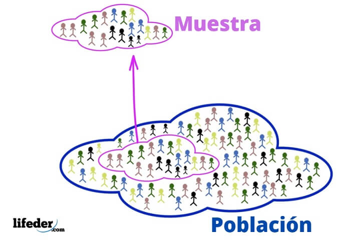
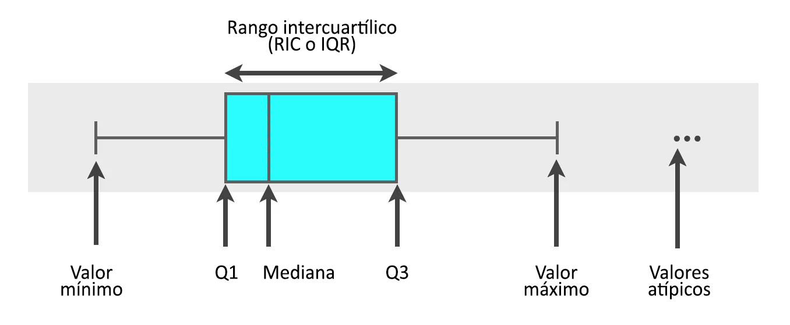
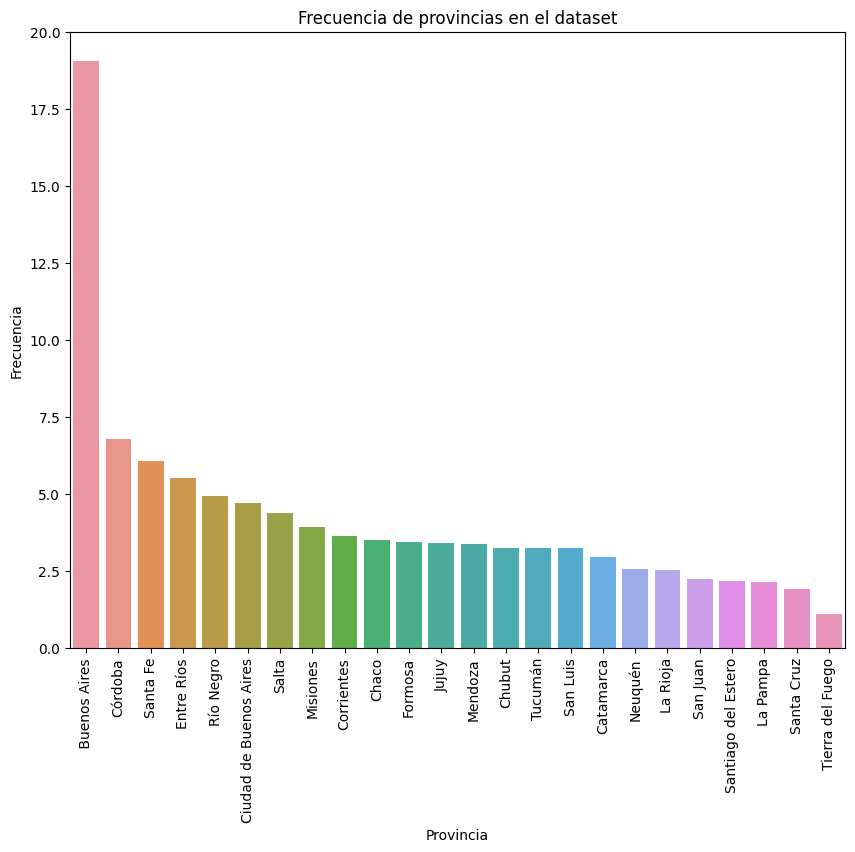
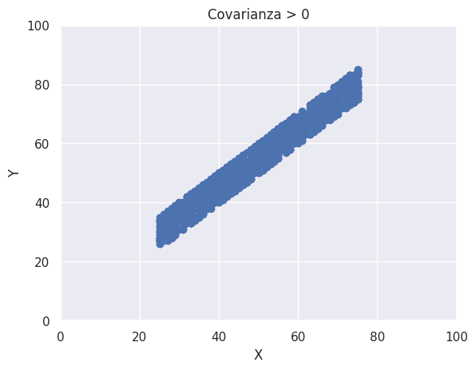
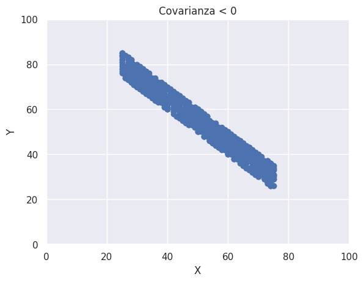
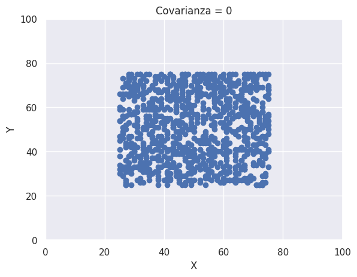

# Unidad 3 - Análisis explcorrelationoratorio de datos: Medidas de Resumen

### Fundamentos de ciencia de datos


## Introducción

Una de las primeras tareas que tenemos que realizar antes de comenzar a trabajar con los datos que recibimos es el análisis exploratorio de los datos. Esta tarea surge naturalmente cuando la consigna del análisis no está definida pero es muy posible pasarla por alto cuando nos piden realizar X análisis usando ciertos datos. 

En esta unidad vamos a estudiar medidas de resumen que nos permitan entender los datos a partir de ciertos valores. En la próxima unidad, vamos a explorar los datos a través de visualizaciones.

Para esta unidad vamos a utilizar la “Encuesta Nacional de Factores de Riesgo (ENFR) 2018” disponible [acá](https://www.indec.gob.ar/indec/web/Institucional-Indec-BasesDeDatos-2) 

### Contenido de la unidad

1. Medidas de centralidad: media, mediana, moda
2. Cuartiles y percentiles
3. Medidas de dispersión: rango, varianza, desvío estándar, rango intercuartílico, desviación mediana absoluta (MAD)
4. Valores atípicos
5. Tablas de frecuencia, proporciones y porcentajes
6. Métricas de correlación: covarianza, correlación lineal, correlación de Spearman
7. Matriz de covarianza y matriz de correlación
8. Métricas de distancia y similaridad

## Algunos conceptos importantes

### **Población**

En estadística, la población se refiere al conjunto total de individuos, objetos, eventos o medidas que comparten una característica común de interés y que son de interés para un estudio en particular. La población puede ser tan grande o tan pequeña como se desee y puede estar formada por personas, animales, objetos, empresas, países, entre otros.

### **Muestra**

Por otro lado, una muestra se refiere a una porción o subconjunto seleccionado que se extrae de la población con el propósito de realizar inferencias sobre la población en su conjunto. El procedimiento por el cual se selecciona una muestra de una población determinada se denomina ***muestreo***. Existen diversos tipos de muestreo que, en términos generales, se clasifican en función de si interviene o no el azar en el proceso. Cabe destacar que para garantizar que los resultados obtenidos a partir de la muestra sean generalizables a la población en su conjunto, es requisito que la muestra sea seleccionada de manera aleatoria.

Por ejemplo, si se desea estudiar la estatura de las mujeres adultas en un país en particular, se podría seleccionar una muestra aleatoria de mujeres adultas y medir su estatura. Si la muestra es representativa y suficientemente grande, se puede inferir información sobre la estatura promedio de todas las mujeres adultas en ese país.



### **Variable**

Una variable es una característica, cualidad o propiedad observada que puede asumir diferentes valores y es susceptible de ser cuantificada o medida en una investigación. Las observaciones registradas de una o más variables conforman un **conjunto o set de datos**. Según su naturaleza, las variables pueden ser:

- Cualitativas (también llamadas categóricas): son aquellas que no son medibles numéricamente.
- Cuantitativas: son aquellas que toman valores numéricos para los cuales tiene sentido pensar en operaciones aritméticas. Pueden ser continuas, si pueden asumir teóricamente cualquier valor dentro de un intervalo, o discretas, si sólo pueden tomar valores aislados en dicho intervalo.

En el ejemplo anterior, la variable de interés es “estatura de las mujeres adultas de un país” y se trata de una variable cuantitativa continua.


### Medición

Asignación de números a objetos, personas o hechos, para representar cantidades de sus atributos, de acuerdo a ciertas reglas.

Escala de medida: 

- Nominal: los números son simplemente rótulos, no tienen valores cuantitativos y las categorías son mutuamente excluyentes. Ej: Profesiones.
- Ordinal: los números indican un orden en la medición, pero no brinda información sobre las
distancias entre cada nivel. Ej: orden de llegada en una carrera, grado de dolor.
- Intervalo: las diferencias entre las mediciones indican intervalos que tienen sentido. Ausencia del cero absoluto. Ej: temperatura en °C, puntajes de crédito. Esto significa que no puedes decir que 20° centigrados es el doble de 10° grados centigrados.
- Razón: Existe un cero absoluto  y las razones tienen sentido. Ej: estatura.

La siguiente tabla muestra las transformaciones y estadísticas aplicables a cada tipo:


## Medidas de centralidad

Las medidas de centralidad describen el centro de la distribución de los datos. Las más comunes son la media aritmética, las fractilas o cuantilos y el modo.

<aside>
💡 Algunas medidas de resumen se calculan de forma diferente dependiendo si el cálculo se realiza con la población o con una muestra.

</aside>

### **Media aritmética/Promedio**

El promedio de la población se representa con la letra $\mu$ mientras que el promedio de la muestra se representa con $\bar{x}$. En este último caso, se calcula sumando todos los valores no nulos de la variable $X$ y dividiendo por la cantidad de valores no nulos de $X$ ($n$):

$$
\bar{x} = \frac{\sum_{i = 1}^{n}{x_{i}}}{n}
$$

Una cuestión importante a tener en cuenta sobre esta medida es que, como depende de todos los valores registrados de la variable, la presencia de un valor anormalmente grande o pequeño en el conjunto influye profundamente sobre ella. Por lo tanto, en estas situaciones deja de ser una medida de centralidad representativa del conjunto de observaciones y deberá buscarse otra alternativa más adecuada. 

Para calcularla, contamos con el método **`mean()`** de **Pandas**, que ya empleamos anteriormente.

### **Mediana**

La mediana, segundo cuartil o percentil del 50%, se define como el valor de la variable que se encuentra en la posición central del conjunto de datos ordenado de menor a mayor. En los casos en los que no existe un único valor central, es decir cuando la cantidad de valores estudiados es par, se calcula el promedio de los dos valores centrales. 

Veamos un ejemplo:

1. Tenemos el siguiente conjunto de 15 observaciones de la variable $X$: [40, 2, 2, 3, 9, 10, 11, 11, 1, 3, 10, 5, 1, 3, 3]
2. Ordenamos los valores de la variable [1, 1, 2, 2, 3, 3, 3, 3, 5, 9, 10, 10, 11, 11, 40]
3. El valor intermedio es 3, ya que es el que deja el mismo número de observaciones (7) por debajo y por encima de él.

En nuestros datos parece haber un valor atípico, el 40. Como discutimos arriba, la media, 7.6, se ve afectada por este valor y no constituye una medida de centralidad representativa del conjunto. En esta situación, la mediana es una medida de tendencia central más adecuada para informar.

### **Fractilas o cuantilos**

La mediana es un tipo particular de medida que pertenece a una clase mucho más general de estadísticas descriptivas de centralidad: **las fractilas o cuantilos**. En términos generales, la fractila de orden r es aquel valor de la variable tal que el r% de las observaciones del conjunto ordenado de datos son menores o iguales a él.

**Percentiles**

Los percentiles son un tipo de fractila que divide al conjunto de datos ordenados de la variable $X$ en 100 partes con aproximadamente el mismo número de datos.

Supongamos que tenemos la siguiente lista ordenada de datos con 11 elementos:

$$
l = [1,2,3,4,5,6,7,8,9,10,11]
$$

Una vez ordenados los datos de una variable $X$ de menor a mayor, el percentil de orden $i$ es el valor de la variable que deja al $i\%$ de los datos por debajo de sí y al $100 - i\%$ por encima de sí.  El percentil 10 es **2**, puesto que deja un único valor por debajo de sí y nueve valores por encima.

**Los cuartiles**

Los cuartiles son un tipo de fractila que divide al conjunto de datos ordenados de la variable en 4 partes con aproximadamente el mismo número de datos:

- **Cuartil 1 (Q1)** es el valor tal que el 25% de los datos son menores o iguales a él. Coincide con el percentil 25.
- **Cuartil 2 (Q2)** es el valor tal que el 50% de los datos son menores o iguales a él. Coincide con la mediana, definida anteriormente, y con el percentil 50.
- **Cuartil 3 (Q3)** es el valor tal que el 75% de los datos son menores o iguales a él. Coincide con el percentil 75.

**¿Cómo calculamos estas medidas con NumPy/Pandas?**

**Pandas** posee el método `quantile` , que permite calcular cualquier fractila de un conjunto de datos de una variable. La misma puede especificarse en el parámetro **`q`** , que por *default* es igual a 0.5 

```python
data.bhih01.quantile(0.1)
6000
```

También puede utilizarse `percentile`, de **NumPy**, con la salvedad de que, a diferencia del primer método, debe especificarse el percentilo a calcular como un número entero entre 1 y 100.

```jsx
np.percentile(data.bhih01, q = 10)
6000
```

Existen varios métodos para calcular percentiles. El **método R-7**, también conocido como "R-7 de Hyndman & Fan", es una variante del método de interpolación lineal. En el mismo, la posición de un percentil específico en una serie de datos ordenada se calcula utilizando la siguiente fórmula, donde **`percentil`** es el percentil deseado y **`N`** es el número total de elementos en la serie de datos:

```python
# percentil puede ser cualquier valor entre 1 y 100
pos = 1 + (percentil / 100) * (N - 1)
```

<aside>
⚠️ **Atención:** esta fórmula nos indica la posición del percentil y no su valor, ya que no estamos incluyendo ninguna de las observaciones que componen el conjunto de datos.

</aside>

Cuando **`pos`** no es un entero, se **interpola linealmente** entre los dos valores adyacentes en la posición fraccionaria en la serie de datos ordenada. El **método R-7** es utilizado por *default* tanto por `NumPy` [](https://numpy.org/doc/stable/reference/generated/numpy.quantile.html)como por `Pandas` para calcular percentiles. 

[Los otros métodos R (R-1 a R-9)](https://en.wikipedia.org/wiki/Quantile#Estimating_quantiles_from_a_sample) son una familia de métodos de estimación de percentiles propuestos por Hyndman y Fan en su artículo "[Sample Quantiles in Statistical Packages](https://www.amherst.edu/media/view/129116/original/Sample+Quantiles.pdf)" (1996). Estos métodos difieren en la forma en que se calcula la posición y en cómo se interpola entre valores adyacentes cuando la posición no es un entero. Es importante destacar que no existe un enfoque "correcto" único para calcular percentiles, ya que cada método tiene sus propias ventajas y desventajas en función de la distribución y características de los datos en cuestión. Por lo tanto, es útil conocer los diferentes métodos y seleccionar el que mejor se adapte a las necesidades del análisis de datos.

En el caso de **Pandas**, el método `quantile()` cuenta con un parámetro llamado `interpolation`, que permite definir el método a utilizar para estimar la fractila. Si bien utiliza `interpolation = 'linear'` por *default* (Método R-7), permite elegir entre otros criterios.

**Ejemplos:**

La siguiente lista de longitud 8 está dividida en 4 partes iguales y pintada acorde  [**2, 2, 4, 5, 5, 6, 7, 8**]. Veamos cómo se calcularían los tres cuartilos utilizando el método R-7.

El Q1 es un valor que se ubica entre el índice 2 y el 3 (Pos. índice 2.75) para que la lista quede dividida en dos partes, por un lado el 25% de los datos y por el otro el 75%. La lista debería quedar de la siguiente manera [**2, 2, 4, 5, 5, 6, 7, 8**]. El Q1 en este caso es 3.5 si utilizamos la interpolación lineal para calcular el valor. 

Posición del cuartil Q1 = (1 + 0.25 * (8 - 1))  = 2.75

Valor del cuartil Q1 = 2 + 0.75 * (4 - 2) = 3.5

El Q2 es un valor que se ubica entre el índice 4 y 5 (Pos. índice 4.5). Como ambos índices tienen el mismo valor, 5, no hay dudas de que el Q2 es igual a 5. La lista quedaría dividida de esta manera [**2, 2, 4, 5, 5, 6, 7, 8**] con 50% de los datos por debajo del valor y 50% de los datos por encima. 

Posición del cuartil Q2 = (1 + 0.5 * (8 - 1))  = 4.5

Valor del cuartil Q2 = 5 + 0.5 * (5 - 5) = 5

Finalmente, el Q3, es un valor que se ubica entre el índice 6 y 7 (Pos. índice 6.25) para que la lista quede dividida en 75-25%, [**2, 2, 4, 5, 5, 6, 7, 8**] . En este caso el Q3 es 6.25.

Posición del cuartil Q3 = (1 + 0.75 * (8 - 1))  = 6.25

Valor del cuartil Q3 = 6 + 0.25 * (7 - 6) = 6.25

En el siguiente ejemplo, mostramos cómo calcular los cuartiles con **Pandas** recurriendo al método [`quantile`](https://pandas.pydata.org/docs/reference/api/pandas.DataFrame.quantile.html), pero también desarrollando las fórmulas en Python “a mano”.

```python
import pandas as pd
import math
serie = pd.Series([2, 2, 4, 5, 5, 6, 7, 8])

#------------------ "A MANO" ------------------
# Cálculo de la posición según método R7 (Mismo que en Excel, R, Pandas, NumPy)
q1_pos = 1 + (25 / 100) * (serie.size - 1)
q2_pos = 1 + (50 / 100) * (serie.size - 1)
q3_pos = 1 + (75 / 100) * (serie.size - 1)

# Obtenemos la parte decimal de la posición calculada
parte_frac, _ = math.modf(q1_pos)
# ¡Restamos 1 a la posición, ya que nuestra serie se basa en 0!
index = int(q1_pos) - 1
# Valor del cuartil Q1 = 2 + 0.75 * (4 - 2) = 3.5
q1_valor = serie[index] + parte_frac * (serie[index + 1] - serie[index])

# Obtenemos la parte decimal de la posición calculada
parte_frac, _ = math.modf(q2_pos)
# ¡Restamos 1 a la posición, ya que nuestra serie se basa en 0!
index = int(q2_pos) - 1
# Valor del cuartil Q2 = 5 + 0.5 * (5 - 5) = 5
q2_valor = serie[index] + parte_frac * (serie[index + 1] - serie[index])

# Obtenemos la parte decimal de la posición calculada
parte_frac, _ = math.modf(q3_pos)
# ¡Restamos 1 a la posición, ya que nuestra serie se basa en 0!
index = int(q3_pos) - 1
# Valor del cuartil Q3 = 6 + 0.25 * (7 - 6) = 6.25
q3_valor = serie[index] + parte_frac * (serie[index + 1] - serie[index])

#------------------ USANDO PANDAS ------------------
# Ahora usamos pandas para calcular los cuartiles. 
# Por defecto Pandas usa siempre la interpolación "linear"
q1_pandas = serie.quantile(0.25, interpolation="linear")
q2_pandas = serie.quantile(0.50, interpolation="linear")
q3_pandas = serie.quantile(0.75, interpolation="linear")

# Los valores calculados a mano en Python, son iguales a Pandas
print('Posic.', '\t\t', 'Python', '\t', 'Pandas')
print(q1_pos, '\t\t', q1_valor, '\t\t', q1_pandas)
print(q2_pos, '\t\t', q2_valor, '\t\t', q2_pandas)
print(q3_pos, '\t\t', q3_valor, '\t\t', q3_pandas)

# Resultado
"""
Posic. 	 Python  Pandas
2.75 		 3.5 		 3.5
4.5 		 5.0 		 5.0
6.25 		 6.25    6.25
"""
```

Volviendo a los datos de ingreso reportados en la encuesta de nuestro dataset, podemos realizar los siguientes cálculos.

```python
# Cuartil 1 (Q1)
data.bhih01.quantile(0.25)
10000

# Cuartil 2 (Q2)
data.bhih01.quantile(0.5)
18000

# Cuartil 3 (Q3)
data.bhih01.quantile(0.75)
30000
```

<aside>
🤔

**Para pensar…**
¿Cómo interpretaría cada una de estas medidas calculadas sobre los datos de la variable `bhih01` si tuviera que informar estos resultados?

</aside>

### **Moda**

Es el valor de la variable que se presenta un mayor número de veces, es decir, el que tiene la mayor frecuencia. Puede ocurrir que un conjunto de datos no presente modo (si todos los valores presentan igual frecuencia) o que haya más de uno.

El comportamiento de una variable a nivel poblacional se encuentra descripto por su **distribución de probabilidad**, la cual indica el rango de valores que ésta puede asumir junto con sus respectivas probabilidades. El concepto de moda puede trasladarse a esta situación y corresponde a aquel valor de la variable en el que la función densidad de probabilidad (en el caso de que la variable sea continua) alcanza un máximo. En función del número de modas que pose, una distribución de probabilidad puede ser unimodal, bimodal o multimodal:  


Libro “Hands-On Data Analysis with Pandas” Stefanie Molin.

**Pandas** cuenta con funciones específicas para calcular estas medidas:

```python
import pandas as pd
data = pd.read_csv('ENFR 2018 - Base usuario.txt', delimiter = '|')

# Mean
data.bhih01.mean()
2446.65

# Median
data.bhih01.median()
18000

# Mode
data.bhih01.mode()
20000
```

Algo importante para agregar es que la moda es la única medida de posición que puede usarse para datos provenientes de una variable cualitativa. Si se aplica el método `mode()` sobre una columna del **DataFrame** que contiene observaciones para este tipo de variable, devolverá aquella/s categoría/s que se hayan presentado con mayor frecuencia.

## Medidas de dispersión

Las medidas de dispersión describen la variabilidad de los datos y complementan a las medidas de centralidad, que no resumen en forma completa la información contenida en el conjunto de datos de la variable de interés. Podemos tener dos conjuntos de datos con aproximadamente la misma media, mediana y modo, pero que difieran en cuánto se alejan del valor “central”.

### Rango

Rango o amplitud, es la distancia entre el dato de menor valor y el de mayor valor. Dado un conjunto de datos de una variable llamado $valores$, el rango se define como:

$$
R = max(valores)- min(valores)
$$

Por ejemplo, para el grupo de datos [5, 7, 29, 9, 60, 1, 100, 45, 50, 80], el rango es 99.

Usando los datos de la encuesta de salud obtendríamos:

```python
data.bhih01.max() - data.bhih01.min()
420000
```

### Varianza

Es una medida de cuánto se desvían, en promedio, las observaciones de una variable respecto a la media aritmética. Se calcula como:

$$
s^2=\frac {\sum_{i = 1}^{n}(x_i - \bar{x})^2}{n-1}
$$

Donde:

$n:$ Cantidad de datos en la muestra

$\bar{x}:$ Media de la muestra

<aside>
💡 La varianza se utiliza en diversos campos como la economía, finanzas, psicología, biología, física, entre otros, para evaluar qué tan dispersos están los valores en un conjunto de datos. Si la varianza es pequeña, significa que los datos están más agrupados o concentrados en torno a la media; si es grande, los datos están más dispersos.

</aside>

### Desvío Estándar

Se define como la raíz cuadrada positiva de la variancia:

$$
s=\sqrt{\frac {\sum_{i = 1}^{n}(x_i - \bar{x})^2}{n-1}}
$$

En comparación con la variancia, posee la ventaja de que está expresada en las unidades de la variable, por lo que su interpretación es más sencilla y directa. Podemos interpretarla como una **“distancia promedio de las observaciones con respecto a la media”**.

Una desviación estándar baja indica que la mayor parte de los datos de una muestra tienden a estar agrupados cerca de la media aritmética, mientras que una desviación estándar alta indica que los datos se extienden sobre un rango de valores más amplio. 

Gráficamente, considerando que las representaciones de la figura corresponden a gráficos de densidad de los datos observados de una variable (ya los trabajaremos en profundidad en la próxima Unidad):


Una desviación estándar alta indica una mayor variabilidad en los datos, mientras que una desviación estándar baja indica una menor variabilidad.

Pensando en la distribución de probabilidad de la variable, si ésta sigue una distribución normal:

 (o curva en forma de campana, o curva de Gauss), donde cada banda tiene un ancho de una vez la desviación estándar](./imagenes/Untitled%205.png)

Una gráfica de la [distribución normal](https://es.wikipedia.org/wiki/Distribuci%C3%B3n_normal) (o curva en forma de campana, o curva de Gauss), donde cada banda tiene un ancho de una vez la desviación estándar

**Pandas** cuenta con la función `pd.std`que calcula la desviación estándar de la muestra:

```python
import pandas as pd
data = pd.read_csv('ENFR 2018 - Base usuario.txt', delimiter = '|')

# Desviación estándar
data.bhih01.std()
19756.58
```

### Coeficiente de Variación (CV)

El coeficiente de variación (CV) es una medida de dispersión relativa que se utiliza para comparar la variabilidad de diferentes conjuntos de datos en términos de su relación con la media. Se define como el desvío estándar dividido por la media aritmética:

$$
CV = \frac{s}{\bar{|x|}}
$$

Es una medida adimensional que indica qué proporción representa el desvío estándar de la media aritmética. Se suele utilizar cuando se desea comparar la variabilidad de dos o más conjuntos de datos que difieren en unidades de medida y/o magnitudes.

Por ejemplo, si queremos comparar la variabilidad de los precios de dos productos que tienen diferentes unidades de medida, el CV nos permitiría hacerlo de manera más adecuada. Si el producto A tiene un precio promedio de $100 con una desviación estándar de $10, y el producto B tiene un precio promedio de $50 con una desviación estándar de $5, el CV de ambos productos sería:

CV A = (10 / 100) x 100% = 10%
CV B = (5 / 50) x 100% = 10%

En este caso, el CV es el mismo para ambos productos, lo que indica que la variabilidad relativa del precio es similar en ambos casos, independientemente de las unidades de medida utilizadas.

### Rango intercuartílico (RI)

Es la diferencia entre el tercer y el primer cuartil y, como tal, **mide la dispersión del 50% de los datos centrales.**

$$
RI = Q_3 - Q_1
$$

El rango intercuartílico es una medida de dispersión resistente a la presencia de valores atípicos o extremos que pueden distorsionar otras medidas de dispersión, como la desviación estándar. Por lo tanto, cuando se usa la mediana como medida de centralidad, el RI es una medida de dispersión adecuada para acompañarla. 

Como veremos debajo, corresponde al ancho de la caja que constituye una parte central del gráfico conocido como **boxplot**.


### Desviación Mediana Absoluta (MAD)

La desviación mediana absoluta se define como la mediana de la desviación absoluta de cada punto con respecto a la mediana:

$$
MAD = Mediana(|X_{i} - Q_{2}|)
$$

Supongamos que tenemos el siguiente conjunto de valores observados: [1,2,3,4,5,6,7,8,9,10,11]. Para calcular la MAD seguimos los siguientes pasos:

1. Calcular la mediana: 6
2. Calcular la desviación absoluta de cada observación con respecto a la mediana: [5, 4, 3, 2, 1, 0, 1, 2, 3, 4, 5]
3. Ordenar la lista de desviaciones absolutas: [0, 1, 1, 2, 2, 3, 3, 4, 4, 5, 5] 
4. Calcular mediana de las desviaciones absolutas: 3

La MAD se utiliza para estimar la variabilidad de los datos en diferentes campos, como la estadística, la ciencia de datos, entre otros. A diferencia de la desviación estándar, la MAD es una medida que no se ve afectada por los valores extremos o atípicos que pueden influir en otras medidas de dispersión.

La MAD se utiliza a menudo en conjunción con la mediana, para proporcionar una descripción completa de la tendencia central y la variabilidad de los datos. Por ejemplo, si queremos describir la distribución de un conjunto de datos que contiene valores atípicos o extremos, la mediana y la MAD pueden proporcionar medidas más representativas de la tendencia central y la variabilidad de los datos que la media y la desviación estándar.

### **Diagrama de Caja y Bigotes (Boxplot)**

Los cuartilos y los valores mínimo y máximo conforman un conjunto de cinco números que brindan un buen resumen de nuestros datos y con los cuales podemos construir un gráfico llamado boxplot. Estos gráficos, también conocidos como diagramas de caja y bigotes, se utilizan para representar gráficamente la distribución de un conjunto de datos numéricos y mostrar la presencia de potenciales valores atípicos (**outliers**).

Se compone de una caja, que abarca todo el rango de valores entre el primer y el tercer cuartil, y de dos líneas (*bigotes*), que se extienden a partir de los bordes de la caja hasta los valores mínimo y máximo del conjunto de datos. Adicionalmente, una línea vertical en el interior de la caja representa la mediana.


### El boxplot modificado

Como se mencionó anteriormente, existe una versión modificada del boxplot permite detectar potenciales ***outliers***, es decir, observaciones que no son típicas del conjunto.

El criterio comúnmente aceptado consiste en considerar potenciales outliers a aquellas observaciones que caigan por fuera de  (Q1 - 1.5 RI) y (Q3 + 1.5 RI). La modificación del gráfico consiste en extender los *whiskers* hasta las observaciones mínima y máxima **que no sean puntos atípicos.** Los **outliers** se marcan en el gráfico como puntos separados de los *whiskers*.



Es importante remarcar que, en el gráfico anterior, la leyenda **“Valor máximo”** se refiere al máximo valor registrado u observado que es menor al límite de (Q3 + 1.5 RI).

Volviendo a nuestro dataset inicial, para construir el boxplot de los ingresos, podemos utilizar la librería `seaborn`:

```python
import seaborn as sns
import matplotlib.pyplot as plt

sns.boxplot(data=data, x='bhih01', orient='h')
plt.xlabel('ingreso')
plt.show()
```

Y el diagrama resultante es:


### Consideraciones importantes sobre el ploteo de los *outliers*

En algunas situaciones, puede resultar de interés construir la **versión clásica del boxplot**, es decir, aquella que no plotea los potenciales valores atípicos del conjunto. Esto puede ser de utilidad, por ejemplo, cuando el tamaño del dataset es considerablemente grande, situación en la cual el boxplot modificado puede volverse completamente ilegible (muchos valores serán indefectiblemente ploteados como potenciales *outliers,* lo que puede llevar, en casos extremos, a no ver la caja).

En `sns.boxplot()` puede setearse el parámetro `showfliers = 'False'` para evitar que el gráfico resultante muestre los potenciales outliers. Sin embargo, esto altera la verdadera distribución del dataset, ya que produce como resultado el equivalente a la versión “modificada”, con el agregado de que ya no se plotean los potenciales valores atípicos (¡es como si se “cortara” el boxplot y se eliminaran datos!). Por este motivo, no es una buena elección si se quiere utilizar el boxplot como una herramienta gráfica para analizar características de la distribución.

Frente a esto, una forma de construir el **boxplot clásico** (el que no muestra potenciales *outliers*) **sin borrar datos ni alterar la verdadera distribución de los mismos**, es modificar el parámetro `whis`, extendiendo los whiskers hasta el menor y el mayor valor observado: `whis = [0,100]`.

### 

## Valores atípicos

Los valores atípicos son aquellos cuyo valor se encuentra alejado del grupo de datos. Supongamos que realizamos una encuesta para estudiar viajes al trabajo en el área metropolitana de Rosario. Cuando estamos estudiando la distribución encontramos que algunos viajes duran más de 3 horas. Estos viajes, si bien ocurren, no son de nuestro interés, porque alguien que tarda 3 horas o más para llegar a su lugar de trabajo probablemente no viva dentro del área que estamos estudiando y sus patrones de movilidad no nos interesen demasiado. Es más, considerarlos puede llegar a sesgar nuestro estudio. Por esta razón, vamos a tener que pensar qué tratamiento se les va a dar, por ejemplo, eliminarlos. 

Existen varias formas de definir valores atípicos. Cuando graficamos un boxplot usando seaborn, como en el gráfico de arriba, como default, seaborn clasifica como outliers a todo punto que este fuera del rango $(Q_1 - 1.5*RIC, Q_{3} + 1.5*RIC)$. 

A continuación mostramos un ejemplo de búsqueda de valores atípicos para la variable “minutos durante los cuales realizó actividad física intensa la semana pasada”. 

```python
import pandas as pd
import matplotlib.pyplot as plt
import seaborn as sns
sns.set()

data = pd.read_csv('ENFR 2018 - Base usuario.txt', delimiter = '|')

# minutos actividad física
sns.boxplot(data.biaf02_m)
plt.ylabel('Minutos por semana en actividad física intensa')
```


En este caso vemos que por encima de 720 minutos (12 horas) seaborn comienza a plotear los valores atípicos. Sin embargo, es nuestra decisión si queremos incluirlos en el análisis o no, o si queremos considerar otra medida para distinguir valores atípicos. Por ejemplo, puede ser que en nuestro estudio no queramos considerar deportistas profesionales. Entonces, deberíamos buscar un valor de minutos de entrenamiento semanal por el cual rechazamos a la observación si esta se encuentra por encima de ese valor, por ejemplo 1000 minutos. 

## Tabla de Frecuencias

La ***frecuencia absoluta*** es una medida estadística que indica cuántas veces se repite o se presenta un determinado valor en un conjunto de datos. La ***frecuencia relativa***, por su parte, es la frecuencia absoluta dividido entre el número total de datos que componen el conjunto. Se la suele multiplicar por 100, de manera que exprese la proporción en la que se presentó un determinado dato en el dataset.

La **tabla de frecuencias** constituye una forma sencilla y efectiva para resumir la información de las observaciones de una variable de un dataset. Es una tabla que muestra la cantidad de veces que se presenta una determinado valor o rango de valores de una variable/atributo $X$. 

En el caso de una **variable cualitativa**, la tabla contiene las diferentes categorías de la misma junto con la frecuencia absoluta de cada una de ellas en el dataset. Un ejemplo de este tipo de variable en la encuesta de Factores de Riesgo lo constituye la provincia a la que pertenece cada persona que respondió la encuesta. Entonces, podemos elaborar una tabla que nos indique cuántas personas fueron encuestadas por provincia:


Para obtener la tabla de arriba usamos el siguiente código:

```python
import pandas as pd

data = pd.read_csv('ENFR2018_baseusuario/ENFR 2018 - Base usuario.txt', delimiter = '|')

# Usando el diccionario de datos, mapeamos los códigos a nombres para que la tabla
# sea más fácil de entender
map_dict = {2: "Ciudad de Buenos Aires",
            6: " Buenos Aires",
            10: "Catamarca",
            14: "Córdoba",
            18: "Corrientes",
            22: "Chaco",
            26: "Chubut",
            30: "Entre Ríos",
            34: "Formosa",
            38: "Jujuy",
            42: "La Pampa",
            46: "La Rioja",
            50: "Mendoza",
            54: "Misiones",
            58: "Neuquén",
            62: "Río Negro",
            66: "Salta",
            70: "San Juan",
            74: "San Luis",
            78: "Santa Cruz",
            82: "Santa Fe",
            86: "Santiago del Estero",
            90: "Tucumán",
            94: "Tierra del Fuego",}
data['provincia'] = data['cod_provincia'].apply(lambda x: map_dict[x])

#Series.value_counts() es la encargada de generar la tabla de frecuencia. 
#El resto del código es para embellecer el resultado
df = data.provincia.value_counts().reset_index()
df.rename(columns = {'index': 'provincia', 'provincia': 'frecuencia'}, inplace = True)
df.set_index('provincia', inplace = True)
```


*Extracto de la tabla del ejemplo anterior*

A la tabla anterior, podemos agregarle una columna con las frecuencias relativas, para conocer qué proporción de la muestra pertenece a cada provincia. Este dato lo obtenemos dividiendo la frecuencia absoluta por el total de personas encuestadas. Podemos multiplicarlo por 100 para obtener los resultados en %.

```python
# Proporción de 0 a 1
df['proporción'] = df['frecuencia'] / df['frecuencia'].sum()

# Proporción de 0 a 100
df['proporción'] = df['frecuencia'] / df['frecuencia'].sum() * 100
```




Visualización gráfica de la frecuencia. Los valores fueron convertidos a % (de 0 100)

La tabla de arriba nos sirve para evaluar si la toma de muestra fue realizada correctamente, entre otras aplicaciones que podemos encontrarle. Cuando se hace un muestreo se plantea que la muestra debe representar de alguna forma a la población. En nuestro caso esta representación puede estar dada a través de la premisa que 

> La distribución de personas encuestadas por provincia sea similar a la distribución de personas por provincia a nivel país.
> 

Para hacer esta comparación, debemos generar además una tabla de frecuencias relativas de la población por provincias. Luego comparamos las dos tablas de frecuencias relativas, la de la población y la de la muestra, y evaluamos qué tanto “se parecen”. 

<aside>
💡 La evaluación de la correspondencia de la muestra con la población es un proceso más complejo en el cual se emplea más de una variable.

</aside>

**Segmentación**

La frecuencia se puede expresar de diferentes maneras, dependiendo del tipo de datos. Cuando trabajamos con **variables continuas**, en lugar de construir la tabla considerando los valores individuales que las mismas pueden asumir, es preciso realizar un agrupamiento previo en subintervalos (segmentación). En el caso de minutos entrenados intensamente por semana podríamos realizar la siguiente segmentación por horas:

- Menos de una hora: [0-60)
- De una a dos horas: [60-120)
- De dos a tres horas: [120-180)
- De tres a cuatro horas: [180- 240)
- etc.

```python
data.biaf02_m.fillna(0, inplace = True)
data['segmento entrenamiento intenso'] = pd.cut(data.biaf02_m, [x for x in range(0, 4200, 60)], right = False)

df = data['segmento entrenamiento intenso'].value_counts()
df/df.sum() #frecuencias relativas

[0, 60)         0.784040
[180, 240)      0.044486
[120, 180)      0.039900
[60, 120)       0.035041
[240, 300)      0.022790
                  ...   
[1860, 1920)    0.000000
[1740, 1800)    0.000000
[1320, 1380)    0.000000
[1020, 1080)    0.000000
[4080, 4140)    0.000000
```

.png)

### Frecuencia acumulada

En algunos casos, sobre todo cuando estudiamos variables continuas, resulta de utilidad realizar la tabla de frecuencia acumulada donde se suman las frecuencias, ya sea absolutas o relativas. Siguiendo con el ejemplo de arriba, podríamos calcular la siguiente tabla de la que podemos extraer conclusiones como:

- El 10% de la población realiza más de 4 horas de entrenamiento intenso por semana.
- El 85% de la población realiza menos de 3 horas de entrenamiento intenso por semana.

```python
df_relativo = (df/df.sum()).reset_index()
# Ordenamos los valores por segmento es decir [0,60), [60, 120), etc
df_relativo.sort_values('index', inplace = True)
df_relativo.set_index('index', inplace = True)

df_relativo.cumsum()

index	        segmento entrenamiento intenso
[0, 60)	      0.784040
[60, 120)	    0.819081
[120, 180)	  0.858981
[180, 240)	  0.903466
[240, 300)	  0.926257
...	...
[3840, 3900)	0.999966
[3900, 3960)	1.000000
[3960, 4020)	1.000000
[4020, 4080)	1.000000
[4080, 4140)	1.000000
```

<aside>
💡 Notar que para realizar la tabla de frecuencias acumuladas los valores deben estar ordenados por la variable en estudio, no por su frecuencia.

</aside>

## Métricas de correlación

La correlación es una medida estadística que describe el grado en que dos variables cambian o “varían” conjuntamente.

### Covarianza

La covarianza es una medida estadística que brinda información acerca del grado en que dos variables varían linealmente en forma conjunta. Suponiendo que se cuenta con un conjunto de n pares de observaciones de dos variables, X e Y, se calcula de la siguiente forma:

$$
S_{xy} = \frac{1}{n-1}\sum_{i=1}^{n} (x_i - \bar{x})(y_i - \bar{y})
$$

Analicemos la ecuación anterior:

- Si la relación entre ambas variables es directa (a mayores valores de una variable le corresponden, en general, mayores valores de la otra, y viceversa), el producto $(x_i - \bar{x})(y_i - \bar{y})$ tenderá a ser positivo, dando como resultado una covariancia positiva.
- Si, por el contrario, la relación entre ambas variables es inversa (a mayores valores de una variable le corresponden, en general, menores valores de la otra), el producto $(x_i - \bar{x})(y_i - \bar{y})$ tenderá a ser negativo, dando como resultado una covariancia negativa.

De esta forma, el **signo** de la covariancia indica si la asociación entre las variables X e Y es positiva o negativa. Un ejemplo podría ser precio de chocolate ($Y$) y porcentaje de cacao ($X$). Probablemente, si estudiamos diferentes marcas de chocolate en el mercado y registramos el precio de venta por gramo y el porcentaje de cacao, vamos a observar que a medida que el porcentaje de cacao aumenta, también lo hace el precio. Por lo tanto, si a partir de los datos recolectados calculáramos la covariancia, esperaríamos obtener un valor positivo de la misma.







Cuando $X$ e $Y$ son estadísticamente independientes, se puede demostrar que la covariancia es igual a 0. Sin embargo, lo opuesto no es necesariamente cierto: 2 variables pueden tener una covariancia igual a 0 y aún así no ser estadísticamente independientes. En este caso, $X$ e $Y$ podrían tener una relación con una forma distinta a la lineal y, de esta forma, no ser independientes.

La fórmula de la covarianza  (población) se define con la siguiente fórmula:

$$
COV(X, Y) = E[(X - E[X])(Y - E[Y])]
$$

Donde: 

$E[X], E[Y]$ : es el valor esperado de la variable $X, Y$respectivamente. Es decir, la media poblacional.

 

<aside>
💡 Las $E$ que vemos en la ecuación de arriba indican que se calcula el valor esperado de una variable aleatoria. El tema variables aleatorias se desarrolla con profundidad en PyE.

</aside>

A continuación vamos a desglosar la fórmula de arriba y vamos a desarrollar algunas intuiciones sobre la misma. 

$(X - E[X])$ calcula la distancia entre cada valor $X$y la media de $X$

$(Y - E[Y])$ calcula la distancia entre cada valor de $Y$y la media de $Y$

- Si, la distancia de $X$e $Y$a sus respectivas medias es “grande” y multiplicamos estas distancias, vamos a obtener un valor “grande”.
- Si ambas variables se alejan de sus medias en la misma dirección, es decir ambas son mayores o menores que las mismas, la multiplicación va a ser positiva. Pero, si se alejan en sentidos opuestos, la multiplicación va a ser negativa.
- Para que la covarianza adquiera un valor que se aleja de 0, ya sea positivo o negativo, la multiplicación de las distancias de la mayoría de los valores que asumen $X, Y$ deben estar en el mismo sentido. Si obtenemos multiplicaciones positivas y negativas balanceadas, el valor esperado de eso va a ser cero.
- Si $X,Y$se alejan “poco” de sus medias, no vamos a tener mucha variación de por si y la covarianza va a ser “chica”

**Limitaciones de la covarianza**

Aunque la covarianza es útil para identificar tendencias y relaciones en los datos, también presenta algunas debilidades y limitaciones:

1. Escala de medida: La covarianza depende de las unidades de medida de las variables, lo que puede dificultar la interpretación y comparación de los valores de covarianza entre diferentes pares de variables. Por ejemplo, si las unidades de medida de una variable son metros y las de la otra variable son grados Celsius, la covarianza entre estas dos variables será en unidades de metros por grados Celsius, lo que no es fácilmente interpretable.
2. Sensibilidad a cambios de escala: La covarianza es sensible a cambios de escala en las variables. Si una de las variables se multiplica por una constante, la covarianza también se multiplicará por esa constante, lo que podría dar lugar a interpretaciones incorrectas de la relación entre las variables.
3. Falta de normalización: A diferencia del coeficiente de correlación de Pearson, la covarianza no está normalizada en un rango de -1 a 1. Esto dificulta la comparación de la fuerza de las relaciones entre diferentes pares de variables, ya que no hay un valor máximo o mínimo absoluto para la covarianza.
4. Interpretación de la fuerza de la relación: La covarianza no proporciona información directa sobre la fuerza de la relación entre las variables. Aunque una covarianza positiva indica una relación directa y una covarianza negativa indica una relación inversa, no se puede deducir cuán fuerte es esa relación a partir del valor de la covarianza en sí.
5. Relaciones lineales únicamente: La covarianza solo puede capturar relaciones lineales entre las variables. Si existe una relación no lineal (por ejemplo, cuadrática o exponencial) entre las variables, la covarianza no será un indicador adecuado de esa relación.

### Correlación lineal de Pearson

El coeficiente de correlación lineal de Pearson mide el grado de asociación lineal que existe entre dos variables cuantitativas continuas. Se calcula de la siguiente manera:

$$
r = \frac{S_{xy}}{S_x S_y}
$$

donde $S_{xy}$ es la covariancia muestral entre X e Y, $S_{x}$ es la desviación estándar muestral de la variable X y $S_{y}$ es la desviación estándar muestral de la variable Y.

**Interpretación**

Dado que se trata de una normalización de la covarianza, su valor está siempre comprendido entre -1 (correlación lineal inversa perfecta) y 1 (correlación lineal directa perfecta). 

- Un coeficiente de correlación positivo indica una asociación directa entre las variables (se mueven en la misma dirección). Por el contrario, un coeficiente de correlación negativo es indicativo de una asociación inversa entre las variables (se mueven en direcciones opuestas).
- Cuanto más cercano a 1 sea, en valor absoluto, más intensa es la correlación lineal entre las variables.
- Un valor de r cercano a 0 no es necesariamente una evidencia de la falta de asociación entre las variables, sino sólo de la ausencia de una relación lineal, ya que este coeficiente no dice nada acerca de la intensidad de asociaciones diferentes a las lineales. En estos casos su cálculo e interpretación resultan inadecuados.
- Existe una tendencia a asumir, implícita o explícitamente, que un alto valor de r implica causalidad, lo que constituye una interpretación errónea. El coeficiente de correlación de Pearson es simplemente una medida de la fuerza de la asociación lineal entre las dos variables.


Ejemplos de correlaciones de variables con el método de Pearson 

$$
\rho_{X,Y} = {\frac {COV(X,Y)}{\sigma_{X}\sigma_{Y}}}
$$

**Ventajas frente a la covariancia**

1. Al estar acotado entre -1 y 1, el coeficiente de correlación de Pearson proporciona información sobre la fuerza de la asociación lineal entre las dos variables (cuanto más cercano a 1, en valor absoluto, más intensa es la asociación lineal). 
2. Su valor es independiente de las unidades en las que estén medidas las variables y de los cambios de escala en los datos. Si las dos variables están medidas en grados Celsius y las observaciones se convierten a grados Kelvin, el coeficiente de correlación de Pearson calculado en esta nueva situación será idéntico al anterior.
3. El coeficiente de correlación de Pearson es muy fácil de interpretar y de calcular.

**Supuestos y limitaciones**

La correlación de Pearson asume que las variables poseen una distribución normal conjunta y que la relación entre las mismas es lineal. En relación al primer punto, se trata de una exigencia que cobra especial importancia en el contexto de la inferencia estadística. Es generalmente aceptado que el coeficiente de correlación lineal de Pearson puede utilizarse en prácticamente todas las situaciones en las que nos enfrentemos a la necesidad de cuantificar el grado de asociación lineal entre dos variables, independientemente de la forma de la distribución conjunta. Por otra parte, en relación al segundo punto, si existe una asociación no lineal entre las variables (por ejemplo, cuadrática o exponencial), el coeficiente de correlación de Pearson no será un indicador adecuado de esa relación. 

Finalmente, es oportuno destacar que el coeficiente de correlación de Pearson es bastante sensible a la presencia de valores atípicos en las observaciones, los cuales pueden distorsionar enormemente su valor y conducir a conclusiones equivocadas.

En la encuesta de Factores de Riesgo podríamos pensar en estudiar las siguientes correlaciones:

| **X** | **Y** | **Valor** |
| --- | --- | --- |
| Edad | Minutos entrenamiento intenso | - 0.16 |
| Ingresos | Minutos entrenamiento intenso | 0.04 |
| Edad | Minutos de caminata | - 0.03 |
| Ingresos | Edad cuando fumó por primera vez | - 0.03 |

Hay muchas maneras de calcular el coeficiente de variación en Python. Usando pandas podemos hacerlo de la siguiente forma:

```python
# bhch04 es la edad y biaf02_m es la cantidad de minutos entrenados de forma intensa 
# en la semana. El método por default es `pearson`
data.bhch04.corr(data.biaf02_m, method = 'pearson')
```

### Correlación de Spearman

Para poder entender la correlación de Spearman primero necesitamos revisar el ranking

**Ranking**

Un ranking es una lista ordenada de elementos o entidades en función de algún criterio de clasificación específico. El objetivo del ranking es proporcionar una forma de clasificar y comparar los elementos o entidades de interés.

Los rankings se utilizan comúnmente en una variedad de campos, como deportes, negocios, educación, ciencias, entre otros. Por ejemplo, en los deportes, los rankings se utilizan para clasificar a los equipos o jugadores en función de su rendimiento en la temporada actual o en temporadas anteriores. En los negocios, los rankings se utilizan para clasificar a las empresas en función de su tamaño, ingresos, beneficios, entre otros criterios. En la educación, los rankings se utilizan para clasificar a las universidades en función de su reputación, calidad académica, entre otros criterios.

Los rankings pueden basarse en diferentes criterios de clasificación, como puntuaciones, tiempos, ingresos, tamaño, popularidad, entre otros. Es importante tener en cuenta que el criterio de clasificación utilizado para crear un ranking puede afectar la posición de los elementos o entidades en la lista.

Los rankings pueden tener un impacto significativo en la percepción pública y el éxito de los elementos o entidades clasificados. Sin embargo, es importante recordar que los rankings no siempre son una medida precisa o completa del rendimiento o calidad de los elementos o entidades clasificados, y que deben interpretarse con precaución.

El ranking establece una relación entre los valores que asume una variable de forma tal que sabemos el orden de la misma sin que nos importe el valor en si. Por ejemplo, la satisfacción con un producto podría ser rankeada de esta forma

- 😍 : 1
- 😀 : 2
- 😑 : 3
- ☹️ : 4
- 🤬 : 5

Otro ejemplo podría ser rankear la variable `edad` de nuestro ejemplo. Para eso ordenamos las edades y le asignamos el valor 1 a la edad más grande y la cantidad de personas encuestadas al valor más chico. Luego, las edades intermedias reciben el correspondiente rango intermedio. Un ejemplo se vería así:

[18, 20, 22, 30, 34, 35, 40, 47, 50, 51]

[10, 9, 8, 7, 6, 5, 4, 3, 2, 1]

Lo que hicimos arriba es posible porque en nuestro ejemplo las edades no se repiten, lo cual es poco real. Cuando los valores se repiten esto se llama empate y tenemos que buscar una estrategia para asignarles el ranking. Supongamos que tenemos las siguientes edades: 

[18, 20, 22, 22, 30, 34, 35, 35, 35, 40, 47, 50, 51]

A continuación listamos algunas estrategias para rankearlas, [fuente Wikipedia](https://en.wikipedia.org/wiki/Ranking). 

**Ranking de competición estándar**

En la clasificación de competición, los elementos que se comparan y resultan iguales reciben el mismo número de clasificación y luego se deja un espacio en los números de clasificación. La cantidad de números de clasificación que se omiten en este espacio es uno menos que la cantidad de elementos que se compararon como iguales. De manera equivalente, el número de clasificación de cada elemento es 1 más la cantidad de elementos clasificados por encima de él. Esta estrategia de clasificación se adopta frecuentemente en competencias, ya que significa que si dos (o más) competidores empatan en una posición en la clasificación, la posición de todos aquellos clasificados por debajo de ellos no se ve afectada (es decir, un competidor solo queda en segundo lugar si exactamente una persona obtiene una puntuación mejor que ellos, tercero si exactamente dos personas obtienen una puntuación mejor que ellos, cuarto si exactamente tres personas obtienen una puntuación mejor que ellos, etc.).

En nuestro ejemplo, obtendríamos este ranking: 

[1, 2, 3, 3, 5, 6, 7, 7, 7, 10, 11, 12, 13]

**Ranking de competición modificado**

A veces, la clasificación de competición se realiza dejando los espacios en los números de clasificación antes de los conjuntos de elementos con clasificación igual (en lugar de después de ellos, como en la clasificación de competición estándar). La cantidad de números de clasificación que se omiten en este espacio sigue siendo uno menos que la cantidad de elementos que se compararon como iguales. De manera equivalente, el número de clasificación de cada elemento es igual a la cantidad de elementos clasificados iguales o por encima de él. Esta clasificación garantiza que un competidor solo queda en segundo lugar si obtiene una puntuación más alta que todos menos uno de sus oponentes, tercero si obtiene una puntuación más alta que todos menos dos de sus oponentes, etc. El ranking nos quedaría de este modo: 

[1, 2, 4, 4, 5, 6, 9, 9, 9, 10, 11, 12, 13]

**Ranking denso**

En la clasificación densa, los elementos que se comparan de manera igual reciben el mismo número de clasificación y los siguientes elementos reciben el número de clasificación inmediatamente posterior. De manera equivalente, el número de clasificación de cada elemento es 1 más la cantidad de elementos clasificados por encima de él que son distintos con respecto al orden de clasificación. El ranking nos quedaría de este modo: 

[1, 2, 3, 3, 4, 5, 6, 6, 6, 7, 8, 9, 10]

**Ranking ordinal**

En la clasificación ordinal, todos los elementos reciben números ordinales distintos, incluidos los elementos que se comparan como iguales. La asignación de números ordinales distintos a elementos que se comparan igual se puede hacer de manera aleatoria o arbitraria, pero generalmente es preferible utilizar un sistema que sea arbitrario pero consistente, ya que esto proporciona resultados estables si la clasificación se realiza varias veces. Un ejemplo de un sistema arbitrario pero consistente sería incorporar otros atributos al orden de clasificación (como el orden alfabético del nombre del competidor) para garantizar que no haya dos elementos que coincidan exactamente.
El ranking nos quedaría de este modo:

[1, 2, 3, 4, 5, 6, 7, 8, 9, 10, 11, 12, 13]

**Ranking fraccional**

Los elementos que se comparan igual reciben el mismo número de clasificación, que es la media de lo que tendrían bajo las clasificaciones ordinales; de manera equivalente, el número de clasificación de 1 más la cantidad de elementos clasificados por encima de él más la mitad de la cantidad de elementos iguales a él. Esta estrategia tiene la propiedad de que la suma de los números de clasificación es la misma que en la clasificación ordinal. El ranking nos quedaría de este modo:
[1, 2, 3.5, 3.5, 5, 6, 8, 8, 8, 10, 11, 12, 13]

Con `pandas`, podemos rankear una serie con diferentes métodos de ranking: 

```python
import pandas as pd

data = [18, 20, 22, 22, 30, 34, 35, 35, 35, 40, 47, 50, 51]
serie = pd.Series(data)

# min: **Ranking de competición estándar**
# max: **Ranking de competición modificado**
# dense: **Ranking denso**
# average: **Ranking fraccional**
# first: **Ranking ordinal**
ranking_methods = ['average', 'min', 'max', 'dense', 'first']

for method in ranking_methods:
    ranked = serie.rank(method=method)
    print(f"Método de Ranking: {method}")
    print(ranked.tolist())
    print("\n")

"""
Ranking method: average
[1.0, 2.0, 3.5, 3.5, 5.0, 6.0, 8.0, 8.0, 8.0, 10.0, 11.0, 12.0, 13.0]

Ranking method: min
[1.0, 2.0, 3.0, 3.0, 5.0, 6.0, 7.0, 7.0, 7.0, 10.0, 11.0, 12.0, 13.0]

Ranking method: max
[1.0, 2.0, 4.0, 4.0, 5.0, 6.0, 9.0, 9.0, 9.0, 10.0, 11.0, 12.0, 13.0]

Ranking method: dense
[1.0, 2.0, 3.0, 3.0, 4.0, 5.0, 6.0, 6.0, 6.0, 7.0, 8.0, 9.0, 10.0]

Ranking method: first
[1.0, 2.0, 3.0, 4.0, 5.0, 6.0, 7.0, 8.0, 9.0, 10.0, 11.0, 12.0, 13.0]
"""
```

**Correlación de Spearman**

La correlación de Spearman se define como el coeficiente de correlación de Pearson para las variables rankeadas. Esto nos permite evaluar si existe una relación monotónica entre dos variables, es decir si crecen/decrecen juntas, sin importar si la relación es lineal o no, a diferencia de Pearson. Además el valor obtenido es menos sensible a valores atípicos que el coeficiente de Pearson. 

La fórmula general es: 

$$
\rho = {\frac{COV(R(X), R(Y))}{\sigma_{R(X)}\sigma_{R(Y)}}}
$$

La correlación de Spearman tiene una relación directa con los rankings (rangos) porque se basa en los rangos de los datos en lugar de sus valores originales. Al calcular la correlación de Spearman, convertimos los valores de las dos variables en rangos antes de evaluar la asociación entre ellas. Esta característica hace que la correlación de Spearman sea especialmente útil para analizar datos ordinales, donde la información más importante es el orden o la clasificación de las observaciones en lugar de sus valores numéricos exactos.

Cuando comparamos dos conjuntos de rankings, la correlación de Spearman nos indica qué tan bien estos rankings concuerdan entre sí. Si los rankings de las dos variables son idénticos, la correlación de Spearman será 1, lo que indica una relación monotónica creciente perfecta. Si los rankings son exactamente opuestos, la correlación de Spearman será -1, lo que indica una relación monotónica decreciente perfecta. Un valor cercano a 0 sugiere que no hay una relación monotónica evidente entre los rankings de las dos variables.


Ejemplos de variables monotónicas y no monotónicas

Antes de calcular la correlación de Spearman, debemos convertir los valores de las variables en rangos. Aquí se detallan los pasos para convertir los datos en rangos:

1. Ordenar los valores de cada variable (X e Y) en orden ascendente, de menor a mayor.
2. Asignar un rango a cada valor en función de su posición en la lista ordenada. El valor más pequeño recibirá el rango 1, el siguiente valor más pequeño recibirá el rango 2 y así sucesivamente.
3. En caso de empates (valores iguales), utilizar el método de ranking ordinal.

Repita estos pasos para ambas variables, X e Y. Al final, tendremos dos conjuntos de datos transformados en rangos, que se pueden utilizar para calcular el coeficiente de correlación de rango de Spearman (ρ).

Aquí hay un ejemplo para ilustrar el proceso:

Suponga que tiene dos variables, X e Y, con los siguientes valores:

X: [10, 25, 30, 45, 55]
Y: [2, 8, 10, 12, 22]

Primero, ordene los valores de cada variable y asígneles rangos:

X: 10 (R1 = 1), 25 (R2 = 2), 30 (R3 = 3), 45 (R4 = 4), 55 (R5 = 5)
Y: 2 (R1 = 1), 8 (R2 = 2), 10 (R3 = 3), 12 (R4 = 4), 22 (R5 = 5)

Luego la fórmula es:

ρ = 1 - (6 * Σd^2) / (n * (n^2 - 1))

$$
\rho = \frac{1-(6\times \sum d^2)}{(n\times(n^2-1)}
$$

Donde:

- n es el número de observaciones (pares de datos)
- Σd^2 es la suma de las diferencias al cuadrado de los rangos.

El coeficiente de correlación de Spearman (ρ) varía entre -1 y 1, donde:

- ρ = 1 indica una relación monotónica creciente perfecta.
- ρ = -1 indica una relación monotónica decreciente perfecta.
- ρ ≈ 0 sugiere que no hay una relación monotónica evidente entre las variables.

Si calculamos el coeficiente de Spearman con Pandas, la librería se encarga de facilitar el proceso de generación de rankings. El coeficiente se puede calcular de la misma forma que el coeficiente de correlación de Pearson pero cambiando el método

```python
data.bhch04.corr(data.biaf02_m, method = 'spearman')
```

Aquí vemos el valor del coeficiente con diferentes funciones como ejemplo ([fuente](https://stackabuse.com/calculating-spearmans-rank-correlation-coefficient-in-python-with-pandas/)):


## Matriz de Covarianza

La matriz de covarianza es una matriz cuadrada donde se muestra el coeficiente de covarianza entre múltiples variables. En el ejemplo de abajo mostramos la matriz de covarianza entre edad (bhch04), minutos semanales de actividad intensa (biaf02_m), ingreso (bhih01), minutos de caminata semanal (biaf06_m) y edad en que comenzó a fumar (bita02).


Esta matriz nos permite ver de forma rápida si existe alguna relación lineal entre las variables y nos puede servir en el futuro como guía para selección de atributos para nuestros modelos. 

Para construir la tabla de arriba usamos Pandas de la siguiente forma:

```python
data[['bhch04', 'biaf02_m', 'bhih01', 'biaf06_m', 'bita02']].cov()
```

## Matriz de Correlación

La matriz de correlación es similar a la anterior pero en lugar de mostrar el coeficiente de covarianza nos muestra el de correlación. 

```python
#en este caso el método por default es el de pearson
data[['bhch04', 'biaf02_m', 'bhih01', 'biaf06_m', 'bita02']].corr()
```


La diagonal siempre tiene el valor de 1 puesto que es la correlación de una variable consigo misma. Tanto en esta matriz como en la anterior, solo nos interesa mirar la parte que está por encima o debajo de la diagonal, puesto que estas matrices son siempre simétricas. 

Una forma de visualizar rápidamente la correlación que existe entre un grupo de variables es  imprimiendo la matriz de correlación con colores:

```python
sns.heatmap(data[['bhch04', 'biaf02_m', 'bhih01', 'biaf06_m', 'bita02']].corr(), annot=True)
```


## Temas avanzados

## Métricas de Distancia y Similaridad

Son métricas que nos a permiten definir cuánto se parecen dos puntos de datos, de forma similar a lo que vimos en la Unidad 2 con la similaridad de Levensthein on Jaro-Winkler. Existen diferentes formas de medir la similaridad y la selección de la misma depende del análisis que se esté realizando. A continuación listamos algunas de ellas.

### **Distancia Euclideana**

La definición formal es que la distancia euclideana es la distancia entre dos puntos en un [espacio euclídeo](https://es.wikipedia.org/wiki/Espacio_eucl%C3%ADdeo). La forma de visualizar esto es pensarlo como la distancia en linea recta entre dos puntos en el espacio. 

Si hablamos de un espacio de n dimensiones y queremos calcular la distancia entre los puntos P y Q, entonces:

$$
d_{E(P,Q)}= \sqrt{\sum_{i = 1}^{n}(p_i - q_i)^2}
$$


**Desventajas**
Aunque es una medida de distancia común, la distancia euclidiana no es una escala invariante, lo que significa que las distancias calculadas pueden estar sesgadas según las unidades de las entidades. Por lo general, uno necesita normalizar los datos antes de usar esta medida de distancia.

Además, a medida que aumenta la dimensionalidad de sus datos, la distancia euclidiana se vuelve menos útil. 

**Casos de uso**
La distancia euclidiana funciona muy bien cuando tiene datos de baja dimensión y es importante medir la magnitud de los vectores. Métodos como [kNN](https://en.wikipedia.org/wiki/K-nearest_neighbors_algorithm) y [HDBSCAN](https://en.wikipedia.org/wiki/DBSCAN#Extensions) muestran excelentes resultados listos para usar si se usa la distancia euclidiana en datos de baja dimensión.

### **Distancia Manhattan**

La distancia de Manhattan se calcula como la suma de la diferencia absoluta entre los componentes de dos vectores P y Q 

$$
d_{M(P,Q)} = \sum_{i = 1}^{n}|p_i - q_i|
$$

La distancia de Manhattan es la norma L1 de un vector mientras que la euclideana es la norma L2. 


Distancia Manhattan contra distancia Euclidiana: Las líneas roja, azul y amarilla tienen la misma longitud (12) en las geometrías Euclidiana y taxicab. En la geometría Euclidiana, la línea verde tiene longitud 6×√2 ≈ 8.48, y es el único camino más corto. En la geometría taxicab, la línea verde tiene longitud 12, por lo que no es más corta que los otros caminos.

**Desventajas**
Aunque la distancia de Manhattan parece funcionar bien para datos de alta dimensión, es una medida algo menos intuitiva que la distancia euclidiana, especialmente cuando se usa en datos de alta dimensión.

Además, es más probable que proporcione un valor de distancia más alto que la distancia euclidiana, ya que no ofrece el camino más corto posible. Esto no necesariamente da problemas, pero es algo que debe tener en cuenta.

**Casos de uso**
Cuando su conjunto de datos tiene atributos discretos y/o binarios, Manhattan parece funcionar bastante bien, ya que tiene en cuenta las rutas que, de manera realista, podrían tomarse dentro de los valores de esos atributos. Tomar la distancia euclidiana, por ejemplo, crearía una línea recta entre dos vectores cuando en realidad esto podría no ser posible.

### **Similaridad de Coseno**

Mide el ángulo entre dos vectores en un espacio de varias dimensiones. Es una métrica popular para la comparación de documentos en procesamiento de lenguaje natural y sistemas de recomendación.

Sabemos que el producto punto entre dos vectores es igual al coseno del ángulo entre ellos por la longitud de los mismos

$$
u.v = cos(\theta) |u||v|
$$

Con esto se define la similitud coseno de la siguiente forma

$$
cos(\theta) = \frac{u.v}{|u||v|}
$$

Mirando la gráfica de la función coseno podemos decir que:

- Cuando $\theta$ es igual a 0, el coseno es igual a 1. En nuestro caso, los dos vectores coinciden perfectamente
- Cuando $\theta$ es igual a $\pi/2$ , el coseno es igual a 0. En nuestro caso, los dos vectores son ortogonales
- Cuando $\theta$ es igual a $\pi$, el coseno es igual a -1. En nuestro caso, los dos vectores se encuentran en posición diametralmente opuesta


<aside>
💡 Notar que la magnitud de los vectores no entra en juego para esta similaridad

</aside>


**Desventajas**
Una de las principales desventajas de la similitud del coseno es que no se tiene en cuenta la magnitud de los vectores, sino simplemente su dirección. En la práctica, esto significa que las diferencias de valores no se tienen plenamente en cuenta. Si toma un sistema de recomendación, por ejemplo, la similitud del coseno no tiene en cuenta la diferencia en la escala de calificación entre diferentes usuarios.

**Casos de uso**
Usamos la similitud del coseno a menudo cuando tenemos datos de alta dimensión y cuando la magnitud de los vectores no es importante. Para los análisis de texto, esta medida se utiliza con bastante frecuencia cuando los datos se representan mediante recuentos de palabras. Por ejemplo, cuando una palabra aparece con más frecuencia en un documento que en otro, esto no significa necesariamente que un documento esté más relacionado con esa palabra. Puede darse el caso de que los documentos tengan longitudes desiguales y la magnitud del conteo sea de menor importancia. Entonces, podemos usar mejor la similitud del coseno que no tiene en cuenta la magnitud.

### **Distancia de Mahalanobis**

En estadística, la distancia de Mahalanobis es una medida de distancia introducida por Mahalanobis en 1936. Su utilidad radica en que es una forma de determinar la similitud entre dos variables aleatorias multidimensionales. Se diferencia de la distancia euclídea en que tiene en cuenta la correlación entre las variables aleatorias.


La distancia de Mahalanobis (MD) es una métrica de distancia efectiva que encuentra la distancia entre el punto y la distribución. Funciona con bastante eficacia en datos multivariados porque utiliza una matriz de covarianza de variables para encontrar la distancia entre los puntos de datos y el centro. Esto significa que MD detecta valores atípicos en función del patrón de distribución de los puntos de datos, a diferencia de la distancia euclidiana.

En la siguientes figuras, el punto negro representa el centroide de la distribución. En la gráfica de la izquierda, tenemos una distribución no correlacionada. En ese caso, los valores atípicos serían los más alejados del centroide y se podría usar la distancia euclidiana para detectarlos. En el caso de la derecha, cuando las variables están correlacionadas, tiene más sentido usar Mahalanobis, ya que tiene en cuenta la correlación entre ambas variables. Allí el punto 2 sería un outlier, mientras que el punto 1 es parte de la distribución. 


La distancia de Mahalanobis mide la distancia entre un punto P y el centroide de una distribución D y es igual a la distancia euclideana cuando las variables no están correlacionadas. 

Se define como:

$$
d_{M(x, \mu, D)} = \sqrt{(x - \mu)^T S^{-1}(x - \mu)}
$$

Y cuando nos interesa saber la distancia entre dos puntos, en vez de un punto y el centroide de los datos:

$$
d_{M(x,y, D)} = \sqrt{(x - y)^T S^{-1}(x - y)}
$$

Donde

$x, y$: puntos en el espacio

$\mu$: media de la distribución D

$S$: matriz de covarianza

Crearemos un conjunto de datos que muestre el puntaje del examen de 20 estudiantes junto con la cantidad de horas que dedicaron a estudiar, la cantidad de exámenes de preparación que tomaron y su calificación actual en el curso::

```python
import numpy as np
import pandas as pd 
import scipy as stats
from scipy.stats import chi2

data = {'score': [91, 93, 72, 87, 86, 73, 68, 87, 78, 99, 95, 76, 84, 96, 76, 80, 83, 84, 73, 74],
        'hours': [16, 6, 3, 1, 2, 3, 2, 5, 2, 5, 2, 3, 4, 3, 3, 3, 4, 3, 4, 4],
        'prep': [3, 4, 0, 3, 4, 0, 1, 2, 1, 2, 3, 3, 3, 2, 2, 2, 3, 3, 2, 2],
        'grade': [70, 88, 80, 83, 88, 84, 78, 94, 90, 93, 89, 82, 95, 94, 81, 93, 93, 90, 89, 89]
        }

df = pd.DataFrame(data,columns=['score', 'hours', 'prep','grade'])

# Crear función para calcular la distancia de Mahalanobis
def mahalanobis(x=None, data=None, cov=None):

    x_mu = x - np.mean(data)
    if not cov:
        cov = np.cov(data.values.T)
    inv_covmat = np.linalg.inv(cov)
    left = np.dot(x_mu, inv_covmat)
    mahal = np.dot(left, x_mu.T)
    return mahal.diagonal()

# Crea una nueva columna en el marco de datos que contiene 
# la distancia de Mahalanobis para cada fila
df['mahalanobis'] = mahalanobis(x=df, data=df[['score', 'hours', 'prep', 'grade']])

# Calcular el valor p para cada distancia mahalanobis
df['p'] = 1 - chi2.cdf(df['mahalanobis'], 3)

# Mostrar valores p para las primeras cinco filas en el marco de datos
df.head()

"""
  score	hours	prep	grade	mahalanobis	p
0	91	16	3	70	16.501963	0.000895
1	93	6	4	88	2.639286	0.450644
2	72	3	0	80	4.850797	0.183054
3	87	1	3	83	5.201261	0.157639
4	86	2	4	88	3.828734	0.280562
"""
```

La interpretación de los valores p es la siguiente:

- Un valor p cercano a 1 indica que la probabilidad de que la observación sea un valor típico dentro de la distribución es alta, por lo que no se considera un valor atípico.
- Un valor p cercano a 0 indica que la probabilidad de que la observación sea un valor típico dentro de la distribución es baja, lo que sugiere que podría ser un valor atípico. Generalmente, se considera que una observación con un valor p inferior a 0.001 es un valor atípico. En este ejemplo, vemos un valor atípico en el primer registro.

**Desventajas**

Suposición de normalidad: La distancia de Mahalanobis supone que los datos siguen una distribución normal multivariante. Si esta suposición no se cumple, la distancia de Mahalanobis podría no ser apropiada o requeriría ajustes en la metodología.

Sensibilidad a la matriz de covarianza: La distancia de Mahalanobis depende de la matriz de covarianza, y el cálculo de su inversa puede ser numéricamente inestable en algunos casos. Esto puede ser un problema en conjuntos de datos de alta dimensionalidad o cuando hay multicolinealidad (variables altamente correlacionadas).

No apropiada para distribuciones no lineales: La distancia de Mahalanobis no es adecuada para conjuntos de datos con relaciones no lineales entre las variables, ya que solo considera las correlaciones lineales.

**Casos de uso**

Detección de valores atípicos: La distancia de Mahalanobis es útil para identificar valores atípicos en un conjunto de datos multivariante, ya que considera la correlación entre las variables y la variabilidad de cada variable. Los puntos con distancias de Mahalanobis grandes pueden ser considerados como valores atípicos.

Clasificación y reconocimiento de patrones: La distancia de Mahalanobis puede utilizarse en problemas de clasificación y reconocimiento de patrones, donde se intenta asignar un objeto desconocido a una de varias clases predefinidas. La distancia de Mahalanobis puede ser utilizada como métrica de similitud para determinar la cercanía entre un objeto desconocido y los objetos en cada clase.

Análisis de conglomerados (clustering): La distancia de Mahalanobis puede ser utilizada en algoritmos de clustering para medir la similitud entre puntos en un espacio multivariante. Algoritmos como K-means o agrupamiento jerárquico pueden utilizar la distancia de Mahalanobis en lugar de la distancia euclidiana para tener en cuenta la correlación entre variables y la variabilidad de cada variable.

### **Distancia de Jaccard**

El coeficiente de similitud de Jaccard o índice de Jaccard mide la similitud entre dos conjuntos de muestras y fue concebido con la intención de comparar los tipos de flores presentes en un ecosistema de la cuenca de un río, con los tipos presentes en las regiones aledañas. Se define como la relación entre el tamaño de la intersección de ambos conjuntos y el tamaño de la unión:

$$
sim_{J(A,B)} = \frac{|A\cap B|}{|A \cup B|}
$$

La *distancia de Jaccard* mide la disimilitud entre dos conjuntos de muestras y se define como el complemento del coeficiente de Jaccard:

$$
J (A,B) = 1 - sim_{J(A,B)}
$$

El coeficiente de Jaccard toma valores entre 0 y 1, siendo 1 la coincidencia perfecta entre ambos conjuntos, cuando la intersección es igual a la unión

Esta distancia puede utilizarse en análisis de texto: La distancia de Jaccard se utiliza para comparar documentos o textos en función de la similitud entre sus conjuntos de palabras, caracteres o n-gramas, o puede ser útil también en sistemas de recomendación, para medir la similitud entre usuarios o elementos en función de los conjuntos de características, preferencias o comportamientos de los usuarios.

**Desventajas**

La distancia de Jaccard puede verse afectada por diferencias significativas en el tamaño de los conjuntos que se comparan. Por ejemplo, si un conjunto es mucho más grande que otro, la distancia de Jaccard puede ser alta incluso si hay una superposición considerable entre los conjuntos.

No apta para datos numéricos continuos: La distancia de Jaccard está diseñada para comparar conjuntos y, por lo tanto, no es adecuada para trabajar con datos numéricos continuos. Para datos continuos, es necesario utilizar otras medidas de distancia, como la distancia euclidiana o la distancia de Mahalanobis.

No considera la estructura interna de los datos: La distancia de Jaccard solo tiene en cuenta la presencia o ausencia de elementos en los conjuntos, pero no considera la estructura interna o las relaciones entre los elementos dentro de los conjuntos. En situaciones donde la estructura interna de los datos es importante, podrían ser más adecuadas otras medidas de similitud o técnicas de análisis.

Sensibilidad a la presencia de elementos irrelevantes: La distancia de Jaccard puede verse afectada por la presencia de elementos irrelevantes o ruidosos en los conjuntos. Estos elementos pueden aumentar la distancia de Jaccard entre dos conjuntos que, de lo contrario, serían muy similares.

**Casos de uso**

La distancia de Jaccard se utiliza a menudo en el análisis de texto para comparar la similitud entre documentos. Por ejemplo, se pueden comparar documentos en función de las palabras o términos que contienen, y luego agruparlos o clasificarlos según su similitud.

Comparación de comunidades biológicas: En ecología y biología, la distancia de Jaccard se utiliza a menudo para comparar la similitud entre comunidades biológicas, como la presencia de especies en diferentes hábitats o ecosistemas. También se puede aplicar en el análisis de datos genéticos para comparar la similitud entre diferentes genomas, especialmente en el contexto de datos de secuenciación de ADN.

Sistemas de recomendación: La distancia de Jaccard puede ser útil en sistemas de recomendación para medir la similitud entre usuarios o elementos en función de sus características binarias o categóricas. Por ejemplo, se puede utilizar para comparar la similitud entre usuarios en función de las películas que han visto o los productos que han comprado. También en el análisis de redes sociales, la distancia de Jaccard se utiliza a menudo para comparar la similitud entre los miembros de una red en función de sus conexiones o intereses compartidos.

### **Distancias entre palabras**

Pueden consultar a la unidad 2 donde estudiamos distancia de Levensthein y de Jaro-Winkler

[**KPI Estándares**](https://www.notion.so/KPI-Est-ndares-86f5927d6c7745b2ae7fdee69d4decee?pvs=21)