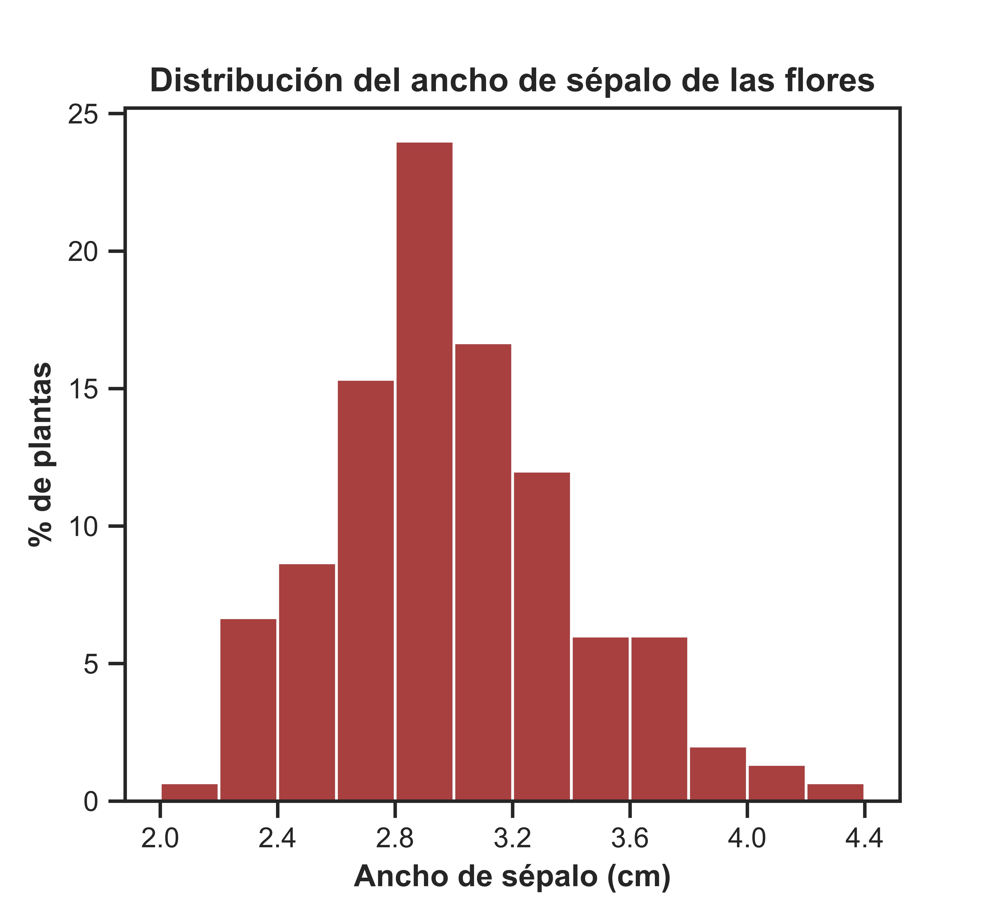
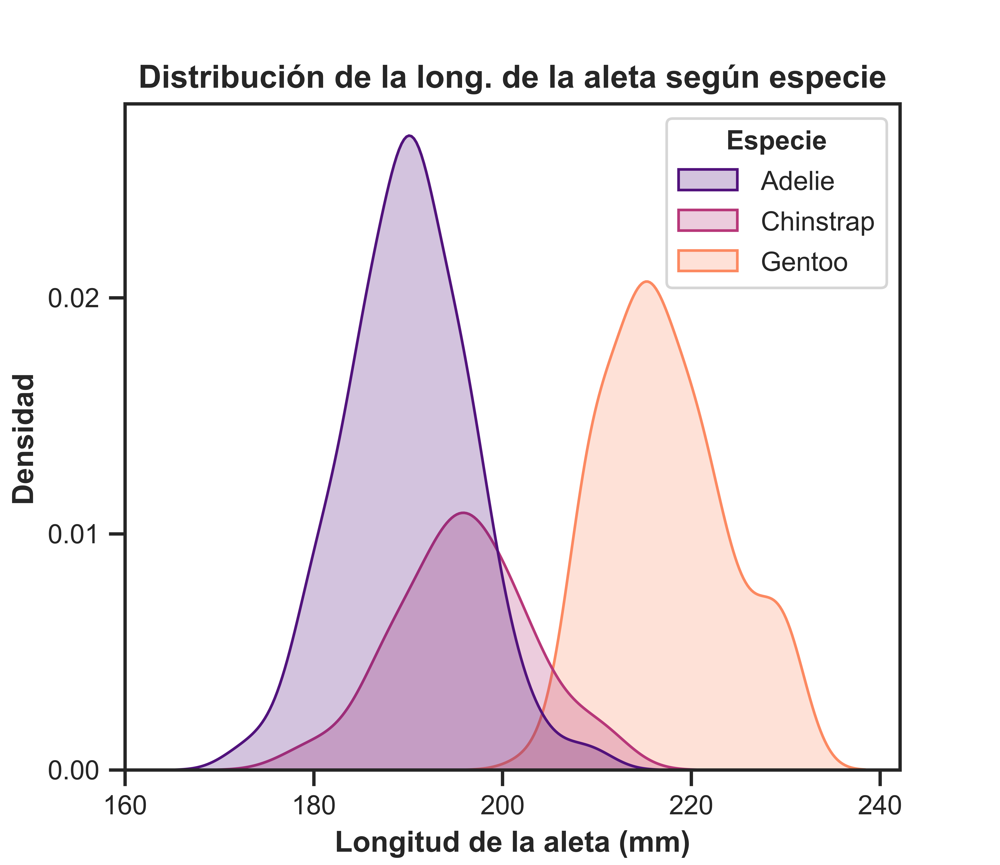

# Unidad 4 - Análisis exploratorio de datos: Visualizaciones

```{admonition} 📂 Descargar archivos  
[Descargar los archivos para la práctica desde el Campus Virtual](https://campusv.fceia.unr.edu.ar/course/view.php?id=471)```

### **Ejercicio N°1**

El dataset **`iris.csv`** contiene información sobre 150 flores de iris de tres especies diferentes: *setosa*, *versicolor* y *virginica*. Para cada flor, se midieron cuatro características: longitud y ancho del sépalo (la parte que rodea y protege el capullo de la flor) y longitud y ancho del pétalo (la parte coloreada de la flor).

1. Reproduzca el histograma mostrado en la siguiente figura para visualizar la distribución del ancho de sépalo. **Sugerencia:** configure previamente el *theme* de Seaborn empleando el argumento **`style='ticks'`** en la función **`set_theme()`**. El color de las barras debe ser **darkred**.

<p align="center">
  
</p>

<br />

2. Realice el gráfico en paneles que se muestra en la siguiente figura, en el que se representan los gráficos de violín para las variables ancho de sépalo y ancho de pétalo. **Sugerencia:** utilice **`plt.subplots()`** para crear los paneles y personalice cada gráfico en su respectivo eje. ¿Cuál de las siguientes opciones describe de una **manera más precisa** la forma de cada una de las distribuciones? *Distribución simétrica* - *Distribución sesgada a la derecha* - *Distribución unimodal* - *Distribución bimodal* - *Distribución normal* - *Distribución sesgada a la izquierda* - *Distribución uniforme*

<p align="center">
  
</p>

<br />

<div style="border-left: 4px solid #8a1717; padding: 0.5em; background: #f9f9f9;">
La función <code><strong>plt.subplots()</strong></code> de Matplotlib crea una figura con una cuadrícula de subgráficos (elemento llamado <code><strong>axes</strong></code>), permitiendo organizar varios gráficos en una sola figura. El uso básico es el siguiente:

<code class="language-python">
fig, axes = plt.subplots(nrows, ncols)
</code>

Donde <code><strong>nrows</code></strong> y <code><strong>ncols</code></strong> especifican el número de filas y columnas de subgráficos. La función devuelve una figura (<code><strong>fig</code></strong>) y un array de ejes (<code><strong>axes</code></strong>). Cada subgráfico individual es un objeto
de tipo <code><strong>Axes</code></strong> que se puede personalizar de manera independiente.
</div>

<br />

3. Realice un boxplot múltiple que permita comparar la distribución del largo del pétalo de las flores entre las distintas especies. Comente brevemente lo observado. ¿Cuál de las especies presenta una mayor mediana del largo del pétalo?

4. Sobre cada uno de los boxplots del gráfico del ítem anterior, añada la media del largo del pétalo para la especie correspondiente. **Sugerencia:** utilice la función **`stripplot()`** de **Seaborn** para representar la medida descriptiva segmentada.

5. Construya un gráfico que le permita analizar la relación general que existe entre las variables ancho y largo del pétalo. Realice un comentario acerca de lo observado y complemente el gráfico anterior informando una medida de la fuerza y la dirección de la asociación lineal entre ambas variables.

### **Ejercicio N°2**
El dataset **`registro_temperatura365d_smn.txt`** contiene las temperaturas máximas y mínimas registradas diariamente entre el 03/10/2023 y el 01/10/2024 en todas las estaciones meteorológicas de superficie pertenecientes al Servicio Meteorológico Nacional.

1. Explore la estructura del archivo. Notará que no se utiliza un delimitador particular para separar las distintas columnas sino que los distintos campos están alineados en columnas con diferente número de espacios que separan uno del otro. Por este motivo, y aprovechando que las primeras columnas son de ancho fijo, se sugiere utilizar la función **`read_fwf()`** de Pandas, que permite leer este tipo de archivos. 

<br />

<div style="border-left: 4px solid #8a1717; padding: 0.5em; background: #f9f9f9;">
La función **`pd.read_fwf()`** en Pandas se utiliza para leer archivos de texto que tienen columnas de ancho fijo, donde cada columna ocupa una cantidad específica de caracteres. Esta función es útil cuando los datos no están separados por delimitadores como comas o espacios, sino que están organizados en columnas de longitudes fijas.

Al emplear esta función se deben definir los anchos de las columnas mediante el parámetro **`colspecs`**. Esto se hace proporcionando una lista de tuplas, donde cada tupla indica el rango de posiciones que corresponden a cada columna. Como ayuda, en nuestro caso **`colspecs`** comienza con la tupla (0, 8) para definir los límites de la columna **`FECHA`**, es decir: **`colspecs = [(0, 8), ...]`**.

**`read_fwf()`** ignora los espacios en blanco al cargar los datos, por lo que no es necesario preocuparse por los espacios adicionales que puedan existir.
</div>

<br />

2. Construya un gráfico que le permita comparar las distribuciones de temperaturas mínimas y máximas diarias entre los últimos 12 meses (octubre 2023 a septiembre 2024) registradas en la estación del Aeropuerto Rosario (”ROSARIO AERO”).

3. En base al gráfico realizado, responda las siguientes preguntas:

- ¿Cuál fue el mes del último año con la mayor temperatura máxima mediana?

- ¿Cuál fue el mes del último año con la menor temperatura mínima mediana?

- Considerando la variabilidad del 50% central de las temperaturas registradas en el mes, ¿cuál fue el mes del último año con una menor dispersión tanto en sus temperaturas mínimas como en sus temperaturas máximas? 

- ¿Cuál fue el mes del último año que presentó una mayor amplitud en sus temperaturas mínimas registradas?

- Considerando los meses del invierno 2024, ¿existió algún mes en el cual se haya registrado una temperatura máxima atípica en relación al resto de los registros de ese mes?
    
4. Realice nuevamente el ítem 2 con los datos correspondientes a la estación meteorológica localizada en la Base Marambio de la Antártida Argentina. Compare los dos gráficos y comente las diferencias que encuentra en las distribuciones de las temperaturas registradas en ambas estaciones.

### **Ejercicio N° 3**
El dataset **Penguins** contiene información acerca de un conjunto de pingüinos que habitan el Archipiélago Palmer, un archipiélago del Océano Glacial Antártico que se encuentra conformado por un conjunto de islas montañosas. Sobre cada ejemplar se cuenta con la siguiente información:

- **`species`**: especie a la que pertenece (Chinstrap, Adélie o Gentoo).

- **`culmen_length_mm`**: largo del culmen, cresta superior del pico (mm).

- **`culmen_depth_mm`**: altura del culmen (mm).

- **`flipper_length_mm`**: largo de la aleta (mm).

- **`body_mass_g`**: masa corporal (g).

- **`island`**: nombre de la isla del Archipiélago Palmer en la que habita (Dream, Torgersen o Biscoe).

- **`sex`**: sexo.

El mismo puede importarse al entorno de trabajo utilizando la función **`sns.load_dataset('penguins')`** de Seaborn.

1. Reproduzca el gráfico mostrado en la @fig-ej3 para visualizar la distribución del largo de la aleta entre las distintas especies de pingüinos. En el mismo se utilizaron colores pertenecientes a la paleta **magma**.

<p align="center">
  
</p>

<br />

2. Realice una tabla en la que se muestre qué porcentaje de pingüinos del dataset pertenece a cada una de las tres especies.

3. Teniendo en cuenta las características del gráfico realizado en el ítem 1 y la información contenida en la tabla realizada en el ítem 2, ¿qué observación puede realizar acerca de las curvas de densidad representadas para cada especie? **Sugerencia:** dentro de la [documentación de Seaborn](https://seaborn.pydata.org/index.html), busque información sobre el parámetro **`common_norm`** de la función **`kdeplot()`** que utilizó para construir el gráfico.

4. ¿A cuál de las tres especies se refiere la siguiente frase? **El 90% de los pingüinos presenta una longitud de aleta menor o igual a 198 mm.**

## **Ejercicio N° 4**
Utilizando el dataset `iris.csv` del **Ejercicio N° 1**:

1. Construya un gráfico que le permita visualizar la distribución de los valores observados del ancho de sépalo. A partir del gráfico realizado, ¿qué puede decir acerca de la simetría de la distribución?

2. Realice un gráfico que permita comparar la distribución del largo del pétalo de las flores entre las distintas especies. Comente brevemente lo observado.

3. 

- Construya un gráfico que le permita analizar la relación general que existe entre las variables ancho y largo del pétalo. ¿Qué observa?
    
- Modifique el gráfico realizado en el ítem anterior de tal manera que le permita analizar si la relación general entre el ancho y el largo del pétalo se mantiene según la especie. Comente brevemente lo observado.
    
4.

- Construya una matriz de gráficos que le permitan estudiar la asociación que existe entre todos los pares de variables cuantitativas del dataset. *Sugerencia*: utilice la función **`pairplot()`** de **Seaborn**. 

- Sobre las mismas variables cuantitativas del dataset, genere la matriz de correlación lineal de Pearson y represéntela gráficamente a través de un correlograma.  
    
- A partir de lo realizado en los ítems anteriores, caracterice el grado de asociación lineal entre los distintos pares de variables de interés, incluyendo fuerza y dirección, y analizando la correspondencia entre los valores calculados y lo observado gráficamente.

## **Ejercicio N° 5**
El set de datos `viajes_tup.xlsx` contiene información sobre el número de viajes mensuales registrados en el Transporte Urbano de Pasajeros (TUP) de la ciudad de Rosario entre los años 2015 y 2021.

1. Realice una tabla que resuma el total de viajes realizados por año y represente gráficamente dicha información. ¿Cuál fue el año en el que se registró la mayor cantidad de viajes en el TUP?

2. Construya un gráfico en el que se represente la evolución del número de viajes registrados en el TUP a lo largo de los meses para los años 2019 y 2020. Comente brevemente lo observado.
