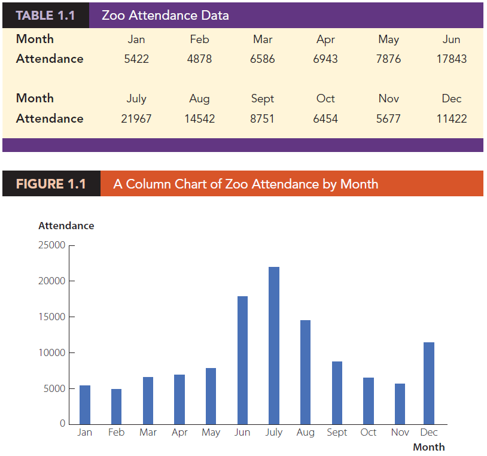
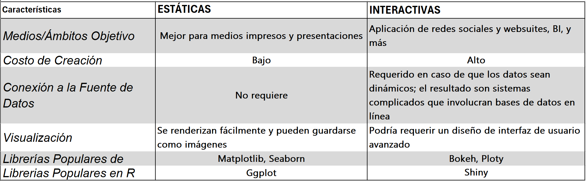

# Unidad 4 - Análisis exploratorio de datos: Visualizaciones

### Fundamentos de ciencia de datos


## Introducción

Recomendamos la siguiente lectura: [Articulo del Gorila](https://genomebiology.biomedcentral.com/articles/10.1186/s13059-020-02133-w)

Dicho artículo trata sobre el costo oculto de tener una hipótesis en la investigación científica. Allí se argumenta que si bien tener una hipótesis puede ser útil para guiar el diseño de pruebas y analizar los resultados de manera efectiva, también puede limitar la creatividad y la exploración de nuevos descubrimientos. Se utiliza la metáfora de la ciencia nocturna y diurna para describir las dos fases de la investigación científica. La fase diurna es cuando se realizan pruebas y se analizan los resultados para probar una hipótesis, mientras que la fase nocturna es cuando se exploran nuevos descubrimientos sin tener una hipótesis específica en mente. El artículo argumenta que la limitación de la creatividad que surge de tener una hipótesis puede ser particularmente problemática en el contexto de conjuntos de datos biológicos modernos que son grandes y contienen múltiples descubrimientos potencialmente emocionantes.

Para ilustrar este punto, el artículo describe un experimento en el que los estudiantes analizan un conjunto de datos. A un grupo de estudiantes se les pide que consideren tres hipótesis específicas al analizar los datos, mientras que a otro grupo se les pide simplemente que analicen los datos sin tener una hipótesis específica en mente. Los resultados del experimento muestran que los estudiantes que no tienen una hipótesis específica tienden a identificar más descubrimientos y patrones en los datos que los estudiantes que tienen una hipótesis específica. El artículo destaca la importancia de equilibrar la investigación diurna y nocturna para maximizar el potencial de descubrimientos emocionantes y útiles en la ciencia.

### Visualización de datos

La visualización de datos, también conocida como data visualization, es una herramienta fundamental en la ciencia de datos que permite representar información compleja de manera visual y fácil de entender. En general, la ciencia de datos implica el análisis de grandes cantidades de datos para extraer información útil y obtener conocimiento sobre fenómenos complejos. Sin embargo, la simple acumulación de datos no es suficiente para tomar decisiones informadas. Es necesario que los datos sean presentados de una manera que permita identificar patrones, tendencias y relaciones.

La visualización de datos, por lo tanto, se refiere al uso de gráficos, diagramas, mapas, tablas y otros recursos visuales para representar datos de una manera que sea fácil de entender y que permita identificar patrones y tendencias que podrían no ser evidentes de otra manera. El objetivo principal de la visualización de datos es comunicar información de manera efectiva y ayudar a los usuarios a tomar decisiones informadas.

En la ciencia de datos, la visualización de datos se utiliza **en todas las etapas del proceso**, desde la exploración y limpieza de los datos, hasta la presentación de los resultados finales. Es una herramienta clave para explorar y comprender los datos, identificar patrones, relaciones y outliers, y comunicar los resultados a audiencias no técnicas. Además, la visualización de datos también se utiliza para comunicar los resultados de modelos complejos y hacer que los datos sean más accesibles y comprensibles para personas con diferentes niveles de habilidad y conocimiento técnico.

### ¿Por qué visualizar datos?

(Extraído del libro “Data Visualization: Exploring and Explaining with Data” - Jeffrey D. Camm)

Creamos visualizaciones de datos por dos razones: para explorar los datos y para comunicar/explicar un mensaje. Discutamos estos usos de la visualización de datos con más detalle, examinemos las diferencias entre los dos usos y consideremos cómo se relacionan con los tipos de análisis descritos anteriormente.

**Visualización de datos para la exploración**
La visualización de datos es una herramienta poderosa para explorar datos y poder identificar patrones, reconocer anomalías o irregularidades en los datos y comprender mejor las relaciones entre variables. Nuestra capacidad para detectar este tipo de características de los datos es mucho más fuerte y rápida cuando vemos una visualización de los datos en lugar de una simple lista.
Como ejemplo de visualización de datos para la exploración, consideremos los datos de asistencia al zoológico mostrados en la Tabla 1.1 y la Figura 1.1. Comparando la Tabla 1.1 y la Figura 1.1, observe que el patrón en los datos es más detectable en el gráfico de columnas de la Figura 1.1 que en una tabla de números. Un gráfico de columnas muestra datos numéricos mediante la altura de la columna para una variedad de categorías o períodos de tiempo. En el caso de la Figura 1.1, los períodos de tiempo son los diferentes meses del año.



Nuestra intuición y experiencia nos dice que esperaríamos que la asistencia al zoológico sea más alta en los meses de verano, cuando muchos niños en edad escolar están de vacaciones de verano (recordemos que este ejemplo fue tomado de un libro escrito por una persona del hemisferio norte). La Figura 1.1 confirma esto, ya que la asistencia al zoológico es más alta en los meses de verano de junio, julio y agosto (en hemisferio norte). Además, vemos que la asistencia aumenta gradualmente cada mes de febrero a mayo a medida que aumenta la temperatura promedio, y disminuye gradualmente cada mes de septiembre a noviembre a medida que la temperatura promedio disminuye. ¿Pero por qué la asistencia al zoológico en diciembre y enero no sigue estos patrones? Resulta que el zoológico tiene un evento conocido como el "Festival de las Luces" que se lleva a cabo desde finales de noviembre hasta principios de enero. Los niños están de vacaciones escolares durante la última mitad de diciembre y principios de enero para las fiestas de fin de año, y esto lleva a un aumento de la asistencia en las noches en el zoológico a pesar de las bajas temperaturas invernales. La exploración visual de datos es una parte importante del análisis descriptivo. La visualización de datos también se puede usar directamente para monitorear las principales métricas de rendimiento, es decir, medir cómo está funcionando una organización en relación con sus objetivos.

**Visualización de datos para explicación**

La visualización de datos también es importante para explicar relaciones encontradas en los datos y para explicar los resultados de modelos predictivos y prescriptivos. En general, la visualización de datos es útil para comunicarse con su audiencia y asegurarse de que su audiencia comprenda y se centre en su mensaje previsto.
Consideremos el artículo "Conoce la cultura antes de un nuevo trabajo", que apareció en The Wall Street Journal. El artículo discute la importancia de encontrar un buen ajuste cultural al buscar un nuevo trabajo. La dificultad para entender una cultura empresarial o la falta de alineación con esa cultura puede llevar a la insatisfacción laboral. La figura 1.3 es una recreación de un gráfico de barras que apareció en este artículo. Un gráfico de barras muestra un resumen de datos categóricos utilizando la longitud de las barras horizontales para mostrar la magnitud de una variable cuantitativa.
El gráfico mostrado en la figura 1.3 muestra el porcentaje de los 10.002 encuestados que enumeraron un factor como el más importante al buscar trabajo. Observe que nuestra atención se dirige a la barra azul oscuro, que es "Cultura de la empresa" (el enfoque del artículo). Inmediatamente vemos que solo "Salario y bonificación" se cita con más frecuencia que "Cultura de la empresa". Cuando se mira por primera vez el gráfico, el mensaje que se comunica es que la cultura empresarial es el segundo factor más importante citado por los solicitantes de empleo. Y como lector, en función de ese mensaje, decide si el artículo merece la pena leerlo.


## Visualización de distribuciones: histogramas, densidades, boxplots, gráficos de violines, distribuciones acumuladas

En el mundo de la estadística y el análisis de datos, la visualización de distribuciones es una herramienta esencial para comprender y comunicar información compleja de manera clara y efectiva. Los gráficos y diagramas no sólo facilitan la interpretación de los datos, sino que también permiten una exploración más profunda de las características y patrones subyacentes. En esta parte se abordarán algunas técnicas gráficas clave en la visualización de distribuciones, por ejemplo: histogramas, densidades, boxplots, gráficos de violines y distribuciones acumuladas.

Cada una de estas técnicas ofrece una perspectiva única sobre la estructura y comportamiento de los datos, permitiendo a los analistas identificar tendencias, anomalías y relaciones ocultas.

### Histogramas

Con frecuencia nos encontramos con la situación en la que nos gustaría comprender cómo se distribuye una variable particular en un conjunto de datos. Para dar un ejemplo concreto, consideraremos los pasajeros del Titanic. Allí había aproximadamente 1300 pasajeros (sin contar la tripulación) y 756 de ellos con edades conocidas. Podríamos querer saber cuántos pasajeros había de determinadas edades en el Titanic, es decir, cuántos niños, adultos jóvenes, personas de mediana edad, personas mayores, etc. A las proporciones relativas de diferentes edades entre los pasajeros las llamamos distribución de edad de los pasajeros.

**Visualizando una distribución simple**

Podemos obtener una idea de la distribución por edades entre los pasajeros agrupando a todos los pasajeros en segmentos con edades comparables y luego contando el número de pasajeros en cada segmento. 

```python
import pandas as pd

titanic_data = pd.read_csv('titanic.csv')

# Define los límites de los segmentos de edad y los etiqueta
age_bins = [0, 5, 10, 15, 20, 25, 30, 35, 40, 45, 50, 55, 60, 65, 70, 75, 80]
age_labels = ['0-5', '6-10', '11-15', '16-20', '21-25', '26-30', '31-35', '36-40', '41-45', '46-50', '51-55', '56-60', '61-65', '66-70', '71-75', '76-80']

# Crea una nueva columna en el DataFrame llamada 'AgeGroup' que contenga los segmentos de edad de cada pasajero:
titanic_data_cleaned['AgeGroup'] = pd.cut(titanic_data_cleaned['Age'], bins=age_bins, labels=age_labels)

# Cuenta el número de pasajeros en cada segmento de edad y almacena los resultados en una variable:
age_distribution = titanic_data_cleaned['AgeGroup'].value_counts().sort_index()

print(age_distribution)
```

Este procedimiento da como resultado una tabla como la siguiente:


Podemos visualizar esta tabla dibujando rectángulos rellenos cuyas alturas correspondan a los conteos y cuyo ancho corresponda al ancho de los intervalos de edad.
Tal visualización se llama histograma. (Tener en cuenta que todos los contenedores deben tener el mismo ancho para que la visualización sea un histograma válido).

```python
import pandas as pd
import matplotlib.pyplot as plt

plt.figure(figsize=(12, 6))
plt.bar(age_distribution.index, age_distribution.values)
plt.title('Histograma de la Distribución de Edades en el Titanic')
plt.xlabel('Segmentos de Edad')
plt.ylabel('Cantidad de Pasajeros')
plt.show()
```


Debido a que los histogramas se generan al agrupar los datos, su apariencia visual exacta depende de la elección del ancho del agrupamiento. La mayoría de los programas de visualización que generan histogramas elegirán un ancho de intervalo por defecto, pero lo más probable es que el ancho de intervalo no sea el más apropiado para cualquier histograma que desee crear. Por lo tanto, es fundamental probar siempre diferentes anchos de intervalo para verificar que el histograma resultante refleje los datos subyacentes con precisión. En general, si el ancho del intervalo es demasiado pequeño, entonces en el histograma se ven demasiados picos y visualmente confuso, y las principales tendencias en los datos pueden oscurecerse. Por otro lado, si el ancho del intervalo es demasiado grande, las características más pequeñas en la distribución de los datos, como la caída alrededor de los 10 años en este ejemplo, pueden desaparecer.
Para la distribución por edades de los pasajeros del Titanic, podemos ver que un ancho de contenedor de 1 año es demasiado pequeño y un ancho de contenedor de 15 años es demasiado grande, mientras que los anchos de contenedor de entre 3 y 5 años funcionan bien.


Los histogramas dependen del ancho del contenedor elegido. Aquí, se muestra la misma distribución de edad de los pasajeros del Titanic con cuatro anchos de compartimiento diferentes: (a) 1 año; (b) 3 años; (c) 5 años; d) 15 años. Fuente de datos: Enciclopedia Titanica.

<aside>
💡 Al hacer un histograma, siempre explorar múltiples anchos para la agrupación

</aside>

**Densidad**

Los histogramas han sido una opción de visualización popular desde al menos el siglo XVIII, en parte porque se generan fácilmente a mano. Más recientemente, a medida que el poder de cómputo está disponible en dispositivos cotidianos como computadoras portátiles y teléfonos celulares, vemos que se reemplazan cada vez más por diagramas de densidad. En una gráfica de densidad, intentamos visualizar la distribución de probabilidad subyacente de los datos (poblacional) dibujando una curva continua apropiada. Esta curva debe estimarse a partir de los datos, y el método más utilizado para este procedimiento de estimación se denomina estimación de densidad por kernel. En la estimación de la densidad por kernel, dibujamos una curva continua (el kernel) con un ancho pequeño (controlado por un parámetro llamado ancho de banda) en la ubicación de cada punto de datos, y luego agregamos (sumamos) todas estas superficies para obtener la estimación de densidad final. El núcleo más utilizado es un núcleo gaussiano (es decir, una curva de campana gaussiana), pero hay muchas otras opciones.

```python
plt.figure(figsize=(12, 6))
sns.kdeplot(data=titanic_data_cleaned['Age'], shade=True)
plt.title('Diagrama de Densidad de la Distribución de Edades en el Titanic')
plt.xlabel('Edad')
plt.ylabel('Densidad')
plt.xlim(0, 75)
plt.show()
```


Estimación de la densidad del núcleo de la distribución por edades de los pasajeros del Titanic.
La altura de la curva está escalada de manera que el área bajo la curva sea igual a 1. La estimación de la densidad se realizó con un núcleo gaussiano y un ancho de banda de 2. Fuente de datos: Enciclopedia Titanica.

Tal como ocurre con los histogramas, la apariencia visual exacta de un gráfico de densidad depende de las opciones de kernel y ancho de banda. El parámetro de ancho de banda se comporta de manera similar al ancho del contenedor en los histogramas. Si el ancho de banda es demasiado pequeño, entonces la estimación de la densidad puede volverse demasiado alta y visualmente ocupada y las principales tendencias en los datos pueden oscurecerse. Por otro lado, si el ancho de banda es demasiado grande, pueden desaparecer características más pequeñas en la distribución de los datos. Además, la elección del kernel afecta la forma de la curva de densidad. Por ejemplo, un núcleo gaussiano tendrá una tendencia a producir estimaciones de densidad que parezcan gaussianas, con rasgos y colas suaves. Por el contrario, un kernel rectangular puede generar la apariencia de pasos en la curva de densidad (Figura “d”). En general, cuantos más puntos de datos hay en el conjunto de datos, menos importa la elección del kernel. Por lo tanto, los diagramas de densidad tienden a ser bastante confiables e informativos para grandes conjuntos de datos, pero pueden ser engañosos para conjuntos de datos de solo unos pocos puntos.

```python
import pandas as pd
import matplotlib.pyplot as plt
from scipy.stats import gaussian_kde
import numpy as np

# Define el ancho de banda del kernel (un valor más bajo generará curvas más puntiagudas)
bandwidth = 0.05

# Crea una función de densidad de kernel gaussiano (KDE) utilizando scipy
# https://docs.scipy.org/doc/scipy/reference/generated/scipy.stats.gaussian_kde.html
kde = gaussian_kde(titanic_data_cleaned['Age'], bw_method=bandwidth)

# Genera un conjunto de valores de edad en el rango deseado (0 a 80) para evaluar la función KDE
x_values = np.linspace(0, 80, num=1000)

# Evalúa la función KDE en los valores de edad generados
density_values = kde.evaluate(x_values)

# Grafica el diagrama de densidad de la distribución de edades con las curvas más puntiagudas utilizando matplotlib
plt.figure(figsize=(12, 6))
plt.plot(x_values, density_values)
plt.fill_between(x_values, density_values, alpha=0.5)
plt.title('Diagrama de Densidad de la Distribución de Edades en el Titanic (Curvas Puntiagudas)')
plt.xlabel('Edad')
plt.ylabel('Densidad')

# Establece el rango del eje x de 0 a 80
plt.xlim(0, 80)

plt.show()
```


Las estimaciones de la densidad por kernel dependen del kernel y el ancho de banda elegidos. Aquí, se muestra la misma distribución de edad de los pasajeros del Titanic para cuatro combinaciones diferentes de estos parámetros: (a) núcleo gaussiano, ancho de banda = 0,5; (b) Kernel gaussiano, ancho de banda = 2; (c) Kernel gaussiano, ancho de banda = 5; (d) núcleo rectangular, ancho de banda = 2. Fuente de datos: Enciclopedia Titanica.

Las curvas de densidad generalmente se escalan de manera que el área bajo la curva sea igual a 1. Esta convención puede hacer que la escala del eje y sea confusa, porque depende de las unidades del eje x. Por ejemplo, en el caso de la distribución por edad, el rango de datos en el eje x va de 0 a aproximadamente 75. Por lo tanto, esperamos que la altura media de la curva de densidad sea 1/75 = 0,013. De hecho, cuando observamos las curvas de densidad de edad, vemos que los valores de y varían de 0 a aproximadamente 0,04, con un promedio cercano a 0,01.

Las estimaciones de la densidad del kernel tienen una trampa que debemos tener en cuenta: tienden a producir la apariencia de datos donde no existen, en particular en las colas.
Como consecuencia, el uso descuidado de las estimaciones de densidad puede conducir fácilmente a cifras que hacen afirmaciones sin sentido. Por ejemplo, si no prestamos atención, podríamos generar una visualización de una distribución de edades que incluya edades negativas:


Las estimaciones de la densidad del núcleo pueden extender las colas de la distribución a áreas donde no existen datos y ni siquiera es posible obtenerlos. Aquí, se ha permitido que la densidad estimada para las edades de los pasajeros del Titanic se extienda al rango de edad negativo. Esto no tiene sentido y debe evitarse. Fuente de datos: Enciclopedia Titanica.

<aside>
💡 Siempre verifique que su estimación de densidad no prediga la existencia de valores de datos sin sentido.

</aside>

Entonces, ¿debería elegir un histograma o un gráfico de densidad para visualizar una distribución? Se pueden tener discusiones acaloradas sobre este tema. Algunas personas están vehementemente en contra de los diagramas de densidad y creen que son arbitrarios y engañosos. Otros se dan cuenta de que los histogramas pueden ser igualmente arbitrarios y engañosos. La elección es en gran medida una cuestión de gusto, pero a veces una u otra opción puede reflejar con mayor precisión las características específicas de interés en los datos disponibles. También existe la posibilidad de no utilizar ninguno y, en su lugar, elegir funciones de densidad acumulada empírica o diagramas q-q.
Sin embargo, las estimaciones de densidad tienen una ventaja inherente sobre los histogramas en cuanto queremos visualizar más de una distribución a la vez.

**Visualización de múltiples distribuciones al mismo tiempo**

En muchos escenarios tenemos múltiples distribuciones que nos gustaría visualizar simultáneamente.
Por ejemplo, digamos que nos gustaría ver cómo se distribuyen las edades de los pasajeros del Titanic entre hombres y mujeres. ¿Los pasajeros masculinos y femeninos tenían generalmente la misma edad, o había una diferencia de edad entre los géneros? Una estrategia de visualización comúnmente empleada en este caso es un histograma apilado, donde dibujamos las barras del histograma para las mujeres encima de las barras para los hombres, en un color diferente.

```python
import pandas as pd
import matplotlib.pyplot as plt

male_data = titanic_data_cleaned[titanic_data_cleaned['Sex'] == 'male']
female_data = titanic_data_cleaned[titanic_data_cleaned['Sex'] == 'female']

age_bins = [0, 5, 10, 15, 20, 25, 30, 35, 40, 45, 50, 55, 60, 65, 70, 75, 80]
age_labels = ['0-5', '6-10', '11-15', '16-20', '21-25', '26-30', '31-35', '36-40', '41-45', '46-50', '51-55', '56-60', '61-65', '66-70', '71-75', '76-80']

male_hist, _ = np.histogram(male_data['Age'], bins=age_bins)
female_hist, _ = np.histogram(female_data['Age'], bins=age_bins)

plt.figure(figsize=(12, 6))
plt.bar(age_labels, male_hist, label='Hombres', color='blue', alpha=0.7)
plt.bar(age_labels, female_hist, bottom=male_hist, label='Mujeres', color='red', alpha=0.7)
plt.title('Histograma Apilado de la Distribución de Edades en el Titanic')
plt.xlabel('Segmentos de Edad')
plt.ylabel('Cantidad de Pasajeros')
plt.legend()
plt.show()
```


Histograma de las edades de los pasajeros del Titanic estratificados por género. Esta cifra se ha etiquetado como "mala" porque los histogramas apilados se confunden fácilmente con histogramas superpuestos (consulte la Figura 7-7). Además, las alturas de las barras que representan a las pasajeras no pueden compararse fácilmente entre sí. Fuente de datos: Enciclopedia Titanica.

Este tipo de visualización puede provocar dos problemas. Primero, con solo mirar la figura, nunca está del todo claro dónde comienzan exactamente las barras. ¿Comienzan donde cambia el color o están destinados a comenzar en cero? En otras palabras, ¿hay unas 25 mujeres de 18 a 20 años o hay casi 80?
(El primero es el caso.) En segundo lugar, las alturas de las barras para los conteos femeninos no se pueden comparar directamente entre sí, porque todas las barras comienzan a una altura diferente. Por ejemplo, los hombres eran en promedio mayores que las mujeres, y este hecho no es del todo visible en la figura.
Podríamos tratar de abordar estos problemas haciendo que todas las barras comiencen en cero y haciendo que las barras sean parcialmente transparentes.


Distribuciones de edad de pasajeros masculinos y femeninos del Titanic, mostradas como dos histogramas superpuestos. Esta cifra ha sido etiquetada como "mala" porque no hay una indicación visual clara de que todas las barras azules comiencen en 0. Fuente de datos: Enciclopedia Titanica.

Sin embargo, este enfoque genera nuevos problemas. Ahora parece que hay en realidad tres grupos diferentes, no solo dos, y todavía no estamos completamente seguros de dónde cada barra comienza y termina. Los histogramas superpuestos no funcionan bien porque una barra semitransparente dibujada encima de otra tiende a no verse como una barra semitransparente sino como una barra dibujada en un color diferente.

Los gráficos de densidad superpuestos no suelen tener el problema que tienen los histogramas superpuestos, porque las líneas de densidad continuas ayudan al ojo a mantener las distribuciones separadas. Sin embargo, para este conjunto de datos en particular, las distribuciones de edad para pasajeros masculinos y femeninos son casi idénticas hasta alrededor de los 17 años y luego divergen, por lo que la visualización resultante aún no es la ideal.

Una solución que funciona bien para este conjunto de datos es mostrar las distribuciones de edad de los pasajeros masculinos y femeninos por separado, cada uno como una proporción de la distribución de edad general. Esta visualización muestra intuitiva y claramente que había muchas menos mujeres que hombres en el rango de edad de 20 a 50 años en el Titanic.

```python
import pandas as pd
import matplotlib.pyplot as plt
import seaborn as sns

# Limpia los datos eliminando las filas con valores de edad faltantes:
titanic_data_cleaned = titanic_data.dropna(subset=['Age'])

# Separa los datos por género:
male_data = titanic_data_cleaned[titanic_data_cleaned['Sex'] == 'male']
female_data = titanic_data_cleaned[titanic_data_cleaned['Sex'] == 'female']

# Grafica el diagrama de densidades utilizando seaborn
bandwidth = 0.5
plt.figure(figsize=(12, 6))
sns.kdeplot(data=male_data['Age'], fill=True, label='Hombres', bw_adjust=bandwidth)
sns.kdeplot(data=female_data['Age'], fill=True, label='Mujeres', bw_adjust=bandwidth)
plt.title('Diagrama de Densidad de la Distribución de Edades en el Titanic por Género')
plt.xlabel('Edad')
plt.ylabel('Densidad')
plt.xlim(0, 80)
plt.legend()
plt.show()
```


Estimaciones de densidad de las edades de los pasajeros masculinos y femeninos del Titanic. Para resaltar que había más pasajeros hombres que mujeres, las curvas de densidad se escalaron de tal manera que el área bajo cada curva corresponde al número total de pasajeros hombres y mujeres con edad conocida (468 y 288, respectivamente). Fuente de datos: Enciclopedia Titánica.


Distribuciones de edad de pasajeros masculinos y femeninos del Titanic, mostradas como proporciones del número total de pasajeros. Las áreas coloreadas muestran las estimaciones de densidad de las edades de los pasajeros masculinos y femeninos, respectivamente, y las áreas grises muestran la distribución general de edades de los pasajeros. Fuente de datos: Enciclopedia Titanica.

Finalmente, cuando queremos visualizar exactamente dos distribuciones, también podemos hacer dos histogramas separados, rotarlos 90 grados y hacer que las barras en un histograma apunten en la dirección opuesta al otro. Este truco se emplea comúnmente cuando se visualizan distribuciones de edad, y el gráfico resultante generalmente se denomina pirámide de edad.

```python
import pandas as pd
import matplotlib.pyplot as plt
import numpy as np

# Limpia los datos eliminando las filas con valores de edad faltantes
titanic_data_cleaned = titanic_data.dropna(subset=['Age'])

# Separa los datos por género
male_data = titanic_data_cleaned[titanic_data_cleaned['Sex'] == 'male']
female_data = titanic_data_cleaned[titanic_data_cleaned['Sex'] == 'female']

# Define los límites de los segmentos de edad y los etiqueta
age_bins = [0, 5, 10, 15, 20, 25, 30, 35, 40, 45, 50, 55, 60, 65, 70, 75, 80]
age_labels = ['0-5', '6-10', '11-15', '16-20', '21-25', '26-30', '31-35', '36-40', '41-45', '46-50', '51-55', '56-60', '61-65', '66-70', '71-75', '76-80']

# Crea histogramas por género utilizando la función np.histogram y los límites de los segmentos de edad definidos
male_hist, _ = np.histogram(male_data['Age'], bins=age_bins)
female_hist, _ = np.histogram(female_data['Age'], bins=age_bins)

# Prepara el tamaño de la figura
plt.figure(figsize=(12, 6))

# Dibuja las barras para hombres (valores negativos para representar la parte izquierda de la pirámide)
plt.barh(age_labels, -male_hist, label='Hombres', color='blue', alpha=0.7)

# Dibuja las barras para mujeres (valores positivos para representar la parte derecha de la pirámide)
plt.barh(age_labels, female_hist, label='Mujeres', color='red', alpha=0.7)

plt.title('Diagrama de Pirámide de la Distribución de Edades en el Titanic por Género')
plt.xlabel('Cantidad de Pasajeros')
plt.ylabel('Segmentos de Edad')
plt.legend()

# Ajusta el rango del eje x para que se muestre correctamente el diagrama de pirámide
max_population = max(max(male_hist), max(female_hist))
plt.xlim(-max_population, max_population)

# Muestra los valores negativos en el eje x como positivos
plt.xticks(np.arange(-max_population, max_population, step=10), np.abs(np.arange(-max_population, max_population, step=10)))

plt.show()
```


Las distribuciones de edad de los pasajeros masculinos y femeninos del Titanic se visualizan como una pirámide de edad. Fuente de datos: Enciclopedia Titanica.

Es importante destacar que este truco no funciona cuando hay más de dos distribuciones que queremos visualizar al mismo tiempo. Para distribuciones múltiples, los histogramas tienden a volverse confusos, mientras que los gráficos de densidad funcionan bien siempre que las distribuciones sean algo distintas y contiguas. Por ejemplo, para visualizar la distribución del porcentaje de grasa de mantequilla en la leche de vacas de cuatro razas diferentes de ganado, los diagramas de densidad están bien.

<aside>
💡 Para visualizar varias distribuciones a la vez, los diagramas de densidad kernel generalmente funcionarán mejor que los histogramas.

</aside>


Estimaciones de densidad del porcentaje de grasa butírica en la leche de cuatro razas de ganado. Fuente de datos: Registro Canadiense de Desempeño para Ganado Lechero de Pura Raza.

**Boxplots**

Los boxplots (también conocidos como diagramas de caja y bigotes) se utilizan para representar gráficamente la distribución de un conjunto de datos numéricos y mostrar la presencia de valores atípicos (outliers). 

El boxplot muestra cinco estadísticas resumen del conjunto de datos: la mediana (el valor correspondiente al indice de orden medio, 50% de los datos a cada lado ), el primer cuartil (el valor que divide al conjunto de datos en dos partes, dejando el 25% de los datos a la izquierda y el 75% a la derecha), el tercer cuartil (el valor que divide al conjunto de datos en dos partes, dejando el 75% de los datos a la izquierda y el 25% a la derecha), el valor mínimo y el valor máximo (que no se consideran outliers).

Además se compone de una caja que se extiende desde el primer cuartil hasta el tercer cuartil, y una línea dentro de la caja que representa la mediana. Dos líneas (bigotes) se extienden desde la caja hasta los valor que usualmente se calculan como Q1 - 1.5 * RIC y Q3 + 1.5 * RIC, respectivamente, excluyendo los valores atípicos que se encuentran más allá de los bigotes.

Los boxplots son útiles para comparar la distribución de datos entre diferentes grupos o conjuntos de datos, y para identificar valores atípicos que pueden estar influyendo en la distribución de los datos. A continuación se muestra un ejemplo de como se interpretan los diagramas de boxplots:


Los diagramas de boxplots ayudan también a comprender como se distribuyen los valores con respecto a su **simetría**, por ejemplo: 


Volviendo a nuestro dataset de ejemplo, al crear boxplots de las edades de los pasajeros que sobrevivieron y los que no, podemos explorar si la edad tuvo un impacto en la supervivencia durante el desastre. Por ejemplo, podríamos encontrar que los niños tuvieron una mayor tasa de supervivencia en comparación con los adultos mayores, a través del siguiente ejemplo:

```python
import pandas as pd
import matplotlib.pyplot as plt
import seaborn as sns

titanic_data = pd.read_csv('https://raw.githubusercontent.com/datasciencedojo/datasets/master/titanic.csv')

titanic_data_cleaned = titanic_data.dropna(subset=['Age'])

sns.set(style="whitegrid")
plt.figure(figsize=(12, 6))
sns.boxplot(x='Survived', y='Age', hue='Sex', data=titanic_data_cleaned)
plt.title('Boxplot de Edad vs. Supervivencia Separados por Sexo')
plt.xlabel('Supervivencia (0 = No, 1 = Sí)')
plt.ylabel('Edad')
plt.legend(title='Sexo')
plt.show()
```


El diagrama de caja mostró que las mujeres sobrevivientes tenían una mayor en las estadísticas de orden, lo que podría deberse a la ayuda de otros. Podría ser que se haya considerado un grupo de alta prioridad durante el rescate. Sobrevivieron más hombres jóvenes menores de 20 años, lo que podría deberse a que pudieron salvarse a sí mismos o recibieron ayuda en función de su edad más joven.

Otra hipótesis podría ser que la mayoría de las mujeres mayores tenían un hermano, cónyuge, padre o hijo que viajaba con ellas y que las ayudó.

Los diagramas de caja son simples pero informativos y funcionan bien cuando se trazan uno al lado del otro para visualizar muchas distribuciones a la vez. Otro ejemplo: Para los datos de temperatura de Lincoln (hemisferio norte), el uso de diagramas de caja conduce a la siguiente figura. En esa figura, ahora podemos ver que la temperatura está muy sesgada en diciembre (la mayoría de los días son moderadamente fríos y algunos extremadamente fríos) y no muy sesgada en algunos otros meses, como en julio.


Temperaturas medias diarias en Lincoln, NE, visualizadas como diagramas de caja. Fuente de datos: Weather Underground.

Los diagramas de caja fueron inventados por el estadístico **John Tukey** a principios de la década de 1970 y rápidamente ganaron popularidad porque eran muy informativos y fáciles de dibujar a mano, que es como se dibujaban la mayoría de las visualizaciones de datos en ese momento. Sin embargo, con las modernas capacidades informáticas y de visualización, no estamos limitados a lo que se dibuja fácilmente a mano. Por lo tanto, más recientemente vemos que los diagramas de caja son reemplazados por diagramas de violín.

**Diagrama de violines**

Los diagramas de violines se pueden usar siempre que se use un diagrama de caja, y brindan una imagen mucho más matizada de los datos. En particular, los diagramas de violín representarán con precisión los datos bimodales, mientras que un diagrama de caja no lo hará.
Solo los valores y de los puntos se visualizan en el gráfico de violín. El ancho del violín en un valor dado, representa la densidad de puntos en ese valor de y. Los violines son simétricos y  comienzan y terminan en los mínimos y máximos valores de datos, respectivamente. La parte más gruesa del violín corresponde a la densidad de puntos más alta en el conjunto de datos.


Anatomía de un diagrama de violín: Se muestra una nube de puntos (izquierda) y el diagrama de violín correspondiente (derecha).

<aside>
💡 Antes de usar violines para visualizar distribuciones, verifique que tenga suficientes puntos de datos en cada grupo para justificar mostrar las densidades de puntos como líneas suaves.

</aside>

Para graficar un diagrama de violines con temperaturas de la ciudad de Rosario, podemos usar el siguiente ejemplo:

```python
import pandas as pd
import pandas as pd
import seaborn as sns
import matplotlib.pyplot as plt

# Descargar dataset desde https://datos.gob.ar/dataset/smn-registro-temperatura-365-dias
# Descomprimir el siguiente archivo: registro_temperatura365d_smn.txt

# Lee el conjunto de datos con Pandas
column_widths = [8, 6, 6, 40]  # Ajusta estos valores según los anchos de tus columnas en el archivo
column_names = ['FECHA', 'TMAX', 'TMIN', 'NOMBRE']
df_temperaturas = pd.read_fwf('registro_temperatura365d_smn.txt', 
                              widths=column_widths, names=column_names, 
                              parse_dates=['FECHA'], dayfirst=True, 
                              encoding='latin-1', 
                              skiprows=3)

df_temperaturas['FECHA'] = pd.to_datetime(df_temperaturas['FECHA'], format='%d%m%Y')

ciudad = 'ROSARIO AERO'
ciudad_data = df_temperaturas[df_temperaturas['NOMBRE'] == ciudad]

ciudad_data['MES'] = ciudad_data['FECHA'].dt.month
ciudad_data['TPROM'] = (ciudad_data['TMAX'] + ciudad_data['TMIN']) / 2

plt.figure(figsize=(12, 6))
sns.violinplot(x='MES', y='TPROM', data=ciudad_data, inner='quartile')
plt.title('Diagrama de Violines de la Distribución de Temperaturas Promedio por Mes')
plt.xlabel('Mes')
plt.ylabel('Temperatura Promedio')
plt.show()
```


Para el caso de las temperaturas de Lincoln con violines, se obtiene la figura siguiente.


Temperaturas medias diarias en Lincoln, NE, visualizadas como gráficos de violín. Fuente de datos: Weather Underground

Ahora podemos ver que algunos meses tienen datos moderadamente bimodales. Por ejemplo, el mes de noviembre parece haber tenido dos grupos de temperatura, uno alrededor de los 50 grados y otro alrededor de los 35 grados Fahrenheit.
Debido a que las gráficas de violín se derivan de estimaciones de densidad, tienen deficiencias similares.
En particular, pueden generar la apariencia de que hay datos donde no los hay, o que el conjunto de datos es muy denso cuando en realidad es bastante escaso. Podemos tratar de eludir estos problemas simplemente trazando todos los puntos de datos individuales directamente, como puntos. Tal figura se llama un gráfico de tiras. 


Temperaturas medias diarias en Lincoln, NE, visualizadas como gráficos de franjas. Cada punto representa la temperatura media de un día. Esta cifra está etiquetada como "mala" porque se trazan tantos puntos uno encima del otro que no es posible determinar qué temperaturas fueron las más comunes en cada mes. Fuente de datos: Weather Underground.

Los gráficos de tiras están bien en principio, siempre y cuando nos aseguremos de no trazar demasiados puntos uno encima del otro. Una solución simple para la sobregraficación es esparcir los puntos un poco a lo largo del eje x, agregando algo de ruido aleatorio en la dimensión x. Esta técnica se llama **jittering**:


Temperaturas medias diarias en Lincoln, NE, visualizadas como gráficos de franjas. Los puntos se han alterado a lo largo del eje x para mostrar mejor la densidad de puntos en cada valor de temperatura. Fuente de datos: Weather Underground.

<aside>
💡 Siempre que el conjunto de datos sea demasiado escaso para justificar la visualización del violín, será posible trazar los datos sin procesar como puntos individuales.

</aside>

Finalmente, podemos combinar lo mejor de ambos mundos extendiendo los puntos en proporción a la densidad de puntos en una coordenada y dada. Este método, llamado sina plot, y se puede considerar como un híbrido entre un diagrama de violín y puntos jittered, y muestra cada punto individual al mismo tiempo que visualiza las distribuciones. En la figura, se ven los diagramas de sina plot encima de los violines, para resaltar la relación entre estos dos enfoques.


Temperaturas medias diarias en Lincoln, NE, visualizadas como diagramas de senos (una combinación de puntos individuales y violines). Los puntos se han alterado a lo largo del eje x en proporción a la densidad de puntos a la temperatura respectiva. Aquí, las gráficas de sina se muestran superpuestas a las gráficas de violín. Fuente de datos: Weather Underground.

**Funciones de distribución acumulativas empíricas**
Para ilustrar las FDAE (Empirical Cumulative Distribution Functions en inglés), comenzaremos con un ejemplo: un conjunto de datos de las calificaciones de los estudiantes. Supongamos que nuestra clase hipotética tiene 50 estudiantes, y los estudiantes acaban de completar un examen en el que podían obtener entre 0 y 100 puntos. ¿Cómo podemos visualizar mejor el desempeño de la clase, por ejemplo, para determinar los límites de calificación apropiados?
Podemos trazar el número total de estudiantes que han recibido como máximo un cierto número de puntos frente a todas las puntuaciones posibles. Esta gráfica será una función ascendente, comenzando en 0 para 0 puntos y terminando en 50 para 100 puntos. Una forma diferente de pensar en esta visualización es la siguiente: podemos clasificar a todos los estudiantes por la cantidad de puntos que obtuvieron, en orden ascendente (de modo que el estudiante con la menor cantidad de puntos recibe la clasificación más baja y el estudiante con la mayor cantidad de puntos la más alta), y luego represente la clasificación frente a los puntos reales obtenidos. El resultado es una función de distribución acumulativa empírica, o simplemente distribución acumulativa. Cada punto representa a un estudiante y las líneas visualizan el rango de estudiante más alto observado para cualquier valor de punto posible.


Función de distribución acumulativa empírica de las calificaciones de los estudiantes para una clase hipotética de 50 estudiantes.

Quizás se pregunten qué sucede si clasificamos a los estudiantes al revés, en orden descendente. Esta clasificación simplemente le da la vuelta a la función. El resultado sigue siendo una función de distribución acumulativa empírica, pero las líneas ahora representan el rango de estudiante más bajo observado para cualquier valor de punto posible.


Distribución de las calificaciones de los estudiantes representadas como FDAE descendente

Las funciones de distribución acumulativa ascendente son más conocidas y más utilizadas que las descendentes, pero ambas tienen aplicaciones importantes. Las funciones de distribución acumulativa descendente son críticas cuando queremos visualizar distribuciones altamente sesgadas, como se explica en la siguiente sección.

En aplicaciones prácticas, es bastante común dibujar el FDAE sin resaltar los puntos individuales y normalizar los rangos por el rango máximo, de modo que el eje y represente la frecuencia acumulada.


FDAE de las calificaciones de los estudiantes. Las clasificaciones de los estudiantes se han normalizado al número total de estudiantes, de modo que los valores de y graficados corresponden a la fracción de estudiantes en la clase con, como máximo, esa cantidad de puntos.

Podemos leer directamente las propiedades clave de la distribución de calificaciones de los estudiantes de este gráfico. Por ejemplo, aproximadamente una cuarta parte de los estudiantes (25%) recibió menos de 75 puntos. El valor medio de la puntuación (correspondiente a una frecuencia acumulada de 0,5) es 81. Aproximadamente el 20 % de los alumnos obtuvo 90 puntos o más. Las FDAE son útiles para asignar límites de calificación porque ayudan a ubicar los límites exactos que minimizan la infelicidad de los estudiantes. Por ejemplo, en este ejemplo, hay una línea horizontal bastante larga justo debajo de los 80 puntos, seguida de una subida pronunciada justo en los 80. Esta característica se debe a que tres estudiantes obtuvieron 80 puntos en su examen, mientras que el estudiante con la siguiente calificación más alta recibió solo 76 puntos. En este escenario, podría decidir que todos los que tienen un puntaje de 80 o más reciben una B y todos los que tienen 79 o menos reciben una C. Los tres estudiantes con 80 puntos están contentos de haber obtenido una B y el estudiante con 76 se da cuenta de que tendría que haber tenido un desempeño mucho mejor para no recibir una C. Si tuviera que establecer el límite en 77, la distribución de calificaciones con letras sería exactamente la misma, pero podría encontrar al estudiante con 76 puntos solicitando negociar su calificación. Del mismo modo, si hubiera establecido el límite en 81, probablemente habría tres estudiantes tratando de negociar su calificación.

## Visualización de cantidades y proporciones: gráficos de barra (apiladas, agrupadas), gráficos de área

La visualización de datos es una herramienta fundamental para comprender y analizar información compleja y voluminosa. Uno de los aspectos clave en la visualización de datos es la representación de cantidades y proporciones. En este capítulo, exploraremos enfoques populares y eficaces para visualizar estos tipo de datos.

Algunos ejemplos comunes de gráficos de cantidades y proporciones incluyen gráficos circulares, gráficos de barras apiladas y gráficos de área apilada. Cada uno de estos gráficos tiene sus propias ventajas y desventajas, y la elección del gráfico adecuado dependerá del contexto y los objetivos específicos de la visualización.


Algunos ejemplos de visualización de proporciones o partes de un “todo”.

A menudo queremos mostrar cómo un grupo, entidad o cantidad se descompone en partes individuales que representan una proporción del todo. Los ejemplos comunes incluyen las proporciones de hombres y mujeres en un grupo de personas, los porcentajes de personas que votan por diferentes partidos políticos en una elección o las cuotas de mercado de las empresas.
El arquetipo de dicha visualización es el gráfico circular, omnipresente en cualquier presentación comercial y muy difamado entre los científicos de datos. Como veremos, visualizar proporciones puede ser un desafío, en particular cuando el todo se divide en muchas partes diferentes o cuando queremos ver cambios en las proporciones a lo largo del tiempo o según las condiciones. No existe una única visualización ideal que siempre funcione. 

### Un caso para los gráficos circulares

De 1961 a 1983, el parlamento alemán (llamado Bundestag) estuvo compuesto por miembros de tres partidos diferentes, CDU/CSU, SPD y FDP. Durante la mayor parte de este tiempo, CDU/CSU y SPD tenían números de escaños aproximadamente comparables, mientras que FDP generalmente ocupaba solo una pequeña fracción de escaños. Por ejemplo, en el octavo Bundestag, de 1976 a 1980, la CDU/CSU tuvo 243 escaños, SPD 214 y FDP 39, para un total de 496. Dichos datos parlamentarios se visualizan más comúnmente como un gráfico circular.

```python
import matplotlib.pyplot as plt

# Datos
partidos = ['CDU/CSU', 'FDP', 'SPD']
votos = [243, 39, 214]

# Función para mostrar valores absolutos
def autopct_abs(values):
    def my_autopct(pct):
        total = sum(values)
        val = int(round(pct * total / 100.0))
        return f'{val}'
    return my_autopct

# Crear gráfico circular
plt.figure(figsize=(6, 6))
plt.pie(votos, labels=partidos, autopct=autopct_abs(votos), startangle=90)

# Agregar título
plt.title('Distribución de votos por partido')

# Asegurar que el gráfico sea un círculo perfecto
plt.axis('equal')

# Mostrar gráfico
plt.show()
```


Figura 10-1. Composición del partido del octavo Bundestag alemán, 1976–1980, visualizada como un gráfico circular. Esta visualización destaca que la coalición gobernante de SPD y FDP tenía una pequeña mayoría sobre la oposición CDU/CSU. Fuente de datos: Wikipedia.

Un gráfico circular divide un círculo en rebanadas de modo que el área de cada rebanada sea proporcional a la fracción del total que representa. El mismo procedimiento se puede realizar en un rectángulo y el resultado es un gráfico de barras apiladas (Figura 10-2). Según si cortamos la barra de forma vertical u horizontal, obtendremos barras apiladas verticalmente (Figura 10-2a) o barras apiladas  horizontalmente (Figura 10-2b).

```python
import matplotlib.pyplot as plt

# Datos
partidos = ['CDU/CSU', 'SPD', 'FDP']
votos = [243, 214, 39]
colores = ['blue', 'orange', 'green']

# Configuración de la figura
fig, axes = plt.subplots(nrows=1, ncols=2, figsize=(12, 6))

# Función para apilar votos
def apilar_votos(votos, index):
    if index == 0:
        return 0
    else:
        return sum(votos[:index])

# Gráfico de barras apiladas vertical
for i, partido in enumerate(partidos):
    axes[0].bar('Votos', votos[i], bottom=apilar_votos(votos, i), color=colores[i], label=partido)
axes[0].set_title('Gráfico de barras apiladas vertical')
axes[0].set_ylabel('Votos')
axes[0].legend()

# Gráfico de barras apiladas horizontal
for i, partido in enumerate(partidos):
    axes[1].barh('Votos', votos[i], left=apilar_votos(votos, i), color=colores[i], label=partido)
axes[1].set_title('Gráfico de barras apiladas horizontal')
axes[1].set_xlabel('Votos')
axes[1].legend()

# Mostrar gráfico
plt.tight_layout()
plt.show()
```


Figura 10-2. Composición del partido del octavo Bundestag alemán, 1976-1980, visualizada como barras apiladas. (a) Barras apiladas verticalmente. (b) Barras apiladas horizontalmente. No es inmediatamente obvio que el SPD y el FDP tuvieran conjuntamente más escaños que la CDU/CSU. Fuente de datos: Wikipedia.

También podemos tomar las barras de la figura y colocarlas una al lado de la otra en lugar de apilarlas una encima de la otra. Esta visualización facilita la realización de una comparación directa de los tres grupos, aunque oscurece otros aspectos de los datos. Lo que es más importante, en una gráfica de barras una al lado de la otra, la relación de cada barra con el total no es visualmente obvia.

```python
import matplotlib.pyplot as plt

# Datos
partidos = ['CDU/CSU', 'SPD', 'FDP']
votos = [243, 214, 39]
colores = ['grey', 'orange', 'yellow']

# Crear gráfico de barras
plt.figure(figsize=(8, 6))
bar_plot = plt.bar(partidos, votos, color=colores)

# Agregar título y etiquetas
plt.title('Distribución de votos por partido')
plt.xlabel('Partidos')
plt.ylabel('Votos')

# Función para agregar etiquetas de votos en cada barra
def agregar_etiquetas_votos(bar_plot):
    for barra in bar_plot:
        altura = barra.get_height()
        plt.text(barra.get_x() + barra.get_width() / 2, altura, str(altura), ha='center', va='bottom')

# Agregar etiquetas de votos en cada barra
agregar_etiquetas_votos(bar_plot)

# Mostrar gráfico
plt.show()
```


Figura 10-3. Composición del partido del octavo Bundestag alemán, 1976-1980, visualizada como barras una al lado de la otra. Como en la Figura 10-2,, no es inmediatamente obvio que SPD y FDP en conjunto tuvieran más escaños que CDU/CSU. Fuente de datos: Wikipedia.

Muchos autores rechazan categóricamente los gráficos circulares y argumentan a favor de las barras apiladas o una al lado de la otra. Otros defienden el uso de gráficos circulares en algunas aplicaciones. Dependerá de cada caso y de la opinión personal, elegir cuál es la mejor forma de representar la información.
Según las características del conjunto de datos y la historia específica que desee contar, es posible que desee favorecer uno u otro enfoque. En el caso del octavo Bundestag alemán, un gráfico circular sería la mejor opción. Destaca que la coalición gobernante del SPD y el FDP en conjunto tenía una pequeña mayoría sobre la CDU/CSU (Figura 10-1). Este hecho no es visualmente obvio en ninguna de las otras parcelas (Figuras 10-2 y 10-3).
En general, los gráficos circulares funcionan bien cuando el objetivo es enfatizar fracciones simples, como un medio, un tercio o un cuarto. También funcionan bien cuando tenemos conjuntos de datos muy pequeños. Un solo gráfico circular, como en la Figura 10-1, se ve bien, pero una sola columna de barras apiladas, como en la Figura 10-2a, se ve rara. Las barras apiladas, por otro lado, pueden funcionar para comparaciones en paralelo de múltiples condiciones o en una serie de tiempo, y las barras en paralelo son preferibles cuando queremos comparar directamente las fracciones individuales entre sí. En la siguiente tabla se proporciona un resumen de las diversas ventajas y desventajas de los gráficos circulares, las barras apiladas y las barras una al lado de la otra.

|  | Pie Chart | Barras Apiladas | Barras lado a lado |
| --- | --- | --- | --- |
| Visualiza claramente los datos como proporciones de un todo | ✔ | ✔ | ✖ |
| Permite una fácil comparación visual de las proporciones relativas | ✖ | ✖ | ✔ |
| Enfatiza visualmente fracciones simples, como 1/2, 1/3, 1/4 | ✔ | ✖ | ✖ |
| Se ve visualmente atractivo incluso para conjuntos de datos muy pequeños | ✔ | ✖ | ✔ |
| Funciona bien cuando el todo se divide en muchas partes. | ✖ | ✖ | ✔ |
| Funciona bien para la visualización de muchos conjuntos de proporciones o series temporales de proporciones. | ✖ | ✔ | ✖ |

*Pros y contras de los enfoques comunes para visualizar proporciones: gráficos circulares, barras apiladas y barras de lado a lado*

### Un caso para barras de lado a lado

Ahora veremos un caso en el que fallan los gráficos circulares. Este ejemplo se basa en una crítica de los gráficos circulares publicada originalmente en Wikipedia [Wikipedia 2007]. Considere el escenario hipotético de cinco empresas, A, B, C, D y E, que tienen una participación de mercado más o menos comparable de aproximadamente el 20 %. Nuestro conjunto de datos hipotéticos enumera la cuota de mercado de cada empresa durante tres años consecutivos. Cuando visualizamos este conjunto de datos con gráficos circulares, es difícil ver tendencias específicas (Figura 10-4). Parece que la participación de mercado de la empresa A está creciendo y la de la empresa E se está reduciendo, pero más allá de esta observación, no podemos decir qué está pasando. En particular, no está claro cómo se comparan exactamente las cuotas de mercado de las diferentes empresas dentro de cada año.

```python
import matplotlib.pyplot as plt

data = {
    "2015": {"A": 23.3, "B": 20.9, "C": 20.9, "D": 17.4, "E": 17.4},
    "2016": {"A": 20, "B": 21.2, "C": 18.8, "D": 20, "E": 20},
    "2017": {"A": 17.4, "B": 17.4, "C": 19.8, "D": 22.1, "E": 23.3},
}

fig, axs = plt.subplots(1, 3, figsize=(18, 6))

for i, year in enumerate(data.keys()):
    values = list(data[year].values())
    labels = list(data[year].keys())

    axs[i].pie(values, labels=labels)
    axs[i].set_title(f"{year}")

plt.show()
```


Figura 10-4. Cuota de mercado de cinco empresas hipotéticas, A–E, para los años 2015–2017, visualizadas como gráficos circulares. Esta visualización tiene dos problemas principales: (i) una comparación de la participación de mercado relativa dentro de los años es casi imposible, y (ii) los cambios en la participación de mercado a lo largo de los años son difíciles de ver.

La imagen se vuelve un poco más clara cuando cambiamos a barras apiladas (Figura 10-5).
Ahora las tendencias de una cuota de mercado creciente para la empresa A y una cuota de mercado cada vez menor para la empresa E son claramente visibles. Sin embargo, las cuotas de mercado relativas de las cinco empresas dentro de cada año siguen siendo difíciles de comparar. Y es difícil comparar las cuotas de mercado de las empresas B, C y D a lo largo de los años, porque las barras se desplazan entre sí a lo largo de los años. Este es un problema general de los diagramas de barras apiladas y la razón principal por la que normalmente no se recomienda este tipo de visualización.

```python
import numpy as np
import matplotlib.pyplot as plt

data = {
    "2015": {"A": 23.3, "B": 20.9, "C": 20.9, "D": 17.4, "E": 17.4},
    "2016": {"A": 20, "B": 21.2, "C": 18.8, "D": 20, "E": 20},
    "2017": {"A": 17.4, "B": 17.4, "C": 19.8, "D": 22.1, "E": 23.3},
}

years = list(data.keys())
categories = list(data["2015"].keys())

num_years = len(years)
bar_width = 0.9
opacity = 0.8

index = np.arange(num_years)
bottoms = np.zeros(num_years)

colors = ['b', 'g', 'r', 'c', 'm']

fig, ax = plt.subplots()

for i, category in enumerate(categories):
    values = [data[year][category] for year in years]
    ax.bar(index, values, bar_width, alpha=opacity, color=colors[i], label=category, bottom=bottoms)
    bottoms += values

ax.set_xlabel('Años')
ax.set_ylabel('Market Share')
ax.set_xticks(index)
ax.set_xticklabels(years)
ax.legend()

plt.show()
```


Figura 10-5. Cuota de mercado de cinco empresas hipotéticas para los años 2015-2017, visualizadas como barras apiladas. Esta visualización tiene dos problemas principales: (i) es difícil comparar las cuotas de mercado relativas dentro de los años, y (ii) los cambios en la cuota de mercado a lo largo de los años son difíciles de ver para las empresas medianas (B, C y D) porque la ubicación de las barras cambia a lo largo de los años.

Para este conjunto de datos hipotéticos, las barras una al lado de la otra son la mejor opción (Figura 10-6). Esta visualización destaca que tanto las empresas A como las B aumentaron su participación de mercado de 2015 a 2017, mientras que las empresas D y E las redujeron. También muestra que las cuotas de mercado aumentan secuencialmente de la empresa A a la E en 2015 y disminuyen de manera similar en 2017.

```python
import numpy as np
import matplotlib.pyplot as plt

data = {
    "2015": {"A": 23.3, "B": 20.9, "C": 20.9, "D": 17.4, "E": 17.4},
    "2016": {"A": 20, "B": 21.2, "C": 18.8, "D": 20, "E": 20},
    "2017": {"A": 17.4, "B": 17.4, "C": 19.8, "D": 22.1, "E": 23.3},
}

years = list(data.keys())
categories = list(data["2015"].keys())

num_years = len(years)
num_categories = len(categories)
bar_width = 0.15
opacity = 0.8

index = np.arange(num_years)
colors = ['b', 'g', 'r', 'c', 'm']

fig, ax = plt.subplots()

for i, category in enumerate(categories):
    values = [data[year][category] for year in years]
    category_indexes = index + i * bar_width
    ax.bar(category_indexes, values, bar_width, alpha=opacity, color=colors[i], label=category)

ax.set_xlabel('Años')
ax.set_ylabel('Market share')
ax.set_title('Barras agrupadas por categoría y año')
ax.set_xticks(index + bar_width * (num_categories - 1) / 2)
ax.set_xticklabels(years)
ax.legend()

plt.show()
```


Figura 10-6. Cuota de mercado de cinco empresas hipotéticas para los años 2015-2017, visualizadas como barras de lado a lado.

### **Visualización de proporciones por separado como partes del total**

Las barras una al lado de la otra tienen el problema de que no visualizan el tamaño de las partes individuales en relación con el todo, y las barras apiladas tienen el problema de que las diferentes barras no se pueden comparar fácilmente porque tienen líneas de base diferentes. Podemos resolver estos dos problemas haciendo una gráfica separada para cada parte y en cada gráfica mostrando la respectiva parte relativa al todo. Para el conjunto de datos de salud de la Figura 10-8, este procedimiento da como resultado la Figura 10-9. La distribución de edad general en el conjunto de datos se muestra como áreas grises sombreadas, y las distribuciones de edad para cada estado de salud se muestran en azul.
Esta cifra destaca que, en términos absolutos, la cantidad de personas con una salud excelente o buena disminuye después de los 30 a 40 años, mientras que la cantidad de personas con una salud regular permanece aproximadamente constante en todas las edades.


Figura 10-9. Estado de salud por edad, expresado como proporción del total de personas encuestadas. Las áreas coloreadas muestran las estimaciones de densidad de las edades de las personas con el respectivo estado de salud y las áreas grises muestran la distribución general por edades. Fuente de datos: SGS.

Para dar un segundo ejemplo, consideremos una variable diferente de la misma encuesta: el estado civil. El estado civil cambia mucho más drásticamente con la edad que el estado de salud, y una gráfica de densidades apiladas del estado civil versus la edad no es muy esclarecedora (Figura 10-10).


Figura 10-10. Estado civil por edad. Para simplificar la figura, se ha eliminado una pequeña cantidad de casos que se notifican como separados. Se ha etiquetado esta gráfica como "mala" porque la frecuencia de personas que nunca se han casado o que son viudas cambia tan drásticamente con la edad que las distribuciones por edad de las personas casadas y divorciadas están muy distorsionadas y son difíciles de interpretar. Fuente de datos: SGS.

El mismo conjunto de datos visualizado como densidades parciales es mucho más claro (Figura 10-11). En particular, vemos que la proporción de personas casadas alcanza su punto máximo alrededor de los 30 años, la proporción de personas divorciadas alcanza su punto máximo alrededor de los 40 y la proporción de viudos alcanza su punto máximo a mediados de los 70.


Figura 10-11. Estado civil por edad, expresado como proporción del total de personas encuestadas. Las áreas coloreadas muestran las estimaciones de densidad de las edades de las personas con el respectivo estado civil, y las áreas grises muestran la distribución general por edades. Fuente de datos: SGS.

Sin embargo, una desventaja de la figura 10-11 es que esta representación no facilita la determinación de proporciones relativas en un momento determinado. Por ejemplo, si quisiéramos saber a qué edad están casados más del 50% de todas las personas encuestadas, no podríamos saberlo fácilmente con la figura 10-11. Para responder a esta pregunta, podemos usar el mismo
tipo de pantalla pero muestran proporciones relativas en lugar de conteos absolutos a lo largo del eje y (Figura 10-12). Ahora vemos que los casados son mayoría a partir de finales de los 20 y los viudos son mayoría a partir de mediados de los 70.


Figura 10-12. Estado civil por edad, expresado como proporción del total de personas encuestadas. Las áreas coloreadas en azul muestran el porcentaje de personas a la edad dada con el estado respectivo, y las áreas coloreadas en gris muestran el porcentaje de personas con todos los demás estados civiles. Fuente de datos: SGS.

## Visualización de asociaciones: gráficos de dispersión, correlogramas, heatmaps

Traducción de: Capítulo 12 de “Fundamentals of Data Visualization”

Muchos conjuntos de datos contienen dos o más variables cuantitativas, y podemos estar interesados en cómo estas variables se relacionan entre sí. Por ejemplo, podemos tener un conjunto de datos de medidas cuantitativas de diferentes animales, como la altura, el peso, la longitud y las demandas energéticas diarias de los animales. Para graficar la relación de solo dos variables, como la altura y el peso, normalmente usaremos un gráfico de dispersión. Si queremos mostrar más de dos variables a la vez, podemos optar por un gráfico de burbujas, una matriz de gráficos de dispersión o un correlograma. Finalmente, para conjuntos de datos dimensionalmente altos, puede ser útil realizar una reducción de dimensiones, por ejemplo, un análisis de componentes principales.

### Gráficos de dispersión

Mostraré el gráfico de dispersión básico y varias de sus variaciones utilizando un conjunto de datos de medidas realizadas en 123 pájaros jay azules. El conjunto de datos contiene información como la longitud de la cabeza (medida desde la punta del pico hasta la parte posterior de la cabeza), el tamaño del cráneo (longitud de la cabeza menos la longitud del pico) y la masa corporal de cada pájaro. Esperamos que haya relaciones entre estas variables. Por ejemplo, se esperaría que los pájaros con picos más largos tuvieran tamaños de cráneo más grandes, y que los pájaros con mayor masa corporal tuvieran picos y cráneos más grandes que los pájaros con menor masa corporal.
Para explorar estas relaciones, comienzo con un gráfico de la longitud de la cabeza frente a la masa corporal (Figura 12-1). En este gráfico, la longitud de la cabeza se muestra a lo largo del eje y y la masa corporal a lo largo del eje x, y cada pájaro está representado por un punto. (Tenga en cuenta la terminología: decimos que graficamos la variable que se muestra a lo largo del eje y en contra de la variable que se muestra a lo largo del eje x). Los puntos forman una nube dispersa (de ahí el término gráfico de dispersión), pero sin duda hay una tendencia a que los pájaros con mayor masa corporal tengan cabezas más largas. El pájaro con la cabeza más larga cae cerca de la masa corporal máxima observada, y el pájaro con la cabeza más corta cae cerca de la masa corporal mínima observada.


*Figura 12-1. Longitud de la cabeza (medida desde la punta del pico hasta la parte posterior de la cabeza, en mm) versus masa corporal (en gramos), para 123 urracas azules. Cada punto corresponde a un pájaro. Existe una tendencia moderada a que los pájaros más pesados tengan cabezas más largas. Fuente de datos: Keith Tarvin, Oberlin College*.

Para generar un gráfico similar al del autor en python podemos seguir los siguientes pasos:

```python
import pandas as pd
import matplotlib.pyplot as plt
import seaborn as sns #solo para hacer gráficos más bonitos 
sns.set() #solo para hacer gráficos más bonitos 

df = pd.read_csv('datos_pajaritos.csv').set_index('pajarito_id')
plt.scatter(df.body_mass, df.head_length)
plt.xlabel('body mass (g)')
plt.ylabel('head length (mm)')
plt.title('Relación entre masa corporal y largo de la cabeza')
#guardamos la imagen, porque a veces es  necesario
plt.savfig('./folder/bm_vs_largo_cabeza.png', bbox_inches = 'tight')
plt.close() #cerramos la imagen porque una imgen abierta puede interferir con otra imagen cuando trabajamos con scripts 
```

El conjunto de datos de los jay azules contiene tanto aves macho como hembra, y puede que queramos saber si la relación general entre la longitud de la cabeza y la masa corporal se sostiene por separado para cada sexo. Para abordar esta pregunta, podemos colorear los puntos en el gráfico de dispersión según el sexo del ave (Figura 12-2). Esta figura revela que la tendencia general en la longitud de la cabeza y la masa corporal está al menos parcialmente impulsada por el sexo de las aves. A la misma masa corporal, las hembras tienden a tener cabezas más cortas que los machos. Al mismo tiempo, las hembras tienden a ser más ligeras que los machos en promedio.


*Figura 12-2. Longitud de cabeza versus masa corporal para 123 urracas azules. El sexo de las aves está indicado por el color. A la misma masa corporal, los machos tienden a tener cabezas más largas (y específicamente, picos más largos) que las hembras. Fuente de datos: Keith Tarvin, Oberlin College.*

```python
import pandas as pd
import matplotlib.pyplot as plt
import seaborn as sns #solo para hacer gráficos más bonitos 
sns.set() #solo para hacer gráficos más bonitos 

df = pd.read_csv('datos_pajaritos.csv').set_index('pajarito_id')
df_male = df[df['gender']=='Male']
df_female = df[df['gender']=='Female']
plt.scatter(df_male.body_mass, df_male.head_length, c = 'blue')
plt.scatter(df_female.body_mass, df_female.head_length, c = 'orange')
plt.xlabel('body mass (g)')
plt.ylabel('head length (mm)')
plt.title('Relación entre masa corporal y largo de la cabeza por género')
#guardamos la imagen, porque a veces es  necesario
plt.savfig('./folder/bm_vs_largo_cabeza_genero.png', bbox_inches = 'tight')
plt.close()
```

<aside>
💡 Pueden consultar los nombres de los colores en este [link](https://matplotlib.org/stable/gallery/color/named_colors.html) y elegir lo que más les guste.

</aside>

Dado que la longitud de la cabeza se define como la distancia desde la punta del pico hasta la parte posterior de la cabeza, una mayor longitud de la cabeza podría implicar un pico más largo, un cráneo más grande o ambos. Podemos separar la longitud del pico y el tamaño del cráneo mirando otra variable en el conjunto de datos, el tamaño del cráneo, que es similar a la longitud de la cabeza pero excluye el pico. Como ya estamos usando la posición x para la masa corporal, la posición y para la longitud de la cabeza y el color del punto para el sexo del ave, necesitamos otra estética a la que podamos asignar el tamaño del cráneo. Una opción es usar el tamaño de los puntos, lo que resulta en una visualización llamada gráfico de burbujas (Figura 12-3).


*Figura 12-3. Longitud de la cabeza versus masa corporal para 123 urracas azules. El sexo de las aves se indica por color y el tamaño del cráneo por el tamaño del símbolo. Las mediciones de longitud de la cabeza incluyen la longitud del pico, mientras que las mediciones de tamaño del cráneo no lo hacen. La longitud de la cabeza y el tamaño del cráneo tienden a estar correlacionados, pero hay algunas aves con picos inusualmente largos o cortos en relación a su tamaño de cráneo. Fuente de datos: Keith Tarvin, Oberlin College.*

```python
import pandas as pd
import matplotlib.pyplot as plt
import seaborn as sns #solo para hacer gráficos más bonitos 
sns.set() #solo para hacer gráficos más bonitos 

df = pd.read_csv('datos_pajaritos.csv').set_index('pajarito_id')
df_male = df[df['gender']=='Male']
df_female = df[df['gender']=='Female']

fig, axs = plt.subplots(1, 2, figsize=(15, 5))

axs[0].scatter(df_female.body_mass, df_female.head_length, c = 'orange', s = df_female.skull_size)
axs[0].set_title('male')
axs[0].set_xlabel('body mass (g)')
axs[0].set_ylabel('head length (mm)')

axs[1].scatter(df_male.body_mass, df_male.head_length, c = 'blue', s = df_male.skull_size)
axs[1].set_title('female birds')
axs[1].set_xlabel('body mass (g)')
axs[1].set_ylabel('head length (mm)')

plt.show()
```

Los gráficos de burbujas tienen la desventaja de que muestran los mismos tipos de variables - variables cuantitativas - con dos tipos diferentes de escalas, posición y tamaño. Esto hace que sea difícil determinar visualmente la fuerza de las asociaciones entre las diversas variables. Además, las diferencias entre los valores de datos codificados como tamaño de burbuja son más difíciles de percibir que las diferencias entre los valores de datos codificados como posición. Debido a que incluso las burbujas más grandes deben ser algo pequeñas en comparación con el tamaño total de la figura, las diferencias de tamaño entre las burbujas más grandes y las más pequeñas son necesariamente pequeñas. En consecuencia, las diferencias más pequeñas en los valores de los datos corresponden a diferencias de tamaño muy pequeñas que pueden ser virtualmente imposibles de ver. En la Figura 12-3, usé una asignación de tamaño que amplifica visualmente la diferencia entre los cráneos más pequeños (alrededor de 28 mm) y los más grandes (alrededor de 34 mm), y sin embargo, es difícil determinar cuál es la relación entre el tamaño del cráneo y el peso corporal o la longitud de la cabeza.

Como alternativa a un gráfico de burbujas, puede ser preferible mostrar una matriz de gráficos de dispersión de todos contra todos, donde cada trama individual muestra dos dimensiones de datos (Figura 12-4). Esta figura muestra claramente que la relación entre el tamaño del cráneo y el peso corporal es comparable para las aves macho y hembra, excepto que las aves hembra tienden a ser un poco más pequeñas. Sin embargo, lo mismo no es cierto para la relación entre la longitud de la cabeza y el peso corporal. Hay una clara separación por sexo. Las aves macho tienden a tener picos más largos que las aves hembra, todo lo demás siendo igual.


Para crear una gráfica similar en Python podemos usar el siguiente código:

```python
fig, axs = plt.subplots(3, 3, figsize=(15, 10))
columns = ['body_mass', 'head_length', 'skull_size']
i = 0
for col in columns:
    j = 0
    for col2 in columns:
				#agregamos labels para usarlas luego
        axs[i, j].scatter(df_female[col], df_female[col2], c = 'orange', label = 'female')
        axs[i, j].scatter(df_male[col], df_male[col2], c = 'blue', label = 'male')
        j+=1
    i+=1
    
#solo ponemos nombres a los ejes en los que nos interesan
axs[0,0].set_ylabel('body mass (g)')
axs[1,0].set_ylabel('head length (mm)')
axs[2,0].set_ylabel('skull size (mm)')

axs[2,0].set_xlabel('body mass (g)')
axs[2,1].set_xlabel('head length (mm)')
axs[2,2].set_xlabel('skull size (mm)')

handles, labels = axs[0, 1].get_legend_handles_labels()
fig.legend(handles, labels, loc='upper center', ncol=2)
plt.show()
```

### Correlogramas

Cuando tenemos más de tres o cuatro variables cuantitativas, las matrices de diagramas de dispersión de todos contra todos se vuelven rápidamente difíciles de manejar. En este caso, es más útil cuantificar la cantidad de asociación entre pares de variables y visualizar estas cantidades en lugar de los datos sin procesar. Una forma común de hacer esto es calcular los coeficientes de correlación.

El coeficiente de correlación r es un número entre -1 y 1 que mide en qué medida covarían dos variables. Un valor de r = 0 significa que no hay asociación alguna, y un valor de 1 o -1 indica una asociación perfecta. El signo del coeficiente de correlación indica si las variables están correlacionadas (los valores más grandes de una variable coinciden con los valores más grandes de la otra) o anticorrelacionadas (los valores más grandes de una variable coinciden con los valores más pequeños de la otra). Para proporcionar ejemplos visuales de cómo se ven las diferentes intensidades de correlación, en la Figura 12-5 muestro conjuntos de puntos generados aleatoriamente que difieren ampliamente en el grado en que los valores de x e y están correlacionados.

![Figura 12-5. Ejemplos de correlaciones de distinta magnitud y dirección, con coeficiente de correlación r asociado. En ambas filas, de izquierda a derecha, las correlaciones van de débil a fuerte. En la fila superior, las correlaciones son positivas (los valores más grandes para una cantidad se asocian con valores más grandes para la otra) y en la fila inferior son negativas (los valores más grandes para una cantidad se asocian con valores más pequeños para la otra). En los seis paneles, los conjuntos de valores de x e y son idénticos, pero los emparejamientos entre los valores individuales de x e y se han reorganizado para generar los coeficientes de correlación especificados.](./imagenes/Untitled%2041.png)

Figura 12-5. Ejemplos de correlaciones de distinta magnitud y dirección, con coeficiente de correlación r asociado. En ambas filas, de izquierda a derecha, las correlaciones van de débil a fuerte. En la fila superior, las correlaciones son positivas (los valores más grandes para una cantidad se asocian con valores más grandes para la otra) y en la fila inferior son negativas (los valores más grandes para una cantidad se asocian con valores más pequeños para la otra). En los seis paneles, los conjuntos de valores de x e y son idénticos, pero los emparejamientos entre los valores individuales de x e y se han reorganizado para generar los coeficientes de correlación especificados.

El coeficiente de correlación ([Pearson](https://es.wikipedia.org/wiki/Coeficiente_de_correlaci%C3%B3n_de_Pearson)) se define como:


donde xi y yi son dos conjuntos de observaciones y x e y son las medias muestrales correspondientes. Podemos hacer una serie de observaciones a partir de esta fórmula. Primero, la fórmula es simétrica en xi y yi, por lo que la correlación de x con y es la misma que la correlación de y con x. En segundo lugar, los valores individuales xi y yi solo ingresan a la fórmula en el contexto de las diferencias de la media de la muestra respectiva, por lo que si cambiamos un conjunto de datos completo en una cantidad constante, por ejemplo, si reemplazamos xi con xi′ = xi + C para alguna C constante: el coeficiente de correlación permanece sin cambios. En tercer lugar, el coeficiente de correlación también permanece sin cambios si cambiamos la escala de los datos (por ejemplo, xi′ = Cxi), ya que la constante C aparecerá tanto en el numerador como en el denominador de la fórmula y, por lo tanto, se puede cancelar.

Las visualizaciones de los coeficientes de correlación se denominan correlogramas. Para ilustrar el uso de un correlograma, consideraremos un conjunto de datos de más de 200 fragmentos de vidrio obtenidos durante el trabajo forense. Para cada fragmento de vidrio, tenemos medidas sobre su composición, expresada como el porcentaje en peso de varios óxidos minerales. Hay siete óxidos diferentes para los que tenemos medidas, dando un total de 6 + 5 + 4 + 3 + 2 + 1 = 21 correlaciones por pares. Podemos mostrar estas 21 correlaciones a la vez como una matriz de mosaicos de colores, donde cada mosaico representa un coeficiente de correlación (Figura 12-6). Este correlograma nos permite captar rápidamente las tendencias en los datos, como que el magnesio tiene una correlación negativa con casi todos los demás óxidos, y que el aluminio y el bario tienen una fuerte correlación positiva.


Figura 12-6. Correlaciones en contenido mineral para 214 muestras de fragmentos de vidrio obtenidos durante trabajo forense. El conjunto de datos contiene siete variables que miden las cantidades de magnesio (Mg), calcio (Ca), hierro (Fe), potasio (K), sodio (Na), aluminio (Al) y bario (Ba) que se encuentran en cada fragmento de vidrio. Los mosaicos de colores representan las correlaciones entre pares de estas variables. Fuente de datos: B. Alemán.

Una debilidad del correlograma de la figura 12-6 es que las correlaciones bajas, es decir, las correlaciones con un valor absoluto cercano a cero, no se suprimen visualmente como deberían.
Por ejemplo, el magnesio (Mg) y el potasio (K) no están en absoluto correlacionados, pero la figura 12-6 no muestra esto inmediatamente. Para superar esta limitación, podemos mostrar las correlaciones como círculos de colores y escalar el tamaño del círculo con el valor absoluto del coeficiente de correlación (Figura 12-7). De esta forma, se suprimen las correlaciones bajas y se destacan mejor las correlaciones altas.


Figura 12-7. Correlaciones en contenido mineral para muestras de vidrio forense. La escala de colores es idéntica a la de la Figura 12-6. Sin embargo, ahora la magnitud de cada correlación también está codificada en el tamaño de los círculos de colores. Esta opción quita énfasis visualmente a los casos con correlaciones cercanas a cero. Fuente de datos: B. Alemán.

Todos los correlogramas tienen un inconveniente importante: son bastante abstractos. Si bien nos muestran patrones importantes en los datos, también ocultan los puntos de datos subyacentes y pueden hacer que saquemos conclusiones incorrectas. Siempre es mejor visualizar los datos sin procesar en lugar de cantidades derivadas abstractas que se han calculado a partir de ellos. Afortunadamente, con frecuencia podemos encontrar un término medio entre mostrar patrones importantes y mostrar los datos sin procesar mediante la aplicación de técnicas de reducción de dimensiones.

### Gráficos de puntos y mapas de calor (heatmaps)

Las barras no son la única opción para visualizar cantidades. Una limitación importante de las barras es que deben comenzar en cero, de modo que la longitud de la barra sea proporcional a la cantidad que se muestra. Para algunos conjuntos de datos, esto puede ser poco práctico o puede ocultar características clave.
En este caso, podemos indicar las cantidades colocando puntos en los lugares apropiados a lo largo del eje x o y.
La Figura 6-11 demuestra este enfoque de visualización para un conjunto de datos de esperanza de vida en 25 países de las Américas. Los ciudadanos de estos países tienen una esperanza de vida de entre 60 y 81 años, y cada valor de esperanza de vida individual se muestra con un punto azul en la ubicación adecuada a lo largo del eje x. Al limitar el rango del eje al intervalo de 60 a 81 años, la figura destaca las características clave de este conjunto de datos: Canadá tiene la esperanza de vida más alta entre todos los países enumerados, y Bolivia y Haití tienen una esperanza de vida mucho más baja que todos los demás países. Si hubiéramos usado barras en lugar de puntos (Figura 6-12), habríamos hecho una figura mucho menos atractiva. Debido a que las barras son tan largas en esta figura, y todas tienen casi la misma longitud, la mirada se dirige hacia el centro de las barras en lugar de hacia sus extremos, y la figura no logra transmitir su mensaje.

```python
import pandas as pd
import matplotlib.pyplot as plt

# Cargar el dataset
df = pd.read_csv("https://bitsandbricks.github.io/data/gapminder.csv")

# Filtrar datos del año 2007
df_2007 = df[df.anio == 2007]

# Lista de países de América
paises_america = [
    'Argentina', 'Bolivia', 'Brazil', 'Canada', 'Chile', 'Colombia', 'Costa Rica', 'Cuba',
    'Dominican Republic', 'Ecuador', 'El Salvador', 'Guatemala', 'Haiti', 'Honduras', 'Jamaica',
    'Mexico', 'Nicaragua', 'Panama', 'Paraguay', 'Peru', 'Puerto Rico', 'Trinidad and Tobago',
    'United States', 'Uruguay', 'Venezuela'
]

# Filtrar solo los países de América y resetear el índice
df_2007_america = df_2007[df_2007['pais'].isin(paises_america)].reset_index(drop=True)
df_2007_america = df_2007_america.sort_values('expVida', ascending=True).reset_index(drop=True)

# Crear un gráfico de dispersión con expectativa de vida en el eje X y países en el eje Y
plt.figure(figsize=(15, 8))
plt.scatter(df_2007_america['expVida'], df_2007_america.index, marker='o', alpha=0.5)

# Etiquetar ejes y título
plt.xlabel('Expectativa de vida (años)')
plt.ylabel('Países')
plt.title('Expectativa de vida por país en América en 2007')

# Establecer etiquetas para los países en el eje Y
plt.yticks(df_2007_america.index, df_2007_america['pais'])

# Mostrar la gráfica
plt.show()
```


Figura 6-11. Esperanza de vida de los países de las Américas, para el año 2007. Fuente de datos: Gapminder.

```python
# Crear un gráfico de barras horizontales con expectativa de vida en el eje X y países en el eje Y
plt.figure(figsize=(15, 8))
plt.barh(df_2007_america.index, df_2007_america['expVida'], alpha=0.5)

# Etiquetar ejes y título
plt.xlabel('Expectativa de vida (años)')
plt.ylabel('Países')
plt.title('Expectativa de vida por país en América en 2007')

# Establecer etiquetas para los países en el eje Y
plt.yticks(df_2007_america.index, df_2007_america['pais'])

# Mostrar la gráfica
plt.show()
```


Figura 6-12. Esperanza de vida de los países de las Américas, para el año 2007, mostradas como barras. Este conjunto de datos no es adecuado para ser visualizado con barras. Las barras son demasiado largas y desvían la atención de la característica clave de los datos, las diferencias en la esperanza de vida entre los distintos países. Fuente de datos: Gapminder.

Sin embargo, independientemente de si usamos barras o puntos, debemos prestar atención al orden de los valores de los datos. En las Figuras 6-11 y 6-12, los países están ordenados en orden descendente de esperanza de vida. Si en cambio los ordenáramos alfabéticamente, terminaríamos con una nube de puntos desordenada que es confusa y no transmite un mensaje claro (Figura 6-13).


Figura 6-13. Esperanza de vida de los países de las Américas, para el año 2007. Aquí, los países están ordenados alfabéticamente, lo que hace que los puntos formen una nube de puntos desordenada. Esto hace que la figura sea difícil de leer y, por lo tanto, merece ser etiquetada como "mala". Fuente de datos: Gapminder.

Todos los ejemplos hasta ahora han representado cantidades por ubicación a lo largo de una escala de posición, ya sea a través del punto final de una barra o la ubicación de un punto. Para conjuntos de datos muy grandes, ninguna de estas opciones puede ser apropiada, porque la cifra resultante sería demasiado ocupada. Ya vimos en la figura 6-7 que solo siete grupos de cuatro valores de datos pueden dar como resultado una figura compleja y no tan fácil de leer. Si tuviéramos 20 grupos de 20 valores de datos, una cifra similar probablemente sería bastante confusa.
Como alternativa al mapeo de valores de datos en posiciones a través de barras o puntos, podemos mapear valores de datos en colores. Tal figura se llama mapa de calor. La Figura 6-14 utiliza este enfoque para mostrar el porcentaje de usuarios de Internet a lo largo del tiempo en 20 países y durante 23 años, desde 1994 hasta 2016. Si bien esta visualización dificulta determinar los valores de datos exactos que se muestran (p. ej., cuál es el porcentaje exacto de usuarios de Internet en los Estados Unidos en 2015?), hace un excelente trabajo al resaltar tendencias más amplias. Podemos ver en qué países el uso de Internet comenzó temprano y en cuáles no, y también podemos ver qué países tienen una alta penetración de Internet en el último año cubierto por el conjunto de datos (2016).

```python
import pandas as pd
import seaborn as sns
import matplotlib.pyplot as plt

df = pd.read_csv("https://raw.githubusercontent.com/wikimedia/analytics-wikistats/master/worldbank/API_IT.NET.USER.ZS_DS2_en_csv_v2.csv", delimiter=',', skiprows=3)

# Eliminar columnas innecesarias y establecer "Country Name" como índice
df = df.drop(columns=['Country Code', 'Indicator Name', 'Indicator Code'])
df = df.set_index('Country Name')

# Lista de países de América
paises_america = [
    'Argentina', 'Bolivia', 'Brazil', 'Canada', 'Chile', 'Colombia', 'Costa Rica', 'Cuba',
    'Dominican Republic', 'Ecuador', 'El Salvador', 'Guatemala', 'Haiti', 'Honduras', 'Jamaica',
    'Mexico', 'Nicaragua', 'Panama', 'Paraguay', 'Peru', 'Puerto Rico', 'Trinidad and Tobago',
    'United States', 'Uruguay'
]

# Filtrar solo los países de América
df = df.loc[paises_america]

# Filtrar por años desde 1995
years = [str(year) for year in range(1995, 2018)]
df = df[years]

# Configurar el gráfico
plt.figure(figsize=(10, 20))

# Crear el mapa de calor
sns.heatmap(df, cmap='coolwarm', linewidths=0.1, annot=False)

# Etiquetar ejes y título
plt.xlabel('Años')
plt.ylabel('Países')
plt.title('Mapa de calor de usuarios de Internet a lo largo de los años en América (1995-2017)')

# Mostrar el gráfico
plt.show()
```


Figura 6-14. Adopción de Internet a lo largo del tiempo, para países seleccionados. El color representa el porcentaje de usuarios de Internet para el respectivo país y año. Los países fueron ordenados por porcentaje de usuarios de Internet en 2016. Fuente de datos: Banco Mundial.

Como es el caso con todos los demás enfoques de visualización discutidos en este capítulo, debemos prestar atención al orden de los valores de datos categóricos al hacer mapas de calor. En la Figura 6-14, los países están ordenados por el porcentaje de usuarios de Internet en 2016. Este orden coloca al Reino Unido, Japón, Canadá y Alemania por encima de Estados Unidos, porque todos estos países tuvieron una mayor penetración de Internet en 2016 que Estados Unidos., a pesar de que Estados Unidos vio un uso significativo de Internet en un momento anterior. Alternativamente, podríamos ordenar los países por qué tan temprano comenzaron a ver un uso significativo de Internet. En la Figura 6-15, los países están ordenados por año en el que el uso de Internet aumentó por primera vez por encima del 20 %. En esta figura, Estados Unidos cae en la tercera posición desde arriba y se destaca por tener un uso de Internet relativamente bajo en 2016 en comparación con lo temprano que comenzó el uso de Internet allí. Se puede ver un patrón similar para Italia. Israel y Francia, por el contrario, comenzaron relativamente tarde pero ganaron terreno rápidamente.


Figura 6-15. Adopción de Internet a lo largo del tiempo, para países seleccionados. Los países se ordenaron por el año en que su uso de Internet superó por primera vez el 20 %. Fuente de datos: Banco Mundial.

Ambas Figuras 6-14 y 6-15 son representaciones válidas de los datos. Cuál es el preferido depende de la historia que queramos transmitir. Si nuestra historia es sobre el uso de Internet en 2016, entonces la Figura 6-14 es probablemente la mejor opción. Sin embargo, si nuestra historia es acerca de cuán temprana o tardíamente se relaciona la adopción de Internet con el uso actual, entonces es preferible la Figura 6-15.

## Visualización de series temporales

Traducción de: Capítulo 13 de “Fundamentals of Data Visualization”. Código en Python desarrollado por nosotros.

En la sección anterior se discutieron los gráficos de dispersión, donde se traza una variable cuantitativa contra otra. Surge un caso especial cuando una de las dos variables puede considerarse como tiempo, ya que el tiempo impone una estructura adicional a los datos. Ahora los puntos de datos tienen un orden inherente; podemos ordenar los puntos en orden creciente de tiempo y definir un predecesor y sucesor para cada punto de datos. Frecuentemente queremos visualizar este orden temporal, y lo hacemos con gráficos de líneas. Sin embargo, los gráficos de líneas no se limitan a series temporales. Son apropiados siempre que una variable imponga un ordenamiento en los datos. Este escenario también surge, por ejemplo, en un experimento controlado donde una variable de tratamiento se establece intencionalmente en un rango de valores diferentes. Si tenemos varias variables que dependen del tiempo, podemos dibujar trazados de línea separados o podemos dibujar un gráfico de dispersión regular y luego dibujar líneas para conectar los puntos vecinos en el tiempo.

### Series de tiempo individuales

Como primera demostración de una serie temporal, consideraremos el patrón de presentaciones mensuales de preprints en biología. Los preprints son artículos científicos que los investigadores publican en línea antes de la revisión formal por pares y la publicación en una revista científica. El servidor de preprints bioRxiv, fundado en noviembre de 2013 específicamente para investigadores que trabajan en ciencias biológicas, ha visto un crecimiento sustancial en las presentaciones mensuales desde entonces. Podemos visualizar este crecimiento mediante la creación de una forma de gráfico de dispersión (Capítulo 12) donde dibujamos puntos que representan el número de presentaciones en cada mes (Figura 13-1).

.](./imagenes/Untitled%2050.png)

Figura 13-1. Presentaciones mensuales en el servidor de preprints bioRxiv, desde su inicio en noviembre de 2013 hasta abril de 2018. Cada punto representa el número de presentaciones en un mes. Ha habido un aumento constante en el volumen de presentaciones durante todo el período de 4.5 años. Fuente de datos: Jordan Anaya, [**http://www.prepubmed.org**](http://www.prepubmed.org/).

Sin embargo, hay una diferencia importante entre la Figura 13-1 y los gráficos de dispersión discutidos en la sección anterior. En la Figura 13-1, los puntos están espaciados uniformemente a lo largo del eje x, y hay un orden definido entre ellos. Cada punto tiene exactamente un vecino a la izquierda y otro a la derecha (excepto los puntos más a la izquierda y más a la derecha, que tienen solo un vecino cada uno). Podemos enfatizar visualmente este orden conectando los puntos vecinos con líneas (Figura 13-2). A este tipo de gráfico se le llama gráfico de línea.

.](./imagenes/Untitled%2051.png)

Figura 13-2. Presentación de las entregas mensuales al servidor de preprints bioRxiv,
mostradas como puntos conectados por líneas. Las líneas no representan datos y sólo se
pretenden como una guía visual. Al conectar los puntos individuales con líneas, enfatiza‐
mos que hay un orden entre ellos: cada punto tiene exactamente un vecino que viene
antes y otro que viene después. Fuente de datos: Jordan Anaya [**http://www.prepubmed.org**](http://www.prepubmed.org/).

Algunas personas se oponen a dibujar líneas entre los puntos porque las líneas no representan los datos observados. En particular, si hay solo algunas observaciones espaciadas de manera distante, si se hubieran hecho observaciones en momentos intermedios, probablemente no habrían caído exactamente en las líneas que se muestran. Por lo tanto, en cierto sentido, las líneas corresponden a datos inventados. Sin embargo, pueden ayudar con la percepción cuando los puntos están espaciados de manera distante o de manera desigual. Podemos resolver en cierta medida este dilema señalándolo en la leyenda de la figura, por ejemplo, escribiendo "las líneas son una guía visual" (ver la leyenda de la Figura 13-2).

El uso de líneas para representar series de tiempo es una práctica generalmente aceptada, y con frecuencia los puntos se omiten por completo (Figura 13-3). Sin puntos, la figura pone más énfasis en la tendencia general de los datos y menos en las observaciones individuales. Una figura sin puntos también es visualmente menos ocupada. En general, cuanto más densa es la serie de tiempo, menos importante es mostrar las observaciones individuales con puntos. Para el conjunto de datos de preprints mostrado aquí, creo que está bien omitir los puntos.

 ](./imagenes/Untitled%2052.png)

Figura 13-3. Presentación de las entregas mensuales al servidor de preprints bioRxiv
mostradas como un gráfico de línea sin puntos. Omitir los puntos enfatiza la tendencia
temporal general mientras se reduce la importancia de las observaciones individuales en
puntos de tiempo específicos. Es particularmente útil cuando los puntos de tiempo están
muy densamente espaciados. Fuente de datos: Jordan Anaya, [**http://www.prepubmed.org**](http://www.prepubmed.org/) 

Podemos también rellenar el área bajo la curva con un color sólido (Figura 13-4). Esta elección enfatiza aún más la tendencia general de los datos, ya que separa visualmente el área por encima de la curva del área por debajo de ella. Sin embargo, esta visualización solo es válida si el eje y comienza en cero, de modo que la altura del área sombreada en cada punto de tiempo representa el valor de los datos en ese punto de tiempo.

.](./imagenes/Untitled%2053.png)

Figura 13-4. Envíos mensuales al servidor de preprints bioRxiv, representados como un gráfico de línea con el área debajo de la curva rellena. Al rellenar el área debajo de la curva, se enfatiza aún más la tendencia temporal general que si solo dibujáramos una línea (Figura 13-3). Fuente de datos: Jordan Anaya, [**http://www.prepubmed.org**](http://www.prepubmed.org/).

Para realizar los gráficos de arriba podemos usar el siguiente código:

```python
import pandas as pd
import matplotlib.pyplot as plt
import seaborn as sns
sns.set()

data = pd.read_csv('preprints.csv')

#Figure 13-1
plt.scatter(data.date, data.preprints_biorxiv)
plt.xlabel('Fecha')
plt.ylabel('Preprints')
plt.title('Crecimiento de preprints en el sitio bioRxiv')

#Figure 13-2
plt.plot(data.date, data.preprints_biorxiv, '-o')
plt.xlabel('Fecha')
plt.ylabel('Preprints')
plt.title('Crecimiento de preprints en el sitio bioRxiv')

#Figure 13-3
plt.plot(data.date, data.preprints_biorxiv)
plt.xlabel('Fecha')
plt.ylabel('Preprints')
plt.title('Crecimiento de preprints en el sitio bioRxiv')

#Figure 13-4
plt.plot(data.date, data.preprints_biorxiv)
plt.xlabel('Fecha')
plt.ylabel('Preprints')
plt.title('Crecimiento de preprints en el sitio bioRxiv')
plt.fill_between(dates, values, alpha = 0.3)
```

### Múltiples series de tiempo y curvas dosis-respuesta.

A menudo tenemos múltiples series de tiempo que queremos mostrar al mismo tiempo. En este caso, tenemos que ser más cuidadosos en cómo representamos los datos, porque la figura puede volverse confusa o difícil de leer. Por ejemplo, si queremos mostrar las presentaciones mensuales en múltiples servidores de preprints, un diagrama de dispersión no es una buena idea, porque las series temporales individuales se superponen (Figura 13-5). Conectar los puntos con líneas alivia este problema (Figura 13-6).

.](./imagenes/Untitled%2054.png)

Figura 13-5. Envíos mensuales a tres servidores de preprints que cubren la investigación biomédica: bioRxiv, la sección q-bio de arXiv y PeerJ Preprints. Cada punto representa el número de envíos en un mes al respectivo servidor de preprints. Esta figura se etiqueta como "mala" porque los tres cursos de tiempo interfieren visualmente entre sí y son difíciles de leer. Fuente de datos: Jordan Anaya, [**http://www.prepubmed.org**](http://www.prepubmed.org/).

.](./imagenes/Untitled%2055.png)

Figura 13-6. Envíos mensuales a tres servidores de preprints que cubren la investigación biomédica: bioRxiv, la sección de q-bio de arXiv y PeerJ Preprints. Al conectar los puntos de la figura 13-5 con líneas, ayudamos al espectador a seguir cada una de las series de tiempo individuales. Fuente de datos: Jordan Anaya, [**http://www.prepubmed.org**](http://www.prepubmed.org/).

La Figura 13-6 representa una visualización aceptable del conjunto de datos de preprints. Sin embargo, la leyenda separada crea una carga cognitiva innecesaria. Podemos reducir esta carga cognitiva etiquetando las líneas directamente (Figura 13-7). También he eliminado los puntos individuales en esta figura, para obtener un resultado que es mucho más simplificado y fácil de leer que el punto de partida original, Figura 13-5.

.](./imagenes/Untitled%2056.png)

Figura 13-7. Envíos mensuales a tres servidores de preprints que cubren la investigación biomédica: bioRxiv, la sección q-bio de arXiv y PeerJ Preprints. Etiquetar directamente las líneas en lugar de proporcionar una leyenda reduce la carga cognitiva necesaria para leer la figura, y eliminar la leyenda elimina la necesidad de puntos de diferentes formas. Esto nos permite simplificar aún más la Figura 13-6 eliminando los puntos. Fuente de datos: Jordan Anaya, [**http://www.prepubmed.org**](http://www.prepubmed.org/).

Los gráficos de líneas no se limitan a series de tiempo. Son apropiados siempre que los puntos de datos tengan un orden natural que se refleje en la variable mostrada en el eje x, de modo que los puntos adyacentes puedan conectarse con una línea. Esta situación surge, por ejemplo, en las curvas dosis-respuesta, donde medimos cómo el cambio de algún parámetro numérico en un experimento (la dosis) afecta un resultado de interés (la respuesta). La figura 13-8 muestra un experimento clásico de este tipo, midiendo el rendimiento de avena en respuesta a cantidades crecientes de fertilización. La visualización del gráfico de líneas destaca cómo las curvas dosis-respuesta tienen una forma similar para las tres variedades de avena consideradas, pero difieren en el punto de partida en ausencia de fertilización (es decir, algunas variedades tienen un rendimiento naturalmente mayor que otras).

![Figura 13-8. Curva de dosis-respuesta que muestra el rendimiento medio de variedades de avena después de la fertilización con estiércol. El estiércol sirve como fuente de nitrógeno y los rendimientos de la avena generalmente aumentan a medida que hay más nitrógeno disponible, independientemente de la variedad. Aquí, la aplicación de estiércol se mide en cwt (peso del centenar) por acre. El peso del centenar es una antigua unidad imperial que equivale a 112 libras o 50,8 kg. Fuente de datos: [Yates 1935].](./imagenes/Untitled%2057.png)

Figura 13-8. Curva de dosis-respuesta que muestra el rendimiento medio de variedades de avena después de la fertilización con estiércol. El estiércol sirve como fuente de nitrógeno y los rendimientos de la avena generalmente aumentan a medida que hay más nitrógeno disponible, independientemente de la variedad. Aquí, la aplicación de estiércol se mide en cwt (peso del centenar) por acre. El peso del centenar es una antigua unidad imperial que equivale a 112 libras o 50,8 kg. Fuente de datos: [Yates 1935].

Para recrear los gráficos de arriba puede usarse el siguiente código

```python
import pandas as pd
import matplotlib.pyplot as plt
import seaborn as sns
sns.set()

data = pd.read_csv('preprints.csv')

#Figure 13-5
plt.scatter(data.date, data.preprints_biorxiv, label = 'bioRxiv')
plt.scatter(data.date, data.preprints_arxiv, label = 'arXiv q-bio')
plt.scatter(data.date, data.preprints_peerj, label = 'PeerJPreprints')
plt.xlabel('Fecha')
plt.ylabel('Preprints')
plt.title('Crecimiento de preprints diferentes sitios web')
plt.legend()

#Figure 13-6
plt.plot(data.date, data.preprints_biorxiv, '-o', label = 'bioRxiv')
plt.plot(data.date, data.preprints_arxiv, '-o', label = 'arXiv q-bio')
plt.plot(data.date, data.preprints_peerj, '-o', label = 'PeerJPreprints')
plt.xlabel('Fecha')
plt.ylabel('Preprints')
plt.title('Crecimiento de preprints diferentes sitios web')
plt.legend()

#Figure 13-7
idxmax = df.date.idxmax()
fig, ax = plt.subplots()
ax.plot(data.date, data.preprints_biorxiv, '-o')
ax.annotate(xy = (df.loc[idxmax].date, df.loc[idxmax].preprints_biorxiv), 
						text = 'bioRxiv')
plt.plot(data.date, data.preprints_arxiv, '-o', label = 'arXiv q-bio')
ax.annotate(xy = (df.loc[idxmax].date, df.loc[idxmax].preprints_arxiv), 
						text = 'arXiv q-bio')
plt.plot(data.date, data.preprints_peerj, '-o', label = 'PeerJPreprints')
ax.annotate(xy = (df.loc[idxmax].date, df.loc[idxmax].preprints_peerj), 
						text = 'PeerJPreprints')
plt.xlabel('Fecha')
plt.ylabel('Preprints')
plt.title('Crecimiento de preprints diferentes sitios web')
```

### Series temporales de dos o más variables de respuesta

En los ejemplos anteriores, tratamos con series temporales de solo una variable de respuesta (por ejemplo, envíos de preprints por mes o rendimiento de avena). Sin embargo, no es raro tener más de una variable de respuesta. Tales situaciones surgen comúnmente en macroeconomía. Por ejemplo, podemos estar interesados en el cambio en los precios de las casas de los últimos 12 meses en relación con la tasa de desempleo. Podemos esperar que los precios de las casas aumenten cuando la tasa de desempleo sea baja, y viceversa.

Con las herramientas de las secciones anteriores, podemos visualizar estos datos como dos gráficas de línea separadas y apiladas una encima de la otra (Figura 13-9). Esta visualización muestra directamente las dos variables de interés y es fácil de interpretar. Sin embargo, como las dos variables se muestran como gráficas de línea separadas, compararlas puede ser engorroso. Si queremos identificar regiones temporales en las que ambas variables se muevan en la misma o en direcciones opuestas, necesitamos alternar entre las dos gráficas y comparar las pendientes relativas de las dos curvas.


Figura 13-9. Cambio de doce meses en los precios de las casas (a) y la tasa de desempleo (b) a lo largo del tiempo, desde enero de 2001 hasta diciembre de 2017. Fuentes de datos: índice de precios de las casas Freddie Mac, Oficina de Estadísticas Laborales de EE. UU.

Como alternativa para mostrar dos gráficas de línea separadas, podemos trazar las dos variables juntas, dibujando un camino que va desde el punto de tiempo más temprano hasta el más reciente (Figura 13-10). Esta visualización se llama gráfico de dispersión conectado, porque técnicamente estamos haciendo un gráfico de dispersión de las dos variables entre sí y luego conectando los puntos vecinos. Los físicos e ingenieros a menudo lo llaman retrato de fase, porque en sus disciplinas se utiliza comúnmente para representar el movimiento en el espacio de fase. 

![Figura 13-10. Cambio de doce meses en los precios de la vivienda versus la tasa de desempleo, desde enero de 2001 hasta diciembre de 2017, se muestra como un gráfico de dispersión conectado. Las tonalidades más oscuras representan meses más recientes. La anticorrelación vista en la Figura 13-9 entre el cambio en los precios de la vivienda y la tasa de desempleo hace que el gráfico de dispersión conectado forme dos círculos en sentido antihorario. Concepto original de la figura: Len Kiefer. Fuentes de datos: índice de precios de la vivienda Freddie Mac, Oficina de Estadísticas Laborales de EE. UU.](./imagenes/Untitled%2059.png)

Figura 13-10. Cambio de doce meses en los precios de la vivienda versus la tasa de desempleo, desde enero de 2001 hasta diciembre de 2017, se muestra como un gráfico de dispersión conectado. Las tonalidades más oscuras representan meses más recientes. La anticorrelación vista en la Figura 13-9 entre el cambio en los precios de la vivienda y la tasa de desempleo hace que el gráfico de dispersión conectado forme dos círculos en sentido antihorario. Concepto original de la figura: Len Kiefer. Fuentes de datos: índice de precios de la vivienda Freddie Mac, Oficina de Estadísticas Laborales de EE. UU.

En un gráfico de dispersión conectado, las líneas que van en dirección de la esquina inferior izquierda a la superior derecha representan movimiento correlacionado entre las dos variables (a medida que una variable crece, lo hace también la otra) y las líneas que van en la dirección perpendicular, desde la esquina superior izquierda hasta la inferior derecha, representan movimiento anticorrelacionado (a medida que una variable crece, la otra disminuye). Si las dos variables tienen una relación algo cíclica, veremos círculos o espirales en el gráfico de dispersión conectado. En la Figura 13-10, vemos un pequeño círculo desde 2001 hasta 2005 y un círculo grande para el resto del curso de tiempo.
Al dibujar un gráfico de dispersión conectado, es importante que indiquemos tanto la dirección como la escala temporal de los datos. Sin tales indicaciones, el gráfico puede convertirse en un garabato sin sentido (Figura 13-11). En la Figura 13-10, utilicé un oscurecimiento gradual del color para indicar la dirección; alternativamente, se podrían dibujar flechas a lo largo del camino.
¿Es mejor utilizar un gráfico de dispersión conectado o dos gráficos de líneas separados? Los gráficos de líneas separados tienden a ser más fáciles de leer, pero una vez que las personas se acostumbran a los gráficos de dispersión conectados, pueden extraer ciertos patrones (como comportamiento cíclico con cierta irregularidad) que pueden ser difíciles de detectar en los gráficos de líneas. De hecho, para mí, la relación cíclica entre el cambio en los precios de las viviendas y la tasa de desempleo es difícil de detectar en la Figura 13-9, pero la espiral en sentido contrario de las manecillas del reloj en la Figura 13-10 la revela. La investigación muestra que los lectores son más propensos a confundir el orden y la dirección en un gráfico de dispersión conectado que en los gráficos de líneas, y menos propensos a informar correlación [Haroz, Kosara y Franconeri 2016]. Por otro lado, los gráficos de dispersión conectados parecen generar un mayor compromiso, por lo que estos gráficos pueden ser herramientas efectivas para atraer a los lectores a una historia.


Figura 13-11. Cambio de los precios de la vivienda en un periodo de doce meses en comparación con la tasa de desempleo, de enero de 2001 a diciembre de 2017. Esta figura se etiqueta como "mala" porque sin los marcadores de fecha y sombreado de color de la Figura 13-10, no se puede ver ni la dirección ni la velocidad del cambio en los datos. Fuentes de datos: Índice de precios de la vivienda de Freddie Mac, Oficina de Estadísticas Laborales de EE. UU.

Para realizar las gráficas de arriba se pueden usar el siguiente código

```python
import pandas as pd
import matplotlib.pyplot as plt
import seaborn as sns
sns.set()

data = pd.read_csv('precions_viviendas.csv')

#Figure 13-9
fig, axs = plt.subplots(nrows=2, ncols=1, figsize=(8, 6))
axs[0].plot(df.date, df.price_change)
axs[1].plot(data.date, data.unemployment_rate)

axs[1].set_xlabel('year')
axs[0].set_ylabel('12-month change in house price')
axs[1].set.ylabel('unemployment rate')

#Figure 13-10
import numpy as np
from matplotlib.collections import LineCollection

# Ordenar los datos por fecha antes de comenzar
df.sort_values('date', inplace = True)

# crear los datos como listas para que sea más fácil la manipulación
x = df.unemployment.to_list()
y = df.price.to_list()
z = df.date.to_list()

# Generar el mapa de color
cmap = plt.cm.get_cmap('cool')

# crear un objeto de LineCollection con una lista de segmentos
segments = [[(x[i], y[i]), [x[i+1], y[i+1]]] for i in range(len(x)-1)]
lc = LineCollection(segments, cmap=cmap, linewidth=2)

# cambiar el color de cada segmento en función de la fecha
lc.set_array(z)

# crear la figura y el eje donde vamos a graficar
fig, ax = plt.subplots()

# Agregar el objeto de LineCollection al eje
ax.add_collection(lc)
ax.autoscale()

# agregar la barra de color
cbar = plt.colorbar(lc)
cbar.set_label('date')

# agregar título y nombre de ejes
ax.set_xlabel('x')
ax.set_ylabel('y')
ax.set_title('Line Plot with Colormap')

# mostrar el plot
plt.show()

'''Para agregar las fechas, pueden usar `annotate`.
En nuestro caso no lo creo necesario porque ya agregamos la barra de colores'''
```

## Temas avanzados

## Visualización de datos georreferenciados

Muchos datos con los que se van a encontrar hoy en día tienen información georeferenciada, es decir nos dicen de que lugar en el mundo proviene ese dato. Por ejemplo, el siguiente mapa muestra las ciclovías y bicisendas junto con los centros culturales de la ciudad de Rosario ([link](https://datosabiertos.rosario.gob.ar/dataset/ciclov%C3%ADas-y-bicisendas) y [link](https://datosabiertos.rosario.gob.ar/dataset/centros-culturales-municipales), respectivamente)


Pero antes de poder hacer estas visualizaciones tenemos que entender algunos conceptos. 

### Geoide, Elipsoide y Datum

El **geoide** se define como la superficie del campo de gravedad de la Tierra, que es aproximadamente igual que el nivel medio del mar. Es perpendicular a la dirección de la atracción gravitatoria. Dado que la masa de la Tierra no es uniforme en todos los puntos y la dirección de gravedad cambia, la forma del geoide es irregular. [arcgis](https://desktop.arcgis.com/es/arcmap/latest/map/projections/about-the-geoid-ellipsoid-spheroid-and-datum-and-h.htm)

Para simplificar el modelo, se han ideado varios **esferoides** o **elipsoides**. Estos términos se utilizan de forma intercambiable. Un esferoide es una forma de tres dimensiones creada a partir de una elipse de dos dimensiones. En el caso de la Tierra, el semieje mayor es el radio desde el centro de la Tierra hasta el ecuador, mientras que el semieje menor es el radio desde el centro de la Tierra hasta el polo. 


Un esferoide determinado se distingue de otro por las longitudes de los semiejes mayores y menores. Por ejemplo, compare el esferoide Clarke 1866 con los esferoides GRS 1980 y WGS 1984, sobre la base de las siguientes mediciones (en metros).


Se puede seleccionar un esferoide determinado para su uso en un área geográfica concreta, porque ese esferoide concreto funciona excepcionalmente bien imitando el geoide para esa parte del mundo. En el caso de América del Norte, el esferoide preferido es GRS 1980, en el que se basa el Datum de Norteamérica de 1983 (NAD83). [arcgis](https://desktop.arcgis.com/es/arcmap/latest/map/projections/about-the-geoid-ellipsoid-spheroid-and-datum-and-h.htm)


Geoide, [Fuente](https://upload.wikimedia.org/wikipedia/commons/c/c2/Geoide.jpg)

Un **datum** se genera sobre el esferoide seleccionado y puede incorporar variaciones locales en la elevación. Con el esferoide, la rotación de la elipse crea una superficie totalmente lisa de todo el mundo. Dado que así no se refleja adecuadamente la realidad, un datum local puede incorporar variaciones locales en la elevación. El datum y el esferoide subyacentes que se utilizan como referencia para un dataset pueden cambiar los valores de las coordenadas [arcgis](https://desktop.arcgis.com/es/arcmap/latest/map/projections/about-the-geoid-ellipsoid-spheroid-and-datum-and-h.htm)

El datum más usado es el [WSG84](https://es.wikipedia.org/wiki/WGS84) que es el que se usa en el Sistema de Posicionamiento Global (GPS).


Datum local, seleccionado para representar mejor las coordenadas de un país o región


A nivel global, se utiliza el Datum WGS84 (GPS), el cual está indicado en rojo en el gráfico

### Sistemas de Coordenadas Geográficas

Un sistema de coordenadas geográficas es un método para describir la posición de una ubicación geográfica en la superficie de la Tierra utilizando mediciones esféricas de latitud y longitud. Se trata de mediciones de los ángulos (en grados) desde el centro de la Tierra hasta un punto en la superficie de la Tierra representada como una esfera. Cuando se utiliza un esferoide (elipsoide), la latitud se mide trazando una línea perpendicular a la superficie de la Tierra que va hasta el plano ecuatorial. Excepto en el ecuador o uno de los polos, esta línea no interseca con el centro de la Tierra. 

El sistema de coordenadas geográficas consta de líneas de latitud y de longitud. Las líneas de longitud van de norte a sur y miden los grados hacia el este o el oeste desde el meridiano 0 de Greenwich. Los valores pueden ir de -180 a +180°. Las líneas de latitud van de este a oeste y miden los grados hacia el norte o el sur desde el ecuador. Los valores van de +90° en el Polo Norte a -90° en el Polo Sur. 

El ecuador se encuentra en un ángulo de 0 grados de latitud. Generalmente, el hemisferio norte posee mediciones de latitud positivas y el hemisferio sur posee mediciones de latitud negativas. La longitud mide ángulos en una dirección de este-oeste. Las mediciones de longitud comúnmente se basan en el meridiano de Greenwich, que es una línea imaginaria que realiza un recorrido desde el Polo Norte, a través de Greenwich, Inglaterra, hasta el Polo Sur. Este ángulo es de longitud 0. El oeste del meridiano de Greenwich se registra normalmente como longitud negativa y el este como longitud positiva. Por ejemplo, la ubicación de Los Ángeles, California, tiene una latitud de aproximadamente "más 33 grados, 56 minutos" y una longitud de "menos 118 grados, 24 minutos". [arcgis](https://desktop.arcgis.com/es/arcmap/10.7/map/projections/geographic-coordinate-system.htm)


### Sistemas de Coordenadas Proyectadas

Muchas veces necesitamos representar la posición de los puntos de interés sobre una superficie plana, en 2D, y no con ángulos como vimos arriba. Entonces, al problema que nos enfrentamos es a pasar información que está sobre una superficie curva a una superficie plana, algo parecido a tratar de poner en un plano toda la cáscara de una mandarina.


El proceso de pasar de tener la ubicación de un objeto sobre la superficie de la tierra a una superficie plana se llama “proyección”. Al igual que con la cáscara de la mandarina, el proceso incluye distorsiones puesto que es imposible pasar de forma perfecta desde una superficie curva a una plana, se puede conservar ángulos o áreas, pero no ambas. 

Un **sistema de coordenadas proyectadas** es una representación plana, bidimensional de la tierra. Se basa en un sistema de coordenadas geográficas esféricas o esferoidales, pero utiliza unidades lineales para las coordenadas, de forma que los cálculos de distancia y área se pueden realizar fácilmente en términos de esas mismas unidades. [ibm](https://www.ibm.com/docs/es/db2woc?topic=SS6NHC/com.ibm.db2.luw.spatial.topics.doc/doc/csb3022b.html)

Las coordenadas de longitud y latitud se convierten en coordenadas x, y en la proyección plana. La coordenada x representa normalmente la orientación hacia el este de un punto y la coordenada y representa normalmente la dirección hacia el norte de un punto. La línea central que va de este a oeste se denomina eje x, y la línea central que va del norte al sur se denomina eje y. [ibm](https://www.ibm.com/docs/es/db2woc?topic=SS6NHC/com.ibm.db2.luw.spatial.topics.doc/doc/csb3022b.html)

Se utilizan fórmulas matemáticas para convertir un sistema de coordenadas geográficas tridimensionales en un sistema de coordenadas proyectadas planas bidimensionales. La transformación se denomina ***proyección cartográfica***. Las proyecciones cartográficas normalmente se clasifican según la superficie de proyección utilizada, como, por ejemplo, superficies cónicas, cilíndricas y planas. En función de la proyección utilizada, diferentes propiedades espaciales aparecerán distorsionadas. Las proyecciones están diseñadas para minimizar la distorsión de una o dos características de datos, pero es posible que la distancia, el área, la forma, la dirección o una combinación de estas propiedades no sean representaciones precisas de los datos de los que se está realizando el modelo. Existen varios tipos de proyecciones disponibles. Mientras que la mayoría de las proyecciones cartográficas intentan conservar cierta precisión de las propiedades espaciales, otras en su lugar intentan minimizar la distorsión general, como por ejemplo la proyección *Robinson*. Los tipos más habituales de proyecciones cartográficas incluyen los siguientes:

**Proyecciones de áreas iguales:** Estas proyecciones conservan el área de elementos específicos. Estas proyecciones distorsionan la forma, el ángulo y la escala. La proyección *cónica de áreas iguales [Albers](https://es.wikipedia.org/wiki/Proyecci%C3%B3n_de_Albers)* es un ejemplo de una proyección de áreas iguales.

**Proyecciones conformes:** Estas proyecciones conservan la forma local de áreas pequeñas. Estas proyecciones conservan ángulos individuales para describir relaciones espaciales mostrando líneas perpendiculares de red geográfica que forman intersección en ángulos de 90 grados en el mapa. Se conservan todos los ángulos; sin embargo, el área del mapa está distorsionada. Las proyecciones *Mercator* y [*Cónica conforme de Lambert*](https://es.wikipedia.org/wiki/Proyecci%C3%B3n_conforme_de_Lambert) son ejemplos de proyecciones conformes.

**Proyecciones equidistantes:** Estas proyecciones conservan las distancias entre ciertos puntos manteniendo la escala de un conjunto de datos determinado. Algunas de las distancias serán distancias verdaderas, que son las mismas distancias en la misma escala que el globo. Si sale fuera del conjunto de datos, la escala se distorsionará más. La proyección *sinusoidal* y la proyección *cónica equidistante* son ejemplos de proyecciones equidistantes.

**Proyecciones de dirección verdadera o azimutales:** Estas proyecciones conservan la dirección de un punto a otros puntos manteniendo algunos de los arcos de círculo grandes. Estas proyecciones dan correctamente las direcciones o azimuts de todos los puntos del mapa respecto al centro. Los mapas azimutales se pueden combinar con proyecciones de áreas iguales, conformes y equidistantes. La proyección *azimutal* *de igual área de Lambert* y la proyección *azimutal equidistante* son ejemplos de proyecciones azimutales. [ibm](https://www.ibm.com/docs/es/db2woc?topic=SS6NHC/com.ibm.db2.luw.spatial.topics.doc/doc/csb3022b.html)


### Geopandas

Es un paquete de Python que nos permite trabajar con datos georeferenciados, en lugar de leer los datos y crear un DataFrame, vamos a leer los datos y crear un GeoDataFrame. Veamos como funciona esto con un ejemplo.

```python
import geopandas as gpd

ciclo = gpd.read_file('ciclovias_y_bicisendas.gml')
centros = gpd.read_file('geo_cultura.gml')
barrios = gpd.read_file('barrios.gml')

ciclo[['gml_id','CATEGORIA','geometry']].head()
centros.head()
barrios.head()
```

Cuando miramos el geodataframe vemos la columna `geometry`. Esta columna es lo que diferencia a una geodataframe de un dataframe y la misma contiene la referencia espacial la cual puede ser un punto, una línea o polígono. En el dataframe de las ciclovías y bicisendas vemos que el objeto que guarda `geometry`es de tipo `shapely.geometry.linestring.LineString`, mientras que el objeto en los centros de salud es `shapely.geometry.point.Point` y en el de barrios vemos `shapely.geometry.point.Polygons`


Para poder trabajar con los geodataframe también necesitamos saber su sistema de coordenadas de referencia, el cual podemos consultar escribiendo `gdf.crs`

```python
<Geographic 2D CRS: EPSG:4326>
Name: WGS 84
Axis Info [ellipsoidal]:
- Lat[north]: Geodetic latitude (degree)
- Lon[east]: Geodetic longitude (degree)
Area of Use:
- name: World.
- bounds: (-180.0, -90.0, 180.0, 90.0)
Datum: World Geodetic System 1984 ensemble
- Ellipsoid: WGS 84
- Prime Meridian: Greenwich
```

Esto nos sirve por ejemplo para saber las unidades con las que estamos trabajando o si podemos unir espacialmente a dos geodataframes puesto que si tienen diferentes CRS, no podemos hacerlo. 

<aside>
💡 En este curso no vamos a realizar análisis espaciales, puesto que se encuentra por fuera del alcance de la materia. Sólo veremos visualizaciones

</aside>

### Visualización

Para visualizar estos datos con geopandas podemos usar la opción `.plot()` y veríamos lo siguiente:

```python
ciclo.plot()
```


Si queremos colorear a cada barrio con un color podemos hacer lo siguiente:

```python
barrios.plot(column = 'BARRIO', figsize =(10,10), cmap = 'inferno')
```


<aside>
💡 La visualización de arriba no es muy recomendable porque hay demasiados barrios y los colores no se distinguen bien.

</aside>

También podemos visualizar variables continuas como por ejemplo la porción de trigo que cultiva cada departamento de la provincia de Córdoba ([datos](https://www.mapascordoba.gob.ar/#/descargas)). En el gráfico de abajo podemos ver que muy pocos departamentos cultivan trigo y que Córdoba Capital es el que más lo hace. 


<aside>
💡 Como se comentó arriba, este tipo de gráficos no es el ideal para presentar en un informe porque el tamaño de cada departamento puede dar una idea errónea, pero, puede ser de utilidad para nuestro análisis exploratorio de datos

</aside>

Los mapas de arriba se verían más atractivos si tuvieran un mapa de fondo, lo que nos daría una idea de la geografía del lugar. Una opción para añadir un mapa de fondo es la librería `folium` la cual nos permite además, realizar mapas interactivos. 

Por ejemplo, podríamos plotear la superficie cultivada de cada departamento de la provincia de Córdoba


```python
m = folium.Map(location=[-31.715057, -63.671522], zoom_start=6)
folium.TileLayer('OpenStreetMap').add_to(m) #podemos cambiar de Tile

folium.Choropleth(
    geo_data=cultivos,
    name="choropleth",
    data=cultivos,
    columns= ["nombre","sup_cultiv"],
    key_on="feature.properties.nombre",
    fill_color="YlGn",
    fill_opacity=0.7,
    line_opacity=0.2,
    legend_name="Superficie cultivada").add_to(m)
m
```

O plotear que superficie del total disponible cultiva cada departamento para detectar cuáles son los que más atención le prestan a la agricultura. También podemos agregarle a este mapa un pop-up para tener información de cada departamento, por ejemplo, nombre del departamento, superficie total, superficie cultivada y porcentaje de superficie cultivada


```python
m = folium.Map(location=[-31.715057, -63.671522], zoom_start=6)
folium.TileLayer('OpenStreetMap').add_to(m)

c = folium.Choropleth(
    geo_data=cultivos,
    name="choropleth",
    data=cultivos,
    columns= ["nombre","porcentaje_cultivado"],
    key_on="feature.properties.nombre",
    fill_color="YlGn",
    fill_opacity=0.7,
    line_opacity=0.2,
    legend_name="Porcentaje de superficie cultivada")

c.geojson.add_child(folium.features.GeoJsonTooltip(['sup_cultiv']))

c.add_to(m)
m
```

Cuando ploteamos los centros culturales, es útil agregarle un pop-up con el nombre y la dirección para localizar más fácilmente cada centro:


```python
m = folium.Map(location=[-32.952601, -60.643213], zoom_start=12)
folium.TileLayer('OpenStreetMap').add_to(m)

folium.GeoJson(centros, 
	popup=folium.features.GeoJsonPopup(fields=['name', 'direccion'], labels=True)).add_to(m)

m
```

Como pueden ver arriba, escribir todas las especificaciones para que el mapa de folium se vea atractivo, lleva tiempo (aunque ese tiempo se puede reducir con la experiencia). Por eso, muchas veces, en la exploración de datos no usamos mapas de fondo y solo lo hacemos cuando vamos a usar la imágen para una presentación más formal. 

Finalmente, `folium` es una de las tantas opciones para agregar un mapa de fondo, pueden probar otras y elegir la que más les guste:

1. [**Matplotlib Basemap Toolkit**](https://matplotlib.org/basemap/): Esta es una extensión de Matplotlib que te permite dibujar mapas en 2D en diferentes proyecciones. Puedes superponer datos geoespaciales y tiene un buen soporte para imágenes satelitales.
2. [**GeoPandas**](https://geopandas.org/): Esta es una extensión de pandas que soporta estructuras de datos geoespaciales. Puedes usar GeoPandas para manipular datos geoespaciales y dibujar mapas.
3. [**Folium**](https://python-visualization.github.io/folium/): Esta librería te permite crear mapas interactivos utilizando Leaflet.js. Puedes superponer tus datos en mapas interactivos y estos se pueden visualizar en un Jupyter Notebook.
4. [**GeoViews**](https://geoviews.org/): Es una extensión de HoloViews que proporciona una interfaz de alto nivel para visualizar datos geoespaciales.
5. [**Cartopy**](http://scitools.org.uk/cartopy/docs/latest): Esta es una librería que proporciona herramientas para la cartografía y la visualización de datos geoespaciales. Tiene una interfaz simple y fácil de usar para crear mapas y superponer datos.
6. [**Plotly**](https://plotly.com/python/maps/): Plotly es una librería de visualización de datos que permite crear gráficos interactivos y visualizaciones complejas, incluyendo mapas.
7. [**PySAL**](https://pysal.org/): PySAL, o Python Spatial Analysis Library, es una librería para análisis espacial y exploratorio de geo-datos. No es para dibujar mapas per se, pero es útil para trabajar con datos geoespaciales y puede ser utilizada en conjunto con otras librerías de visualización.
8. [**gmplot**](https://github.com/gmplot/gmplot): Permite visualizar y exportar datos para Google Maps.

## Visualizaciones avanzadas (upset plot, chord plots, raincloud plots)

### UpSet Plots

Los UpSet plots son un tipo de visualización de datos que se utiliza para representar y analizar intersecciones y relaciones entre conjuntos de datos. Los UpSet plots son especialmente útiles para comparar conjuntos de datos de gran tamaño o complejos, donde la representación tradicional de [diagramas de Venn](https://es.wikipedia.org/wiki/Diagrama_de_Venn) no es práctica o eficiente.

La principal característica de los UpSet plots es que representan conjuntos y sus intersecciones como matrices de puntos o barras, lo que permite una visualización clara y estructurada de las interacciones entre múltiples conjuntos de datos. Se usan comúnmente en estudios genómicos y de biología molecular, donde los investigadores pueden estar interesados en encontrar genes comunes entre diferentes experimentos o condiciones.

Los UpSet plots pueden ser creados y personalizados utilizando varias herramientas y bibliotecas de visualización, como R, Python y JavaScript. Por ejemplo, en Python, se puede utilizar la biblioteca   [`UpSetPlot`](https://upsetplot.readthedocs.io/) para crear UpSet plots.

**Uso de los UpSet plots**
Se muestra una matriz de UpSet en la parte izquierda, donde cada fila corresponde a una intersección de múltiples conjuntos, que se muestran en las columnas. Se destacan en color tres intersecciones (solo en B; en A y B, pero no en C; y en todos A, B y C) y se muestran los segmentos correspondientes en un diagrama de Venn. El diagrama de Venn muestra con el mismo color, las intersecciones que están etiquetadas en el diagrama de la izquierda, para mostrar cuál es el conjunto al cual se hace referencia:


Ilustración que muestra cómo las filas de un gráfico UpSet se corresponden con los segmentos de un diagrama de Venn.

Los gráficos de UpSet visualizan intersecciones entre conjuntos en una matriz. En un gráfico de UpSet vertical, las columnas de la matriz corresponden a los conjuntos y las filas corresponden a las intersecciones. Para cada fila, las celdas que forman parte de una intersección se rellenan. Si hay varias celdas rellenas, se conectan con una línea para enfatizar la dirección de lectura del gráfico. Como los conjuntos varían en tamaño, el tamaño del conjunto se representa como gráficos de barras en la parte superior de las columnas. El tamaño de las intersecciones (cardinalidad) se muestra alineado con las filas, también como gráficos de barras. Este diseño facilita la comparación entre los tamaños de las intersecciones individuales, ya que el tamaño de las barras es fácil de comparar. Los gráficos de UpSet se pueden usar horizontal y verticalmente.


Una gráfica de UpSet que muestra tres conjuntos y el diagrama de Venn correspondiente

Los gráficos de UpSet se pueden ordenar de varias maneras. Un enfoque común de ordenación, por ejemplo, es ordenar por cardinalidad (el tamaño de una intersección), lo que coloca las intersecciones más grandes en la parte superior. Las clasificaciones alternativas son por grado de intersección o por conjuntos.


Una trama UpSet que muestra cómo se cruzan los géneros cinematográficos. La intersección más grande de dos conjuntos es la intersección Comedia-Drama.

Para crear un diagrama de este tipo con Python, podemos escribir algo como:

```python
# Instalar la librería "upsetplot", usando el comando:
# !pip install upsetplot
import matplotlib.pyplot as plt
from upsetplot import from_contents, plot

# Conjuntos de datos de ejemplo
set1 = {1, 2, 3, 4, 5}
set2 = {4, 5, 6, 7, 8}
set3 = {5, 6, 9, 10}

# Asignar nombres a los conjuntos de datos y crear un diccionario
data = {
    'Conjunto 1': set1,
    'Conjunto 2': set2,
    'Conjunto 3': set3,
}

# Crear conjuntos de intersecciones y conteos
example = from_contents(data)

# Crear un UpSet plot usando la biblioteca UpSetPlot
plot(example)

# Mostrar el gráfico
plt.show()
```

Donde se obtiene un gráfico como el siguiente:


- La columna 1 tiene tamaño 3, ya que el conjunto 1 tiene los elementos {1, 2, 3} que están solamente en dicho conjunto.
- La columna 2 tiene tamaño 2, ya que el conjunto 2 tiene los elementos {7, 8} que están solamente en dicho conjunto.
- La columna 3 tiene tamaño 2, ya que el conjunto 3 tiene los elementos {9, 10} que están solamente en dicho conjunto.
- La columna 4 tiene tamaño 1, ya que solamente tienen un elemento en común los conjuntos 1 y 2 que no está en 3 (elemento {4}).
- La columna 5 tiene tamaño 1, ya que solamente tienen un elemento en común los conjuntos 2 y 3 que no está en 1 (elemento {6}).
- La columna 6 tiene tamaño 1, ya que solamente tienen un elemento en común los conjuntos 1, 2 y 3 (elemento {5}).

**Beneficios y limitaciones**
Los diagramas de UpSet tienden a funcionar mejor que los diagramas de Venn para un mayor número de conjuntos y cuando es deseable mostrar también información contextual sobre las intersecciones de conjuntos. Para visualizar diagramas con menos de tres conjuntos, o cuando solo hay unas pocas intersecciones, generalmente se prefieren los diagramas de Venn y Euler, porque tienden a ser más familiares e intuitivos de leer.

Los gráficos UpSet se limitan a mostrar 20-30 conjuntos, aunque los detalles dependen de los datos reales. Un enfoque alternativo para conjuntos de datos más grandes es mostrar un mapa de calor de co-ocurrencia, aunque estos no pueden mostrar intersecciones de orden superior.

### Raincloud plots (diagrama de nubes de lluvia)

Adaptación de “[Raincloud plots: a multi-platform tool for robust data
visualization](https://europepmc.org/backend/ptpmcrender.fcgi?accid=PMC6480976&blobtype=pdf)” 

La visualización efectiva de datos es esencial para la interpretación y comunicación del análisis de datos. La herramienta "raincloud plot" es una solución de código abierto y multiplataforma que combina diferentes enfoques de visualización para ofrecer una representación de datos más robusta y comprensible. A diferencia de los gráficos de barras, que pueden ser propensos a distorsiones y malinterpretaciones, el gráfico de nube de lluvia combina elementos de gráficos de violín, puntos de datos sin procesar con dispersión aleatoria y una visualización estándar de tendencia central (como la media o mediana) y error, como un diagrama de caja, aprovechando técnicas conocidas para lograr una representación más clara de los datos.


Ejemplo de gráfico de nubes de lluvia. El diagrama de nubes de lluvia combina una ilustración de la distribución de datos (la "nube") con datos sin procesar alterados (la "lluvia"). Esto se puede complementar aún más agregando diagramas de caja u otras medidas estándar de tendencia central y error.

Los gráficos de nube de lluvia (raincloud plots) tienen ventajas sobre otros tipos de gráficos tradicionales, como los gráficos de barras o de líneas, debido a varias razones:

- Representación de datos sin procesar: Los raincloud plots incluyen la visualización de puntos de datos individuales con dispersión aleatoria (jitter), lo que permite apreciar la variabilidad y las diferencias dentro de los datos. Esto es útil para detectar patrones inesperados y valores atípicos que podrían pasar desapercibidos en otros tipos de gráficos.
- Mayor información estadística: Estos gráficos combinan diferentes enfoques de visualización, como gráficos de violín y de caja, lo que proporciona información adicional sobre la distribución, la tendencia central y la dispersión de los datos. Esta combinación de elementos ofrece una visión más completa de la naturaleza de los datos en comparación con otros gráficos tradicionales.
- Flexibilidad y modularidad: Los raincloud plots permiten a los usuarios adaptar el gráfico a sus necesidades específicas y preferencias personales. Por ejemplo, pueden incluir o excluir ciertos elementos, como gráficos de violín, puntos de datos individuales o diagramas de caja, según la información que deseen destacar en su presentación.

![Las gráficas de Raincloud dejan poco librado a la imaginación: Al reemplazar la distribución de probabilidad reflejada de manera redundante con un gráfico de caja y puntos de datos sin procesar, el gráfico de nubes de lluvia brinda al usuario información sobre observaciones individuales y patrones entre ellos (como estriación o agrupación) y tendencias generales en la distribución. Como se ilustra aquí, incluso un diagrama de caja más datos sin procesar pueden ocultar la bimodalidad u otras facetas cruciales de los datos.](./imagenes/Untitled%2084.png)

Las gráficas de Raincloud dejan poco librado a la imaginación: Al reemplazar la distribución de probabilidad reflejada de manera redundante con un gráfico de caja y puntos de datos sin procesar, el gráfico de nubes de lluvia brinda al usuario información sobre observaciones individuales y patrones entre ellos (como estriación o agrupación) y tendencias generales en la distribución. Como se ilustra aquí, incluso un diagrama de caja más datos sin procesar pueden ocultar la bimodalidad u otras facetas cruciales de los datos.

Para hacer este tipo de gráficos en Python podemos hacer algo como en el siguiente ejemplo:

```python
import numpy as np
import matplotlib.pyplot as plt

# Función para generar datos con ruido
def generate_data(values, probabilities, size=500):
    data = np.random.choice(values, p=probabilities, size=size)
    noise = np.random.uniform(low=-1, high=1, size=len(data))
    return data.astype(float) + noise

# Generar dos conjuntos de datos con distribuciones específicas
x1 = generate_data(np.arange(0, 11), [0.01, 0.01, 0.15, 0.19, 0.05, 0.11, 0.2, 0.16, 0.10, 0.01, 0.01])
x2 = generate_data(np.arange(6, 18), [0.01, 0.01, 0.15, 0.23, 0.14, 0.06, 0.05, 0.10, 0.12, 0.11, 0.01, 0.01])
data_x = [x1, x2]

# Preparar el gráfico
fig, ax = plt.subplots(figsize=(8, 4))

# Colores personalizados para boxplots, violin plots y scatter plots
boxplots_colors = ['yellowgreen', 'olivedrab']
violin_colors = ['thistle', 'orchid']
scatter_colors = ['tomato', 'darksalmon']

# Dibujar boxplots
bp = ax.boxplot(data_x, patch_artist=True, vert=False)
for patch, color in zip(bp['boxes'], boxplots_colors):
    patch.set_facecolor(color)
    patch.set_alpha(0.4)

# Dibujar violin plots
vp = ax.violinplot(data_x, points=500, showmeans=False, showextrema=False, showmedians=False, vert=False)
for idx, b in enumerate(vp['bodies']):
    b.get_paths()[0].vertices[:, 1] = np.clip(b.get_paths()[0].vertices[:, 1], idx + 1, idx + 2)
    b.set_color(violin_colors[idx])

# Dibujar scatter plots
for idx, features in enumerate(data_x):
    y = np.full(len(features), idx + .8) + np.random.uniform(low=-.05, high=.05, size=len(features))
    plt.scatter(features, y, s=.3, c=scatter_colors[idx])

# Configurar las etiquetas y el título del gráfico
plt.yticks(np.arange(1, 3, 1), ['Feature 1', 'Feature 2'])
plt.xlabel('Values')
plt.title("Raincloud plot")

# Mostrar el gráfico
plt.show()
```

Y el resultado será algo como:


### **Diagramas de cuerdas (Chord diagrams)**

Los diagramas de cuerdas, son una creación de un científico y artista llamado [Martin Krzywinski](http://mkweb.bcgsc.ca/). También se los conoce como “[Circos](http://circos.ca/)”, debido a una herramienta que permite generarlos.

Los diagramas de cuerdas (chord diagrams) son una representación visual utilizada para mostrar relaciones o conexiones entre elementos dentro de un conjunto de datos. Estos diagramas son útiles para visualizar datos multidimensionales y se utilizan comúnmente para representar relaciones complejas, como correlaciones, similitudes, flujos y conexiones entre diferentes nodos o entidades.


Diagrama de cuerdas que muestra el comercio de electricidad acumulado (2015-2065) entre países africanos (TWh)

Un diagrama de cuerdas se representa típicamente como un círculo dividido en segmentos proporcionales a la cantidad de nodos en el conjunto de datos. Cada segmento representa un nodo o entidad individual, y las conexiones entre estos nodos se muestran como arcos o cuerdas (chords) que conectan los segmentos. La intensidad o grosor de estos arcos puede variar en función de la fuerza o magnitud de la relación entre los nodos.

Los diagramas, son muy flexibles, ya que se pueden combinar con diagramas de otros tipos, por ejemplo de barras, de área, de densidad, etc. 

![Algunos ejemplos de tramas de Circos. (A) glifo (B) resaltado con control de profundidad (C) dispersión (D) ubicación emparejada (E) cinta (F) histograma (G) mosaico (H) resaltado con profundidad automática (I) texto con organización automática (J) mapa de calor (K) texto de alta densidad (L) glifo de alta densidad (M) compuesto de varios tipos (N) control de escala variable (O) control de geometría fina (P) texto flexible y colocación de elementos (Q) cintas transparentes (R ) histograma apilado (S) conectores (T) anillos de graduación.](./imagenes/Untitled%2087.png)

Algunos ejemplos de tramas de Circos. (A) glifo (B) resaltado con control de profundidad (C) dispersión (D) ubicación emparejada (E) cinta (F) histograma (G) mosaico (H) resaltado con profundidad automática (I) texto con organización automática (J) mapa de calor (K) texto de alta densidad (L) glifo de alta densidad (M) compuesto de varios tipos (N) control de escala variable (O) control de geometría fina (P) texto flexible y colocación de elementos (Q) cintas transparentes (R ) histograma apilado (S) conectores (T) anillos de graduación.

Existen decenas de aplicaciones, por ejemplo: [http://circos.ca/intro/published_images/](http://circos.ca/intro/published_images/) 

Para crear un diagrama de este tipo en Python, podemos usar la librería     `pycirclize`: 

```python
from pycirclize import Circos
import pandas as pd

# Crear un DataFrame (3 x 6) como matriz de datos
row_names = ["F1", "F2", "F3"]
col_names = ["T1", "T2", "T3", "T4", "T5", "T6"]
matrix_data = [
    [10, 16, 7, 7, 10, 8],
    [4, 9, 10, 12, 12, 7],
    [17, 13, 7, 4, 20, 4],
]
matrix_df = pd.DataFrame(matrix_data, index=row_names, columns=col_names)

# Inicializar Circos a partir de la matriz para representar un diagrama de cuerdas
circos = Circos.initialize_from_matrix(
    matrix_df,
    space=5,  # Espacio entre segmentos
    cmap="tab10",  # Mapa de colores
    label_kws=dict(size=12),  # Atributos de las etiquetas
    link_kws=dict(ec="black", lw=0.5, direction=1),  # Atributos de los enlaces (cuerdas)
)

# Guardar el diagrama de acordes como imagen
circos.savefig("example02.png")
```

Y obtendremos un diagrama como el siguiente:


## Gráficos interactivos y dashboards

Traducción de “Interactive Data Visualization with Python: Present your data as an effective and compelling story” (Abha Belorkar, Sharath Chandra Guntuku, Shubhangi Hora, Anshu Kumar) -  2020

### Introducción

Las visualizaciones de datos son representaciones gráficas de información y datos. Su propósito es extraer valores de múltiples filas y columnas de números y datos que de otro modo serían difíciles de comprender, y representarlos en diagramas gráficamente atractivos. Como resultado, las visualizaciones de datos pueden proporcionar información clave sobre los datos de un vistazo. Esto es algo que los datos sin procesar, e incluso los datos analizados en forma tabular, no pueden hacer. Las visualizaciones vistas anteriormente se tratan de datos estáticos que están estancados, y donde la audiencia no puede modificarlos ni interactuar con ellos en tiempo real.
Las visualizaciones de datos interactivas van un paso por delante de las estáticas. La definición de interactivo es algo que involucra la comunicación entre dos o más cosas o personas que trabajan juntas.
Por lo tanto, las visualizaciones interactivas son representaciones gráficas de datos analizados (estáticos o dinámicos) que pueden reaccionar y responder a las acciones del usuario en el momento. Son visualizaciones estáticas que incorporan características para aceptar entradas humanas, mejorando y aumentando así el impacto que tienen los datos.

La capacidad de un gráfico para brindar más información sobre un punto de datos, cuando hay una acción del usuario (como el mouse sobre él), es lo que lo hace interactivo.
Un ejemplo de esto se puede ver en los siguientes diagramas:


Visualización interactiva de datos


Pasar el cursor sobre algo, proporciona más información al respecto.

Las visualizaciones interactivas a menudo también se basan en datos dinámicos. La palabra dinámico se usa para referirse a algo que cambia constantemente, y cuando se usa con respecto a las visualizaciones de datos, significa que los datos de entrada en los que se basa la visualización cambian constantemente a diferencia de los datos estáticos, que están estancados y no cambian. Un ejemplo de visualización de datos interactivos con datos dinámicos, son las visualizaciones que muestran las fluctuaciones en las tendencias de las acciones. Los datos de entrada que se utilizan para crear estos gráficos son dinámicos y cambian constantemente en tiempo real, por lo que las visualizaciones son interactivas. Los datos estáticos son más para la inteligencia empresarial, como cuando las visualizaciones de datos se utilizan como parte de un proceso de ciencia de datos/aprendizaje automático.
Para comprender las capacidades reales de la visualización interactiva, comparémosla directamente con la visualización estática.

### Visualización estática frente a visualización interactiva

Si bien las visualizaciones de datos estáticos son un gran paso adelante hacia el objetivo de extraer y explicar el valor y la información que contienen los conjuntos de datos, la adición de la interactividad lleva estas visualizaciones un paso adelante.

- Las visualizaciones de datos interactivos tienen las siguientes cualidades:
Son más fáciles de explorar ya que le permiten interactuar con los datos cambiando colores, parámetros y gráficos.
- Se pueden manipular de manera fácil e instantánea. Como puede interactuar con ellos, los gráficos se pueden cambiar frente a usted. Por ejemplo, en los ejercicios y actividades de este capítulo, creará un control deslizante interactivo. Cuando se modifica la posición de este control deslizante y cambia el gráfico que ve, también podrá crear casillas de verificación que le permitan seleccionar los parámetros que desea ver.
- Permiten el acceso a datos en tiempo real y a la información que proporcionan. Esto permite el análisis eficiente y rápido de las tendencias.
- Son más fáciles de comprender, lo que permite a las organizaciones tomar mejores decisiones basadas en datos.
- Eliminan el requisito de tener varios gráficos para la misma información, un gráfico interactivo puede transmitir los mismos conocimientos.
- Te permiten observar relaciones (por ejemplo, causa y efecto).

Comencemos con un ejemplo para comprender lo que podemos lograr a través de la visualización interactiva. Consideremos un conjunto de datos para miembros inscritos en un gimnasio:


Dataset de clientes de gimnasio

La siguiente es una visualización de datos estáticos en forma de diagrama de caja que describe el peso de las personas clasificadas por su sexo (0 es hombre, 1 es mujer y 2 es otro):


Una visualización estática que muestra el peso frente al sexo de los clientes del gimnasio

La única información que podemos obtener de este gráfico es la relación entre el peso y el sexo: los clientes masculinos que visitan este gimnasio pesan entre 62 kg y 91 kg, las clientes mujeres pesan entre 57 kg y 86 kg, y las/los clientes que se identifican como otras/os pesan entre 61 kg y 90 kg. Sin embargo, hay una tercera característica presente en el conjunto de datos que se usa para generar este diagrama de caja: la edad. Agregar esta característica al gráfico estático anterior puede generar confusión en términos de comprensión de los datos. Entonces, estamos un poco atascados con respecto a mostrar la relación entre las tres características usando una visualización estática. Este problema se puede resolver fácilmente creando una visualización interactiva, como se muestra aquí:


Una visualización interactiva que muestra el peso y el sexo de clientes de gimnasio de 46 años

En el diagrama de caja anterior, se introdujo un control deslizante para la función de edad. El usuario puede deslizar manualmente la posición del control deslizante para observar la relación entre peso, sexo y edad en diferentes valores de edad. Además, hay una herramienta flotante que permite al usuario obtener más información sobre los datos.

El diagrama de caja anterior describe que, en este gimnasio, los únicos clientes de 46 años son lxs que se identifican como otrxs, y el más pesado de 46 años pesa 82 kilogramos, mientras que el más liviano pesa 56 kilogramos.
El usuario puede deslizar a otra posición para observar la relación entre peso y sexo a una edad diferente, como se muestra en el siguiente gráfico:


Una visualización interactiva que muestra el peso y el sexo de clientes de gimnasio de 34 años

El gráfico anterior describe los datos a la edad de 34 años: no hay clientes masculinos en el gimnasio; sin embargo, la cliente más pesada de 34 años pesa 100 kilogramos mientras que la más liviana pesa 71 kilogramos.

Pero aún hay más aspectos a considerar al diferenciar entre visualizaciones estáticas e interactivas. Miremos la siguiente tabla:



En última instancia, las visualizaciones de datos interactivas transforman la discusión de los datos en el arte de contar historias, lo que simplifica el proceso de comprensión de lo que los datos intentan decirnos. Benefician tanto a las personas que crean las visualizaciones (ya que los mensajes y la información que intentan transmitir se transmiten de manera eficiente y visualmente agradable) como a quienes las ven (ya que pueden comprender y observar patrones e ideas casi al instante). Estos aspectos son los que separan las visualizaciones interactivas de las visualizaciones estáticas.

**Librerías Python**

En Python tenemos librerías alternativas a la popular Matplotlib, que incorporan capacidades interactivas, por ejemplo:

- **Plotly**: [https://plotly.com/python/](https://plotly.com/python/)
- **Bokeh**: [https://demo.bokeh.org/](https://demo.bokeh.org/)

También tenemos librerías que permiten crear aplicaciones web con facilidad desde Python, que permiten construir visualizaciones interactivas, como por ejemplo:

- **Streamlit**: [https://streamlit.io/gallery](https://streamlit.io/gallery)
- **Plotly Dash**: [https://plotly.com/examples/](https://plotly.com/examples/)
- **Gradio**: [https://gradio.app/demos/](https://gradio.app/demos/)

### KPI (Indicadores Clave de Performance)

Un **KPI** (*key performance indicator*), conocido también como **indicador clave o medidor de desempeño** o **indicador clave de rendimiento**, es una medida del nivel del rendimiento de un proceso. El valor del indicador está directamente relacionado con un objetivo fijado para la toma de decisiones previamente y normalmente se expresa en valores porcentuales.[1](https://es.wikipedia.org/wiki/Indicador_clave_de_rendimiento#cite_note-1)

Un KPI se diseña para mostrar cómo es el progreso en un proceso o producto en concreto, por lo que es un indicador de rendimiento. Existen KPI para diversas áreas de una empresa: compras, logística, ventas, servicio al cliente, etc. Las grandes compañías disponen de KPI que muestran si las acciones desarrolladas están dando sus frutos o si, por el contrario, no se progresa como se esperaba.

Los indicadores clave de desempeño son mediciones financieras o no financieras utilizadas para cuantificar el grado de cumplimiento de los objetivos; reflejan el rendimiento de una organización y generalmente se recogen en su plan estratégico. Estos KPI se utilizan en [inteligencia empresarial](https://es.wikipedia.org/wiki/Inteligencia_empresarial) para reflejar el estado actual de un negocio y definir una línea de acción futura.

El acto de monitorear los indicadores clave de desempeño en tiempo real se conoce como «monitorización de actividad de negocio». Los indicadores de rendimiento son frecuentemente utilizados para "valorar" actividades complicadas de medir, como los beneficios de desarrollos líderes, el compromiso de los empleados, el servicio o la satisfacción.

**Objetivos**

Los KPI tienen como objetivos principales medir el nivel de servicio, realizar un diagnóstico de la situación, comunicar e informar sobre la situación y los objetivos, motivar a los equipos responsables del cumplimiento de los objetivos reflejados en el KPI y, en general, evaluar cualquier progreso de manera constante.

**Usos Frecuentes**

Usado para calcular, entre otros:

- Usado como herramienta.
- Nivel de la satisfacción del cliente.
- Tiempo de mejoras de asuntos relacionados con los niveles de servicio.
- Impacto de la calidad de los recursos financieros adicionales necesarios para realizar el nivel de servicio definido.
- Rentabilidad de un proyecto (Retorno de la Inversión [ROI](https://es.wikipedia.org/wiki/ROI))
- Calidad de la gestión de la empresa ([rotación del inventario](https://es.wikipedia.org/wiki/Rotaci%C3%B3n_del_inventario), días de cuentas por cobrar [DCC], y por pagar [DCP])
- Monitorear el rendimiento de los equipos de trabajo en Campo, por ejemplo en el sector de las telecomunicaciones

**Cualidades de los KPI**

Cualquier organización debe poder identificar sus propios KPI. Las claves para esto son:

- Tener predefinido un [proceso de negocio](https://es.wikipedia.org/wiki/Proceso_de_negocio).
- Tener claros los objetivos o el rendimiento requeridos en el proceso de negocio.
- Tener una medida cuantitativa/cualitativa de los resultados, y que sea posible su comparación con los objetivos.
- Investigar variaciones y ajustar procesos o recursos para alcanzar metas a corto plazo.

Cuando se definen KPI se suele aplicar el acrónimo [SMART](https://es.wikipedia.org/w/index.php?title=SMART_(gesti%C3%B3n_de_proyectos)&action=edit&redlink=1), ya que los KPIs tienen que ser:

- E**S**pecíficos (***S**pecific*)
- **M**edibles (***M**easurable*)
- **A**lcanzables (***A**chievable*)
- **R**elevantes (***R**elevant*)
- Opor**T**unos (***T**imely*)

Es importante que:

1. Los datos de los que dependen los KPI sean consistentes y correctos.
2. Estos datos estén disponibles a tiempo.

**KPIs estándares**

Procesos industriales: Los KPI de producción son esenciales a la hora de realizar un seguimiento de la producción y de los resultados de una empresa. En donde según el caso, se pueden encontrar diferentes indicadores de producción. Sin embargo, existen una serie de KPI que, por su importancia, van a ser comunes a todas las compañías, por lo que es esencial contar con ellos en el análisis de datos.

¿Cuáles son los principales KPI de producción?

La elección de los KPI de producción que se toman como referencia puede variar de una empresa a otra. Sin embargo, vamos a encontrar algunos comunes entre todas debido a la especial importancia que tienen a la hora de realizar el análisis de datos y de valorar los resultados obtenidos.

- **Tiempo de ciclo de producción**: Permite medir el tiempo que se tarda en producir un producto determinado teniendo en cuenta el lote de producción. Para ello se toma como referencia inicial el momento en el que se ejecuta la orden de producción y como referencia final el momento en el que el lote en cuestión puede darse por completado. En otras palabras, se toma el tiempo de producción del lote y se divide en las unidades conformes. Por que no se hace en base también de las unidades no conformes, por que la naturaleza del proceso ya lleva inmerso el porcentaje de no conformes (obviando que el proceso se debe ajustar). El tiempo que transcurre entre un momento y otro es el tiempo de ciclo de producción de cada producto.
- **Rendimiento de calidad**: En este caso, el KPI de producción se centra en analizar el porcentaje de productos que son fabricados sin errores. Es decir, el número de productos que, al terminar la cadena de producción, son perfectos desde el punto de vista de los estándares de calidad de la compañía.
- **Tasa de rechazo**: La tasa de rechazo es un KPI que mide los productos que no cumplen con los estándares de calidad determinados. Es decir, se trata del KPI opuesto al rendimiento de calidad, ya que, en este caso, lo que se mide es la cantidad de productos que son eliminados de la cadena de suministro antes de llegar a completar su producción.
- **Tasa de devoluciones**: Este KPI de producción hace referencia al seguimiento del producto una vez se ha completado la producción. Sin embargo, es esencial tenerlo en cuenta para adaptar la producción y reducir la tasa de devoluciones, ya que determina de forma directa el nivel de satisfacción del cliente. Una tasa de devoluciones elevadas cuando el producto cumple con los estándares de calidad determinados suele estar asociada a un diseño ineficaz o a una incapacidad del producto para cumplir con las expectativas del consumidor, por lo que, en muchos casos, será necesario reformular la producción desde el principio.

**Proceso de mantenimiento:**

Los indicadores clave de rendimiento de mantenimiento (KPI) son métricas que evalúan factores críticos para el éxito de una organización. Una amplia gama de empresas hace un seguimiento de los KPI. Sin embargo, en el mundo del mantenimiento, estas métricas controlan el rendimiento con respecto a los objetivos vinculados a cosas como los fallos de la máquina, los tiempos de reparación, los retrasos en el mantenimiento y los costos.

¿Cuáles son los principales indicadores de mantenimiento?

Aunque los KPIs tienen una relación directa con los objetivos que se pretende alcanzar, no son metas. Un KPI de mantenimiento es una métrica que sirve para evaluar, de forma cuantitativa, el rendimiento de una determinada actividad, activo o departamento. Los indicadores pueden dividirse en dos categorías: • Los que ponen de relieve el efecto del mantenimiento en el rendimiento del negocio • Los que se asocian con la fiabilidad y la disponibilidad de los activos. De esta categorización, podemos destacar como principales KPIs: downtime; backlog; MTBF; MTTR; OEE; PMP (planned maintenance percentage/tasa de mantenimiento planificado) y tasa de cumplimiento de mantenimiento preventivo. A continuación, explicaremos sus respectivas funciones, beneficios y cuáles son los patrones medios globales para cada uno de los indicadores.

- ***Downtime*** Esta métrica de mantenimiento, también conocida como Tiempo de Inactividad del Equipo, puede ser usada para rastrear, monitorear y evaluar la fiabilidad de un activo. El downtime corresponde al tiempo de inactividad no programada. Es decir, es el resultado de un acontecimiento imprevisto que requerirá algún tipo de intervención. Este KPI puede ser evaluado, independientemente de si ya existe (o no) un cronograma de mantenimiento para el equipo.
- ***Backlog*** El backlog es un indicador de tiempo que puede traducirse como “retraso en el mantenimiento”. Representa la acumulación de actividades pendientes o en ejecución, por cada técnico o empleado, independientemente de si ya están en marcha o todavía están solo planificadas. En otras palabras, el Backlog es el tiempo de servicio necesario para realizar una determinada acción de Mantenimiento Correctivo, Preventivo o Predictivo; Inspecciones de Calidad; Mejoras o cualquier otra actividad para el buen funcionamiento de los activos.
- ***MTBF – Mean Time Between Failures*** Otro importante indicador de rendimiento del mantenimiento es el MTBF, también conocido como el Indicador de Confiabilidad. Mide la tasa de fallos aleatorios (no previstos), incluso si son causados por fallos de software o defectos de fabricación que comprometen su vida útil. Se excluyen los fallos que no causan downtime.
- ***MTTR – Mean Time To Repair*** Un indicador de mantenimiento igualmente común es el Tiempo Medio de Reparación (MTTR), que puede aplicarse a un equipo, máquina, componente o sistema. El MTTR considera el tiempo medio que tarda su equipo técnico en intervenir o resolver una avería después de que haya ocurrido. A diferencia del MTBF, el objetivo es reducir al máximo este KPI de mantenimiento. En cierto modo, la reducción del MTTR sirve de detonante para tomar decisiones que mejoren su estrategia de mantenimiento, siempre con el objetivo de maximizar los beneficios y reducir los riesgos, es ampliamente utilizado en los procesos en donde la pérdida de beneficios por una maquinaria inactiva es significativa .
- ***OEE – [Overall Equipment Effectiveness](https://es.wikipedia.org/wiki/Eficiencia_general_de_los_equipos)*** Este es uno de los KPI de mantenimiento más importantes ya que mide la eficacia global de la empresa. Con este cálculo se podrá establecer si los procesos son eficientes o no. Uno de los beneficios de calcular la OEE es saber con qué frecuencia los equipos están en funcionamiento. También nos ayuda a conocer la rapidez con que se desarrolla la producción de la empresa y, por último, cuántos productos (o servicios) se han producido (o realizado) sin ningún tipo de fallo.
- ***PMP – Planned Maintenance Percentage/Porcentaje de Mantenimiento Planificado*** El Porcentaje de Mantenimiento Planificado considera el tiempo dedicado a las actividades programadas (ya sean de mantenimiento, reparación o sustitución) con los activos definidos. Este KPI de mantenimiento está directamente asociado con el Plan de Mantenimiento Preventivo de una empresa. Se considera la eficacia, el modo cómo ha transcurrido cada actividad, así como el tiempo necesario para completarla, el resultado del PMP indicará el grado de eficiencia de una empresa, así como su rendimiento y éxito en el sector del mercado en el que opera.
- ***Tasa de Cumplimiento del Mantenimiento Preventivo*** Esta métrica no podía faltar en una lista de los principales indicadores de rendimiento del mantenimiento. Analiza la conformidad de la empresa con el cronograma establecido.

**Marketing Digital y SEO (Optimización de motores de búsqueda):**

- **Tráfico orgánico**: Este KPI mide la cantidad de visitantes que llegan a tu sitio web a través de motores de búsqueda sin pagar por publicidad. Un aumento en el tráfico orgánico generalmente indica un buen rendimiento de SEO.
- **Posiciones de ranking de palabras clave**: Las palabras clave son esenciales para el SEO. Este KPI mide la posición de un sitio web en los resultados de búsqueda para las palabras clave seleccionadas.
- **Tasa de rebote**: Este es el porcentaje de visitantes que abandonan tu sitio web después de visitar solo una página. Una tasa de rebote alta podría indicar que el contenido de la página no es relevante para los visitantes.
- **Páginas vistas por sesión**: Este KPI mide el número promedio de páginas que un visitante ve durante una sesión. Un número más alto puede indicar que los visitantes encuentran el contenido relevante y útil.
- **Enlaces entrantes**: Los enlaces de otros sitios web a un sitio (backlinks) son un factor importante en la clasificación de los motores de búsqueda. Este KPI mide la cantidad y calidad de estos enlaces.
- **Tasa de conversión**: Este KPI mide el porcentaje de visitantes que completan una acción deseada, como hacer una compra, registrarse para un boletín informativo, descargar un eBook, etc.
- **Costo por adquisición (CPA)**: Este KPI mide cuánto cuesta adquirir un nuevo cliente a través de los esfuerzos de marketing digital.
- **Retorno de la inversión (ROI)**: Este KPI mide la rentabilidad de los esfuerzos de marketing digital. Se calcula dividiendo la ganancia neta de tus esfuerzos de marketing por el costo total.
- **Tasa de clics (CTR)**: Este KPI mide el porcentaje de personas que hacen clic en los anuncios en comparación con el número total de impresiones.
- **Tasa de participación en las redes sociales**: Este KPI mide cómo interactúan los usuarios con tu contenido en las redes sociales, incluyendo me gusta, comentarios, compartidos, etc.

### Dashboards (Tableros de mando)

En los sistemas de información empresarial, un tablero es un tipo de interfaz gráfica de usuario que a menudo proporciona vistas de un vistazo de los indicadores clave de rendimiento (KPI) relevantes para un objetivo o proceso comercial en particular. Al proporcionar esta descripción general, los dueños de negocios pueden ahorrar tiempo y mejorar su toma de decisiones utilizando paneles.

El tablero a menudo es accesible mediante un navegador web y generalmente está vinculado a fuentes de datos que se actualizan periódicamente.

Los tableros bien conocidos incluyen los tableros de Google Analytics, utilizados en la mayoría de los sitios web, que muestran la actividad de los visitantes de una web; como cantidad de visitas, páginas de entrada, tasa de rebote y fuentes de tráfico.

La pandemia de COVID-19 de 2020 puso en primer plano otros paneles, como el [rastreador de coronavirus de Johns Hopkins](https://coronavirus.jhu.edu/map.html) y el [rastreador de coronavirus del gobierno del Reino Unido](https://coronavirus.data.gov.uk/) como buenos ejemplos.

El término dashboard tiene su origen en el tablero del automóvil, donde los conductores controlan las principales funciones de un vistazo a través del panel de instrumentos.

**Beneficios**

Los tableros permiten a los gerentes y directores monitorear el rendimiento de los diversos departamentos en su organización, proporcionando una mirada integral del negocio.

Los beneficios de usar paneles digitales incluyen:

- Presentación visual de las medidas de rendimiento
- Capacidad para identificar y corregir tendencias negativas
- Medir eficiencias e ineficiencias
- Tomar decisiones objetivas basadas en datos

Los tableros ofrecen una visión holística de todo el negocio ya que proporcionan a la dirección de una visión panorámica del rendimiento de las ventas, el inventario de datos, el tráfico web, las analíticas de redes sociales y otros datos asociados que se presentan visualmente en un único panel. Las analíticas web juegan un papel crucial en la configuración de la estrategia de marketing de muchas empresas. Los paneles también facilitan un mejor seguimiento de las ventas y la presentación de informes financieros ya que los datos son más precisos y están en una sola área. Por último, los paneles ofrecen un mejor servicio al cliente a través del seguimiento porque mantienen tanto a los gerentes como a los clientes actualizados sobre el progreso del proyecto a través de correos electrónicos y notificaciones automatizadas.


Tablero de seguimiento de marketing

**Tableros interactivos de ejemplo**

[https://www.heavy.ai/demos](https://www.heavy.ai/demos)

[https://www.tableau.com/learn/articles/business-intelligence-dashboards-examples](https://www.tableau.com/learn/articles/business-intelligence-dashboards-examples)

**Herramientas de Business Intelligence (BI)**

Las herramientas de Business Intelligence (BI), o Inteligencia de Negocios, son programas de software que se utilizan para analizar, procesar y visualizar datos relacionados con las actividades de una organización. En general, son las herramientas que se utilizan para construir dashboards en las empresas medianas y grandes, y pueden manejar grandes cantidades de datos desestructurados para ayudar a identificar, desarrollar y generar nuevos enfoques estratégicos de negocio.

Algunas de las características fundamentales de las herramientas de BI incluyen:

1. **Recopilación de Datos**: Las herramientas de BI pueden recolectar datos de diversas fuentes, como bases de datos, archivos CSV, hojas de cálculo de Excel, entre otros.
2. **Almacenamiento de Datos**: Algunas herramientas de BI tienen su propio sistema de almacenamiento de datos, mientras que otras pueden integrarse con sistemas de almacenamiento de datos existentes.
3. **Procesamiento de Datos**: Las herramientas de BI pueden procesar grandes cantidades de datos y convertirlos en información significativa. Esto a menudo implica funciones como la limpieza de datos, la integración de datos, la transformación de datos y la carga de datos.
4. **Análisis de Datos**: Las herramientas de BI pueden realizar una variedad de análisis, desde análisis básicos hasta complejos, como análisis de regresión, análisis de correlación, análisis de segmentación y mucho más.
5. **Visualización de Datos**: Las herramientas de BI pueden representar datos de manera gráfica, facilitando la comprensión y el análisis de los datos. Esto puede incluir gráficos, mapas de calor, gráficos de barras, gráficos de líneas, etc.
6. **Reporte y Dashboard**: Las herramientas de BI pueden generar informes detallados y tableros de control interactivos para presentar los resultados del análisis de datos de una manera fácil de entender.

Entre las herramientas de BI más populares se encuentran Microsoft Power BI, Tableau, QlikView, Looker, y SAS BI. Estas herramientas permiten a las organizaciones tomar decisiones informadas al proporcionar información útil sobre las tendencias, los problemas y los resultados que están ocurriendo en la organización.

El Cuadrante Mágico de Gartner es un informe de investigación y análisis que proporciona una visión profunda del mercado, la dirección, la madurez y los participantes de una industria específica, en este caso, la industria de la Inteligencia de Negocios (Business Intelligence, BI).

En el Cuadrante Mágico, Gartner evalúa a los proveedores de BI en base a su integridad de visión y su capacidad para ejecutar. Con base en estas evaluaciones, los proveedores son clasificados en uno de los cuatro cuadrantes:

1. **Líderes**: Los líderes ejecutan bien contra su visión actual y están bien posicionados para el futuro. Tienen un sólido historial, una presencia visible en el mercado y una visión clara de la dirección del mercado.
2. **Visionarios**: Los visionarios tienen una visión clara de la dirección del mercado y están desarrollando capacidades para mantenerse al día con las tendencias, pero no pueden ejecutar su visión tan eficazmente como los líderes.
3. **Jugadores de Nicho**: Los jugadores de nicho se centran con éxito en un segmento pequeño del mercado, o están enfocados en una funcionalidad específica, pero no muestran la capacidad de innovar o de influir en la dirección general del mercado.
4. **Retadores**: Los retadores tienen la capacidad de ejecutar bien hoy en día, pero no tienen una visión tan desarrollada como los líderes. A menudo tienen una gran presencia en el mercado, pero carecen de la profundidad de funcionalidad o capacidad para mantenerse al día con las tendencias del mercado.


Existen varias soluciones de Business Intelligence (BI) de código abierto que pueden ser una excelente opción para las empresas que buscan flexibilidad y control sobre su software. Por ejemplo [Apache Superset](https://superset.apache.org/), [Redash](https://redash.io/), [Metabase](https://www.metabase.com/), [Grafana](https://grafana.com/), [Kibana](https://www.elastic.co/es/kibana/), entre otras.


Apache Superset


Redash


Metabase


Grafana


Kibana

## Buenas y malas prácticas de diseño y visualización

El diseño y la visualización son componentes esenciales para la interacción del usuario. El modo en que se presenta la información, el esquema de colores que se utiliza, la elección de la tipografía, la colocación de los botones y muchos otros factores influyen en cómo los usuarios perciben y utilizan una interfaz. Un buen diseño puede facilitar la comprensión, mejorar la usabilidad y aumentar la satisfacción del usuario. Sin embargo, un mal diseño puede frustrar a los usuarios, crear barreras para la accesibilidad y disminuir la eficacia general del producto.

### Uso del color

El color es una de las cosas más importantes para entender en la visualización de datos y con frecuencia se utiliza incorrectamente. No debe usar el color solo para darle vida a una visualización aburrida. De hecho, muchas visualizaciones de datos excelentes no usan color en absoluto y son informativas y hermosas.
En la Figura 1.15, vemos la visualización de Shine Pulikathara que ganó la competencia Tableau Iron Viz de 2015. Notar el simple uso del color.


Figure 1.15 Winning visualization by Shine Pulikathara during the 2015 Tableau Iron Viz competition. Source: Used with permission from Shine Pulikathara.

El color debe usarse con un propósito. Por ejemplo, el color se puede utilizar para llamar la atención del lector, resaltar una parte de los datos o distinguir entre diferentes categorías. El color debe usarse en la visualización de datos de tres formas principales: secuencial, divergente y categórico. Además, a menudo existe la necesidad de resaltar datos o alertar al lector de algo importante. La Figura 1.16 ofrece un ejemplo de cada uno de estos esquemas de color.


### **Contraste**

La pauta de contraste de color más utilizada es la WCAG. Hay dos niveles de contraste de color más utilizados: AA (contraste mínimo) y AAA (contraste mejorado):

El nivel AA requiere una relación de contraste de al menos 4.5:1 para el texto normal y 3:1 para el texto grande. WCAG 2.1 requiere una relación de contraste de al menos 3:1 para gráficos y componentes de la interfaz de usuario.
El nivel AAA requiere una relación de contraste de al menos 7:1 para el texto normal y 4.5:1 para el texto grande.
Hay muchos comprobadores de contraste de color que pueden ayudarte a seguir las pautas: [Colorable](https://colorable.jxnblk.com/000000/ffffff), [WebAIM](https://webaim.org/resources/contrastchecker/), [Coolors](https://coolors.co/contrast-checker/000000-ffffff), [ColorContrast](https://colourcontrast.cc/), y muchos más. Pero recuerda hacer una revisión manual y probarlo con los usuarios, porque las pautas a veces pueden ser defectuosas.


### Tamaño del texto y tipos de letra

No hay directrices oficiales sobre el tamaño mínimo del texto, pero generalmente se recomienda utilizar fuentes de tamaño 12pt (16px) para el texto del cuerpo al utilizar tamaños de monitor tradicionales. El tamaño mínimo de la fuente es de 9pt (12px). Por debajo de este tamaño, la fuente puede volverse técnicamente ilegible para algunas plataformas. Según las pautas WCAG, debería haber una opción para redimensionar el texto sin pérdida de contenido o funcionalidad.

Los tipos de letra que se utilizan en la visualización también pueden tener un gran impacto en la accesibilidad. Puede hacer una diferencia para las personas con mala visión, discapacidades de aprendizaje, afasia, dislexia o bajo alfabetismo adulto. [Gareth Ford Williams](https://garethfordwilliams.medium.com/about) seleccionó 8 puntos que deberías considerar al elegir un tipo de letra.

1. Usa una fuente apropiada para tu público. Si se trata de niños o personas con baja visión, es mejor elegir una fuente sans serif y si tu público lee rápido, las fuentes serif serán una mejor elección.
2. Evita usar formas similares para diferentes símbolos. La "i" mayúscula, la "L" minúscula y el "1" deben verse diferentes.
3. Evita las letras espejo. Por ejemplo, la "p" y la "q" deben contener diferencias además del espejo.
4. Las letras deben ser fácilmente distinguibles. Un ejemplo es la "o" y la "c". En este caso, la "c" necesita estar notablemente abierta para que sea difícil confundirla con la "o" para las personas con baja visión.
5. Usar tipos de letra [Humanistas en lugar de Grotescas,](https://es.wikipedia.org/wiki/Clasificaci%C3%B3n_Vox-ATypI) ya que tienden a tener más variación en las formas de las letras y son más legibles en tamaños más pequeños.
6. Usar fuentes con un espaciado más definido entre las letras, ya que el espaciado compacto tiende a parecer pegado, lo que tiene una mala influencia en la legibilidad.
7. La altura de las letras mayúsculas y los ascendentes deben variar. Como ejemplo, la "i" mayúscula y la "l" minúscula deben tener una altura diferente.
8. Probar el tipo de letra en el contexto en el que lo vayas a utilizar.


### Generar información accesible para todo el público

No todo el mundo procesa la información de la misma manera y con ciertas prácticas de visualización podemos llegar a dejar a grupos de personas “afuera” del análisis. Por ejemplo, sabemos que las personas con daltonismo pueden tener problemas detectando algunos colores o que las personas con Dislexia pueden tener más dificultad para leer ciertas tipografías y tamaños de letras.

A continuación les dejamos unos links con recomendaciones para conseguir visualizaciones más inclusivas:

- [Detección de colores](https://www.tableau.com/blog/examining-data-viz-rules-dont-use-red-green-together#:~:text=Use%20a%20colorblind%2Dfriendly%20palette%20when%20appropriate&text=For%20example%2C%20blue%2Forange%20is,blue%20to%20someone%20with%20CVD.)
- [Dislexia](https://www.bdadyslexia.org.uk/advice/employers/creating-a-dyslexia-friendly-workplace/dyslexia-friendly-style-guide)
- [Consejos para diseñar gráficos accesibles para lectores con discapacidad visual](https://www.datylon.com/blog/data-visualization-for-visually-impaired-users)
- [Do No Harm Guide: Underrpresented Groups](https://www.urban.org/sites/default/files/2022-12/Do) (Guía de Acción Sin Daño: Grupos subrepresentados)

**Deficiencia de la visión del color (daltonismo)**
Según la investigación (Birch 1993), aproximadamente el 8 por ciento de los hombres tienen deficiencia de visión cromática (CVD) en comparación con solo el 0,4 por ciento de las mujeres. Esta deficiencia es causada por la falta de uno de los tres tipos de conos dentro del ojo necesarios para ver todos los colores. La deficiencia comúnmente se conoce como "daltonismo", pero ese término no es del todo exacto.
De hecho, las personas que padecen CVD pueden ver el color, pero no pueden distinguir los colores de la misma manera que el resto de la población. El término más preciso es "deficiencia de la visión del color". Dependiendo del cono que falte, puede ser muy difícil para las personas con CVD distinguir entre ciertos colores debido a la forma en que ven el espectro de colores. Hay tres tipos de deficiencia de visión cromática:

1. Protanopia es la falta de conos de onda larga (rojo débil).
2. La deuteranopía es la falta de conos de onda media (verde débil).
3. Tritanopia es la falta de conos de onda corta (azul).
(Esto es muy raro y afecta a menos del 0,5 por ciento de la población).


La CVD es principalmente hereditaria y, como puede ver en los números, afecta principalmente a los hombres. En empresas más grandes o cuando se presenta una visualización de datos al público en general, los diseñadores deben comprender el CVD y diseñar con eso en mente.
El principal problema entre las personas con CVD es con los colores rojo y verde. Por eso es mejor evitar el uso conjunto de rojo y verde y, en general, evitar los colores de semáforo de uso común.


Figura 1.24 Gráfico de barras usando los colores del semáforo y una simulación de protanopia. Observe que las barras rojas y verdes en el panel de la derecha son muy difíciles de diferenciar entre sí para una persona con protanopia.


Figura 1.25 Gráfico de barras que usa una paleta azul y naranja para daltónicos y una simulación de protanopia.

**Pautas de accesibilidad al contenido web**

[Las Web Content Accessibility Guidelines (WCAG)](https://www.w3.org/TR/WCAG21/) son un conjunto de recomendaciones para hacer el contenido web más accesible, principalmente para las personas con discapacidades. Estas pautas son publicadas por el World Wide Web Consortium (W3C), una organización internacional que establece estándares para la web. Las WCAG se desarrollan a través del proceso W3C en cooperación con individuos y organizaciones de todo el mundo, y tienen el objetivo de proporcionar un estándar compartido para la accesibilidad del contenido web que satisfaga las necesidades de individuos, organizaciones y gobiernos a nivel internacional.

Las WCAG se aplican a una amplia gama de tecnologías web y se pueden aplicar a cualquier información o servicio que utilice tecnologías web. Cubren cosas como texto, imágenes, sonido, código (como HTML y CSS), etc.

Las pautas WCAG sirven para varios propósitos:

1. Ayudar a hacer la web más inclusiva: Las WCAG permiten que las personas con discapacidades, incluyendo discapacidades visuales, auditivas, físicas, del habla, cognitivas, del lenguaje, de aprendizaje y neurológicas, puedan usar y contribuir en la web.
2. Proporcionar una referencia estándar: Las WCAG son utilizadas por desarrolladores, diseñadores, administradores de sitios web y otros profesionales para asegurarse de que sus sitios web y aplicaciones sean accesibles.
3. Cumplimiento legal: En muchos países, tener un sitio web accesible es un requisito legal, y las WCAG a menudo se utilizan como base para estas leyes.

### **Bibliografía ampliatoria**

- Data Visualization: A practical introduction (Kieran Healy)
- Do No Harm Guide Centering Accessibility in Data Visualization (Jonathan Schwabish, Sue Popkin, Alice Feng)
- Fundamentals of Data Visualization (Claus O. Wilke)