---
jupytext:
  text_representation:
    extension: .md
    format_name: myst
kernelspec:
  display_name: Python 3
  language: python
  name: python3
---

# Unidad 4 - Análisis exploratorio de datos: Visualizaciones

## Introducción: ver para entender

En la unidad anterior construimos una idea central: en ciencia de datos, trabajar únicamente con medidas descriptivas no es suficiente. Podemos calcular medias, cuartiles, desvíos estándar, rangos o coeficientes de correlación y, aun así, pasar por alto aspectos fundamentales del comportamiento de los datos.

Un ejemplo clásico que ilustra esto es el **Datasaurus Dozen**: un conjunto de datasets que comparten prácticamente las mismas estadísticas descriptivas pero que, al visualizarse, revelan patrones completamente distintos.

```{figure} imagenes/datasaurus.png
---
width: 70%
align: center
---
El *Datasaurus Dozen*.
```

Este ejemplo deja una enseñanza clave:

> Dos conjuntos de datos pueden ser "idénticos" en términos de sus medidas descriptivas y, sin embargo, ser completamente diferentes en su estructura.

Por eso, en análisis de datos, visualizar no es opcional: es una herramienta fundamental para comprender lo que las estadísticas, por sí solas, no pueden mostrar.

### ¿Qué es la visualización de datos?

La visualización de datos es mucho más que construir gráficos. **Es una forma de representar información visualmente con el objetivo de generar conocimiento.**

A través de gráficos, diagramas o mapas podemos detectar patrones, identificar tendencias, reconocer valores atípicos y descubrir relaciones entre variables. Además, la visualización cumple un **rol central en la comunicación de resultados**: un buen gráfico puede transmitir en segundos lo que requeriría páginas de texto o extensas tablas numéricas.

### Visualizar para entender y para comunicar

Una idea central en visualización de datos es que no todos los gráficos cumplen el mismo propósito. En términos generales, podemos distinguir dos grandes usos: la exploración y la explicación.

En la **visualización exploratoria**, el objetivo es entender los datos. Los gráficos se utilizan como herramienta de investigación para detectar patrones, anomalías o relaciones que no eran evidentes a priori. En esta etapa muchas veces no existe una hipótesis clara, y el proceso está guiado por la curiosidad y la observación.

Este enfoque ha sido estudiado en el [trabajo de Yanai y Lercher (2020)](https://link.springer.com/article/10.1186/s13059-020-02133-w), quienes muestran que tener hipótesis previas puede, paradójicamente, dificultar el descubrimiento. En su experimento, un grupo de estudiantes debía analizar un conjunto de datos con hipótesis específicas, mientras que otro debía explorarlo libremente. El dataset estaba diseñado de modo que, al graficarlo, revelaba con claridad la figura de un gorila. Sin embargo, los estudiantes enfocados en las hipótesis fueron mucho menos propensos a detectarlo.

Este resultado ilustra un punto importante:

> Cuando buscamos algo específico en los datos, podemos pasar por alto patrones evidentes.

En la **visualización explicativa**, el objetivo cambia: ya no se trata de descubrir, sino de comunicar un mensaje claro a una audiencia. En este caso, el gráfico se diseña cuidadosamente para resaltar una idea particular, priorizando la claridad y la efectividad del mensaje.

La distinción entre exploración y explicación es fundamental en ciencia de datos. En las primeras etapas del análisis conviene mantener una actitud abierta y dejar que los datos "hablen". En etapas posteriores, la visualización se convierte en una herramienta de comunicación con un propósito bien definido.

En este sentido, la visualización no es una etapa aislada del proceso de análisis: aparece desde la exploración inicial hasta la comunicación final de resultados.

### Herramientas de visualización en Python

Python cuenta con múltiples librerías para generar visualizaciones. A continuación presentamos algunas de las más utilizadas.

#### Matplotlib

```{figure} imagenes/matplotlib.png
---
width: 70%
align: center
---
```

Matplotlib es la biblioteca base de visualización en Python. Ofrece un control muy detallado sobre cada elemento del gráfico, lo que la hace extremadamente flexible. Su módulo más utilizado es `pyplot`, que permite construir gráficos de manera relativamente directa. Sin embargo, esa misma flexibilidad implica que, en muchos casos, se necesita más código para lograr visualizaciones complejas o con buen acabado estético.

#### Seaborn

```{figure} imagenes/seaborn.png
---
width: 70%
align: center
---
```

Seaborn es una librería construida sobre Matplotlib que simplifica la creación de gráficos. Su principal ventaja es que permite generar visualizaciones complejas con pocas líneas de código, incorporando además buenas prácticas de diseño por defecto.

#### Plotnine y la gramática de los gráficos

```{figure} imagenes/plotnine.png
---
width: 30%
align: center
---
```

Plotnine es una implementación en Python de la *Grammar of Graphics*, propuesta originalmente por Leland Wilkinson. Este enfoque concibe los gráficos como una combinación de componentes independientes:

- **datos**
- **variables estéticas** (ejes, color, tamaño, forma)
- **geometrías** (puntos, barras, líneas)
- **transformaciones estadísticas**

Esta forma de pensar resulta especialmente poderosa porque permite construir gráficos de manera sistemática y coherente, combinando componentes de forma modular.

### Tipos de visualizaciones

Existen muchas formas de clasificar los gráficos. En este curso seguiremos la propuesta de Claus Wilke en [*Fundamentals of Data Visualization*](https://clauswilke.com/dataviz/), que organiza las visualizaciones según el tipo de información que buscan representar.

```{figure} imagenes/fundamentals-wilke.png
---
width: 50%
align: center
---
```

Nos enfocaremos en cinco grandes categorías.

#### Cantidades

Cuando queremos representar valores numéricos asociados a categorías, los gráficos más habituales son los de barras (verticales u horizontales) y los gráficos de puntos (*dot plots*). Estos permiten comparar magnitudes entre categorías de forma directa.

```{figure} imagenes/amounts-1.png
---
width: 70%
align: center
---
```

Cuando hay dos o más grupos de categorías, es posible agrupar o apilar las barras, o bien representar los valores mediante un mapa de calor (*heatmap*).

```{figure} imagenes/amounts_multi-1.png
---
width: 70%
align: center
---
```

#### Distribuciones

```{admonition} **¿De qué hablamos cuando hablamos de distribución?**
:class: tip

La **distribución** de una variable describe cómo se reparten sus valores: qué valores aparecen, con qué frecuencia y en qué rangos se concentran.
```

Para una única distribución, las herramientas más utilizadas son el histograma y el gráfico de densidad; también existen alternativas como las funciones de distribución acumulada empírica (ECDF) y los gráficos Q-Q, que representan los datos de forma más fiel aunque suelen ser más difíciles de interpretar. El boxplot, si bien es especialmente útil para comparar varias distribuciones, también puede emplearse para resumir una única distribución y detectar valores atípicos.

```{figure} imagenes/single-distributions-1.png
---
width: 70%
align: center
---
```

Cuando se quieren comparar varias distribuciones al mismo tiempo, herramientas como el boxplot, el gráfico de violín, el strip chart o el ridgeline plot permiten identificar diferencias en la forma, la dispersión y la presencia de valores atípicos.

```{figure} imagenes/multiple-distributions-1.png
---
width: 70%
align: center
---
```

#### Proporciones

Cuando el interés está en cómo se divide un todo entre distintas partes, los gráficos más utilizados son los de sectores (*pie charts*) y los de barras apiladas o agrupadas. Los gráficos de sectores son útiles para destacar fracciones simples y enfatizar que las partes suman un todo; las barras agrupadas, en cambio, facilitan la comparación directa entre categorías.

```{figure} imagenes/proportions-1.png
---
width: 70%
align: center
---
```

Cuando se comparan proporciones entre múltiples grupos o condiciones, los gráficos de sectores suelen volverse poco eficientes. En esos casos, las barras apiladas o agrupadas son preferibles. Para proporciones anidadas (es decir, cuando hay más de un nivel de agrupamiento), existen alternativas como los *treemaps* o los *parallel sets*.

```{figure} imagenes/proportions-comp-1.png
---
width: 70%
align: center
---
```

```{figure} imagenes/proportions-multi-1.png
---
width: 70%
align: center
---
```

#### Relaciones entre variables cuantitativas

Para analizar la relación entre dos variables cuantitativas, el gráfico más fundamental es el *scatterplot*, que ya introdujimos en la unidad anterior. Permite detectar relaciones lineales o no lineales, patrones estructurales y posibles valores atípicos.

```{figure} imagenes/basic-scatter-1.png
---
width: 70%
align: center
---
```

Cuando el eje *x* representa el tiempo, se suelen usar gráficos de línea. Cuando hay muchos puntos y el *scatterplot* se vuelve difícil de leer por superposición, alternativas como los gráficos de contorno, los histogramas 2D o los *hex bins* resultan más informativos.

```{figure} imagenes/xy-binning-1.png
---
width: 70%
align: center
---
```

```{figure} imagenes/xy-lines-1.png
---
width: 70%
align: center
---
```

#### Visualización geoespacial

Cuando los datos tienen una componente espacial, es posible representarlos sobre mapas. Este tipo de visualización permite analizar distribuciones geográficas, concentraciones espaciales y patrones regionales, y es especialmente relevante en áreas como economía, epidemiología o planificación urbana.

Una variante frecuente es el *choropleth*: un mapa en el que las regiones se colorean según el valor de una variable. Otra alternativa son los *cartogramas*, que distorsionan el tamaño de las regiones en función de alguna cantidad de interés (por ejemplo, la población).

```{figure} imagenes/geospatial-1.png
---
width: 70%
align: center
---
```

## Gráficos para visualizar distribuciones

En la unidad anterior introdujimos herramientas para resumir la distribución de una variable mediante tablas de frecuencias. En esta sección veremos cómo representar esa misma información de forma visual, eligiendo el tipo de gráfico adecuado según las características de la variable.

### Gráfico de bastones

Como vimos en la unidad anterior, cuando una variable cuantitativa discreta toma un conjunto acotado de valores distintos, es posible resumir su distribución mediante una tabla de frecuencias donde cada fila corresponde a un valor observado. El **gráfico de bastones** es la representación visual natural de esa tabla.

En este tipo de gráfico, el eje horizontal representa los valores posibles de la variable y el eje vertical representa su frecuencia (absoluta o relativa). Para cada valor se traza un segmento vertical —el "bastón"— cuya altura es proporcional a dicha frecuencia.

Retomando el dataset de la Encuesta Nacional de Factores de Riesgo 2018, construimos el gráfico de bastones para la variable `cant_componentes`, que registra la cantidad de miembros del hogar:

```{code-cell} python
import pandas as pd

# Importamos el dataset de la ENFR 2018
data = pd.read_csv('datasets/enfr2018.txt', delimiter = '|')
```

```{code-cell} python

import matplotlib.pyplot as plt
import seaborn as sns
import numpy as np

plt.figure(figsize = (8,5))
sns.countplot(x = 'cant_componentes', width = 0.25, color = 'darkred', data = data)
plt.xlabel('Cantidad de miembros del hogar', fontweight = 'bold')
plt.ylabel('Frecuencia absoluta', fontweight = 'bold')
plt.show()
```

El gráfico permite observar con claridad que la distribución es asimétrica hacia la derecha: la mayoría de los hogares tiene pocos miembros, mientras que los hogares con muchos integrantes son progresivamente menos frecuentes.

### Histograma de frecuencias

Consideremos ahora la variable `edad` en el dataset del Titanic. El dataset del Titanic contiene información sobre los pasajeros del famoso transatlántico hundido en 1912. Entre las variables disponibles se encuentran la edad, el sexo, la clase del pasaje, el precio pagado y si el pasajero sobrevivió o no. Es uno de los datasets más utilizados en ciencia de datos, tanto para exploración como para aprendizaje de modelos predictivos. 

```{figure} imagenes/titanic.jpeg
---
width: 60%
align: center
---
```

Podemos importarlo directamente desde la librería `seaborn`, que incluye algunos datasets de práctica accesibles con la función `load_dataset()`:  

```{code-cell} python
data_titanic = sns.load_dataset('titanic')
```

En este caso, aunque en los datos suele registrarse en años cumplidos, puede asumir un número muy grande de valores distintos. Si intentáramos representar su distribución con un gráfico de bastones, obtendríamos un bastón por cada edad registrada: el gráfico sería difícil de leer y perdería toda utilidad como herramienta de resumen.

Cuando una variable puede tomar muchos valores diferentes —ya sea porque es continua o porque es discreta con un rango amplio— la representación adecuada es el **histograma de frecuencias**.

A diferencia del gráfico de bastones, el histograma no trabaja con valores puntuales sino con **intervalos** (llamados *bins*): agrupa las observaciones en subintervalos contiguos y representa, mediante un rectángulo, la frecuencia de cada uno. El área de cada rectángulo es proporcional a la frecuencia del intervalo correspondiente. Cuando todos los intervalos tienen la misma amplitud (como ocurre habitualmente), la altura de los rectángulos es directamente comparable.

```{code-cell} python
plt.figure(figsize = (8,5))

sns.histplot(x = 'age', edgecolor = 'black', color = '#4BAE8A', data = data_titanic)
plt.xlabel('Edad (años)', fontweight = 'bold')
plt.ylabel('Frecuencia absoluta', fontweight = 'bold')
plt.show()
```

#### Personalización del gráfico

Más allá de la información que transmite, un buen gráfico debe ser claro y estar correctamente etiquetado. En la construcción del histograma anterior ya aparecen algunos elementos de personalización que vale la pena explicitar.

Los **títulos de los ejes** se agregan con las funciones `plt.xlabel()` y `plt.ylabel()` de Matplotlib. El argumento `fontweight = 'bold'` permite resaltar el texto en negrita; de manera análoga, `fontsize` controla el tamaño.

El **color** de las barras se controla mediante el parámetro `color` de `sns.histplot()`, que acepta nombres de colores (`'red'`, `'steelblue'`) o códigos hexadecimales (`'#4BAE8A'`). El parámetro `edgecolor` define el color del borde de cada barra, lo que suele mejorar la legibilidad cuando los intervalos son angostos.

El **tamaño de la figura** se establece con `plt.figure(figsize = (ancho, alto))` antes de llamar a la función de graficado, donde los valores están en pulgadas.

Finalmente, `plt.show()` cierra y renderiza el gráfico de forma explícita, lo que en algunos entornos evita que se muestren mensajes de salida no deseados junto con la figura.

A lo largo de la unidad iremos incorporando otros elementos de personalización según sea necesario.

#### La elección del número de intervalos

Un aspecto central al construir un histograma es decidir en cuántos intervalos dividir el rango de la variable. Esta decisión no es trivial: afecta directamente la imagen que el gráfico transmite sobre la distribución.

Si se utilizan **muy pocos intervalos**, se pierde detalle y la distribución puede aparecer más uniforme de lo que realmente es. Si se utilizan **demasiados**, el gráfico se vuelve ruidoso y difícil de interpretar, con picos y valles que pueden no reflejar ningún patrón real.

El siguiente gráfico muestra el efecto de distintas elecciones de *bins* sobre el histograma de las edades del Titanic:

```{code-cell} python
fig, axs = plt.subplots(2, 2, figsize = (14, 8))
bins = [5, 10, 30, 60]

for i, (ax, bin_value) in enumerate(zip(axs.flat, bins)):
    sns.histplot(x = 'age', edgecolor = 'black', color = '#4BAE8A',
                 data = data_titanic, bins = bin_value, ax = ax)
    ax.set_xlim(left = 0)
    ax.set_title(f'Bins = {bin_value}', fontsize = 14, fontweight='bold')
    ax.set_xlabel('Edad (años)' if i >= 2 else '')
    ax.set_ylabel('Frecuencia absoluta' if i % 2 == 0 else '')

plt.tight_layout()
plt.show()
```

Por defecto, `sns.histplot()` calcula automáticamente un número de bins razonable según la cantidad de observaciones. Sin embargo, es posible controlarlo mediante el parámetro `bins`, que acepta:

- un número entero: por ejemplo, `bins = 10`

- el nombre de una regla de referencia: `bins = 'sqrt'` (raíz cuadrada de n)

- una lista con los límites de los intervalos: `bins = [0, 10, 20, 30, 40, 50, 60, 70, 80]`

También pueden resultar útiles los parámetros `binwidth` (para fijar la amplitud de cada intervalo) y `binrange` (para definir el rango cubierto por el histograma).

#### Interpretación

El histograma de edades del Titanic permite observar que la distribución presenta una concentración importante en edades jóvenes y adultas, con una cola hacia la derecha correspondiente a los pasajeros de mayor edad. Esta forma asimétrica sería imposible de detectar con una tabla de frecuencias de valores individuales, y difícilmente apreciable en un gráfico de bastones con tantos valores distintos.

Esto ilustra bien el valor del histograma: **no solo resume los datos, sino que revela la forma de la distribución**, permitiendo identificar patrones como la asimetría, la concentración de valores o la presencia de múltiples modas.

### Gráfico de densidad

El histograma es una herramienta útil para visualizar distribuciones, pero tiene una limitación: su forma depende directamente de la elección del número y el ancho de los intervalos. Una alternativa que evita esta dependencia es el **gráfico de densidad**, que en lugar de representar frecuencias por intervalos busca estimar la **distribución de probabilidad subyacente** de los datos mediante una **curva continua.**

El método de estimación más utilizado es la **estimación de densidad por kernel (KDE)**. La idea es la siguiente: se coloca una curva suave —llamada *kernel*, representada en la figura a continuación sobre cada observación— centrada en cada observación, y luego se suman todas esas curvas para obtener una estimación global de la densidad. El resultado es una curva continua que describe la forma de la distribución. El *kernel* más utilizado es el gaussiano, aunque existen otras opciones.


```{figure} imagenes/kernel-estimation.png
---
width: 50%
align: center
---
Ilustración del proceso de estimación de densidad por *kernel*.
```

El parámetro que controla el suavizado de la curva se denomina **ancho de banda** (*bandwidth*). Un ancho de banda pequeño produce una curva muy irregular que sigue de cerca cada observación individual; uno grande produce una curva más suave pero que puede ocultar estructura real en los datos.

En `seaborn`, los gráficos de densidad se construyen con la función `kdeplot()`. Retomando el dataset del Titanic, visualizamos la distribución de edades:

```{code-cell} python
plt.figure(figsize = (8, 5))

sns.kdeplot(x = 'age', fill = True, color = '#4BAE8A', clip = (0, None), data = data_titanic)
plt.xlabel('Edad (años)', fontweight = 'bold')
plt.ylabel('Densidad', fontweight = 'bold')
plt.show()
```

Notemos el uso del parámetro **`clip = (0, None)`**: le indica a `kdeplot()` que restrinja la curva al rango de valores posibles de la variable. Sin este ajuste, la estimación por kernel tiene una tendencia conocida a extenderse más allá del rango real de los datos, generando la apariencia de que existen observaciones donde no las hay. En el caso de la edad, esto se traduce en que la curva podría adentrarse en valores negativos, lo cual carece de sentido. El valor `None` en el segundo elemento de la tupla indica que no se establece un límite superior.

```{admonition} **Importante**
:class: warning

Cuando la variable tiene un límite natural —por ejemplo, no puede tomar valores negativos— es importante usar `clip` para restringir la curva a ese rango. De lo contrario, el gráfico puede comunicar información incorrecta sobre la distribución de los datos.
```

El parámetro `fill = True` rellena el área bajo la curva, lo que facilita su lectura. El eje vertical no representa frecuencias sino **valores de densidad de probabilidad**: dado que el área total bajo la curva es igual a 1, la escala del eje depende de las unidades de la variable representada y no siempre resulta intuitiva. Por ejemplo, si las edades van de 0 a 75 años, la altura media de la curva será del orden de 1/75 ≈ 0.013, lo que explica los valores pequeños que suele mostrar el eje $Y$.

#### El efecto del ancho de banda

Al igual que la elección de los *bins* en el histograma, el ancho de banda afecta directamente la imagen que el gráfico transmite sobre la distribución. El siguiente gráfico muestra el efecto de distintos valores sobre la curva de densidad de las edades del Titanic:

```{code-cell} python
fig, axes = plt.subplots(2, 4, figsize=(18, 9))
bw_values = [0.05, 0.1, 0.2, 0.5, 1, 2, 5, None]

for i, (ax, bw_value) in enumerate(zip(axes.flat, bw_values)):
    sns.kdeplot(x = 'age', data = data_titanic, ax = ax,
                bw_method = bw_value, color = '#4BAE8A',
                fill = True, clip = (0,100))
    ax.set(xlabel = '', ylabel = '')
    ax.tick_params(axis = 'both', labelsize = 14)
    ax.set_title('Bw por default' if bw_value is None else f'Bw = {bw_value}',
                 fontweight='bold', fontsize = 16)
    if i in [0, 4]:
        ax.set_ylabel('Densidad', fontsize = 15)
    if i in [4, 5, 6, 7]:
        ax.set_xlabel('Edad (años)', fontsize = 15)

plt.tight_layout()
plt.show()
```

Con valores muy pequeños la curva se vuelve ruidosa y difícil de interpretar; con valores muy grandes se aplana hasta perder toda información sobre la estructura de la distribución: por ejemplo, la asimetría hacia la derecha que presenta la distribución de edades desaparece por completo. Wilke señala, además, que el tipo de *kernel* también influye en la forma de la curva: un *kernel* gaussiano produce estimaciones con transiciones suaves y colas extendidas, mientras que otros *kernels* pueden generar escalones o discontinuidades. En general, cuantas más observaciones tiene el dataset, menos importante es la elección del *kernel* y más robusta resulta la estimación.

Como regla práctica —tanto para histogramas como para gráficos de densidad— conviene **explorar distintos valores del parámetro de suavizado** para verificar que la forma que muestra el gráfico refleja genuinamente los datos y no es un artefacto de una elección particular.

#### ¿Histograma o gráfico de densidad?

Ambas representaciones tienen ventajas y limitaciones, y ninguna es universalmente superior. El histograma muestra directamente las frecuencias observadas y es más fácil de interpretar. Por su parte, el gráfico de densidad ofrece una representación más suave y continua, pero introduce supuestos sobre la forma de la distribución que no siempre están justificados.

En la práctica, la elección suele depender del contexto y del gusto. Sin embargo, una ventaja clara del gráfico de densidad es que resulta especialmente útil cuando se quieren **comparar varias distribuciones al mismo tiempo**, ya que superponer múltiples histogramas suele producir gráficos difíciles de leer. Volveremos sobre esto en la siguiente sección.

#### Histograma con curva de densidad superpuesta

Una práctica habitual es combinar ambas representaciones superponiendo la curva de densidad al histograma, lo que permite ver simultáneamente las frecuencias observadas y la estimación continua de la distribución. En `seaborn` esto se logra con el parámetro `kde = True` dentro de `histplot()`:

```{code-cell} python
plt.figure(figsize = (8, 5))

sns.histplot(x= 'age', kde = True, color = '#4BAE8A', data = data_titanic)
plt.xlabel('Edad (años)', fontweight = 'bold')
plt.ylabel('Frecuencia absoluta', fontweight = 'bold')
plt.show()
```

### Comparar distribuciones entre grupos

Hasta aquí visualizamos la distribución de una variable de forma global. Sin embargo, en muchos análisis el interés está en comparar cómo se distribuye una variable cuantitativa en distintos grupos definidos por una variable categórica.

Para ilustrar las distintas alternativas, retomamos el dataset **Palmer Penguins** y la variable `flipper_length_mm`, que mide la longitud de aleta de pingüinos de tres especies: *Adelie*, *Chinstrap* y *Gentoo*.

```{code-cell} python
data_penguins = sns.load_dataset('penguins')
```

#### Gráficos de densidad múltiples

Una primera opción es superponer los gráficos de densidad de cada grupo en un mismo panel. En `seaborn`, esto se logra con el parámetro `hue` dentro de `kdeplot()`, que asigna un color distinto a cada categoría, y `multiple = 'layer'`, que superpone las curvas:

```{code-cell} python
paleta_especies = {
    'Adelie':    '#E07B54',
    'Chinstrap': '#5B8DB8',
    'Gentoo':    '#4BAE8A'
}

plt.figure(figsize = (8, 5))

sns.kdeplot(x = 'flipper_length_mm', hue = 'species',
            multiple = 'layer', fill = True, palette = paleta_especies, data = data_penguins)
plt.xlabel('Longitud de aleta (mm)', fontweight = 'bold')
plt.ylabel('Densidad', fontweight = 'bold')
plt.show()
```

El resultado permite comparar de forma inmediata la forma y posición de cada distribución. Se observa que las tres especies presentan distribuciones claramente diferenciadas: *Adelie* y *Chinstrap* tienen aletas más cortas y de longitud similar entre sí, mientras que *Gentoo* se distingue con aletas notablemente más largas.

Por defecto, `kdeplot()` utiliza `common_norm = True`, lo que implica que todas las curvas se normalizan de manera conjunta: el área total bajo todas ellas suma 1. En consecuencia, el área de cada curva es proporcional al tamaño relativo de cada grupo en el dataset. Si en cambio se quisiera comparar únicamente la forma de las distribuciones, sin que intervenga la proporción relativa de las distintas categorías de la variable cualitativa, se puede utilizar `common_norm = False`. En ese caso, cada curva se normaliza de manera independiente y todas tienen área igual a 1.

Para verificar cómo se distribuyen las observaciones entre las especies, podemos calcular el porcentaje que representa cada una sobre el total:

```{code-cell} python
#|echo: true
#|output: true
#|code-line-numbers: false

data_penguins['species'].value_counts(normalize = True).mul(100).round(2)
```

Esto permite incorporar información sobre el tamaño relativo de cada grupo. Sin embargo, esa diferencia no siempre es fácil de percibir visualmente: en este caso, se distingue con mayor claridad que *Chinstrap* es la especie menos numerosa, mientras que la mayor proporción de *Adelie* no resulta tan evidente a simple vista. Aun así, esta versión comunica simultáneamente la forma de cada distribución y el peso relativo de cada grupo dentro del total.

Sin embargo, los gráficos de densidad superpuestos tienen una limitación práctica: cuando el número de grupos crece, las curvas se acumulan y el gráfico se vuelve difícil de leer. Para esos casos existen alternativas más adecuadas.

#### Boxplot múltiple

El boxplot, que ya introdujimos como herramienta para resumir una única distribución, resulta especialmente útil cuando se quieren comparar varias distribuciones al mismo tiempo. Al colocar varios boxplots uno al lado del otro es posible comparar de un vistazo la mediana, la dispersión y la presencia de valores atípicos en cada grupo.

En `seaborn`, esto se logra mapeando la variable categórica al parámetro `y`:

```{code-cell} python
orden = (data_penguins.groupby('species')['flipper_length_mm']
         .median()
         .sort_values()
         .index)

plt.figure(figsize = (8, 5))

sns.boxplot(x = 'flipper_length_mm', y = 'species',
            hue = 'species', palette = paleta_especies, order = orden, data = data_penguins)
plt.xlabel('Longitud de aleta (mm)', fontweight = 'bold')
plt.ylabel('Especie', fontweight = 'bold')
plt.show()
```

Las categorías se ordenan según la mediana de la variable respuesta en lugar de dejarse en orden alfabético. Esta práctica facilita la lectura y hace más evidente el ordenamiento entre grupos.

El boxplot tiene, sin embargo, una limitación importante: **resume la distribución en cinco números y puede ocultar su forma real o subyacente**. Dos distribuciones con la misma mediana y el mismo rango intercuartílico pueden tener formas muy distintas —una unimodal y simétrica, otra bimodal o sesgada— y un boxplot las haría aparecer idénticas.

#### Strip plot

Una alternativa que evita este problema es el **strip plot** (también llamado *jitter plot*), que representa directamente cada observación como un punto. Al mostrar los datos individuales, este gráfico no oculta ninguna información sobre la distribución.

Cuando hay muchas observaciones, representarlas en una línea exacta provoca superposición y dificulta la lectura. Por eso se aplica *jittering*: se agrega un pequeño desplazamiento aleatorio en la dimensión perpendicular al eje de la variable respuesta, de modo que los puntos se dispersen sin distorsionar los valores reales.

```{code-cell} python
plt.figure(figsize = (8, 5))

sns.stripplot(x = 'flipper_length_mm', y = 'species',
              hue = 'species', palette = paleta_especies, order = orden,
              jitter = 0.25, data = data_penguins)
plt.xlabel('Longitud de aleta (mm)', fontweight = 'bold')
plt.ylabel('Especie', fontweight = 'bold')
plt.show()
```

El strip plot es preferible cuando el número de observaciones es moderado y se quiere mostrar la distribución completa. Con datasets muy grandes, incluso con *jittering* puede volverse difícil de leer.

#### Violin plot

El **gráfico de violín** combina las ventajas del boxplot y del gráfico de densidad. Técnicamente, es una estimación de densidad por *kernel* rotada 90 grados y reflejada, lo que produce una figura simétrica cuyo ancho en cada punto es proporcional a la densidad de observaciones en ese valor.

A diferencia del boxplot, el violin plot puede revelar distribuciones bimodales o asimétricas que el boxplot ocultaría. Sin embargo, hereda la principal limitación del gráfico de densidad: cuando el número de observaciones en algún grupo es pequeño, la curva puede sugerir estructura donde no la hay. Por eso, antes de usar un violin plot conviene verificar que cada grupo cuenta con suficientes observaciones.

```{code-cell} python
plt.figure(figsize = (8, 5))

sns.violinplot(x = 'flipper_length_mm', y = 'species',
               hue = 'species', palette = paleta_especies, order = orden,
               inner_kws = dict(box_width = 12, whis_width = 2),
               data = data_penguins)
plt.xlabel('Longitud de aleta (mm)', fontweight = 'bold')
plt.ylabel('Especie', fontweight = 'bold')
plt.show()
```

Por defecto, `violinplot()` incluye un boxplot interno que resume los cuartiles y la mediana. Esto puede controlarse con el parámetro `inner`: usando `inner = None` se oculta, y con `inner_kws` se puede ajustar su grosor y apariencia.

Una combinación especialmente informativa es superponer el strip plot sobre el violin plot con `inner = None`, obteniendo simultáneamente la estimación de la forma de la distribución y la visualización de cada observación individual:

```{code-cell} python
plt.figure(figsize=(8, 5))

sns.violinplot(x = 'flipper_length_mm', y = 'species',
               hue = 'species', palette = paleta_especies, order = orden,
               inner = None, data = data_penguins)
sns.stripplot(x = 'flipper_length_mm', y = 'species',
              order = orden, data = data_penguins,
              color = 'black', size = 3, alpha = 0.6,
              jitter = True)
plt.xlabel('Longitud de aleta (mm)', fontweight = 'bold')
plt.ylabel('Especie', fontweight = 'bold')
plt.show()
```

#### Ridgeline plot

Cuando el número de grupos es grande, los gráficos anteriores pueden volverse difíciles de leer: los boxplots o violines apilados se comprimen y pierden legibilidad. En esos casos, el **ridgeline plot** ofrece una alternativa más efectiva.

Un ridgeline plot muestra las distribuciones de cada grupo como curvas de densidad escalonadas en el eje vertical, superponiéndose ligeramente entre sí. Este tipo de gráfico es especialmente útil cuando se tienen muchos grupos o cuando se quiere visualizar la evolución de distribuciones a lo largo del tiempo.

Para el ejemplo de Penguins el número de grupos es pequeño y cualquiera de las opciones anteriores funciona bien. Sin embargo, es una buena oportunidad para conocer esta herramienta. Puede construirse directamente con seaborn combinando un FacetGrid con `kdeplot()`:

```{code-cell} python
sns.set_theme(style = 'ticks', rc = {'axes.facecolor': (0, 0, 0, 0)})

g = sns.FacetGrid(
    data_penguins,
    row = 'species',
    hue = 'species',
    row_order = orden,
    aspect = 8,
    height = 2,
    palette = paleta_especies
)

g.map(sns.kdeplot, 'flipper_length_mm',
      bw_adjust = 0.8, fill = True, alpha = 1, linewidth = 1.5, clip_on = False)

g.map(sns.kdeplot, 'flipper_length_mm',
      bw_adjust = 0.8, color = 'white', lw = 2, clip_on = False)

g.refline(y = 0, linewidth = 1.5, linestyle = '-', color = None, clip_on = False)

def label(x, color, label):
    ax = plt.gca()
    ax.text(0, 0.2, label, fontweight = 'bold', color = color,
            ha = 'left', va = 'center', transform = ax.transAxes)

g.map(label, 'flipper_length_mm')

g.figure.subplots_adjust(hspace = -0.5)
g.set_titles('')
g.set(yticks = [], ylabel = '')
g.despine(bottom = True, left = True)
g.set_xlabels('Longitud de aleta (mm)', fontweight = 'bold')

plt.show()
```

### Función de distribución acumulada empírica (ECDF)

Los histogramas y los gráficos de densidad que vimos en las secciones anteriores son herramientas poderosas e intuitivas para explorar la forma de una distribución. Sin embargo, ambas comparten una limitación importante: el aspecto final del gráfico depende de decisiones que toma el analista de datos —por ejemplo, el ancho de los *bins* en el histograma, el *bandwidth* en la estimación de densidad— y esas decisiones pueden afectar de forma significativa lo que el gráfico comunica. En ese sentido, tanto el histograma como el gráfico de densidad son, en alguna medida, una interpretación de los datos, no una representación directa de ellos.

La **función de distribución acumulada empírica** (ECDF, por sus siglas en inglés) resuelve este problema. No requiere ningún parámetro de suavizado, no depende de decisiones arbitrarias del analista y muestra todos los datos al mismo tiempo. La contrapartida es que resulta algo menos intuitiva al primer contacto, razón por la cual es mucho más frecuente en publicaciones técnicas y en la práctica estadística que en la comunicación general de datos.

La idea detrás de la ECDF es simple: para cada valor posible $x_0$ en el rango de los datos, la función nos dice qué proporción de las observaciones es menor o igual a $x_0$. Dicho de otro modo, si ordenamos todas las observaciones de menor a mayor y las numeramos del 1 al $n$ la ECDF asigna a cada observación su rango relativo dentro del total.

Para ilustrarlo con un ejemplo concreto usaremos la variable `flipper_length_mm` (longitud de la aleta en milímetros), incluida en el dataset Penguins, y construiremos el gráfico utilizando la función **`sns.ecdfplot()`** de la librería Seaborn:

```{code-cell} python
# Eliminamos cualquier registro que contenga un dato faltante
data_penguins = data_penguins.dropna()

plt.figure(figsize=(8, 5))

sns.ecdfplot(x = 'flipper_length_mm', linewidth = 2.5, data = data_penguins)

plt.xlabel('Longitud de aleta (mm)', fontweight = 'bold')
plt.ylabel('Proporción acumulada', fontweight = 'bold')

plt.show()
```

La curva resultante es siempre **monótona creciente**: parte de 0 en el valor mínimo de los datos y llega a 1 en el valor máximo. Su forma nos permite leer directamente propiedades de la distribución que en un histograma requieren más esfuerzo. Por ejemplo, el valor en el que la curva cruza el 0.5 en el eje vertical corresponde a la mediana. Si la curva crece de forma muy abrupta en una región, significa que muchas observaciones se concentran allí. Si crece lentamente, los datos están más dispersos en ese rango.

También podemos usar la ECDF para comparar distribuciones entre grupos, simplemente graficando una curva por grupo:

```{code-cell} python
plt.figure(figsize=(8, 5))

sns.ecdfplot(x = 'flipper_length_mm', hue = 'species', linewidth = 2.5, data = data_penguins)

plt.xlabel('Longitud de aleta (mm)', fontweight = 'bold')
plt.ylabel('Proporción acumulada', fontweight = 'bold')

plt.legend(title = 'Especie', labels = ['Adelie', 'Chinstrap', 'Gentoo'], facecolor = 'white')

plt.show()
```

Esta comparación tiene una ventaja sobre los gráficos de densidad por grupo: al no requerir suavizado, no existe el riesgo de que las curvas de distintos grupos se "contaminen" visualmente entre sí. Cada ECDF representa fielmente los datos de su grupo, sin interpolación.

#### ECDF y distribuciones muy asimétricas

La ECDF resulta especialmente útil cuando los datos tienen distribuciones muy asimétricas, es decir, con una cola larga hacia la derecha. En esos casos, los histogramas y las densidades suelen mostrar un pico pronunciado cerca del mínimo y un eje horizontal tan extendido que los detalles de la distribución desaparecen.

Un ejemplo clásico es la distribución de ingresos, precios de viviendas, o tamaños de ciudades. Para ilustrarlo, vamos a simular datos provenientes de una distribución muy asimétrica (`datos_x1`):

```{code-cell} python

# Simulamos datos muy asimétricos (distribución lognormal)
np.random.seed(123)
datos_x1 = np.random.lognormal(mean = 2, sigma = 0.8, size = 5000)

fig, axes = plt.subplots(1, 2, figsize = (10, 5))

# Histograma
sns.histplot(x = datos_x1, color = 'darkred', edgecolor = 'black', bins = 50, ax = axes[0])
axes[0].set_xlabel('x1', fontweight = 'bold')
axes[0].set_ylabel('Frecuencia', fontweight = 'bold')
axes[0].set_title('Histograma', fontweight = 'bold')
axes[0].set_xticks(np.arange(0, 226, 25))
axes[0].set_xlim(0, 225)

# ECDF
sns.ecdfplot(x = datos_x1, linewidth = 2.5, color = 'darkred', ax = axes[1])
axes[1].set_xlabel('x1', fontweight = 'bold')
axes[1].set_ylabel('Proporción acumulada', fontweight = 'bold')
axes[1].set_title('ECDF', fontweight = 'bold')
axes[1].set_xticks(np.arange(0, 226, 25))
axes[1].set_xlim(0, 225)

plt.tight_layout()
plt.show()
```

Comparar ambos gráficos lado a lado es un ejercicio revelador. El histograma muestra claramente la asimetría pero hace difícil leer valores concretos. La ECDF, en cambio, permite ver directamente qué proporción de los valores de la variable son menores o iguales a un determinado valor, o identificar los percentiles de la distribución con precisión.

Cuando la asimetría es muy extrema, puede ser útil aplicar una transformación logarítmica al eje horizontal antes de graficar la ECDF. Esto "abre" la distribución y hace visibles detalles que de otro modo quedarían aplastados cerca del mínimo.

### Gráficos Q-Q

Los **gráficos cuantil-cuantil** (Q-Q plots) son una herramienta de diagnóstico estadístico: no están pensados para explorar la forma de una distribución en términos generales, sino para responder una pregunta más específica: ¿qué tan bien se ajustan mis datos a una distribución teórica particular?

La distribución de referencia más habitual es la **distribución normal**, aunque el principio es general y puede aplicarse a cualquier distribución teórica.

La lógica del gráfico es la siguiente: si los datos siguieran perfectamente una distribución normal, entonces sus cuantiles empíricos deberían coincidir exactamente con los cuantiles teóricos de esa distribución. El Q-Q plot compara visualmente ambos conjuntos de cuantiles: si los puntos caen sobre la diagonal, los datos se ajustan bien a la distribución de referencia. Las desviaciones sistemáticas respecto a la línea pueden revelar algunas diferencias específicas con respecto a la referencia: colas más pesadas o más ligeras de lo esperado, asimetría, valores atípicos, etc.

Para construir un Q-Q plot en Python podemos usar la función **`sm.qqplot()`** de la librería `statsmodels`. A modo de ejemplo, vamos a comparar el Q-Q plot de los datos de la variable $x_1$ (generada anteriormente) con el de una variable $x_2$, generada a partir de una distribución normal.

```{code-cell} python
# Simulamos datos provenientes de una distribución normal
np.random.seed(123)
datos_x2 = np.random.normal(loc = 2, scale = 0.8, size = 5000)
```

```{code-cell} python
import statsmodels.api as sm

fig, axes = plt.subplots(1, 2, figsize = (10, 5))

# Variable aproximadamente normal: x2
sm.qqplot(datos_x2, line = 's', ax = axes[0], markerfacecolor = 'black', markeredgecolor = 'none', alpha = 0.5)
axes[0].set_title('Q-Q plot x2', fontweight = 'bold')
axes[0].set_xlabel('Cuantiles teóricos', fontweight = 'bold')
axes[0].set_ylabel('Cuantiles observados', fontweight = 'bold')

axes[0].lines[1].set_color('#3c32a8')
axes[0].lines[1].set_linewidth(2.5)

# Variable asimétrica: x1
sm.qqplot(datos_x1, line = 's', ax = axes[1], markerfacecolor = 'black', markeredgecolor = 'none', alpha = 0.5)
axes[1].set_title('Q-Q plot x1', fontweight = 'bold')
axes[1].set_xlabel('Cuantiles teóricos', fontweight = 'bold')
axes[1].set_ylabel('Cuantiles observados', fontweight = 'bold')

axes[1].lines[1].set_color('#3c32a8')
axes[1].lines[1].set_linewidth(2.5)

plt.tight_layout()
plt.show()
```

El contraste entre ambos paneles es inmediatamente elocuente. Los datos de la variable $x_2$ siguen muy de cerca la diagonal, lo que indica que su distribución es aproximadamente normal. Los datos de $x_1$, en cambio, muestran una desviación muy marcada.

#### ¿Cuándo usar ECDF y cuándo usar Q-Q plots?

Ambas herramientas son complementarias y responden a preguntas distintas. La ECDF es ideal para **explorar** la distribución de los datos: muestra todo el rango de valores, permite comparar grupos y es útil para leer percentiles directamente. El Q-Q plot, en cambio, es una **herramienta de diagnóstico**: sirve para evaluar si los datos se ajustan a una distribución teórica específica, y es más sensible a desviaciones en las colas de la distribución que un histograma o una densidad.

En la práctica, la secuencia habitual es: explorar con histograma o densidad, confirmar o refinar con ECDF, y validar supuestos distribucionales con Q-Q plots antes de aplicar modelos estadísticos que los requieran.

## Gráficos para visualizar conteos y proporciones 

Hasta aquí trabajamos principalmente con variables cuantitativas. Cuando la variable de interés es cualitativa, el objetivo cambia: ya no buscamos describir una forma continua, sino **comparar frecuencias o proporciones entre categorías**.

La herramienta central para este tipo de análisis es el **gráfico de barras**.

### Gráfico de barras

En un gráfico de barras cada categoría se representa mediante una barra cuya longitud es proporcional a la frecuencia de observaciones en esa categoría. Es, en esencia, la representación visual de una tabla de frecuencias para una variable cualitativa.

En `seaborn`, esto se implementa con `countplot()`. Por defecto muestra frecuencias absolutas, pero puede representar frecuencias relativas utilizando el argumento `stat = 'proportion'` o porcentajes utilizando `stat = 'percent'`. Retomando el dataset del Titanic, visualizamos la distribución de pasajeros según la clase en la que viajaban:

```{code-cell} python
# Definimos paletas de colores para los gráficos
colors_v = sns.color_palette('viridis', 2)
colors_m = sns.color_palette('magma', 2)
```

```{code-cell} python
:tags: [remove-stderr]

plt.figure(figsize = (8, 5))

sns.countplot(y = 'class', stat = 'percent',
              order = ['First', 'Second', 'Third'],
              palette = 'viridis',
              edgecolor = 'black',
              data = data_titanic)

plt.xlabel('Porcentaje (%)', fontweight = 'bold')
plt.ylabel('Clase', fontweight = 'bold')
plt.yticks(ticks = range(3),
labels = ['Primera', 'Segunda', 'Tercera'])

plt.show()
```

El gráfico permite observar de un vistazo cómo era la distribución de los pasajeros del barco entre las tres clases: más de la mitad viajaba en tercera clase. Se trata de la representación visual de la siguiente tabla:

```{code-cell} python
data_titanic['class'].value_counts(normalize = True).mul(100).round(1).rename('percent')
```

Nótese que las categorías se ordenan explícitamente con el parámetro `order` en lugar de dejar el orden por defecto. Igual que con los boxplots, ordenar las barras según el valor representado —de mayor a menor, o siguiendo algún criterio sustantivo— facilita la lectura y hace más evidentes las diferencias entre grupos.

### Barras agrupadas

Muchas veces el interés no está en una sola variable categórica, sino en analizar la relación entre dos. Una forma directa de hacerlo es con un **gráfico de barras agrupadas**, que coloca en paralelo las barras de cada combinación de categorías.

En `seaborn`, esto se logra incorporando el parámetro `hue`, que introduce la segunda variable categórica asignando un color distinto a cada una de sus categorías:

```{code-cell} python
plt.figure(figsize = (8, 5))

sns.countplot(y = 'class', hue = 'alive',
              stat = 'percent',
              order = ['First', 'Second', 'Third'],
              palette = colors_v,
              edgecolor = 'black',
              data = data_titanic)

plt.xlabel('Porcentaje (%)', fontweight = 'bold')
plt.ylabel('Clase', fontweight = 'bold')
plt.yticks(ticks = range(3),
labels = ['Primera', 'Segunda', 'Tercera'])

plt.legend(title = 'Supervivencia', labels = ['No', 'Sí'],
facecolor = 'white')

plt.show()
```

Es clave entender qué representan exactamente los porcentajes en este gráfico. Con stat = 'percent', countplot() calcula los porcentajes **sobre el total de observaciones del dataset**. Es decir, cada barra indica qué fracción del total corresponde a esa combinación particular de clase y supervivencia. En consecuencia, todas las barras del gráfico suman 100 % y el gráfico muestra lo que se conoce como la **distribución conjunta** de ambas variables.

Por ejemplo, puede observarse que una proporción importante del total de pasajeros corresponde a personas que viajaban en tercera clase y no sobrevivieron.

Podemos obtener esta misma información en forma tabular:

```{code-cell} python
data_titanic.value_counts(['class', 'alive'], normalize = True).mul(100).round(2).sort_index(level='class')
```

#### Tablas de contingencia y proporciones

Otra forma de resumir la relación entre dos variables categóricas es mediante una **tabla de contingencia**, que podemos construir con **`crosstab()`**.

Una tabla de contingencia es una **tabla de doble entrada** que muestra la frecuencia conjunta de dos variables categóricas. Cada celda indica cuántas observaciones pertenecen simultáneamente a una categoría de la primera variable (filas) y a una categoría de la segunda (columnas). En este sentido, permite ver cómo se distribuyen los datos considerando ambas variables al mismo tiempo.

```{code-cell} python
pd.crosstab(data_titanic['class'], data_titanic['alive'])
```

Por ejemplo, en la tabla anterior el valor 372 indica la cantidad de pasajeros que viajaban en tercera clase y no sobrevivieron al naufragio.

El argumento `normalize` permite transformar esta tabla en frecuencias relativas o proporciones (que luego podrán transformarse en porcentajes multiplicándolas por 100):

- `normalize = 'all'`: divide sobre el total de observaciones (distribución conjunta)

- `normalize = 'index'`: divide por filas (distribución condicional por fila).

- `normalize = 'columns'`: divide por columnas (distribución condicional por columna)

Por ejemplo, la distribución conjunta en escala porcentual es:

```{code-cell} python
pd.crosstab(data_titanic['class'], data_titanic['alive'], normalize = 'all').mul(100).round(2)
```

#### Distribución condicional

Muchas veces, sin embargo, el interés está en responder preguntas del tipo:

> **¿qué proporción de pasajeros sobrevivió dentro de cada clase?**

Esto requiere trabajar con la **distribución condicional de la variable `alive` dada la clase**, es decir, calcular porcentajes **dentro de cada grupo**:

```{code-cell} python
tabla_cond = pd.crosstab(data_titanic['class'],
data_titanic['alive'], 
normalize = 'index').mul(100).round(2)

tabla_cond
```

Podemos representar esta información con un gráfico de barras paralelas. En este caso utilizamos el método `plot.barh()` de Pandas:

```{code-cell} python
tabla_cond.plot.barh(figsize = (8,5), 
stacked = False, 
color = colors_m,
edgecolor = 'black',
width = 0.85)

plt.xlabel('Porcentaje (%)', fontweight = 'bold')
plt.ylabel('Clase', fontweight = 'bold', )
plt.yticks(ticks = range(3), labels = ['Primera', 'Segunda', 'Tercera'])

plt.legend(title = 'Supervivencia', labels = ['No', 'Sí'],
facecolor = 'white', bbox_to_anchor = (1.2,1))

plt.show()
```

Este gráfico permite comparar directamente proporciones dentro de cada clase. Por ejemplo, se observa que la proporción de personas que no sobrevivieron es considerablemente mayor en tercera clase que en primera.

A diferencia de lo que ocurría antes, aquí no utilizamos `countplot()`. Esto se debe a que `countplot()` calcula automáticamente los conteos o porcentajes sobre el total del dataset, por lo que representa distribuciones conjuntas. En este caso, en cambio, ya realizamos un cálculo previo para obtener porcentajes dentro de cada clase (distribución condicional). Por lo tanto, necesitamos un gráfico que simplemente represente esos valores ya calculados, sin volver a procesarlos. Para ello utilizamos directamente los métodos de graficación de Pandas.

#### Comparación: distribución conjunta vs. condicional
 
Comparemos ahora ambas representaciones:

```{code-cell} python
:tags: [remove-input, remove-stderr]
:align: center

fig, axes = plt.subplots(2, 1, figsize = (7, 10))
plt.subplots_adjust(hspace = 0.5)

# Gráfico izquierdo: porcentajes sobre el total
sns.countplot(y = 'class', hue = 'alive', stat = 'percent', 
              order = ['First', 'Second', 'Third'], edgecolor = 'black',
              palette = colors_v, data = data_titanic, 
              ax = axes[0])
axes[0].invert_yaxis()
axes[0].set_xlabel('Porcentaje (%)', fontweight='bold')
axes[0].set_ylabel('Clase', fontweight='bold')
axes[0].set_yticklabels(['Primera', 'Segunda', 'Tercera'])
legend0 = axes[0].legend(title = 'Supervivencia', 
labels = ['No', 'Sí'], facecolor = 'white', bbox_to_anchor = (1,1))
axes[0].set_title('GRÁF. 1 - Distribución conjunta', fontweight = 'bold', pad = 10)

# Gráfico derecho: porcentajes dentro de cada clase
tabla_cond.plot.barh(stacked = False, color = colors_m, edgecolor = 'black', ax = axes[1], width = 0.85)
axes[1].set_xlabel('Porcentaje (%)', fontweight='bold')
axes[1].set_ylabel('Clase', fontweight='bold')
axes[1].set_yticklabels(['Primera', 'Segunda', 'Tercera'])
legend1 = axes[1].legend(title='Supervivencia', labels=['No', 'Sí'], facecolor = 'white', bbox_to_anchor=(1, 1))
axes[1].set_title('GRÁF. 2 - Distribución condicional', fontweight='bold', pad=10)

plt.show()
```

- El **primer gráfico** muestra la **distribución conjunta**: los porcentajes se calculan sobre el total de pasajeros, por lo que todas las barras suman 100 %.

- El **segundo gráfico** muestra la **distribución condicional**: los porcentajes se calculan dentro de cada clase, por lo que cada fila suma 100 %.

Esta diferencia es fundamental: el primer gráfico describe la composición del total, mientras que el segundo permite comparar proporciones entre grupos.

```{admonition} **¿Distribución conjunta o condicional?**
:class: warning

Al interpretar un gráfico de barras agrupadas conviene preguntarse siempre sobre qué base se calcularon los porcentajes. La respuesta cambia completamente el mensaje del gráfico: visualizar la distribución conjunta muestra el peso de cada combinación dentro del total; visualizar distribuciones condicionales permite comparar el comportamiento de una variable dentro de cada categoría de la otra.
```

### Barras apiladas

Una alternativa para representar estas relaciones son los **gráficos de barras apiladas**, que permiten visualizar simultáneamente el total y su composición interna.

#### Distribución conjunta

Partimos de la tabla de proporciones sobre el total:

```{code-cell} python
tabla_porc = pd.crosstab(data_titanic['class'], 
data_titanic['alive'], 
normalize = 'all').mul(100).round(2)

tabla_porc
```

Y construimos el gráfico:

```{code-cell} python
tabla_porc.plot.barh(figsize = (8, 5), 
stacked = True, 
color = colors_v, 
edgecolor = 'black')

plt.xlabel('Porcentaje (%)', fontweight = 'bold')
plt.ylabel('Clase', fontweight = 'bold')
plt.yticks(ticks = range(3), labels = ['Primera', 'Segunda', 'Tercera'])

legend = plt.legend(title = 'Supervivencia', labels = ['No', 'Sí'], facecolor = 'white')

plt.show()
```

Aquí la longitud total de cada barra representa el porcentaje de pasajeros en esa clase y cada segmento muestra cómo se distribuye ese grupo según la supervivencia al naufragio del barco.

#### Distribución condicional

Si en cambio usamos la tabla condicional:

```{code-cell} python
tabla_cond.plot.barh(figsize = (8, 5), 
                     stacked = True, 
                     color = colors_m, 
                     edgecolor = 'black')
                     
plt.xlabel('Porcentaje (%)', fontweight = 'bold')
plt.ylabel('Clase', fontweight = 'bold')
plt.yticks(ticks = range(3), labels = ['Primera', 'Segunda', 'Tercera'])

legend = plt.legend(title = 'Supervivencia', labels = ['No', 'Sí'], facecolor = 'white', bbox_to_anchor = (1,1))

plt.show()
```

En este caso todas las barras tienen la misma longitud (100 %) y lo que varía es la proporción interna de cada categoría.

Este tipo de gráfico resalta aún más la comparación entre grupos, ya que elimina el efecto del tamaño de cada categoría y permite enfocarse únicamente en las diferencias relativas.

### Gráfico de sectores

El gráfico de sectores (o *pie chart*) representa la distribución de una variable categórica como un círculo que equivale al 100 % de las observaciones. Cada categoría se muestra como un sector del círculo, cuyo tamaño es proporcional a la frecuencia o porcentaje de observaciones en esa categoría.

A diferencia del gráfico de barras, donde comparamos longitudes, en este caso la comparación se realiza a partir de áreas.

Para construir un gráfico de sectores para la variable `class`, primero generamos una tabla con los porcentajes correspondientes a cada categoría:

```{code-cell} python
tabla_clases = data_titanic['class'].value_counts(normalize = True).mul(100).round(1).reset_index().rename(columns = {'class': 'Clase', 'proportion': 'Porcentaje'})

tabla_clases
```

Luego, utilizamos la función `pie()` de `matplotlib` para representar estos valores:

```{code-cell} python
:align: center

plt.figure(figsize = (6, 6))

color = sns.color_palette('magma')

plt.pie(data = tabla_clases, 
        labels = 'Clase',  
        x = 'Porcentaje', 
        colors = color,
        autopct = '%.1f%%',
        textprops = dict(color = "w"))

plt.legend(title = 'Clase',
           labels = ['Tercera', 'Primera', 'Segunda'],
           loc = 'center right', 
           bbox_to_anchor=(1.4, 0.5))

plt.show()
```

El gráfico permite visualizar cómo se distribuyen las observaciones entre las distintas categorías. En este caso, se observa que la mayor proporción de pasajeros viajaba en tercera clase, ya que el área del sector correspondiente a la misma es la mayor de las tres.

Si bien es un gráfico muy difundido, el gráfico de sectores presenta **algunas limitaciones importantes:**

- La comparación entre categorías es menos precisa, ya que el ojo humano compara peor áreas que longitudes.

- Diferencias pequeñas entre proporciones pueden ser difíciles de percibir.

- Se vuelve poco claro cuando hay muchas categorías.

## Visualizar series de tiempo

Una **serie temporal** es una secuencia de observaciones de una variable registradas en puntos específicos en el tiempo. A diferencia de otros tipos de datos, las observaciones que componen una serie temporal no son independientes entre sí: están ordenadas cronológicamente, y cada valor tiene un "antes" y un "después". Esta estructura impone una lógica particular sobre cómo debemos visualizar los datos.

Cuando graficamos una serie temporal, el eje horizontal representa el tiempo y los puntos se distribuyen de izquierda a derecha siguiendo ese orden natural. Esto significa que cada observación tiene exactamente un vecino anterior y uno posterior (salvo los extremos de la serie), lo que nos habilita a conectar los puntos mediante líneas. El resultado es lo que se conoce como un **gráfico de líneas**.

Vale la pena detenerse un momento en qué representan esas líneas. Estrictamente hablando, no corresponden a datos observados: son interpolaciones visuales entre mediciones reales. Si las observaciones estuvieran más espaciadas en el tiempo, los valores intermedios probablemente no caerían sobre la línea trazada. Sin embargo, los gráficos de líneas son una convención ampliamente aceptada en la visualización de series temporales porque cumplen una función muy clara: **hacen visible la evolución de la variable a lo largo del tiempo y facilitan la detección de tendencias y comportamientos estacionales**. Cuando sea pertinente, es buena práctica aclararlo en el epígrafe del gráfico, con una frase del tipo *"las líneas son una guía visual"*.

### Un ejemplo: el acceso a Internet en Argentina

Para ilustrar estas ideas, trabajaremos con datos del Banco Mundial sobre el porcentaje de personas con acceso a Internet a lo largo del tiempo en distintos países (puede descargarse [acá](https://data.worldbank.org/indicator/IT.NET.USER.ZS)). El primer paso es importar ese dataset al entorno de trabajo y realizar algunas tareas de limpieza y filtrado que nos permitirán obtener el conjunto de datos listo para analizar.

```{code-cell} python
# Importamos el dataset
data_internet = pd.read_csv('datasets/data_internet.csv', skiprows = 4)

# Filtramos sólo algunos países
lista_paises = ['Iceland', 'Norway', 'United Kingdom', 'Japan', 'Canada', 'Germany', 'New Zealand',
                  'France', 'Israel', 'Argentina', 'United States', 'Chile', 'Italy', 'Brazil', 'Mexico',
                  'South Africa', 'China', 'Algeria', 'India', 'Kenia']

data_internet_f = data_internet[(data_internet['Country Name'].isin(lista_paises))]

# Eliminamos columnas innecesarias
data_internet_f = data_internet_f.drop(['Country Code', 'Indicator Name', 'Indicator Code', 'Unnamed: 70'], axis = 1)

# Filtramos los últimos 30 años (datos para todos los países que seleccionamos)
data_internet_f = data_internet_f[
    ['Country Name'] + [col for col in data_internet_f.columns if col.isdigit() and 1994 <= int(col) <= 2024]
]

# Seteamos Country Name como index
data_internet_f.set_index('Country Name', inplace = True)

# Visualizamos las primeras filas
data_internet_f.head(3)
```

Como primer caso, visualizamos la evolución de este indicador en Argentina entre 1994 y 2024. Para ello, necesitamos filtrar esa información y darle forma de **`DataFrame`**. 

```{code-cell} python
data_argentina = data_internet_f.loc['Argentina'].reset_index().rename(columns = {'index' : 'anio', 'Argentina' : 'porcentaje'})
data_argentina.head()
```

Además, teniendo en cuenta que la columna **`anio`** es de tipo **`object`**, la transformamos en **`int64`** para poder realizar luego algunas modificaciones de escala en el gráfico:

```{code-cell} python
data_argentina['anio'] = pd.to_numeric(data_argentina['anio'])
data_argentina.info()
```

El punto de partida es un gráfico de dispersión o *scatterplot* donde cada punto representa el porcentaje de acceso a Internet en un año particular. Sin embargo, a diferencia de un *scatterplot* convencional, aquí los puntos están ordenados a lo largo del eje horizontal según el tiempo, y esa estructura es precisamente la que vamos a aprovechar.

```{code-cell} python
plt.figure(figsize = (8,5))

sns.scatterplot(x = 'anio', y = 'porcentaje', s = 35, color = '#3446eb', edgecolor = '#3446eb', data = data_argentina)

plt.xlabel('Año', fontweight = 'bold')
plt.ylabel('Porcentaje de acceso a Internet', fontweight = 'bold')

plt.ylim(0, 100)

plt.show()
```

Al conectar los puntos con una línea, obtenemos un gráfico de líneas básico que ya deja ver la tendencia de crecimiento sostenido del acceso a Internet en el país. Si queremos mostrar también las observaciones individuales, podemos agregar marcadores:

```{code-cell} python
plt.figure(figsize = (8,5))

sns.lineplot(x = 'anio', y = 'porcentaje', color = '#3446eb', marker = 'o', data = data_argentina)

plt.xlabel('Año', fontweight = 'bold')
plt.ylabel('Porcentaje de acceso a Internet', fontweight = 'bold')

plt.ylim(0, 100)

plt.show()
```

La elección de mostrar o no los puntos individuales depende del objetivo del gráfico. Incluirlos enfatiza las observaciones concretas, mientras que omitirlos pone el foco en la tendencia general. Para series con pocas observaciones muy espaciadas, los marcadores ayudan a distinguir los datos reales de la interpolación visual. Para series muy densas, los marcadores se superponen y ensucian el gráfico; en esos casos, la línea sola es suficiente.

```{code-cell} python
plt.figure(figsize = (8,5))

sns.lineplot(x = 'anio', y = 'porcentaje', color = '#3446eb', data = data_argentina)

plt.xlabel('Año', fontweight = 'bold')
plt.ylabel('Porcentaje de acceso a Internet', fontweight = 'bold')

plt.ylim(0, 100)

plt.show()
```

### Comparar varias series temporales

Frecuentemente nos interesa comparar la evolución de una misma variable en distintos grupos o categorías. En nuestro caso, supongamos que queremos contrastar la trayectoria del acceso a Internet en Argentina, India y Estados Unidos. Lo primero es filtrar esa información, darle forma de **`DataFrame`** en formato largo y convertir la columna **`anio`** a numérica:

```{code-cell} python
data_paises = data_internet_f.loc[['Argentina', 'India', 'United States']].reset_index().melt(id_vars = 'Country Name', var_name = 'anio', value_name = 'porcentaje')

data_paises['anio'] = pd.to_numeric(data_paises['anio'])

data_paises.head(3)
```

La forma más directa de construir esta visualización es usando el parámetro **`hue`**, que asigna un color diferente a cada categoría:

```{code-cell} python
plt.figure(figsize = (8,5))

sns.scatterplot(x = 'anio', y = 'porcentaje', hue = 'Country Name', s = 35, data = data_paises)

plt.xlabel('Año', fontweight = 'bold')
plt.ylabel('Porcentaje de acceso a Internet', fontweight = 'bold')

plt.ylim(0, 100)

handles, labels = plt.gca().get_legend_handles_labels()
labels_espaniol = ['Argentina', 'India', 'Estados Unidos']
plt.legend(handles = handles, labels = labels_espaniol, title = 'País', facecolor = 'white')

plt.show()
```

Cuando trabajamos con múltiples series temporales, los gráficos de líneas tienen una ventaja decisiva sobre los gráficos de puntos sin conectar: las líneas ayudan al ojo a seguir cada trayectoria de forma independiente, evitando que las series se confundan entre sí:

```{code-cell} python
plt.figure(figsize = (8,5))

sns.lineplot(x = 'anio', y = 'porcentaje', hue = 'Country Name', data = data_paises)

plt.xlabel('Año', fontweight = 'bold')
plt.ylabel('Porcentaje de acceso a Internet', fontweight = 'bold')

plt.ylim(0, 100)

handles, labels = plt.gca().get_legend_handles_labels()
labels_espaniol = ['Argentina', 'India', 'Estados Unidos']
plt.legend(handles = handles, labels = labels_espaniol, title = 'País', facecolor = 'white')

plt.show()
```

Analicemos cuál es la función que cumple el siguiente fragmento en las líneas de código anteriores

``` python
handles, labels = plt.gca().get_legend_handles_labels()
labels_espaniol = ['Argentina', 'India', 'Estados Unidos']
plt.legend(handles = handles, labels = labels_espaniol, title = 'País', facecolor = 'white')
```

En primer lugar, **`plt.gca()`** devuelve el objeto `Axes` de los ejes actuales del gráfico (“get current axes”), es decir, el “área de dibujo” donde se colocan todos los elementos visuales como líneas, barras, etiquetas, leyendas, etc.

En Matplotlib, **`handles`** son los objetos gráficos que representan los elementos que aparecen en la leyenda (por ejemplo, las líneas correspondientes a cada país). Por su parte, los **`labels`** son las etiquetas asociadas a cada uno de esos objetos. Estos dos elementos se generan automáticamente a partir del gráfico ya construido (en este caso, a partir de la variable utilizada en `hue`). Además, cada `handle` está asociado a un `label` en la misma posición, lo que permite modificar las etiquetas manteniendo los mismos elementos visuales.

De este modo, podemos reemplazar los labels originales por otros (por ejemplo, en español) sin necesidad de redefinir las líneas del gráfico.

## Heatmaps: cuando el color representa una cantidad

A lo largo de las secciones anteriores hemos visto distintas formas de representar datos: gráficos para entender cómo se distribuyen los valores de una variable (segmentados o no según una variable categórica), gráficos de barras y proporciones para comparar conteos o proporciones entre categorías, y gráficos de líneas para seguir la evolución de una variable en el tiempo. Todas estas visualizaciones tienen algo en común: *mapean* los valores de los datos a posiciones en el espacio del gráfico, ya sea la altura de una barra, la posición de un punto o la trayectoria de una línea.

Existe, sin embargo, una alternativa: en lugar de usar la posición para representar un valor numérico, **podemos usar el color**. Este tipo de visualización se conoce como **mapa de calor o *heatmap***, y resulta especialmente poderoso cuando queremos mostrar simultáneamente una variable cuantitativa en función de dos dimensiones categóricas u ordinales, por ejemplo: países y años.

### El heatmap aplicado al acceso a Internet

El gráfico de líneas que construimos en la sección anterior es ideal para comparar la evolución de dos o tres países. Pero, ¿qué ocurre si queremos visualizar los 20 países del dataset al mismo tiempo? Un gráfico de líneas con 20 series superpuestas se vuelve rápidamente ilegible: los colores se repiten, las líneas se cruzan y el ojo no logra seguir ninguna trayectoria en particular.

El heatmap ofrece una solución elegante a este problema. La idea es sencilla: construimos una grilla donde cada fila corresponde a un país y cada columna a un año, y cada celda se colorea según el valor del porcentaje de acceso a Internet en ese país y ese año. En Python, podemos construirlo con Seaborn a partir de los datos en formato ancho (que es justo el formato en el cual teníamos los datos originalmente, en el objeto `data_internet_f`):

```{code-cell} python
plt.figure(figsize = (17,9))

ax = sns.heatmap(data_internet_f, cmap = 'magma', cbar_kws={'label': 'Porcentaje de acceso a internet'})

plt.xlabel('Año', fontweight = 'bold')
plt.ylabel('País', fontweight = 'bold')

cbar = ax.collections[0].colorbar
cbar.ax.tick_params(labelsize=15)
cbar.ax.yaxis.label.set_size(18)
cbar.ax.yaxis.label.set_fontweight('bold')

plt.show()
```

El resultado es una visualización compacta que permite leer patrones globales de un vistazo: qué países adoptaron Internet tempranamente, cuáles lo hicieron tarde, y cómo se distribuye el acceso Internet en los años más recientes.

### Lo que el heatmap gana y lo que cede

Como toda herramienta de visualización, el heatmap implica una serie de concesiones. Su principal fortaleza es la capacidad de mostrar muchas series simultáneamente sin saturar el gráfico: 20 países, más de 30 años, más de 600 celdas, todo en una sola figura legible. Además, permite detectar patrones estructurales con rapidez: gradientes de color que revelan tendencias, celdas aisladas que señalan anomalías, bloques de color que muestran grupos de países con comportamientos similares.

Lo que el heatmap sacrifica es la precisión en la lectura de valores individuales. Si queremos saber exactamente qué porcentaje de personas tenía acceso a Internet en Argentina en 2010, el heatmap nos dará una respuesta aproximada, no exacta. Para ese tipo de consulta, un gráfico de líneas o una tabla son herramientas más adecuadas. El heatmap no compite con ellos: los complementa.

### El orden de las filas importa (y mucho)

Una decisión de diseño que tiene un impacto enorme en lo que el heatmap comunica es el orden en que se disponen los países. No existe un único orden correcto, la elección depende de la historia que queremos contar.

Si ordenamos los países por su porcentaje de acceso a Internet en el año más reciente del dataset (año 2024), el gráfico destaca cuáles son los países con mayor acceso actual y cuáles quedaron rezagados. Esta es la pregunta más natural si nos interesa el estado del mundo hoy.

```{code-cell} python
# Ordenar por acceso en el último año disponible

## Índice ordenado
orden_2024 = data_internet_f.sort_values(by = '2024', ascending = False).index

## Dataset ordenado
data_internet_ord_2024 = data_internet_f.reindex(orden_2024)
```

Pero si ordenamos los países por el año en que su acceso a Internet superó por primera vez un umbral determinado —digamos, el 20% de la población—, el gráfico nos cuenta una historia diferente: la de los pioneros y los tardíos en la adopción de la tecnología. Este ordenamiento puede revelar patrones sorprendentes: países que adoptaron Internet muy temprano pero que en la actualidad tienen un porcentaje relativamente bajo de su población con acceso a Internet, así como países que llegaron tarde pero crecieron de forma muy acelerada.

```{code-cell} python
# Ordenar según orden de acceso del 20% de la población

## Índice ordenado
orden_20 = (data_internet_f >=20).idxmax(axis = 'columns').sort_values().index

## Dataset ordenado
data_internet_ord_20 = data_internet_f.reindex(orden_20)
```

Ambas representaciones son igualmente válidas. La pregunta que debemos hacernos antes de construir el gráfico no es cuál es el orden "correcto", sino **cuál es la pregunta que queremos responder.** El orden de las filas no es un detalle técnico: es una decisión narrativa.

Veamos cómo luce el heatmap construido con las categorías ordenadas según este último criterio:

```{code-cell} python
plt.figure(figsize = (17,9))

ax = sns.heatmap(data_internet_ord_20, cmap = 'magma', cbar_kws={'label': 'Porcentaje de acceso a internet'})

plt.xlabel('Año', fontweight = 'bold')
plt.ylabel('País', fontweight = 'bold')

cbar = ax.collections[0].colorbar
cbar.ax.tick_params(labelsize=15)
cbar.ax.yaxis.label.set_size(18)
cbar.ax.yaxis.label.set_fontweight('bold')

plt.show()
```

## Gráficos para visualizar asociaciones entre variables cuantitativas

Cuando trabajamos con datasets que contienen múltiples variables cuantitativas, una pregunta natural es si existe alguna relación entre ellas. Retomando el ejemplo del dataset Penguins, podríamos preguntarnos, por ejemplo si los pingüinos más pesados tienden a tener aletas más largas y, de ser así, qué tipo de forma caracteriza a dicha relación. Para responder este tipo de preguntas necesitamos herramientas que permitan visualizar asociaciones, es decir, si dos variables cuantitativas *varían o no en forma conjunta*.

### El scatterplot como punto de partida

Ya vimos en detalle en la unidad anterior que el gráfico de dispersión o *scatterplot* es la herramienta fundamental para explorar la relación entre dos variables cuantitativas. Cada punto representa una observación, y su posición en el plano está determinada por los valores de las dos variables que estamos representando. Vale la pena recordar, a modo de repaso, el gráfico que construimos con el dataset de pingüinos del archipiélago Palmer para visualizar la relación existente entre la masa corporal y la longitud del pico:

```{code-cell} python
plt.figure(figsize = (8,5))

sns.scatterplot(x = 'body_mass_g', y = 'flipper_length_mm', s = 35, color = '#eb4034', edgecolor = '#eb4034', data = data_penguins)

plt.xlabel('Masa corporal (g)', fontweight = 'bold')
plt.ylabel('Longitud de la aleta (mm)', fontweight = 'bold')

plt.show()
```

La nube de puntos resultante muestra con claridad que la relación entre ambas variables es lineal, intensa y que los pingüinos más pesados tienden a tener aletas más largas (dirección positiva). También vimos que podemos incorporar una variable categórica codificándola mediante el color de los puntos, lo que permite distinguir si un patrón se mantiene en todos los grupos o si es distinto entre ellos.

Lo que nos preguntamos ahora es: ¿qué hacemos cuando queremos explorar no una sino varias relaciones al mismo tiempo?

### Matrices de scatterplots

El dataset de pingüinos incluye cuatro variables cuantitativas: longitud del pico (`bill_length_mm`), profundidad del pico (`bill_depth_mm`), longitud de la aleta (`flipper_length_mm`) y masa corporal (`body_mass_g`). Si quisiéramos estudiar la relación entre cada par posible de estas variables, tendríamos que construir seis scatterplots por separado. La función **`pairplot()`** de Seaborn resuelve este problema de forma elegante, generando automáticamente la matriz de scatterplots para todas las combinaciones posibles:

```{code-cell} python
# Diccionario para renombrar columnas
nombres_ejes = {'bill_length_mm': 'Largo de pico (mm)', 'bill_depth_mm': 'Prof. de pico (mm)',
                'flipper_length_mm' : 'Largo de aleta (mm)', 'body_mass_g' : 'Masa corporal (g)'}

# DataFrame con columnas renombradas (sólo para plotear)
data_plot = data_penguins.rename(columns = nombres_ejes)

# Construimos la matriz de gráficos
g = sns.pairplot(
    vars = list(nombres_ejes.values()),
    data = data_plot,
    height = 2,
    plot_kws = {'color': 'black', 'edgecolor': 'black', 's': 25},
    diag_kws = {'color': 'black', 'edgecolor': 'black'}
)

# Para que todos los títulos de ejes estén en negrita
for ax in g.axes.flatten():
    ax.xaxis.label.set_fontweight('bold')
    ax.yaxis.label.set_fontweight('bold')
    
plt.show()
```

El resultado es una grilla donde cada celda fuera de la diagonal muestra el scatterplot entre un par de variables, y cada celda en la diagonal muestra la distribución individual de cada variable mediante un histograma. La matriz es simétrica: el gráfico en la posición ($i$, $j$) muestra las mismas variables que el de la posición ($j$, $i$), pero con los ejes intercambiados.

Como ya hicimos con el scatterplot simple, podemos incorporar la variable `species` mediante el parámetro `hue` para visualizar si los patrones de asociación difieren entre las tres especies:  

```{code-cell} python
# Renombramos columna 'species' para cambiar fácil el título de la leyenda
data_plot.rename(columns = {'species' : 'Especie'}, inplace = True)

# Construimos la matriz de gráficos, mapeando la especie al color
g = sns.pairplot(
    vars = list(nombres_ejes.values()),
    hue = 'Especie',
    data = data_plot,
    height = 2,
    plot_kws = {'edgecolor': 'none', 's': 15}
)

# Para que todos los títulos de ejes y el de la leyenda estén en negrita
for ax in g.axes.flatten():
    ax.xaxis.label.set_fontweight('bold')
    ax.yaxis.label.set_fontweight('bold')

g._legend.get_title().set_fontweight('bold')

plt.show()
```

Cuando se usa `hue`, la diagonal deja de mostrar histogramas y pasa a mostrar curvas de densidad superpuestas para cada especie. Esto permite comparar tanto las asociaciones entre los distintos pares de variables como la distribución de cada una de estas variables entre las categorías de la variable cualitativa mapeada al color.

La matriz de scatterplots es una herramienta poderosa porque explota lo que mejor hacemos los seres humanos al leer gráficos: juzgar posiciones. Cada relación se representa en su propio panel, sin que las variables compitan entre sí por el espacio visual.

### *Bubble charts*: una tercera variable cuantitativa en el tamaño

Una alternativa que a veces se propone para incorporar una tercera variable cuantitativa en un scatterplot es codificarla en el **tamaño de los puntos**. Este tipo de gráfico se conoce como *bubble chart* y en Seaborn se construye mapeando esa variable cuantitativa adicional en el parámetro `size` dentro de `sns.scatterplot()`:

```{code-cell} python
plt.figure(figsize = (8,5))

sns.scatterplot(x = 'body_mass_g', y = 'flipper_length_mm',
                size = 'bill_length_mm', sizes = (20, 200),
                color = '#eb4034', edgecolor = 'darkred',
                data = data_penguins)
                
plt.xlabel('Masa corporal (g)', fontweight = 'bold')
plt.ylabel('Largo de la aleta (mm)', fontweight = 'bold')

plt.legend(title = 'Largo de pico (mm)', facecolor = 'white')

plt.show()
```

El resultado puede parecer atractivo, pero en la práctica presenta limitaciones importantes que vale la pena conocer. 

En primer lugar, los seres humanos somos significativamente menos precisos para juzgar diferencias de tamaño o área que para juzgar diferencias de posición. Eso significa que las asociaciones que involucran la tercera variable —la que se codifica en el tamaño de los puntos— son mucho más difíciles de percibir que las que se leen en los ejes. 

En segundo lugar, los rangos de tamaño disponibles son necesariamente pequeños en relación al tamaño total de la figura, lo que hace que diferencias moderadas en los datos se traduzcan en cambios casi imperceptibles en el tamaño de los puntos. 

En tercer lugar, el gráfico mezcla dos tipos de escalas visuales —posición y área— que no se perciben con la misma facilidad ni con la misma precisión.

Por estas razones, cuando el objetivo es entender las relaciones entre tres o más variables cuantitativas, suele ser preferible recurrir a múltiples visualizaciones más simples —como la matriz de scatterplots— antes que intentar condensar todo en un único gráfico complejo. El principio general es claro: **la posición es el canal visual más preciso y debería ser el primero en aprovecharse.**

### Correlogramas

En la unidad anterior presentamos el **coeficiente de correlación lineal de Pearson** ($r$) como una herramienta para cuantificar el grado de asociación lineal entre dos variables de naturaleza cuantitativa. Vimos que toma valores entre -1 y 1. Un valor cercano a 1 indica una asociación lineal positiva fuerte: cuando una variable aumenta, la otra tiende a aumentar también. Un valor cercano a -1 indica una asociación lineal negativa fuerte: cuando una variable aumenta, la otra tiende a disminuir. Un valor cercano a 0 indica que no hay asociación lineal entre las variables. La fórmula que lo define es:

Una propiedad importante de $r$ (que ya mencionamos con anterioridad) es que es simétrico: la correlación de $x$ con $y$ es idéntica a la de $y$ con $x$. Otra propiedad relevante es que es invariante ante cambios de escala y de origen: si multiplicamos o sumamos una constante a todos los valores de una variable, el coeficiente de correlación no cambia.

La **matriz de correlación** reúne todos los coeficientes $r$ entre pares de variables en una tabla cuadrada. Para visualizarla, podemos construir un correlograma: un heatmap donde cada celda representa la correlación entre dos variables y se colorea según su valor.

Para construirlo en Python, primero calculamos la matriz de correlación y luego la graficamos con sns.heatmap():

```{code-cell} python
# Construimos la matriz de correlación y la guardamos en el objeto 'matriz'
matriz = data_penguins[['bill_length_mm', 'bill_depth_mm',
                         'flipper_length_mm', 'body_mass_g']].corr()

# Construimos el correlograma
sns.heatmap(matriz, annot = True)

plt.show()
```

El gráfico resultante es la base de un correlograma, pero requiere algunas modificaciones para ser realmente efectivo. La más importante tiene que ver con la escala de colores.

#### La escala de colores en un correlograma

Para el correlograma, necesitamos una **escala de colores divergente**: una escala que tenga un color neutro en el centro (correspondiente a $r = 0$) y dos colores contrastantes a medida que nos vamos moviendo hacia ambos extremos (correspondientes a $r \pm 1$). Este tipo de escala es el apropiado siempre que queremos visualizar desviaciones en dos direcciones opuestas desde un punto medio neutral.

Seaborn ofrece varias paletas divergentes, entre ellas:

**EJEMPLOS DE ESCALAS DIVERGENTES**

1.  **`vlag`**

```{code-cell} python
:tags: [remove-input, remove-stderr]

sns.color_palette('vlag', 25)
```

2.  **`coolwarm`**

```{code-cell} python
:tags: [remove-input, remove-stderr]

sns.color_palette('coolwarm', 25)
```

3.  **`BrBG`**

```{code-cell} python
:tags: [remove-input, remove-stderr]

sns.color_palette('BrBG', 25)
```

4.  **`RdYlGn`**

```{code-cell} python
:tags: [remove-input, remove-stderr]

sns.color_palette('RdYlGn', 25)
```

5.  **`seismic`**

```{code-cell} python
:tags: [remove-input, remove-stderr]

sns.color_palette('seismic', 25)
```

6.  **`bwr`**

```{code-cell} python
:tags: [remove-input, remove-stderr]

sns.color_palette('bwr', 25)
```

También es posible construir una manualmente combinando dos paletas secuenciales:

```{code-cell} python
superior = sns.color_palette('Reds', 25)
inferior = sns.color_palette('Blues_r', 25)
paleta_custom = sns.blend_palette(inferior + superior, n_colors = 25, as_cmap = True)
```

Para aplicar la paleta divergente al correlograma, seteamos los parámetros `cmap`, `vmin` y `vmax` para fijar los límites de la escala entre -1 y 1, y agregamos un título a la barra de colores:

```{code-cell} python
# Lista de columnas con variables cuantitativas (ya renombradas)
lista_nombres = list(nombres_ejes.values())

# Matriz de correlación
matriz_cor = data_plot[lista_nombres].corr()

ax = sns.heatmap(matriz_cor,
                 annot = True,
                 cmap = 'vlag',
                 vmin = -1,
                 vmax = 1,
                 linewidths = 0.9,
                 cbar_kws = dict(label = 'Coef. de correlación de Pearson'))
                 
plt.xticks(rotation = 45)

plt.show()
```

**Fijar los límites en -1 y 1 es fundamental**: si dejamos que la escala se ajuste automáticamente al rango de los datos, los colores pierden su significado absoluto y dos correlogramas de datasets distintos dejarían de ser comparables entre sí.

#### Las limitaciones del correlograma

El correlograma es una herramienta eficiente para detectar patrones globales en conjuntos de muchas variables, pero tiene una limitación de fondo que conviene no perder de vista: resume y oculta al mismo tiempo. Al reemplazar la nube de puntos de cada scatterplot por un único número, el correlograma descarta toda la información sobre la forma de la relación, la presencia de valores atípicos, la existencia de subgrupos dentro de los datos, o cualquier patrón no lineal que el coeficiente de Pearson no puede capturar.

Por este motivo, **los correlogramas siempre deberían complementarse con una matriz de scatterplots, al menos para las relaciones que resulten más relevantes o sorprendentes.**

## Visualización de datos georreferenciados

Una enorme cantidad de datos con los que nos encontramos en la práctica tienen una dimensión espacial: nos dicen *dónde* ocurrió algo, *dónde* está algo, o *cómo se distribuye* algo sobre la superficie de la Tierra. A este tipo de datos los llamamos **datos georreferenciados**.

Visualizar datos georreferenciados requiere herramientas específicas y, antes de usarlas, es necesario entender algunos conceptos fundamentales sobre cómo se describe la posición de un punto sobre nuestro planeta. Este es el dominio de la *geodesia*, la ciencia que estudia la forma y las dimensiones de la Tierra.

### La forma de la Tierra: de la esfera al geoide

La primera pregunta que necesitamos responder es aparentemente sencilla: **¿qué forma tiene la Tierra?** La respuesta honesta es que no se corresponde exactamente con ningún modelo geométrico, y esa imperfección tiene consecuencias directas sobre cómo representamos posiciones sobre su superficie.

```{figure} imagenes/tierra-esfera.jpg
---
width: 50%
align: center
---
Representación de la Tierra como una esfera.
```

La aproximación más simple es modelarla como una **esfera**, un cuerpo geométrico generado por la rotación de una circunferencia alrededor de su diámetro. Esta simplificación hace los cálculos manejables y es suficiente para mapas a pequeña escala (menores a 1:5.000.000), donde la diferencia entre una esfera y un modelo más preciso no produce errores detectables. Sin embargo, la Tierra no es esférica: la rotación terrestre genera una fuerza centrífuga que es máxima en el Ecuador y nula en los polos, lo que deforma al planeta. El resultado es un cuerpo más abultado en la zona ecuatorial y más achatado en las zonas polares. El radio de la Tierra, en otras palabras, no es constante.

```{figure} imagenes/elipsoide.png
---
width: 75%
align: center
---
Representación esquemática de un elipsoide. El semieje mayor ($a$) se sitúa sobre el plano ecuatorial y el semieje menor ($b$) es perpendicular al mismo.
```

Una mejor aproximación es el **elipsoide** (también llamado **esferoide** o, más precisamente, **elipsoide oblato de revolución**): un cuerpo geométrico generado por la rotación de una elipse alrededor de su eje menor. En el caso de la Tierra, el **semieje mayor** ($a$) es el radio desde el centro hasta el Ecuador, y el **semieje menor** ($b$) es el radio desde el centro hasta el polo. Distintos elipsoides propuestos a lo largo de la historia difieren en las longitudes de estos semiejes, cada uno optimizado para ajustarse mejor a una región particular del planeta. El grado de achatamiento de un esferoide respecto a una esfera perfecta se expresa mediante el aplanamiento ($f$):

$$ f = \frac{a - b}{a}$$

La siguiente tabla reúne los parámetros de algunos elipsoides históricos y actuales:

<style>
  .styled-table th {
    background-color: black;
    color: white;
  }
  .styled-table {
    border-collapse: collapse;
    border: 1px solid black;
  }
  .styled-table th,
  .styled-table td {
    border: 1px solid black;
    padding: 8px;
  }
  .styled-table tr.destacado {
    background-color: #f0f598 !important;
  }
</style>
<table class="styled-table">
  <thead>
    <tr>
      <th>Elipsoide</th>
      <th>Semieje mayor (m)</th>
      <th>Semieje menor (m)</th>
    </tr>
  </thead>
  <tbody>
    <tr><td>Australian National</td><td>6.378.160,000</td><td>6.356.774,719</td></tr>
    <tr><td>Clarke 1866</td><td>6.378.206,400</td><td>6.356.583,800</td></tr>
    <tr><td>Bessel 1841</td><td>6.377.397,155</td><td>6.356.078,963</td></tr>
    <tr><td>Fischer 1968</td><td>6.378.150,000</td><td>6.356.768,337</td></tr>
    <tr><td>International 1924 (Hayford)</td><td>6.378.388,000</td><td>6.356.911,946</td></tr>
    <tr class="destacado"><td>GRS 1980</td><td>6.378.137,000</td><td>6.356.752,314</td></tr>
    <tr class="destacado"><td>WGS 84</td><td>6.378.137,000</td><td>6.356.752,314</td></tr>
  </tbody>
</table>

\

El más utilizado actualmente a nivel global es el **WGS 84** (World Geodetic System 1984), desarrollado por el Departamento de Defensa de los Estados Unidos y adoptado como referencia por el GPS. Sus semiejes —resaltados en la tabla— coinciden con los del GRS 1980, aunque difieren ligeramente en la definición del aplanamiento. Nótese también que las diferencias entre elipsoides son del orden de los cientos de metros en los semiejes: diferencias pequeñas en términos absolutos, pero significativas cuando se requiere precisión cartográfica. 

Ahora bien, incluso el elipsoide es una simplificación. Para entender por qué, hay que considerar que el interior de la Tierra no tiene densidad uniforme: hay rocas más densas y menos densas, masas de magma, variaciones en la corteza. Esto hace que la fuerza gravitatoria no sea idéntica en todos los puntos de la superficie. Y donde la gravedad varía, también varía la altura del nivel del mar en equilibrio.

Imaginemos que los océanos cubrieran toda la superficie de la Tierra, incluyendo los continentes. La superficie de ese *océano imaginario*, en calma y en equilibrio con la gravedad, no sería ni una esfera ni un elipsoide perfecto: tendría ondulaciones suaves, algo más elevada donde la gravedad es más intensa (sobre regiones de mayor densidad interna) y algo más baja donde es menos intensa. Esa superficie imaginaria es el **geoide**.

```{figure} imagenes/geoide.jpg
---
width: 50%
align: center
---
El geoide (exagerado visualmente). Sus ondulaciones reflejan las variaciones en el campo gravitatorio de la Tierra causadas por la distribución no uniforme de su masa interna.
```

El geoide es el modelo más fiel a la forma real de la Tierra desde un punto de vista físico, y se usa como referencia para medir altitudes (la altitud de un punto es su distancia vertical al geoide, no al elipsoide). Sin embargo, su forma irregular lo hace muy difícil de trabajar matemáticamente, razón por la cual para la descripción de posiciones horizontales —latitud y longitud— seguimos usando el elipsoide.

### El datum geodésico

El elipsoide define la *forma* del modelo de la Tierra, pero no basta por sí solo para describir posiciones: también necesitamos saber **cómo está orientado y posicionado ese elipsoide** respecto al planeta real. Esa información adicional es lo que aporta el **datum geodésico**.

El datum es un sistema de referencia que especifica el elipsoide utilizado y la forma en que ese elipsoide se alinea con la superficie terrestre. En términos prácticos, el datum establece el punto de referencia a partir del cual se miden las coordenadas geográficas.

Existen dos grandes familias de datums:

- Los **datums globales o geocéntricos** posicionan el centro del elipsoide en el centro de masa de la Tierra y están diseñados para funcionar en cualquier parte del mundo. En los últimos 15 años, los datos de los satélites han proporcionado nuevas mediciones para definir el esferoide que mejor se ajusta a la tierra, que relaciona las coordenadas con el centro de masa de la tierra. Un datum centrado en la tierra o geocéntrico utiliza el centro de masa de la tierra como origen. El último datum desarrollado, ampliamente utilizado, es WGS 1984. Sirve como marco para la medición mundial de ubicaciones.

```{figure} imagenes/geocentric_datum.jpg
---
width: 50%
align: center
---
Ilustración de un datum geocéntrico.
```

- Los **datums locales** ajustan el elipsoide para que se adapte con la máxima precisión a una región geográfica específica. En Argentina, por ejemplo, se han utilizado históricamente el datum ***Campo Inchauspe*** para la cartografía nacional, y existen además datums de alcance más limitado como ***Chos Malal*** y ***Tapi Aike***. Un datum local funciona excelentemente dentro de su región de diseño, pero puede introducir errores significativos si se lo aplica fuera de ella.

```{figure} imagenes/local_datum.jpg
---
width: 50%
align: center
---
Ilustración de un datum local.
```

```{admonition} **Importante**
:class: warning

Este último punto tiene una implicación práctica muy importante: cuando trabajamos con múltiples datasets georreferenciados, es fundamental verificar que todos usen el mismo datum antes de combinarlos. Si un dataset usa WGS 84 y otro usa Campo Inchauspe, las coordenadas no son directamente comparables y los objetos aparecerán en posiciones incorrectas al superponerlos en un mapa.
```

### Coordenadas geográficas: latitud y longitud

Con un datum establecido, podemos describir la posición de cualquier punto sobre la superficie terrestre mediante un sistema de **coordenadas geográficas**, que utiliza dos ángulos: la **latitud** y la **longitud**.

```{figure} imagenes/latitud_longitud.png
---
width: 50%
align: center
---
```

La **latitud** ($\phi$) mide el ángulo entre el plano ecuatorial y la línea que une el punto con el centro de la Tierra. Toma valores entre -90° (Polo Sur) y +90° (Polo Norte), siendo 0° el Ecuador. El hemisferio norte tiene latitudes positivas y el hemisferio sur, negativas. La ciudad de Rosario, por ejemplo, está ubicada aproximadamente a -32.9° de latitud.

La **longitud** ($\lambda$) mide el ángulo entre el meridiano de Greenwich (longitud 0°, que pasa por el observatorio de Greenwich, Inglaterra) y el meridiano que pasa por el punto de interés. Toma valores entre -180° y +180°, siendo negativas las longitudes al oeste de Greenwich y positivas las del este. Rosario tiene una longitud de aproximadamente -60.7°.

Este sistema de coordenadas angulares es poderoso y preciso, pero tiene una limitación práctica: al trabajar con superficies planas —como una pantalla o un papel— resulta incómodo operar con ángulos. Además, las distancias en grados no son constantes: un grado de longitud equivale a distancias muy distintas dependiendo de la latitud (es máximo en el Ecuador y se reduce a cero en los polos). Esto nos lleva al problema de las **proyecciones cartográficas**.

### Proyecciones cartográficas

Una proyección cartográfica es el proceso matemático de trasladar posiciones desde la superficie curva de la Tierra a una superficie plana bidimensional. Es una operación inevitablemente imperfecta: así como es imposible pelar una mandarina y extender su cáscara sobre una mesa sin romperla o deformarla, también es imposible representar la esfera terrestre en un plano sin introducir distorsiones.

```{figure} imagenes/mandarina.png
---
width: 65%
align: center
---
```

Dado que los mapas son planos, algunas de las proyecciones más sencillas se convierten en formas geométricas que se pueden aplanar sin extender sus superficies. Dichas superficies se denominan **superficies desarrollables**. Ejemplos comunes son los conos, cilindros y planos. Una proyección cartográfica proyecta de manera sistemática ubicaciones situadas en la superficie de un esferoide sobre posiciones representativas situadas sobre una superficie plana, utilizando para ello algoritmos matemáticos.

Muchas de las proyecciones cartográficas más comunes se clasifican según la superficie de la proyección utilizada:

- **Proyecciones cónicas:** la superficie desarrollable es un cono, el cual se sitúa generalmente tangente o secante en dos paralelos a la superficie del elipsoide.

```{figure} imagenes/conic_proyection.png
---
width: 65%
align: center
---
```

- **Proyecciones cilíndricas:** se sitúa un cilindro imaginario alrededor del globo. El cilindro puede tocar el globo a lo largo de una línea de latitud (tipo normal), a lo largo de una línea de longitud (tipo transversal) o a lo largo de otra línea cualquiera (tipo oblicuo). 
Este tipo de proyecciones proporcionan la apariencia de un rectángulo, que puede ser visto como una superficie cilíndrica “desenrollada”.

```{figure} imagenes/cylindric_proyection.png
---
width: 65%
align: center
---
```

- **Proyecciones planas o azimutales:** consisten en proyectar una parte de la Tierra sobre un plano tangente a la esfera en un punto seleccionado. El punto de contacto puede ser el Polo Norte, el Polo Sur, un punto en el Ecuador o cualquier punto intermedio.

```{figure} imagenes/azimutal_proyection.jpeg
---
width: 65%
align: center
---
```

Las proyecciones deben conservar alguna propiedad geométrica a expensas de otras. Según qué propiedad preservan, se clasifican en:

- **Proyecciones conformes:** conservan los ángulos y las formas locales, pero distorsionan las áreas. La proyección de Mercator es el ejemplo más conocido: representa correctamente las formas de los continentes en escalas locales, pero exagera enormemente el tamaño de las zonas polares (Groenlandia aparece del mismo tamaño que África, cuando en realidad es aproximadamente 14 veces más pequeña).

- **Proyecciones equivalentes (o de áreas iguales)**: conservan las áreas relativas de los objetos, pero distorsionan sus formas y ángulos. La proyección Albers es un ejemplo frecuente en cartografía temática.

- **Proyecciones equidistantes:** conservan las distancias desde un punto central o a lo largo de ciertos meridianos, a costa de distorsionar otras propiedades.

Existen además proyecciones de compromiso como la Robinson, que no conservan ninguna propiedad perfectamente pero minimizan la distorsión general y se usan frecuentemente en mapas del mundo de carácter divulgativo.

La elección de la proyección no es un detalle técnico menor: puede cambiar radicalmente la percepción del mapa y, en el caso de la cartografía temática —donde el color o el sombreado de regiones comunica información cuantitativa—, usar una proyección que distorsione las áreas puede llevar a interpretaciones incorrectas.

En este [enlace](https://map-projections.net/singleview.php) se presenta toda una colección de proyecciones cartográficas. Para los fines de este *book*, trabajaremos principalmente con coordenadas en WGS 84 (latitud y longitud en grados), que es el sistema estándar para la mayoría de los datos abiertos disponibles actualmente. Cada vez que necesitemos hacer visualizaciones precisas o cálculos de área y distancia, tendremos que prestar atención al sistema de coordenadas de referencia de nuestros datos.

### El sistema de coordenadas de referencia (CRS)

En la práctica, toda la información sobre el datum y la proyección utilizada se condensa en un único identificador llamado **sistema de coordenadas de referencia** (CRS, por sus siglas en inglés). El registro más utilizado para identificar CRS de manera estandarizada es el sistema EPSG (European Petroleum Survey Group), que asigna un código numérico único a cada combinación de datum y proyección.

Los dos CRS más frecuentes en el trabajo cotidiano con datos georreferenciados son:

- **EPSG:4326** (WGS 84 geográfico): coordenadas angulares en grados de latitud y longitud. Es el sistema del GPS y el más común en datos abiertos.

- **EPSG:3857** (Web Mercator): sistema proyectado en metros que usan Google Maps, OpenStreetMap y la mayoría de los servicios de mapas en línea.

```{admonition} **Importante**
:class: tip

Cuando trabajemos con datos en Python, verificar y, si es necesario, transformar el CRS de nuestros datos será un paso rutinario antes de realizar cualquier análisis o visualización.
```

### GeoPandas: trabajar con datos georreferenciados en Python

La librería GeoPandas extiende la funcionalidad de Pandas para incorporar soporte nativo para datos geoespaciales. Su estructura central es el **GeoDataFrame**: esencialmente un DataFrame de Pandas al que se le agrega una columna especial llamada geometry, donde se almacena la información geográfica de cada observación.

La librería GeoPandas extiende la funcionalidad de Pandas para incorporar soporte nativo para datos geoespaciales. Su estructura central es el GeoDataFrame, que es esencialmente un DataFrame de Pandas al que se le agrega una columna especial llamada geometry, donde se almacena la información geométrica de cada observación.

```{figure} imagenes/geopandas_logo.png
---
width: 75%
align: center
---
```

GeoPandas trabaja con tres tipos básicos de geometría, que corresponden a los objetos geográficos más habituales:

- Un **punto** (**`POINT`**) representa una ubicación individual en el espacio, definida por un par de coordenadas. Se usa para ubicar objetos puntuales como hospitales, estaciones de monitoreo, ciudades o sensores.

- Una **línea** (**`LINESTRING`**) es una secuencia de puntos conectados que forman una trayectoria. Se usa para representar objetos lineales como calles, ríos, rutas o tendidos eléctricos.

- Un **polígono** (**`POLYGON`**) es un área cerrada definida por una secuencia de puntos. Se usa para representar superficies como barrios, municipios, provincias, países, o cualquier otra región geográfica delimitada. Cuando una entidad está formada por varios polígonos no contiguos (como un archipiélago o un país con territorios separados), se usa el tipo **`MULTIPOLYGON`**.

#### Lectura de archivos con datos geoespaciales

GeoPandas puede leer los formatos más comunes de archivos geoespaciales: **Shapefiles** (`.shp`), **GeoJSON** (`.geojson`), **GML** (`.gml`), entre otros. Todos se leen con la misma función **`read_file()`**. Como ejemplo, trabajaremos con el dataset [**barrios.gml**](https://datosabiertos.rosario.gob.ar/dataset/568be879-5cdc-497f-a292-b05b482e4517), disponible en los datos abiertos de la Municipalidad de Rosario, que contiene los polígonos que establecen los límites catastrales de los barrios oficiales de la ciudad:

```{code-cell} python
import geopandas as gpd

data_barrios = gpd.read_file('datasets/barrios.gml')
data_barrios.head(1)
```

Al explorar el objeto `data_barrios`, veremos que se parece mucho a un DataFrame convencional, con la diferencia de que tiene una columna **`geometry`** que contiene los objetos geométricos.
El tipo del objeto lo podemos confirmar con `.info()`:

```{code-cell} python
data_barrios.info()
```

La salida confirma que data_barrios es un `GeoDataFrame` y que la columna `geometry` almacena polígonos (`Polygon`).

```{admonition} **Archivos auxiliares al leer datos en formato GML**
:class: tip dropdown

Al trabajar con archivos en formato GML (`.gml`), es posible que al leerlos con GeoPandas aparezca en la misma carpeta un archivo adicional con extensión `.gfs`. Este archivo no forma parte del dataset original: es generado automáticamente por la biblioteca subyacente la primera vez que se lee el archivo GML.

El archivo `.gfs` contiene una descripción del esquema del `.gml`, incluyendo los nombres de las capas, los atributos disponibles, los tipos de datos y el tipo de geometría. Actúa como una especie de caché que hace más rápidas y consistentes las lecturas posteriores del mismo archivo. Si se elimina, no ocurre ningún inconveniente: simplemente se regenera la próxima vez que se lee el `.gml`.
```

Antes de visualizar o analizar cualquier dataset geoespacial, es fundamental verificar su **sistema de coordenadas de referencia** (CRS). Podemos consultarlo con el atributo `.crs`:

```{code-cell} python
data_barrios.crs
```

La salida tiene varios elementos que vale la pena entender:

- `EPSG:4326` es el identificador numérico estándar del sistema de coordenadas. En este caso corresponde al WGS 84, el sistema de referencia global del GPS. El código EPSG es el que usaremos cada vez que necesitemos especificar o transformar el CRS de un dataset.

- `Geographic 2D CRS` indica que se trata de un sistema de coordenadas geográfico, es decir, basado en coordenadas angulares (latitud y longitud en grados), y no proyectado. Esta distinción tiene consecuencias prácticas importantes, como veremos a continuación.

- `Datum: WGS 84` confirma el modelo matemático de la Tierra sobre el que se definen las coordenadas.

- `Prime Meridian: Greenwich` establece el meridiano de referencia (longitud 0°), que pasa por Greenwich, en el Reino Unido.

Verificar el CRS es una práctica indispensable cada vez que cargamos un nuevo dataset geoespacial, especialmente cuando vamos a combinar múltiples fuentes de datos. Dos datasets con CRS distintos no pueden superponerse directamente: los objetos aparecerán en posiciones incorrectas.

#### Visualización con GeoPandas

La forma más directa de visualizar un GeoDataFrame es el método **`.plot()`**, que genera un mapa estático usando Matplotlib como motor gráfico.

##### Polígonos: los barrios de Rosario

Con el dataset de barrios, podemos construir un mapa básico con una sola línea de código:

```{code-cell} python
data_barrios.plot(edgecolor = 'black', linewidth = 1.75, column = 'BARRIO');
```

El parámetro `column` indica qué variable se usará para colorear los polígonos, asignando un color distinto a cada barrio. Sin embargo, cuando el número de categorías es grande —como ocurre con los barrios de una ciudad—, esta visualización resulta poco útil porque los colores se repiten y no se distinguen bien. En esos casos, suele ser más informativo mostrar solo los límites entre barrios, sin relleno, usando el método **`.boundary.plot()`**:

```{code-cell} python
data_barrios.boundary.plot(edgecolor = 'black');
```

Este tipo de mapa sirve como **capa base** sobre la cual se superponen otros datos.

---

##### Un paréntesis necesario: coordenadas geográficas y cálculo de áreas

Antes de continuar con más ejemplos de visualización, vale la pena detenerse en un error muy común al trabajar con datos geoespaciales: **intentar calcular áreas o distancias con un CRS geográfico.**

Supongamos que queremos saber cuál es el barrio más grande de Rosario. Una idea natural sería usar el atributo `.area` de GeoPandas:

```{code-cell} python
# Muestra las áreas de los primeros 5 barrios del dataset
data_barrios.area.head(5) 
```

El resultado existe pero no tiene sentido físico: las unidades son grados al cuadrado, no metros cuadrados. Esto ocurre porque el dataset está en EPSG:4326, un sistema geográfico donde las coordenadas son ángulos, no distancias lineales (***¡Notar el Warning que aparece junto con la salida!***). Un "grado" de longitud mide distancias muy distintas según la latitud en la que se encuentre (es máximo en el Ecuador y se reduce a cero en los polos), por lo que operar aritméticamente con grados produce resultados incorrectos.

Para calcular áreas correctamente necesitamos primero reproyectar el dataset a un sistema de coordenadas proyectado, donde las unidades sean métricas. Para datos en Argentina, el sistema oficial es el POSGAR 2007, definido por el Instituto Geográfico Nacional. Dado que Rosario se ubica cerca del meridiano central de la Faja 5, usamos EPSG:5347:

```{code-cell} python
data_barrios_proy = data_barrios.to_crs(epsg = 5347)
data_barrios_proy.crs
```

Ahora la salida confirma que el CRS es proyectado (Projected CRS) y que las coordenadas están en metros. Con esto, el cálculo de áreas es válido:

```{code-cell} python
data_barrios_proy['area_m2'] = data_barrios_proy.area
data_barrios_proy['area_km2'] = data_barrios_proy['area_m2'] / 1e6
```

Y podemos identificar el barrio con mayor superficie:

```{code-cell} python
data_barrios_proy.sort_values('area_km2', ascending = False)[['BARRIO', 'area_km2']].head(1)
```

Finalmente, podemos visualizarlo sobre el mapa base para tener una referencia espacial:

```{code-cell} python
fig, ax = plt.subplots(figsize = (10, 10))

# Base
data_barrios_proy.boundary.plot(ax = ax, edgecolor = 'black')

# Barrio con mayor superficie
max_area_idx = data_barrios_proy['area_km2'].idxmax()
barrio_mayor_sup = data_barrios_proy.loc[[max_area_idx]]

# Plot encima del gráfico base
barrio_mayor_sup.plot(ax = ax, color = '#51a34b', edgecolor = 'black')

plt.axis('off')
plt.show()
```

---

##### Puntos sobre un mapa base: centros de salud de Rosario

Podemos combinar múltiples capas en un mismo mapa superponiendo GeoDataFrames. El mecanismo es pasar el eje (`ax`) del primer gráfico como argumento al segundo, de manera que ambas capas se dibujen sobre el mismo panel. Para ejemplificar, agregaremos al mapa base de los barrios de Rosario los efectores de salud de la ciudad, disponibles en el archivo [**`geo_salud.gml`**](https://datosabiertos.rosario.gob.ar/dataset/02f03d29-0352-4738-b226-e150f8958a82):

```{code-cell} python
data_salud = gpd.read_file('datasets/geo_salud.gml')
data_salud.head()
```

Explorando el GeoDataFrame, veremos que la columna `geometry` contiene objetos de tipo `POINT`: cada efector de salud es un punto en el espacio definido por su par de coordenadas. La columna `titular` indica la dependencia institucional de cada efector (Municipal, Nacional, Provincial, Privado).

Como primer paso, construimos el mapa más simple: todos los efectores representados con el mismo color sobre el mapa base de barrios.

```{code-cell} python
fig, ax = plt.subplots(figsize=(8, 8))

# Capa base: polígonos de barrios con relleno gris claro
data_barrios.boundary.plot(edgecolor = 'black', color = 'lightgrey', 
linewidth = 0.8, ax = ax)

# Capa de puntos: todos los efectores en rojo oscuro
data_salud.plot(ax = ax, markersize = 20, color = 'darkred')

plt.axis('off')
plt.show()
```

Este mapa ya es informativo: permite ver cómo se distribuyen espacialmente los efectores de salud en la ciudad y en qué barrios hay mayor concentración. Sin embargo, trata a todos los efectores de la misma forma. Si nos interesa distinguir según el tipo de efector, podemos codificar esa variable mediante el color de los puntos, usando `column = 'titular'`: 

```{code-cell} python
fig, ax = plt.subplots(figsize=(8, 8))

# Capa base
data_barrios.boundary.plot(edgecolor = 'black', color = 'lightgrey', 
linewidth = 0.8, ax = ax)

# Capa de puntos: efectores coloreados según tipo de efector
data_salud.plot(ax = ax, markersize = 20, column='titular',
                         legend = True, cmap = 'viridis',
                         legend_kwds = dict(title = 'Efector',
                                          bbox_to_anchor=(1.4, 1)))

plt.axis('off')
plt.show()
```

El resultado muestra simultáneamente la estructura espacial de la ciudad y la distribución geográfica de los centros de salud según su dependencia institucional, lo que permite identificar de forma rápida, por ejemplo, si los efectores nacionales o privados se concentran en determinadas zonas de la ciudad.

#### Choropleth con datos continuos: cultivos en Córdoba

Cuando la variable que queremos representar es cuantitativa continua, el mapa toma la forma de un mapa coroplético (***choropleth map***): cada polígono se colorea según la intensidad del valor que le corresponde, usando una escala de color secuencial. Este tipo de visualización es muy habitual en cartografía temática: mapas de densidad poblacional, tasas de desocupación, precipitaciones acumuladas por región, entre muchos otros.

Para ilustrarlo, trabajaremos con el archivo **`cultivos_por_dpto_mapa.json`**, que contiene datos sobre la superficie cultivada en cada uno de los departamentos de la provincia de Córdoba:

```{code-cell} python
data_cultivos = gpd.read_file('datasets/cultivos_por_dpto_mapa.json')
data_cultivos.head()
```

El objetivo es representar visualmente la cantidad de hectáreas sembradas por departamento. La columna `sup_cultivada` contiene esa información, pero viene almacenada como texto con la unidad incluida (por ejemplo, "250000 Has"). Necesitamos extraer el número antes de poder usarlo:

```{code-cell} python
data_cultivos['sup_cultivada_has'] = data_cultivos['sup_cultivada'].str.extract(r'(\d+)').astype('int')

datos_cultivos.head(1)
```

Para mejorar la legibilidad de la escala en el mapa, conviene expresar los valores en millones de hectáreas en lugar de hectáreas brutas:

```{code-cell} python
data_cultivos['sup_cultivada_millones_has'] = data_cultivos['sup_cultivada_has'] / 1e6
```

Con los datos listos, construimos el mapa coroplético. Una práctica útil es graficar primero una capa de fondo con todos los polígonos en gris claro, antes de superponer la capa con los datos. La razón principal es el manejo de valores faltantes: GeoPandas no asigna ningún color a los polígonos cuya variable de interés es `NaN`, lo que hace que directamente no se dibujen sobre el mapa —o queden en blanco, confundiéndose con el fondo del gráfico. Al colocar una capa gris debajo, esos polígonos sin dato quedan visibles con un color neutro, lo que le permite al lector distinguir entre "este departamento tiene un valor bajo" y "este departamento no tiene dato":

```{code-cell} python
fig, ax = plt.subplots(figsize = (10, 10))

# Capa de fondo en gris claro: hace visibles los polígonos sin dato (NaN),
# que de otro modo no se dibujarían. En este dataset no hay faltantes,
# pero es una buena práctica incorporarla sistemáticamente.
data_cultivos.plot(ax = ax,
                   color = 'lightgrey',
                   edgecolor = 'black',
                   linewidth = 1)

# Capa con datos: cada departamento coloreado según superficie cultivada
data_cultivos.plot(ax = ax,
                   column = 'sup_cultivada_millones_has',
                   cmap = 'inferno',
                   vmin = 0,
                   vmax = 1.5,
                   linewidth = 0.8,
                   edgecolor = 'black',
                   legend = True,
                   legend_kwds = {
                       'label': 'Superficie cultivada (millones de has)',
                       'ticks': [i/10 for i in range(0, 16)]
                   })

plt.axis('off')
plt.show()
```
Los parámetros `vmin` y `vmax` merecen una mención especial: definen los extremos de la escala de colores. Si no se especifican, GeoPandas los ajusta automáticamente al mínimo y al máximo del dataset. Esto puede ser conveniente en algunos casos, pero en otros puede generar comparaciones engañosas: si un único departamento tiene un valor extremo muy alto, la paleta se estira para incluirlo y todos los demás quedan comprimidos en un rango visual muy estrecho. Fijar `vmin` y `vmax` manualmente permite un mayor control sobre qué diferencias se hacen visibles.

Notar también que en este gráfico usamos `plt.axis('off')` para ocultar los ejes. Esto tiene sentido aquí porque el CRS del dataset es un sistema proyectado (EPSG:22174) con coordenadas en metros, cuyos valores numéricos en los ejes carecen de significado inmediato para el lector. Si quisiéramos mostrar ejes con coordenadas interpretables —latitud y longitud en grados—, deberíamos reproyectar los datos a EPSG:4326 antes de graficar, como vimos anteriormente:

```{code-cell} python
data_cultivos.crs  # Confirma que el CRS actual es EPSG:22174 (proyectado, metros)
```

```{code-cell} python
# Reproyectar a coordenadas geográficas (grados)
data_cultivos_geo = data_cultivos.to_crs(epsg = 4326)
```
Una consideración final sobre los mapas coropléticos: **el tamaño visual de cada polígono puede distorsionar la percepción.** Un departamento geográficamente extenso pero con baja superficie cultivada puede capturar mucho más la atención del observador que uno pequeño con alta intensidad agrícola, simplemente porque ocupa más espacio en el mapa. Esta no es una limitación de la implementación en Python, sino una característica inherente al tipo de visualización que vale tener presente al interpretar cualquier mapa coroplético y, especialmente, al comunicar sus resultados a otras personas.

Mapas interactivos con Folium
Los mapas estáticos producidos por GeoPandas son útiles para exploración y para figuras en documentos, pero tienen una limitación importante: no permiten al lector interactuar con los datos. Para hacer mapas interactivos que se puedan explorar en un navegador —haciendo zoom, desplazándose y consultando información al pasar el mouse sobre los objetos—, podemos usar la librería Folium.
Folium está construida sobre Leaflet.js, una de las bibliotecas de mapas interactivos más utilizadas en la web, y permite crear mapas que se integran naturalmente en un Jupyter Notebook o en una página web. Su flujo de trabajo es diferente al de GeoPandas: en lugar de operar con el paradigma de Matplotlib (figuras y ejes), construimos el mapa agregando capas a un objeto central.
Mapa coroplético interactivo
pythonimport folium

# Crear el mapa base centrado en Córdoba
m = folium.Map(location=[-31.715057, -63.671522], zoom_start=7)
folium.TileLayer('cartodbpositron').add_to(m)

# Agregar la capa coroplética
c = folium.Choropleth(
    geo_data=datos_cultivos,
    data=datos_cultivos,
    columns=['nombre', 'sup_cultivada_has'],
    key_on='feature.properties.nombre',
    fill_color='magma',
    fill_opacity=0.6,
    line_opacity=0.8,
    highlight=True,
    legend_name='Superficie cultivada (Hectáreas)'
).add_to(m)

# Agregar tooltip con información al pasar el mouse
c.geojson.add_child(folium.features.GeoJsonTooltip(
    fields=['nombre', 'sup_cultivada_has'],
    aliases=['Departamento:', 'Superficie (Has):']
))

m
Hay algunos parámetros clave que vale la pena entender:
location define las coordenadas del centro del mapa al cargar. zoom_start controla el nivel de zoom inicial (valores más altos hacen más zoom). TileLayer permite elegir el estilo del mapa de fondo: 'cartodbpositron' produce un fondo claro y minimalista que no compite con los datos; 'OpenStreetMap' muestra el mapa de calles completo. key_on es el campo del GeoJSON que Folium usará para conectar cada polígono con su valor en el dataset; debe seguir la sintaxis 'feature.properties.nombre_del_campo'. El tooltip agrega la ventana de información que aparece al pasar el mouse, con fields indicando los campos a mostrar y aliases sus etiquetas legibles.
Puntos con popups interactivos
Para datos de tipo punto, Folium permite agregar popups que se despliegan al hacer clic sobre cada marcador, mostrando información detallada del objeto:
pythonm = folium.Map(location=[-32.952601, -60.643213], zoom_start=12)
folium.TileLayer('OpenStreetMap').add_to(m)

folium.GeoJson(
    datos_centros_salud,
    popup=folium.features.GeoJsonPopup(
        fields=['name', 'direccion'],
        labels=True
    )
).add_to(m)

m
La diferencia entre tooltip y popup es sutil pero importante: el tooltip se activa al pasar el mouse (hover) y es útil para inspección rápida; el popup se activa al hacer clic y es más adecuado para información más detallada.

GeoPandas o Folium: ¿cuándo usar cada uno?
Ambas herramientas son complementarias y responden a necesidades distintas. GeoPandas con Matplotlib produce mapas estáticos de alta calidad, adecuados para informes, publicaciones y análisis exploratorio rápido. Su sintaxis es consistente con el ecosistema de visualización que ya conocemos, y el resultado es una figura que puede exportarse como imagen.
Folium produce mapas interactivos pensados para presentaciones digitales, dashboards o notebooks compartidos. Permite al usuario explorar los datos activamente —haciendo zoom, consultando valores, filtrando capas— de una manera que un mapa estático no puede ofrecer. La contrapartida es que su sintaxis es más verbosa y el mapa resultante solo funciona en entornos web.
Una estrategia habitual en la práctica es usar GeoPandas para la exploración inicial —donde la velocidad importa más que la presentación— y reservar Folium para las visualizaciones finales que se compartirán con otras personas.

## Temas avanzados

## Visualización de datos georreferenciados

Muchos datos con los que se van a encontrar hoy en día tienen información georeferenciada, es decir nos dicen de que lugar en el mundo proviene ese dato. Por ejemplo, el siguiente mapa muestra las ciclovías y bicisendas junto con los centros culturales de la ciudad de Rosario ([link](https://datosabiertos.rosario.gob.ar/dataset/ciclov%C3%ADas-y-bicisendas) y [link](https://datosabiertos.rosario.gob.ar/dataset/centros-culturales-municipales), respectivamente)

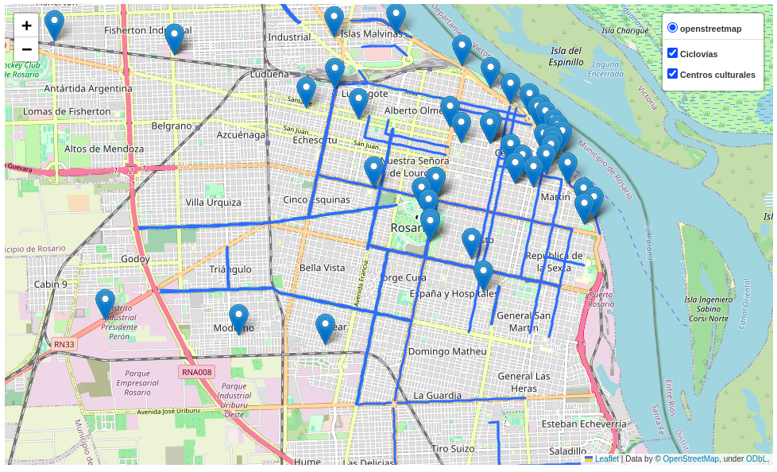

Pero antes de poder hacer estas visualizaciones tenemos que entender algunos conceptos. 

### Geoide, Elipsoide y Datum

El **geoide** se define como la superficie del campo de gravedad de la Tierra, que es aproximadamente igual que el nivel medio del mar. Es perpendicular a la dirección de la atracción gravitatoria. Dado que la masa de la Tierra no es uniforme en todos los puntos y la dirección de gravedad cambia, la forma del geoide es irregular. [arcgis](https://desktop.arcgis.com/es/arcmap/latest/map/projections/about-the-geoid-ellipsoid-spheroid-and-datum-and-h.htm)

Para simplificar el modelo, se han ideado varios **esferoides** o **elipsoides**. Estos términos se utilizan de forma intercambiable. Un esferoide es una forma de tres dimensiones creada a partir de una elipse de dos dimensiones. En el caso de la Tierra, el semieje mayor es el radio desde el centro de la Tierra hasta el ecuador, mientras que el semieje menor es el radio desde el centro de la Tierra hasta el polo. 

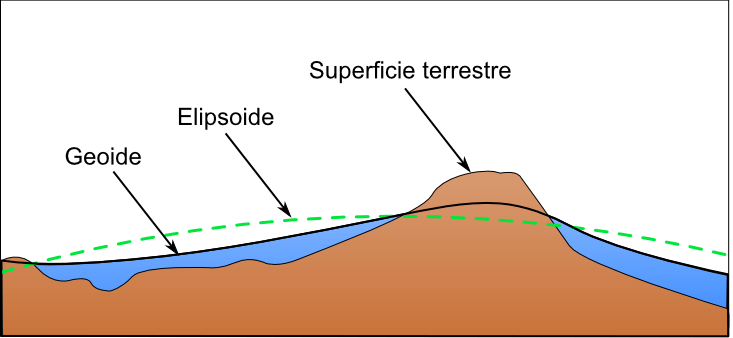

Un esferoide determinado se distingue de otro por las longitudes de los semiejes mayores y menores. Por ejemplo, compare el esferoide Clarke 1866 con los esferoides GRS 1980 y WGS 1984, sobre la base de las siguientes mediciones (en metros).

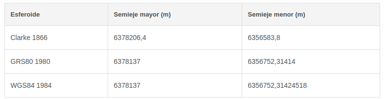

Se puede seleccionar un esferoide determinado para su uso en un área geográfica concreta, porque ese esferoide concreto funciona excepcionalmente bien imitando el geoide para esa parte del mundo. En el caso de América del Norte, el esferoide preferido es GRS 1980, en el que se basa el Datum de Norteamérica de 1983 (NAD83). [arcgis](https://desktop.arcgis.com/es/arcmap/latest/map/projections/about-the-geoid-ellipsoid-spheroid-and-datum-and-h.htm)

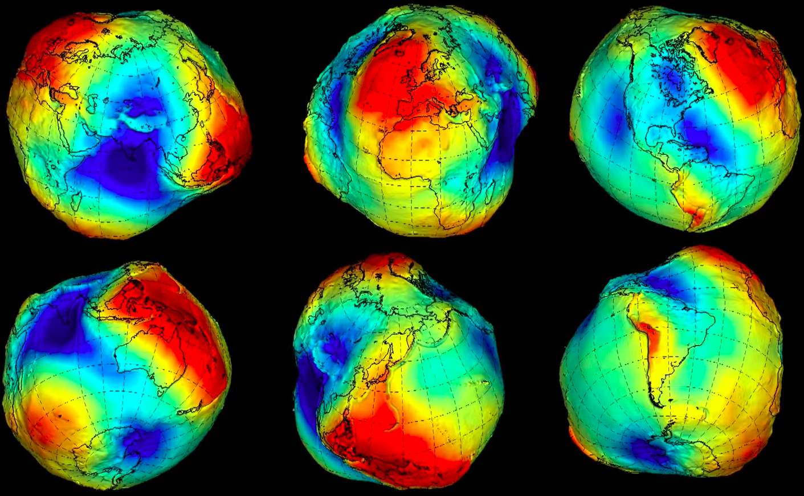

Geoide, [Fuente](https://upload.wikimedia.org/wikipedia/commons/c/c2/Geoide.jpg)

Un **datum** se genera sobre el esferoide seleccionado y puede incorporar variaciones locales en la elevación. Con el esferoide, la rotación de la elipse crea una superficie totalmente lisa de todo el mundo. Dado que así no se refleja adecuadamente la realidad, un datum local puede incorporar variaciones locales en la elevación. El datum y el esferoide subyacentes que se utilizan como referencia para un dataset pueden cambiar los valores de las coordenadas [arcgis](https://desktop.arcgis.com/es/arcmap/latest/map/projections/about-the-geoid-ellipsoid-spheroid-and-datum-and-h.htm)

El datum más usado es el [WSG84](https://es.wikipedia.org/wiki/WGS84) que es el que se usa en el Sistema de Posicionamiento Global (GPS).

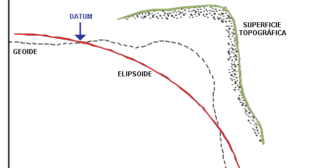

Datum local, seleccionado para representar mejor las coordenadas de un país o región

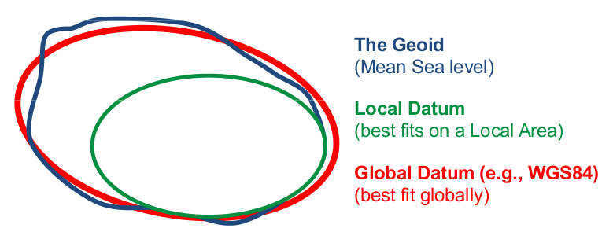

A nivel global, se utiliza el Datum WGS84 (GPS), el cual está indicado en rojo en el gráfico

### Sistemas de Coordenadas Geográficas

Un sistema de coordenadas geográficas es un método para describir la posición de una ubicación geográfica en la superficie de la Tierra utilizando mediciones esféricas de latitud y longitud. Se trata de mediciones de los ángulos (en grados) desde el centro de la Tierra hasta un punto en la superficie de la Tierra representada como una esfera. Cuando se utiliza un esferoide (elipsoide), la latitud se mide trazando una línea perpendicular a la superficie de la Tierra que va hasta el plano ecuatorial. Excepto en el ecuador o uno de los polos, esta línea no interseca con el centro de la Tierra. 

El sistema de coordenadas geográficas consta de líneas de latitud y de longitud. Las líneas de longitud van de norte a sur y miden los grados hacia el este o el oeste desde el meridiano 0 de Greenwich. Los valores pueden ir de -180 a +180°. Las líneas de latitud van de este a oeste y miden los grados hacia el norte o el sur desde el ecuador. Los valores van de +90° en el Polo Norte a -90° en el Polo Sur. 

El ecuador se encuentra en un ángulo de 0 grados de latitud. Generalmente, el hemisferio norte posee mediciones de latitud positivas y el hemisferio sur posee mediciones de latitud negativas. La longitud mide ángulos en una dirección de este-oeste. Las mediciones de longitud comúnmente se basan en el meridiano de Greenwich, que es una línea imaginaria que realiza un recorrido desde el Polo Norte, a través de Greenwich, Inglaterra, hasta el Polo Sur. Este ángulo es de longitud 0. El oeste del meridiano de Greenwich se registra normalmente como longitud negativa y el este como longitud positiva. Por ejemplo, la ubicación de Los Ángeles, California, tiene una latitud de aproximadamente "más 33 grados, 56 minutos" y una longitud de "menos 118 grados, 24 minutos". [arcgis](https://desktop.arcgis.com/es/arcmap/10.7/map/projections/geographic-coordinate-system.htm)

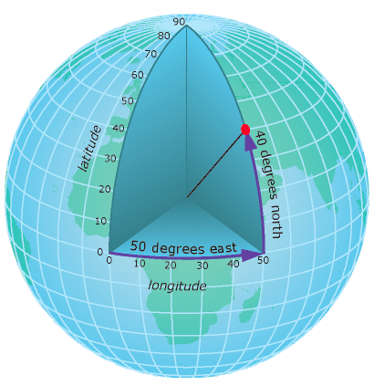

### Sistemas de Coordenadas Proyectadas

Muchas veces necesitamos representar la posición de los puntos de interés sobre una superficie plana, en 2D, y no con ángulos como vimos arriba. Entonces, al problema que nos enfrentamos es a pasar información que está sobre una superficie curva a una superficie plana, algo parecido a tratar de poner en un plano toda la cáscara de una mandarina.


El proceso de pasar de tener la ubicación de un objeto sobre la superficie de la tierra a una superficie plana se llama “proyección”. Al igual que con la cáscara de la mandarina, el proceso incluye distorsiones puesto que es imposible pasar de forma perfecta desde una superficie curva a una plana, se puede conservar ángulos o áreas, pero no ambas. 

Un **sistema de coordenadas proyectadas** es una representación plana, bidimensional de la tierra. Se basa en un sistema de coordenadas geográficas esféricas o esferoidales, pero utiliza unidades lineales para las coordenadas, de forma que los cálculos de distancia y área se pueden realizar fácilmente en términos de esas mismas unidades. [ibm](https://www.ibm.com/docs/es/db2woc?topic=SS6NHC/com.ibm.db2.luw.spatial.topics.doc/doc/csb3022b.html)

Las coordenadas de longitud y latitud se convierten en coordenadas x, y en la proyección plana. La coordenada x representa normalmente la orientación hacia el este de un punto y la coordenada y representa normalmente la dirección hacia el norte de un punto. La línea central que va de este a oeste se denomina eje x, y la línea central que va del norte al sur se denomina eje y. [ibm](https://www.ibm.com/docs/es/db2woc?topic=SS6NHC/com.ibm.db2.luw.spatial.topics.doc/doc/csb3022b.html)

Se utilizan fórmulas matemáticas para convertir un sistema de coordenadas geográficas tridimensionales en un sistema de coordenadas proyectadas planas bidimensionales. La transformación se denomina ***proyección cartográfica***. Las proyecciones cartográficas normalmente se clasifican según la superficie de proyección utilizada, como, por ejemplo, superficies cónicas, cilíndricas y planas. En función de la proyección utilizada, diferentes propiedades espaciales aparecerán distorsionadas. Las proyecciones están diseñadas para minimizar la distorsión de una o dos características de datos, pero es posible que la distancia, el área, la forma, la dirección o una combinación de estas propiedades no sean representaciones precisas de los datos de los que se está realizando el modelo. Existen varios tipos de proyecciones disponibles. Mientras que la mayoría de las proyecciones cartográficas intentan conservar cierta precisión de las propiedades espaciales, otras en su lugar intentan minimizar la distorsión general, como por ejemplo la proyección *Robinson*. Los tipos más habituales de proyecciones cartográficas incluyen los siguientes:

**Proyecciones de áreas iguales:** Estas proyecciones conservan el área de elementos específicos. Estas proyecciones distorsionan la forma, el ángulo y la escala. La proyección *cónica de áreas iguales [Albers](https://es.wikipedia.org/wiki/Proyecci%C3%B3n_de_Albers)* es un ejemplo de una proyección de áreas iguales.

**Proyecciones conformes:** Estas proyecciones conservan la forma local de áreas pequeñas. Estas proyecciones conservan ángulos individuales para describir relaciones espaciales mostrando líneas perpendiculares de red geográfica que forman intersección en ángulos de 90 grados en el mapa. Se conservan todos los ángulos; sin embargo, el área del mapa está distorsionada. Las proyecciones *Mercator* y [*Cónica conforme de Lambert*](https://es.wikipedia.org/wiki/Proyecci%C3%B3n_conforme_de_Lambert) son ejemplos de proyecciones conformes.

**Proyecciones equidistantes:** Estas proyecciones conservan las distancias entre ciertos puntos manteniendo la escala de un conjunto de datos determinado. Algunas de las distancias serán distancias verdaderas, que son las mismas distancias en la misma escala que el globo. Si sale fuera del conjunto de datos, la escala se distorsionará más. La proyección *sinusoidal* y la proyección *cónica equidistante* son ejemplos de proyecciones equidistantes.

**Proyecciones de dirección verdadera o azimutales:** Estas proyecciones conservan la dirección de un punto a otros puntos manteniendo algunos de los arcos de círculo grandes. Estas proyecciones dan correctamente las direcciones o azimuts de todos los puntos del mapa respecto al centro. Los mapas azimutales se pueden combinar con proyecciones de áreas iguales, conformes y equidistantes. La proyección *azimutal* *de igual área de Lambert* y la proyección *azimutal equidistante* son ejemplos de proyecciones azimutales. [ibm](https://www.ibm.com/docs/es/db2woc?topic=SS6NHC/com.ibm.db2.luw.spatial.topics.doc/doc/csb3022b.html)

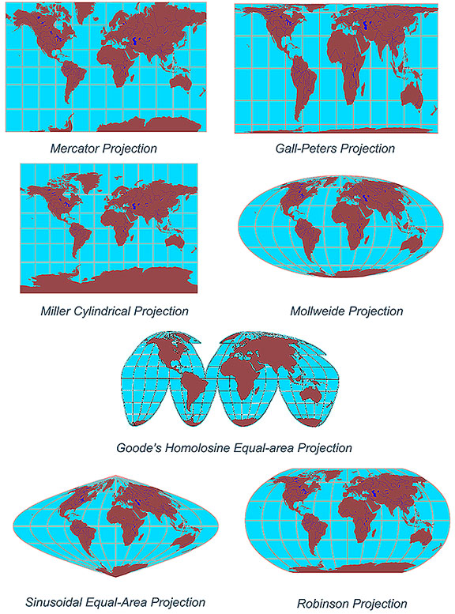

### Geopandas

Es un paquete de Python que nos permite trabajar con datos georeferenciados, en lugar de leer los datos y crear un DataFrame, vamos a leer los datos y crear un GeoDataFrame. Veamos como funciona esto con un ejemplo.

```python
import geopandas as gpd

ciclo = gpd.read_file('ciclovias_y_bicisendas.gml')
centros = gpd.read_file('geo_cultura.gml')
barrios = gpd.read_file('barrios.gml')

ciclo[['gml_id','CATEGORIA','geometry']].head()
centros.head()
barrios.head()
```

Cuando miramos el geodataframe vemos la columna `geometry`. Esta columna es lo que diferencia a una geodataframe de un dataframe y la misma contiene la referencia espacial la cual puede ser un punto, una línea o polígono. En el dataframe de las ciclovías y bicisendas vemos que el objeto que guarda `geometry`es de tipo `shapely.geometry.linestring.LineString`, mientras que el objeto en los centros de salud es `shapely.geometry.point.Point` y en el de barrios vemos `shapely.geometry.point.Polygons`

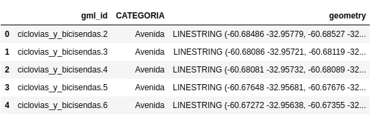

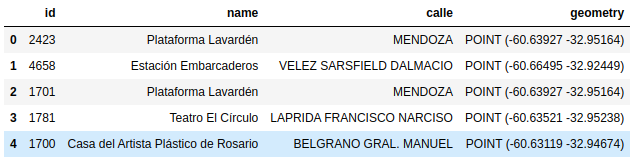

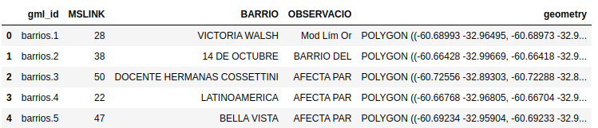

Para poder trabajar con los geodataframe también necesitamos saber su sistema de coordenadas de referencia, el cual podemos consultar escribiendo `gdf.crs`

```python
<Geographic 2D CRS: EPSG:4326>
Name: WGS 84
Axis Info [ellipsoidal]:
- Lat[north]: Geodetic latitude (degree)
- Lon[east]: Geodetic longitude (degree)
Area of Use:
- name: World.
- bounds: (-180.0, -90.0, 180.0, 90.0)
Datum: World Geodetic System 1984 ensemble
- Ellipsoid: WGS 84
- Prime Meridian: Greenwich
```

Esto nos sirve por ejemplo para saber las unidades con las que estamos trabajando o si podemos unir espacialmente a dos geodataframes puesto que si tienen diferentes CRS, no podemos hacerlo. 

<aside>
💡 En este curso no vamos a realizar análisis espaciales, puesto que se encuentra por fuera del alcance de la materia. Sólo veremos visualizaciones

</aside>

### Visualización

Para visualizar estos datos con geopandas podemos usar la opción `.plot()` y veríamos lo siguiente:

```python
ciclo.plot()
```

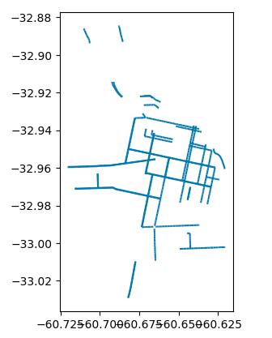

Si queremos colorear a cada barrio con un color podemos hacer lo siguiente:

```python
barrios.plot(column = 'BARRIO', figsize =(10,10), cmap = 'inferno')
```

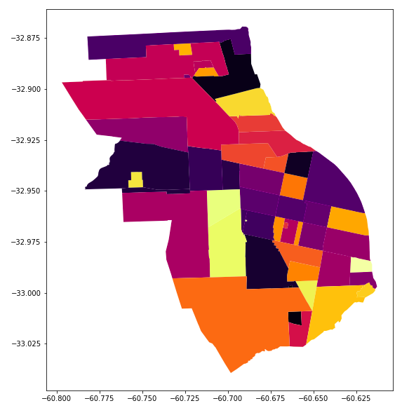

<aside>
💡 La visualización de arriba no es muy recomendable porque hay demasiados barrios y los colores no se distinguen bien.

</aside>

También podemos visualizar variables continuas como por ejemplo la porción de trigo que cultiva cada departamento de la provincia de Córdoba ([datos](https://www.mapascordoba.gob.ar/#/descargas)). En el gráfico de abajo podemos ver que muy pocos departamentos cultivan trigo y que Córdoba Capital es el que más lo hace. 

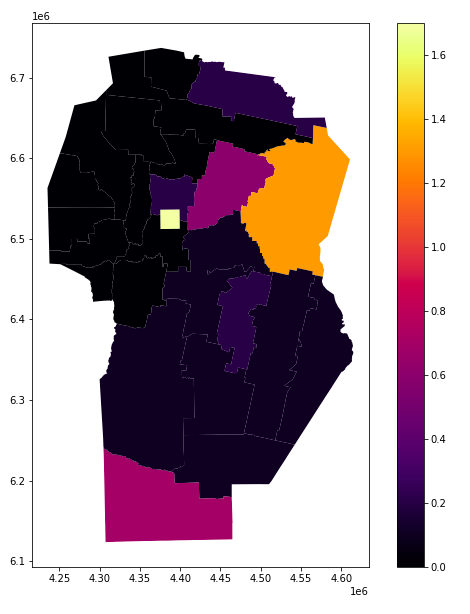

<aside>
💡 Como se comentó arriba, este tipo de gráficos no es el ideal para presentar en un informe porque el tamaño de cada departamento puede dar una idea errónea, pero, puede ser de utilidad para nuestro análisis exploratorio de datos

</aside>

Los mapas de arriba se verían más atractivos si tuvieran un mapa de fondo, lo que nos daría una idea de la geografía del lugar. Una opción para añadir un mapa de fondo es la librería `folium` la cual nos permite además, realizar mapas interactivos. 

Por ejemplo, podríamos plotear la superficie cultivada de cada departamento de la provincia de Córdoba

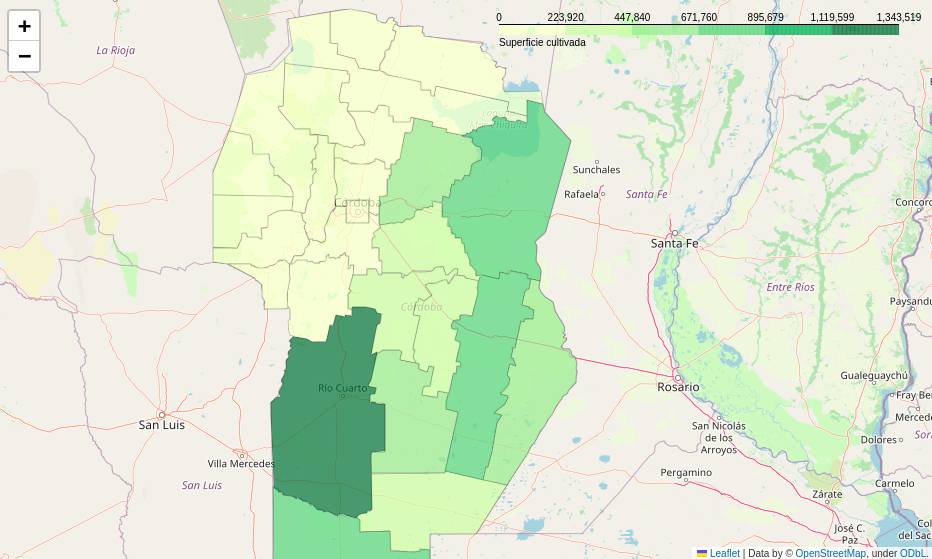

```python
m = folium.Map(location=[-31.715057, -63.671522], zoom_start=6)
folium.TileLayer('OpenStreetMap').add_to(m) #podemos cambiar de Tile

folium.Choropleth(
    geo_data=cultivos,
    name="choropleth",
    data=cultivos,
    columns= ["nombre","sup_cultiv"],
    key_on="feature.properties.nombre",
    fill_color="YlGn",
    fill_opacity=0.7,
    line_opacity=0.2,
    legend_name="Superficie cultivada").add_to(m)
m
```

O plotear que superficie del total disponible cultiva cada departamento para detectar cuáles son los que más atención le prestan a la agricultura. También podemos agregarle a este mapa un pop-up para tener información de cada departamento, por ejemplo, nombre del departamento, superficie total, superficie cultivada y porcentaje de superficie cultivada

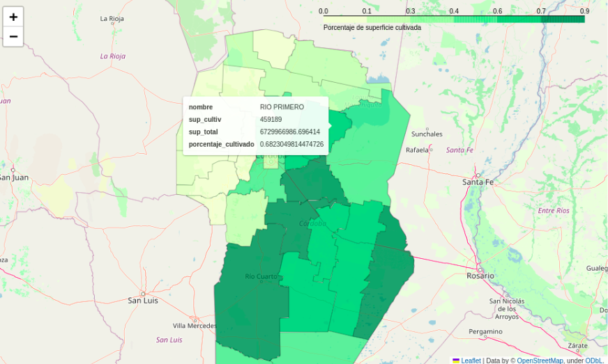

```python
m = folium.Map(location=[-31.715057, -63.671522], zoom_start=6)
folium.TileLayer('OpenStreetMap').add_to(m)

c = folium.Choropleth(
    geo_data=cultivos,
    name="choropleth",
    data=cultivos,
    columns= ["nombre","porcentaje_cultivado"],
    key_on="feature.properties.nombre",
    fill_color="YlGn",
    fill_opacity=0.7,
    line_opacity=0.2,
    legend_name="Porcentaje de superficie cultivada")

c.geojson.add_child(folium.features.GeoJsonTooltip(['sup_cultiv']))

c.add_to(m)
m
```

Cuando ploteamos los centros culturales, es útil agregarle un pop-up con el nombre y la dirección para localizar más fácilmente cada centro:

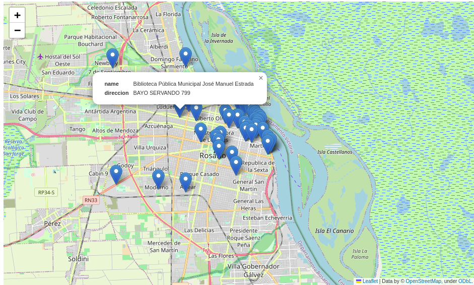

```python
m = folium.Map(location=[-32.952601, -60.643213], zoom_start=12)
folium.TileLayer('OpenStreetMap').add_to(m)

folium.GeoJson(centros, 
	popup=folium.features.GeoJsonPopup(fields=['name', 'direccion'], labels=True)).add_to(m)

m
```

Como pueden ver arriba, escribir todas las especificaciones para que el mapa de folium se vea atractivo, lleva tiempo (aunque ese tiempo se puede reducir con la experiencia). Por eso, muchas veces, en la exploración de datos no usamos mapas de fondo y solo lo hacemos cuando vamos a usar la imágen para una presentación más formal. 

Finalmente, `folium` es una de las tantas opciones para agregar un mapa de fondo, pueden probar otras y elegir la que más les guste:

1. [**Matplotlib Basemap Toolkit**](https://matplotlib.org/basemap/): Esta es una extensión de Matplotlib que te permite dibujar mapas en 2D en diferentes proyecciones. Puedes superponer datos geoespaciales y tiene un buen soporte para imágenes satelitales.
2. [**GeoPandas**](https://geopandas.org/): Esta es una extensión de pandas que soporta estructuras de datos geoespaciales. Puedes usar GeoPandas para manipular datos geoespaciales y dibujar mapas.
3. [**Folium**](https://python-visualization.github.io/folium/): Esta librería te permite crear mapas interactivos utilizando Leaflet.js. Puedes superponer tus datos en mapas interactivos y estos se pueden visualizar en un Jupyter Notebook.
4. [**GeoViews**](https://geoviews.org/): Es una extensión de HoloViews que proporciona una interfaz de alto nivel para visualizar datos geoespaciales.
5. [**Cartopy**](http://scitools.org.uk/cartopy/docs/latest): Esta es una librería que proporciona herramientas para la cartografía y la visualización de datos geoespaciales. Tiene una interfaz simple y fácil de usar para crear mapas y superponer datos.
6. [**Plotly**](https://plotly.com/python/maps/): Plotly es una librería de visualización de datos que permite crear gráficos interactivos y visualizaciones complejas, incluyendo mapas.
7. [**PySAL**](https://pysal.org/): PySAL, o Python Spatial Analysis Library, es una librería para análisis espacial y exploratorio de geo-datos. No es para dibujar mapas per se, pero es útil para trabajar con datos geoespaciales y puede ser utilizada en conjunto con otras librerías de visualización.
8. [**gmplot**](https://github.com/gmplot/gmplot): Permite visualizar y exportar datos para Google Maps.

## Visualizaciones avanzadas (upset plot, chord plots, raincloud plots)

### UpSet Plots

Los UpSet plots son un tipo de visualización de datos que se utiliza para representar y analizar intersecciones y relaciones entre conjuntos de datos. Los UpSet plots son especialmente útiles para comparar conjuntos de datos de gran tamaño o complejos, donde la representación tradicional de [diagramas de Venn](https://es.wikipedia.org/wiki/Diagrama_de_Venn) no es práctica o eficiente.

La principal característica de los UpSet plots es que representan conjuntos y sus intersecciones como matrices de puntos o barras, lo que permite una visualización clara y estructurada de las interacciones entre múltiples conjuntos de datos. Se usan comúnmente en estudios genómicos y de biología molecular, donde los investigadores pueden estar interesados en encontrar genes comunes entre diferentes experimentos o condiciones.

Los UpSet plots pueden ser creados y personalizados utilizando varias herramientas y bibliotecas de visualización, como R, Python y JavaScript. Por ejemplo, en Python, se puede utilizar la biblioteca   [`UpSetPlot`](https://upsetplot.readthedocs.io/) para crear UpSet plots.

**Uso de los UpSet plots**
Se muestra una matriz de UpSet en la parte izquierda, donde cada fila corresponde a una intersección de múltiples conjuntos, que se muestran en las columnas. Se destacan en color tres intersecciones (solo en B; en A y B, pero no en C; y en todos A, B y C) y se muestran los segmentos correspondientes en un diagrama de Venn. El diagrama de Venn muestra con el mismo color, las intersecciones que están etiquetadas en el diagrama de la izquierda, para mostrar cuál es el conjunto al cual se hace referencia:

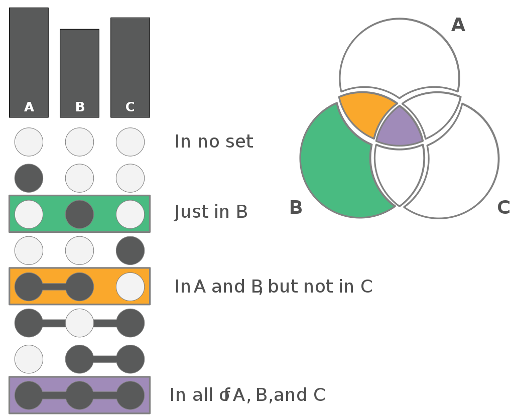

Ilustración que muestra cómo las filas de un gráfico UpSet se corresponden con los segmentos de un diagrama de Venn.

Los gráficos de UpSet visualizan intersecciones entre conjuntos en una matriz. En un gráfico de UpSet vertical, las columnas de la matriz corresponden a los conjuntos y las filas corresponden a las intersecciones. Para cada fila, las celdas que forman parte de una intersección se rellenan. Si hay varias celdas rellenas, se conectan con una línea para enfatizar la dirección de lectura del gráfico. Como los conjuntos varían en tamaño, el tamaño del conjunto se representa como gráficos de barras en la parte superior de las columnas. El tamaño de las intersecciones (cardinalidad) se muestra alineado con las filas, también como gráficos de barras. Este diseño facilita la comparación entre los tamaños de las intersecciones individuales, ya que el tamaño de las barras es fácil de comparar. Los gráficos de UpSet se pueden usar horizontal y verticalmente.

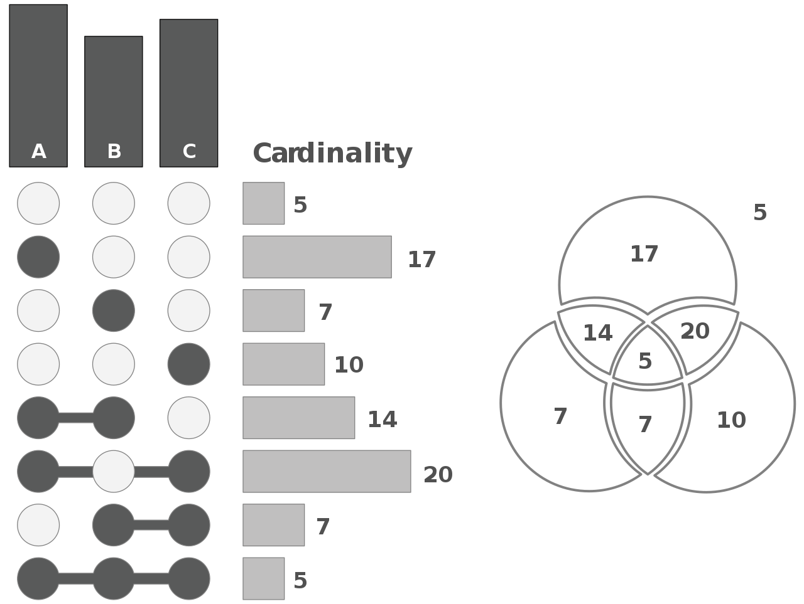

Una gráfica de UpSet que muestra tres conjuntos y el diagrama de Venn correspondiente

Los gráficos de UpSet se pueden ordenar de varias maneras. Un enfoque común de ordenación, por ejemplo, es ordenar por cardinalidad (el tamaño de una intersección), lo que coloca las intersecciones más grandes en la parte superior. Las clasificaciones alternativas son por grado de intersección o por conjuntos.

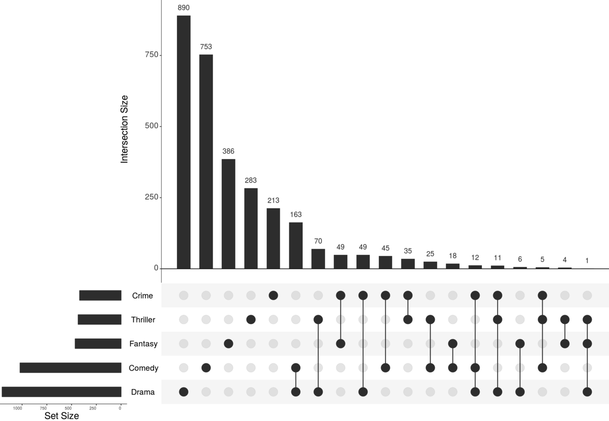

Una trama UpSet que muestra cómo se cruzan los géneros cinematográficos. La intersección más grande de dos conjuntos es la intersección Comedia-Drama.

Para crear un diagrama de este tipo con Python, podemos escribir algo como:

```python
# Instalar la librería "upsetplot", usando el comando:
# !pip install upsetplot
import matplotlib.pyplot as plt
from upsetplot import from_contents, plot

# Conjuntos de datos de ejemplo
set1 = {1, 2, 3, 4, 5}
set2 = {4, 5, 6, 7, 8}
set3 = {5, 6, 9, 10}

# Asignar nombres a los conjuntos de datos y crear un diccionario
data = {
    'Conjunto 1': set1,
    'Conjunto 2': set2,
    'Conjunto 3': set3,
}

# Crear conjuntos de intersecciones y conteos
example = from_contents(data)

# Crear un UpSet plot usando la biblioteca UpSetPlot
plot(example)

# Mostrar el gráfico
plt.show()
```

Donde se obtiene un gráfico como el siguiente:

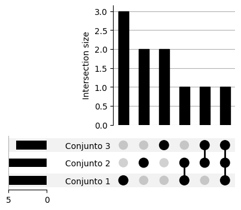

- La columna 1 tiene tamaño 3, ya que el conjunto 1 tiene los elementos {1, 2, 3} que están solamente en dicho conjunto.
- La columna 2 tiene tamaño 2, ya que el conjunto 2 tiene los elementos {7, 8} que están solamente en dicho conjunto.
- La columna 3 tiene tamaño 2, ya que el conjunto 3 tiene los elementos {9, 10} que están solamente en dicho conjunto.
- La columna 4 tiene tamaño 1, ya que solamente tienen un elemento en común los conjuntos 1 y 2 que no está en 3 (elemento {4}).
- La columna 5 tiene tamaño 1, ya que solamente tienen un elemento en común los conjuntos 2 y 3 que no está en 1 (elemento {6}).
- La columna 6 tiene tamaño 1, ya que solamente tienen un elemento en común los conjuntos 1, 2 y 3 (elemento {5}).

**Beneficios y limitaciones**
Los diagramas de UpSet tienden a funcionar mejor que los diagramas de Venn para un mayor número de conjuntos y cuando es deseable mostrar también información contextual sobre las intersecciones de conjuntos. Para visualizar diagramas con menos de tres conjuntos, o cuando solo hay unas pocas intersecciones, generalmente se prefieren los diagramas de Venn y Euler, porque tienden a ser más familiares e intuitivos de leer.

Los gráficos UpSet se limitan a mostrar 20-30 conjuntos, aunque los detalles dependen de los datos reales. Un enfoque alternativo para conjuntos de datos más grandes es mostrar un mapa de calor de co-ocurrencia, aunque estos no pueden mostrar intersecciones de orden superior.

### Raincloud plots (diagrama de nubes de lluvia)

Adaptación de “[Raincloud plots: a multi-platform tool for robust data
visualization](https://europepmc.org/backend/ptpmcrender.fcgi?accid=PMC6480976&blobtype=pdf)” 

La visualización efectiva de datos es esencial para la interpretación y comunicación del análisis de datos. La herramienta "raincloud plot" es una solución de código abierto y multiplataforma que combina diferentes enfoques de visualización para ofrecer una representación de datos más robusta y comprensible. A diferencia de los gráficos de barras, que pueden ser propensos a distorsiones y malinterpretaciones, el gráfico de nube de lluvia combina elementos de gráficos de violín, puntos de datos sin procesar con dispersión aleatoria y una visualización estándar de tendencia central (como la media o mediana) y error, como un diagrama de caja, aprovechando técnicas conocidas para lograr una representación más clara de los datos.


Ejemplo de gráfico de nubes de lluvia. El diagrama de nubes de lluvia combina una ilustración de la distribución de datos (la "nube") con datos sin procesar alterados (la "lluvia"). Esto se puede complementar aún más agregando diagramas de caja u otras medidas estándar de tendencia central y error.

Los gráficos de nube de lluvia (raincloud plots) tienen ventajas sobre otros tipos de gráficos tradicionales, como los gráficos de barras o de líneas, debido a varias razones:

- Representación de datos sin procesar: Los raincloud plots incluyen la visualización de puntos de datos individuales con dispersión aleatoria (jitter), lo que permite apreciar la variabilidad y las diferencias dentro de los datos. Esto es útil para detectar patrones inesperados y valores atípicos que podrían pasar desapercibidos en otros tipos de gráficos.
- Mayor información estadística: Estos gráficos combinan diferentes enfoques de visualización, como gráficos de violín y de caja, lo que proporciona información adicional sobre la distribución, la tendencia central y la dispersión de los datos. Esta combinación de elementos ofrece una visión más completa de la naturaleza de los datos en comparación con otros gráficos tradicionales.
- Flexibilidad y modularidad: Los raincloud plots permiten a los usuarios adaptar el gráfico a sus necesidades específicas y preferencias personales. Por ejemplo, pueden incluir o excluir ciertos elementos, como gráficos de violín, puntos de datos individuales o diagramas de caja, según la información que deseen destacar en su presentación.

![Las gráficas de Raincloud dejan poco librado a la imaginación: Al reemplazar la distribución de probabilidad reflejada de manera redundante con un gráfico de caja y puntos de datos sin procesar, el gráfico de nubes de lluvia brinda al usuario información sobre observaciones individuales y patrones entre ellos (como estriación o agrupación) y tendencias generales en la distribución. Como se ilustra aquí, incluso un diagrama de caja más datos sin procesar pueden ocultar la bimodalidad u otras facetas cruciales de los datos.](./imagenes/Untitled84.png)

Las gráficas de Raincloud dejan poco librado a la imaginación: Al reemplazar la distribución de probabilidad reflejada de manera redundante con un gráfico de caja y puntos de datos sin procesar, el gráfico de nubes de lluvia brinda al usuario información sobre observaciones individuales y patrones entre ellos (como estriación o agrupación) y tendencias generales en la distribución. Como se ilustra aquí, incluso un diagrama de caja más datos sin procesar pueden ocultar la bimodalidad u otras facetas cruciales de los datos.

Para hacer este tipo de gráficos en Python podemos hacer algo como en el siguiente ejemplo:

```python
import numpy as np
import matplotlib.pyplot as plt

# Función para generar datos con ruido
def generate_data(values, probabilities, size=500):
    data = np.random.choice(values, p=probabilities, size=size)
    noise = np.random.uniform(low=-1, high=1, size=len(data))
    return data.astype(float) + noise

# Generar dos conjuntos de datos con distribuciones específicas
x1 = generate_data(np.arange(0, 11), [0.01, 0.01, 0.15, 0.19, 0.05, 0.11, 0.2, 0.16, 0.10, 0.01, 0.01])
x2 = generate_data(np.arange(6, 18), [0.01, 0.01, 0.15, 0.23, 0.14, 0.06, 0.05, 0.10, 0.12, 0.11, 0.01, 0.01])
data_x = [x1, x2]

# Preparar el gráfico
fig, ax = plt.subplots(figsize=(8, 4))

# Colores personalizados para boxplots, violin plots y scatter plots
boxplots_colors = ['yellowgreen', 'olivedrab']
violin_colors = ['thistle', 'orchid']
scatter_colors = ['tomato', 'darksalmon']

# Dibujar boxplots
bp = ax.boxplot(data_x, patch_artist=True, vert=False)
for patch, color in zip(bp['boxes'], boxplots_colors):
    patch.set_facecolor(color)
    patch.set_alpha(0.4)

# Dibujar violin plots
vp = ax.violinplot(data_x, points=500, showmeans=False, showextrema=False, showmedians=False, vert=False)
for idx, b in enumerate(vp['bodies']):
    b.get_paths()[0].vertices[:, 1] = np.clip(b.get_paths()[0].vertices[:, 1], idx + 1, idx + 2)
    b.set_color(violin_colors[idx])

# Dibujar scatter plots
for idx, features in enumerate(data_x):
    y = np.full(len(features), idx + .8) + np.random.uniform(low=-.05, high=.05, size=len(features))
    plt.scatter(features, y, s=.3, c=scatter_colors[idx])

# Configurar las etiquetas y el título del gráfico
plt.yticks(np.arange(1, 3, 1), ['Feature 1', 'Feature 2'])
plt.xlabel('Values')
plt.title("Raincloud plot")

# Mostrar el gráfico
plt.show()
```

Y el resultado será algo como:

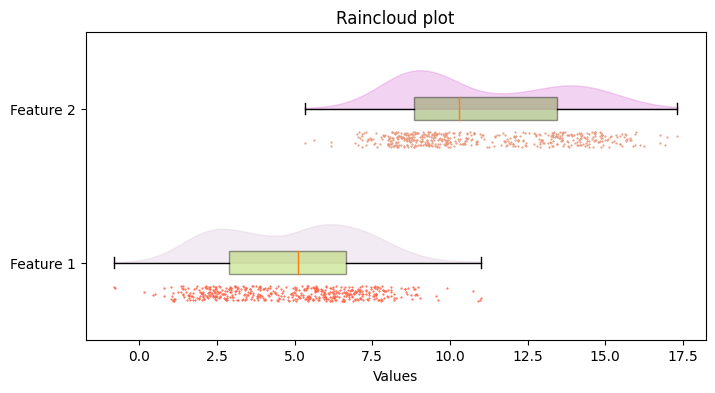

### **Diagramas de cuerdas (Chord diagrams)**

Los diagramas de cuerdas, son una creación de un científico y artista llamado [Martin Krzywinski](http://mkweb.bcgsc.ca/). También se los conoce como “[Circos](http://circos.ca/)”, debido a una herramienta que permite generarlos.

Los diagramas de cuerdas (chord diagrams) son una representación visual utilizada para mostrar relaciones o conexiones entre elementos dentro de un conjunto de datos. Estos diagramas son útiles para visualizar datos multidimensionales y se utilizan comúnmente para representar relaciones complejas, como correlaciones, similitudes, flujos y conexiones entre diferentes nodos o entidades.

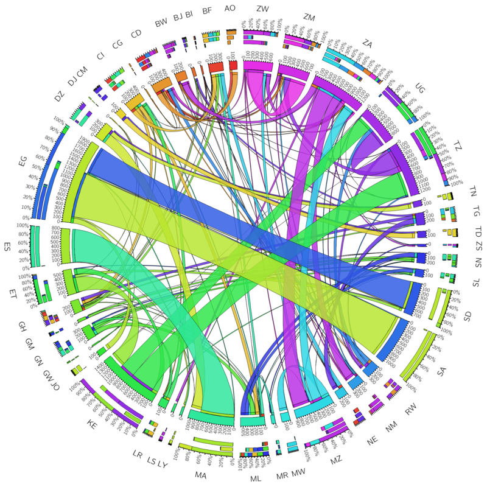

Diagrama de cuerdas que muestra el comercio de electricidad acumulado (2015-2065) entre países africanos (TWh)

Un diagrama de cuerdas se representa típicamente como un círculo dividido en segmentos proporcionales a la cantidad de nodos en el conjunto de datos. Cada segmento representa un nodo o entidad individual, y las conexiones entre estos nodos se muestran como arcos o cuerdas (chords) que conectan los segmentos. La intensidad o grosor de estos arcos puede variar en función de la fuerza o magnitud de la relación entre los nodos.

Los diagramas, son muy flexibles, ya que se pueden combinar con diagramas de otros tipos, por ejemplo de barras, de área, de densidad, etc. 

![Algunos ejemplos de tramas de Circos. (A) glifo (B) resaltado con control de profundidad (C) dispersión (D) ubicación emparejada (E) cinta (F) histograma (G) mosaico (H) resaltado con profundidad automática (I) texto con organización automática (J) mapa de calor (K) texto de alta densidad (L) glifo de alta densidad (M) compuesto de varios tipos (N) control de escala variable (O) control de geometría fina (P) texto flexible y colocación de elementos (Q) cintas transparentes (R ) histograma apilado (S) conectores (T) anillos de graduación.](./imagenes/Untitled87.png)

Algunos ejemplos de tramas de Circos. (A) glifo (B) resaltado con control de profundidad (C) dispersión (D) ubicación emparejada (E) cinta (F) histograma (G) mosaico (H) resaltado con profundidad automática (I) texto con organización automática (J) mapa de calor (K) texto de alta densidad (L) glifo de alta densidad (M) compuesto de varios tipos (N) control de escala variable (O) control de geometría fina (P) texto flexible y colocación de elementos (Q) cintas transparentes (R ) histograma apilado (S) conectores (T) anillos de graduación.

Existen decenas de aplicaciones, por ejemplo: [http://circos.ca/intro/published_images/](http://circos.ca/intro/published_images/) 

Para crear un diagrama de este tipo en Python, podemos usar la librería     `pycirclize`: 

```python
from pycirclize import Circos
import pandas as pd

# Crear un DataFrame (3 x 6) como matriz de datos
row_names = ["F1", "F2", "F3"]
col_names = ["T1", "T2", "T3", "T4", "T5", "T6"]
matrix_data = [
    [10, 16, 7, 7, 10, 8],
    [4, 9, 10, 12, 12, 7],
    [17, 13, 7, 4, 20, 4],
]
matrix_df = pd.DataFrame(matrix_data, index=row_names, columns=col_names)

# Inicializar Circos a partir de la matriz para representar un diagrama de cuerdas
circos = Circos.initialize_from_matrix(
    matrix_df,
    space=5,  # Espacio entre segmentos
    cmap="tab10",  # Mapa de colores
    label_kws=dict(size=12),  # Atributos de las etiquetas
    link_kws=dict(ec="black", lw=0.5, direction=1),  # Atributos de los enlaces (cuerdas)
)

# Guardar el diagrama de acordes como imagen
circos.savefig("example02.png")
```

Y obtendremos un diagrama como el siguiente:

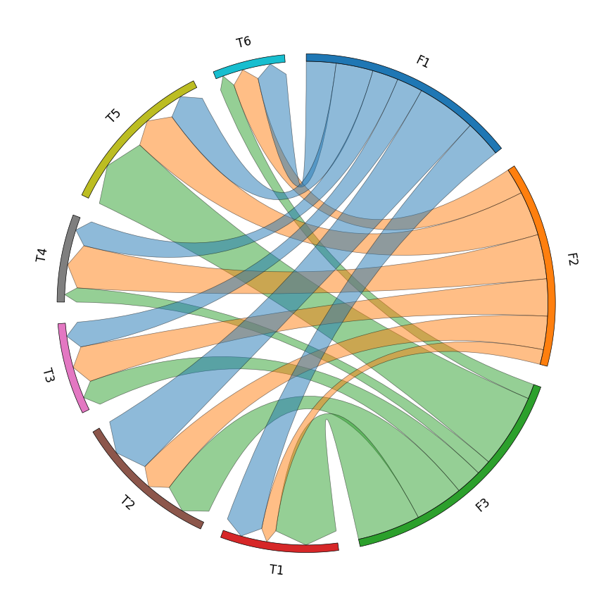

## Gráficos interactivos y dashboards

Traducción de “Interactive Data Visualization with Python: Present your data as an effective and compelling story” (Abha Belorkar, Sharath Chandra Guntuku, Shubhangi Hora, Anshu Kumar) -  2020

### Introducción

Las visualizaciones de datos son representaciones gráficas de información y datos. Su propósito es extraer valores de múltiples filas y columnas de números y datos que de otro modo serían difíciles de comprender, y representarlos en diagramas gráficamente atractivos. Como resultado, las visualizaciones de datos pueden proporcionar información clave sobre los datos de un vistazo. Esto es algo que los datos sin procesar, e incluso los datos analizados en forma tabular, no pueden hacer. Las visualizaciones vistas anteriormente se tratan de datos estáticos que están estancados, y donde la audiencia no puede modificarlos ni interactuar con ellos en tiempo real.
Las visualizaciones de datos interactivas van un paso por delante de las estáticas. La definición de interactivo es algo que involucra la comunicación entre dos o más cosas o personas que trabajan juntas.
Por lo tanto, las visualizaciones interactivas son representaciones gráficas de datos analizados (estáticos o dinámicos) que pueden reaccionar y responder a las acciones del usuario en el momento. Son visualizaciones estáticas que incorporan características para aceptar entradas humanas, mejorando y aumentando así el impacto que tienen los datos.

La capacidad de un gráfico para brindar más información sobre un punto de datos, cuando hay una acción del usuario (como el mouse sobre él), es lo que lo hace interactivo.
Un ejemplo de esto se puede ver en los siguientes diagramas:

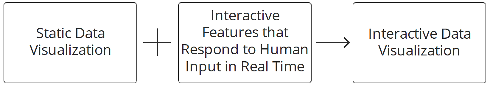

Visualización interactiva de datos

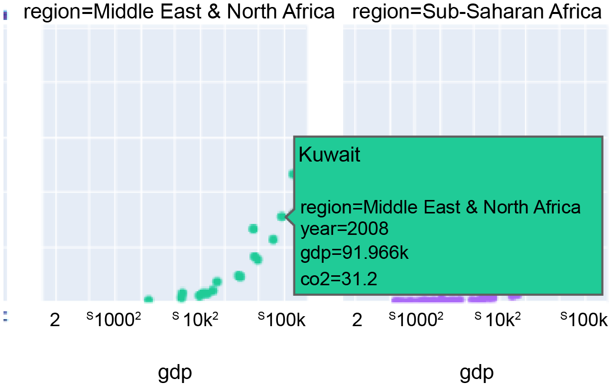

Pasar el cursor sobre algo, proporciona más información al respecto.

Las visualizaciones interactivas a menudo también se basan en datos dinámicos. La palabra dinámico se usa para referirse a algo que cambia constantemente, y cuando se usa con respecto a las visualizaciones de datos, significa que los datos de entrada en los que se basa la visualización cambian constantemente a diferencia de los datos estáticos, que están estancados y no cambian. Un ejemplo de visualización de datos interactivos con datos dinámicos, son las visualizaciones que muestran las fluctuaciones en las tendencias de las acciones. Los datos de entrada que se utilizan para crear estos gráficos son dinámicos y cambian constantemente en tiempo real, por lo que las visualizaciones son interactivas. Los datos estáticos son más para la inteligencia empresarial, como cuando las visualizaciones de datos se utilizan como parte de un proceso de ciencia de datos/aprendizaje automático.
Para comprender las capacidades reales de la visualización interactiva, comparémosla directamente con la visualización estática.

### Visualización estática frente a visualización interactiva

Si bien las visualizaciones de datos estáticos son un gran paso adelante hacia el objetivo de extraer y explicar el valor y la información que contienen los conjuntos de datos, la adición de la interactividad lleva estas visualizaciones un paso adelante.

- Las visualizaciones de datos interactivos tienen las siguientes cualidades:
Son más fáciles de explorar ya que le permiten interactuar con los datos cambiando colores, parámetros y gráficos.
- Se pueden manipular de manera fácil e instantánea. Como puede interactuar con ellos, los gráficos se pueden cambiar frente a usted. Por ejemplo, en los ejercicios y actividades de este capítulo, creará un control deslizante interactivo. Cuando se modifica la posición de este control deslizante y cambia el gráfico que ve, también podrá crear casillas de verificación que le permitan seleccionar los parámetros que desea ver.
- Permiten el acceso a datos en tiempo real y a la información que proporcionan. Esto permite el análisis eficiente y rápido de las tendencias.
- Son más fáciles de comprender, lo que permite a las organizaciones tomar mejores decisiones basadas en datos.
- Eliminan el requisito de tener varios gráficos para la misma información, un gráfico interactivo puede transmitir los mismos conocimientos.
- Te permiten observar relaciones (por ejemplo, causa y efecto).

Comencemos con un ejemplo para comprender lo que podemos lograr a través de la visualización interactiva. Consideremos un conjunto de datos para miembros inscritos en un gimnasio:

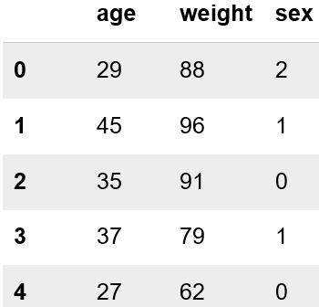

Dataset de clientes de gimnasio

La siguiente es una visualización de datos estáticos en forma de diagrama de caja que describe el peso de las personas clasificadas por su sexo (0 es hombre, 1 es mujer y 2 es otro):

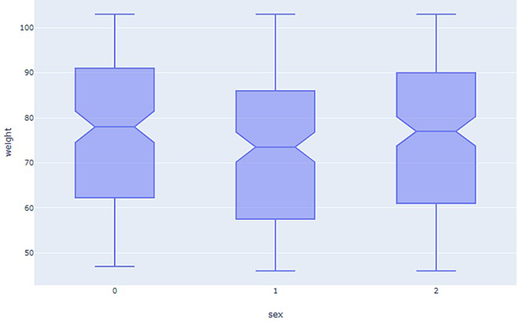

Una visualización estática que muestra el peso frente al sexo de los clientes del gimnasio

La única información que podemos obtener de este gráfico es la relación entre el peso y el sexo: los clientes masculinos que visitan este gimnasio pesan entre 62 kg y 91 kg, las clientes mujeres pesan entre 57 kg y 86 kg, y las/los clientes que se identifican como otras/os pesan entre 61 kg y 90 kg. Sin embargo, hay una tercera característica presente en el conjunto de datos que se usa para generar este diagrama de caja: la edad. Agregar esta característica al gráfico estático anterior puede generar confusión en términos de comprensión de los datos. Entonces, estamos un poco atascados con respecto a mostrar la relación entre las tres características usando una visualización estática. Este problema se puede resolver fácilmente creando una visualización interactiva, como se muestra aquí:

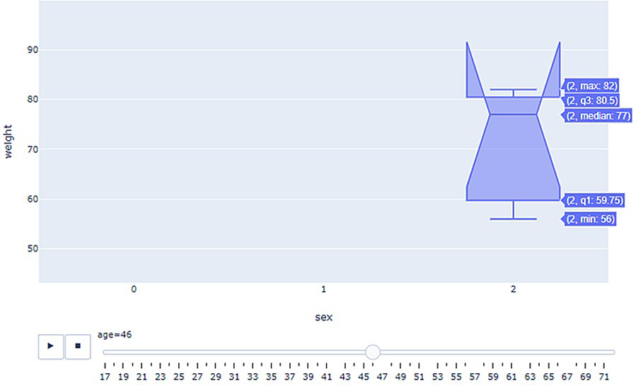

Una visualización interactiva que muestra el peso y el sexo de clientes de gimnasio de 46 años

En el diagrama de caja anterior, se introdujo un control deslizante para la función de edad. El usuario puede deslizar manualmente la posición del control deslizante para observar la relación entre peso, sexo y edad en diferentes valores de edad. Además, hay una herramienta flotante que permite al usuario obtener más información sobre los datos.

El diagrama de caja anterior describe que, en este gimnasio, los únicos clientes de 46 años son lxs que se identifican como otrxs, y el más pesado de 46 años pesa 82 kilogramos, mientras que el más liviano pesa 56 kilogramos.
El usuario puede deslizar a otra posición para observar la relación entre peso y sexo a una edad diferente, como se muestra en el siguiente gráfico:

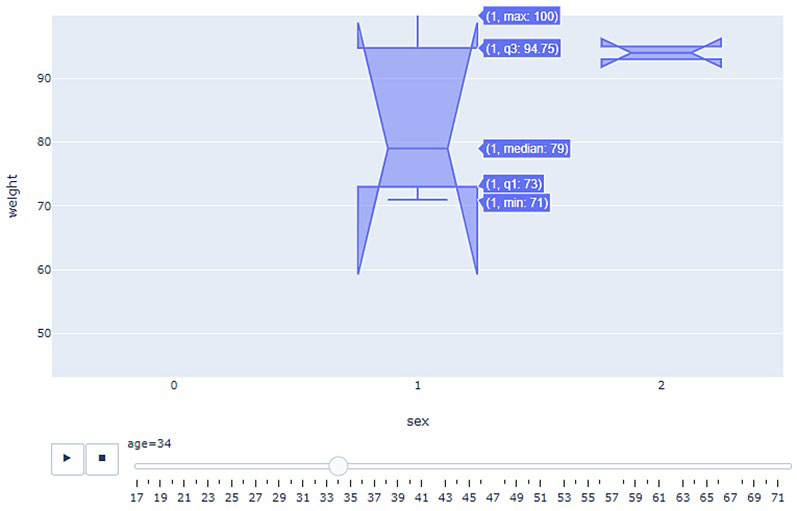

Una visualización interactiva que muestra el peso y el sexo de clientes de gimnasio de 34 años

El gráfico anterior describe los datos a la edad de 34 años: no hay clientes masculinos en el gimnasio; sin embargo, la cliente más pesada de 34 años pesa 100 kilogramos mientras que la más liviana pesa 71 kilogramos.

Pero aún hay más aspectos a considerar al diferenciar entre visualizaciones estáticas e interactivas. Miremos la siguiente tabla:

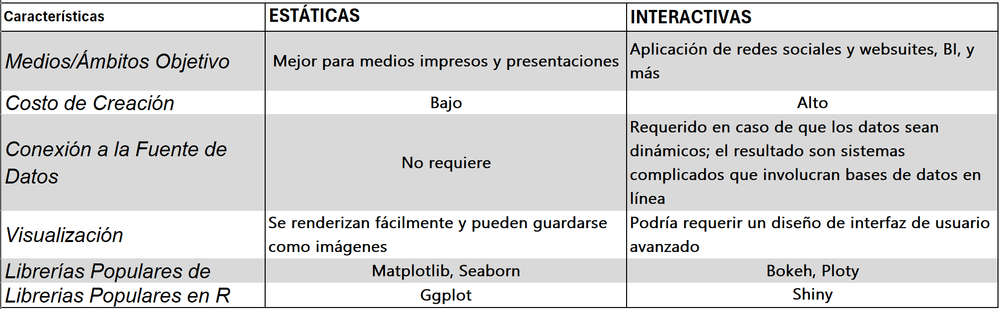

En última instancia, las visualizaciones de datos interactivas transforman la discusión de los datos en el arte de contar historias, lo que simplifica el proceso de comprensión de lo que los datos intentan decirnos. Benefician tanto a las personas que crean las visualizaciones (ya que los mensajes y la información que intentan transmitir se transmiten de manera eficiente y visualmente agradable) como a quienes las ven (ya que pueden comprender y observar patrones e ideas casi al instante). Estos aspectos son los que separan las visualizaciones interactivas de las visualizaciones estáticas.

**Librerías Python**

En Python tenemos librerías alternativas a la popular Matplotlib, que incorporan capacidades interactivas, por ejemplo:

- **Plotly**: [https://plotly.com/python/](https://plotly.com/python/)
- **Bokeh**: [https://demo.bokeh.org/](https://demo.bokeh.org/)

También tenemos librerías que permiten crear aplicaciones web con facilidad desde Python, que permiten construir visualizaciones interactivas, como por ejemplo:

- **Streamlit**: [https://streamlit.io/gallery](https://streamlit.io/gallery)
- **Plotly Dash**: [https://plotly.com/examples/](https://plotly.com/examples/)
- **Gradio**: [https://gradio.app/demos/](https://gradio.app/demos/)

### KPI (Indicadores Clave de Performance)

Un **KPI** (*key performance indicator*), conocido también como **indicador clave o medidor de desempeño** o **indicador clave de rendimiento**, es una medida del nivel del rendimiento de un proceso. El valor del indicador está directamente relacionado con un objetivo fijado para la toma de decisiones previamente y normalmente se expresa en valores porcentuales.[1](https://es.wikipedia.org/wiki/Indicador_clave_de_rendimiento#cite_note-1)

Un KPI se diseña para mostrar cómo es el progreso en un proceso o producto en concreto, por lo que es un indicador de rendimiento. Existen KPI para diversas áreas de una empresa: compras, logística, ventas, servicio al cliente, etc. Las grandes compañías disponen de KPI que muestran si las acciones desarrolladas están dando sus frutos o si, por el contrario, no se progresa como se esperaba.

Los indicadores clave de desempeño son mediciones financieras o no financieras utilizadas para cuantificar el grado de cumplimiento de los objetivos; reflejan el rendimiento de una organización y generalmente se recogen en su plan estratégico. Estos KPI se utilizan en [inteligencia empresarial](https://es.wikipedia.org/wiki/Inteligencia_empresarial) para reflejar el estado actual de un negocio y definir una línea de acción futura.

El acto de monitorear los indicadores clave de desempeño en tiempo real se conoce como «monitorización de actividad de negocio». Los indicadores de rendimiento son frecuentemente utilizados para "valorar" actividades complicadas de medir, como los beneficios de desarrollos líderes, el compromiso de los empleados, el servicio o la satisfacción.

**Objetivos**

Los KPI tienen como objetivos principales medir el nivel de servicio, realizar un diagnóstico de la situación, comunicar e informar sobre la situación y los objetivos, motivar a los equipos responsables del cumplimiento de los objetivos reflejados en el KPI y, en general, evaluar cualquier progreso de manera constante.

**Usos Frecuentes**

Usado para calcular, entre otros:

- Usado como herramienta.
- Nivel de la satisfacción del cliente.
- Tiempo de mejoras de asuntos relacionados con los niveles de servicio.
- Impacto de la calidad de los recursos financieros adicionales necesarios para realizar el nivel de servicio definido.
- Rentabilidad de un proyecto (Retorno de la Inversión [ROI](https://es.wikipedia.org/wiki/ROI))
- Calidad de la gestión de la empresa ([rotación del inventario](https://es.wikipedia.org/wiki/Rotaci%C3%B3n_del_inventario), días de cuentas por cobrar [DCC], y por pagar [DCP])
- Monitorear el rendimiento de los equipos de trabajo en Campo, por ejemplo en el sector de las telecomunicaciones

**Cualidades de los KPI**

Cualquier organización debe poder identificar sus propios KPI. Las claves para esto son:

- Tener predefinido un [proceso de negocio](https://es.wikipedia.org/wiki/Proceso_de_negocio).
- Tener claros los objetivos o el rendimiento requeridos en el proceso de negocio.
- Tener una medida cuantitativa/cualitativa de los resultados, y que sea posible su comparación con los objetivos.
- Investigar variaciones y ajustar procesos o recursos para alcanzar metas a corto plazo.

Cuando se definen KPI se suele aplicar el acrónimo [SMART](https://es.wikipedia.org/w/index.php?title=SMART_(gesti%C3%B3n_de_proyectos)&action=edit&redlink=1), ya que los KPIs tienen que ser:

- E**S**pecíficos (***S**pecific*)
- **M**edibles (***M**easurable*)
- **A**lcanzables (***A**chievable*)
- **R**elevantes (***R**elevant*)
- Opor**T**unos (***T**imely*)

Es importante que:

1. Los datos de los que dependen los KPI sean consistentes y correctos.
2. Estos datos estén disponibles a tiempo.

**KPIs estándares**

Procesos industriales: Los KPI de producción son esenciales a la hora de realizar un seguimiento de la producción y de los resultados de una empresa. En donde según el caso, se pueden encontrar diferentes indicadores de producción. Sin embargo, existen una serie de KPI que, por su importancia, van a ser comunes a todas las compañías, por lo que es esencial contar con ellos en el análisis de datos.

¿Cuáles son los principales KPI de producción?

La elección de los KPI de producción que se toman como referencia puede variar de una empresa a otra. Sin embargo, vamos a encontrar algunos comunes entre todas debido a la especial importancia que tienen a la hora de realizar el análisis de datos y de valorar los resultados obtenidos.

- **Tiempo de ciclo de producción**: Permite medir el tiempo que se tarda en producir un producto determinado teniendo en cuenta el lote de producción. Para ello se toma como referencia inicial el momento en el que se ejecuta la orden de producción y como referencia final el momento en el que el lote en cuestión puede darse por completado. En otras palabras, se toma el tiempo de producción del lote y se divide en las unidades conformes. Por que no se hace en base también de las unidades no conformes, por que la naturaleza del proceso ya lleva inmerso el porcentaje de no conformes (obviando que el proceso se debe ajustar). El tiempo que transcurre entre un momento y otro es el tiempo de ciclo de producción de cada producto.
- **Rendimiento de calidad**: En este caso, el KPI de producción se centra en analizar el porcentaje de productos que son fabricados sin errores. Es decir, el número de productos que, al terminar la cadena de producción, son perfectos desde el punto de vista de los estándares de calidad de la compañía.
- **Tasa de rechazo**: La tasa de rechazo es un KPI que mide los productos que no cumplen con los estándares de calidad determinados. Es decir, se trata del KPI opuesto al rendimiento de calidad, ya que, en este caso, lo que se mide es la cantidad de productos que son eliminados de la cadena de suministro antes de llegar a completar su producción.
- **Tasa de devoluciones**: Este KPI de producción hace referencia al seguimiento del producto una vez se ha completado la producción. Sin embargo, es esencial tenerlo en cuenta para adaptar la producción y reducir la tasa de devoluciones, ya que determina de forma directa el nivel de satisfacción del cliente. Una tasa de devoluciones elevadas cuando el producto cumple con los estándares de calidad determinados suele estar asociada a un diseño ineficaz o a una incapacidad del producto para cumplir con las expectativas del consumidor, por lo que, en muchos casos, será necesario reformular la producción desde el principio.

**Proceso de mantenimiento:**

Los indicadores clave de rendimiento de mantenimiento (KPI) son métricas que evalúan factores críticos para el éxito de una organización. Una amplia gama de empresas hace un seguimiento de los KPI. Sin embargo, en el mundo del mantenimiento, estas métricas controlan el rendimiento con respecto a los objetivos vinculados a cosas como los fallos de la máquina, los tiempos de reparación, los retrasos en el mantenimiento y los costos.

¿Cuáles son los principales indicadores de mantenimiento?

Aunque los KPIs tienen una relación directa con los objetivos que se pretende alcanzar, no son metas. Un KPI de mantenimiento es una métrica que sirve para evaluar, de forma cuantitativa, el rendimiento de una determinada actividad, activo o departamento. Los indicadores pueden dividirse en dos categorías: • Los que ponen de relieve el efecto del mantenimiento en el rendimiento del negocio • Los que se asocian con la fiabilidad y la disponibilidad de los activos. De esta categorización, podemos destacar como principales KPIs: downtime; backlog; MTBF; MTTR; OEE; PMP (planned maintenance percentage/tasa de mantenimiento planificado) y tasa de cumplimiento de mantenimiento preventivo. A continuación, explicaremos sus respectivas funciones, beneficios y cuáles son los patrones medios globales para cada uno de los indicadores.

- ***Downtime*** Esta métrica de mantenimiento, también conocida como Tiempo de Inactividad del Equipo, puede ser usada para rastrear, monitorear y evaluar la fiabilidad de un activo. El downtime corresponde al tiempo de inactividad no programada. Es decir, es el resultado de un acontecimiento imprevisto que requerirá algún tipo de intervención. Este KPI puede ser evaluado, independientemente de si ya existe (o no) un cronograma de mantenimiento para el equipo.
- ***Backlog*** El backlog es un indicador de tiempo que puede traducirse como “retraso en el mantenimiento”. Representa la acumulación de actividades pendientes o en ejecución, por cada técnico o empleado, independientemente de si ya están en marcha o todavía están solo planificadas. En otras palabras, el Backlog es el tiempo de servicio necesario para realizar una determinada acción de Mantenimiento Correctivo, Preventivo o Predictivo; Inspecciones de Calidad; Mejoras o cualquier otra actividad para el buen funcionamiento de los activos.
- ***MTBF – Mean Time Between Failures*** Otro importante indicador de rendimiento del mantenimiento es el MTBF, también conocido como el Indicador de Confiabilidad. Mide la tasa de fallos aleatorios (no previstos), incluso si son causados por fallos de software o defectos de fabricación que comprometen su vida útil. Se excluyen los fallos que no causan downtime.
- ***MTTR – Mean Time To Repair*** Un indicador de mantenimiento igualmente común es el Tiempo Medio de Reparación (MTTR), que puede aplicarse a un equipo, máquina, componente o sistema. El MTTR considera el tiempo medio que tarda su equipo técnico en intervenir o resolver una avería después de que haya ocurrido. A diferencia del MTBF, el objetivo es reducir al máximo este KPI de mantenimiento. En cierto modo, la reducción del MTTR sirve de detonante para tomar decisiones que mejoren su estrategia de mantenimiento, siempre con el objetivo de maximizar los beneficios y reducir los riesgos, es ampliamente utilizado en los procesos en donde la pérdida de beneficios por una maquinaria inactiva es significativa .
- ***OEE – [Overall Equipment Effectiveness](https://es.wikipedia.org/wiki/Eficiencia_general_de_los_equipos)*** Este es uno de los KPI de mantenimiento más importantes ya que mide la eficacia global de la empresa. Con este cálculo se podrá establecer si los procesos son eficientes o no. Uno de los beneficios de calcular la OEE es saber con qué frecuencia los equipos están en funcionamiento. También nos ayuda a conocer la rapidez con que se desarrolla la producción de la empresa y, por último, cuántos productos (o servicios) se han producido (o realizado) sin ningún tipo de fallo.
- ***PMP – Planned Maintenance Percentage/Porcentaje de Mantenimiento Planificado*** El Porcentaje de Mantenimiento Planificado considera el tiempo dedicado a las actividades programadas (ya sean de mantenimiento, reparación o sustitución) con los activos definidos. Este KPI de mantenimiento está directamente asociado con el Plan de Mantenimiento Preventivo de una empresa. Se considera la eficacia, el modo cómo ha transcurrido cada actividad, así como el tiempo necesario para completarla, el resultado del PMP indicará el grado de eficiencia de una empresa, así como su rendimiento y éxito en el sector del mercado en el que opera.
- ***Tasa de Cumplimiento del Mantenimiento Preventivo*** Esta métrica no podía faltar en una lista de los principales indicadores de rendimiento del mantenimiento. Analiza la conformidad de la empresa con el cronograma establecido.

**Marketing Digital y SEO (Optimización de motores de búsqueda):**

- **Tráfico orgánico**: Este KPI mide la cantidad de visitantes que llegan a tu sitio web a través de motores de búsqueda sin pagar por publicidad. Un aumento en el tráfico orgánico generalmente indica un buen rendimiento de SEO.
- **Posiciones de ranking de palabras clave**: Las palabras clave son esenciales para el SEO. Este KPI mide la posición de un sitio web en los resultados de búsqueda para las palabras clave seleccionadas.
- **Tasa de rebote**: Este es el porcentaje de visitantes que abandonan tu sitio web después de visitar solo una página. Una tasa de rebote alta podría indicar que el contenido de la página no es relevante para los visitantes.
- **Páginas vistas por sesión**: Este KPI mide el número promedio de páginas que un visitante ve durante una sesión. Un número más alto puede indicar que los visitantes encuentran el contenido relevante y útil.
- **Enlaces entrantes**: Los enlaces de otros sitios web a un sitio (backlinks) son un factor importante en la clasificación de los motores de búsqueda. Este KPI mide la cantidad y calidad de estos enlaces.
- **Tasa de conversión**: Este KPI mide el porcentaje de visitantes que completan una acción deseada, como hacer una compra, registrarse para un boletín informativo, descargar un eBook, etc.
- **Costo por adquisición (CPA)**: Este KPI mide cuánto cuesta adquirir un nuevo cliente a través de los esfuerzos de marketing digital.
- **Retorno de la inversión (ROI)**: Este KPI mide la rentabilidad de los esfuerzos de marketing digital. Se calcula dividiendo la ganancia neta de tus esfuerzos de marketing por el costo total.
- **Tasa de clics (CTR)**: Este KPI mide el porcentaje de personas que hacen clic en los anuncios en comparación con el número total de impresiones.
- **Tasa de participación en las redes sociales**: Este KPI mide cómo interactúan los usuarios con tu contenido en las redes sociales, incluyendo me gusta, comentarios, compartidos, etc.

### Dashboards (Tableros de mando)

En los sistemas de información empresarial, un tablero es un tipo de interfaz gráfica de usuario que a menudo proporciona vistas de un vistazo de los indicadores clave de rendimiento (KPI) relevantes para un objetivo o proceso comercial en particular. Al proporcionar esta descripción general, los dueños de negocios pueden ahorrar tiempo y mejorar su toma de decisiones utilizando paneles.

El tablero a menudo es accesible mediante un navegador web y generalmente está vinculado a fuentes de datos que se actualizan periódicamente.

Los tableros bien conocidos incluyen los tableros de Google Analytics, utilizados en la mayoría de los sitios web, que muestran la actividad de los visitantes de una web; como cantidad de visitas, páginas de entrada, tasa de rebote y fuentes de tráfico.

La pandemia de COVID-19 de 2020 puso en primer plano otros paneles, como el [rastreador de coronavirus de Johns Hopkins](https://coronavirus.jhu.edu/map.html) y el [rastreador de coronavirus del gobierno del Reino Unido](https://coronavirus.data.gov.uk/) como buenos ejemplos.

El término dashboard tiene su origen en el tablero del automóvil, donde los conductores controlan las principales funciones de un vistazo a través del panel de instrumentos.

**Beneficios**

Los tableros permiten a los gerentes y directores monitorear el rendimiento de los diversos departamentos en su organización, proporcionando una mirada integral del negocio.

Los beneficios de usar paneles digitales incluyen:

- Presentación visual de las medidas de rendimiento
- Capacidad para identificar y corregir tendencias negativas
- Medir eficiencias e ineficiencias
- Tomar decisiones objetivas basadas en datos

Los tableros ofrecen una visión holística de todo el negocio ya que proporcionan a la dirección de una visión panorámica del rendimiento de las ventas, el inventario de datos, el tráfico web, las analíticas de redes sociales y otros datos asociados que se presentan visualmente en un único panel. Las analíticas web juegan un papel crucial en la configuración de la estrategia de marketing de muchas empresas. Los paneles también facilitan un mejor seguimiento de las ventas y la presentación de informes financieros ya que los datos son más precisos y están en una sola área. Por último, los paneles ofrecen un mejor servicio al cliente a través del seguimiento porque mantienen tanto a los gerentes como a los clientes actualizados sobre el progreso del proyecto a través de correos electrónicos y notificaciones automatizadas.

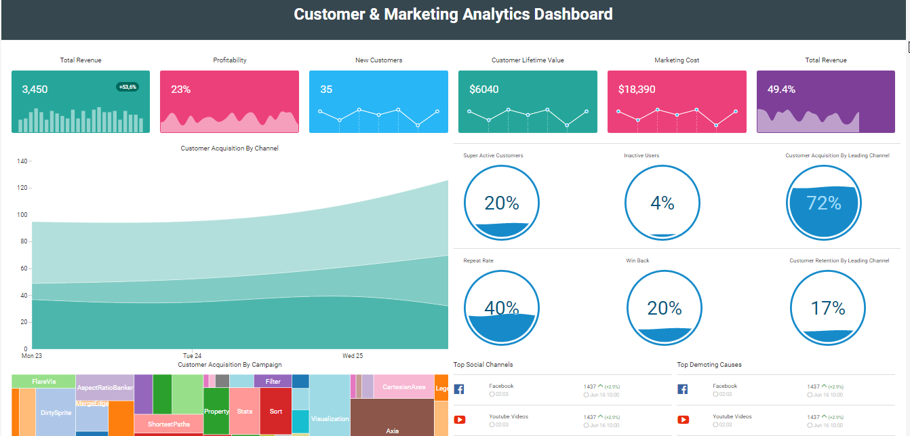

Tablero de seguimiento de marketing

**Tableros interactivos de ejemplo**

[https://www.heavy.ai/demos](https://www.heavy.ai/demos)

[https://www.tableau.com/learn/articles/business-intelligence-dashboards-examples](https://www.tableau.com/learn/articles/business-intelligence-dashboards-examples)

**Herramientas de Business Intelligence (BI)**

Las herramientas de Business Intelligence (BI), o Inteligencia de Negocios, son programas de software que se utilizan para analizar, procesar y visualizar datos relacionados con las actividades de una organización. En general, son las herramientas que se utilizan para construir dashboards en las empresas medianas y grandes, y pueden manejar grandes cantidades de datos desestructurados para ayudar a identificar, desarrollar y generar nuevos enfoques estratégicos de negocio.

Algunas de las características fundamentales de las herramientas de BI incluyen:

1. **Recopilación de Datos**: Las herramientas de BI pueden recolectar datos de diversas fuentes, como bases de datos, archivos CSV, hojas de cálculo de Excel, entre otros.
2. **Almacenamiento de Datos**: Algunas herramientas de BI tienen su propio sistema de almacenamiento de datos, mientras que otras pueden integrarse con sistemas de almacenamiento de datos existentes.
3. **Procesamiento de Datos**: Las herramientas de BI pueden procesar grandes cantidades de datos y convertirlos en información significativa. Esto a menudo implica funciones como la limpieza de datos, la integración de datos, la transformación de datos y la carga de datos.
4. **Análisis de Datos**: Las herramientas de BI pueden realizar una variedad de análisis, desde análisis básicos hasta complejos, como análisis de regresión, análisis de correlación, análisis de segmentación y mucho más.
5. **Visualización de Datos**: Las herramientas de BI pueden representar datos de manera gráfica, facilitando la comprensión y el análisis de los datos. Esto puede incluir gráficos, mapas de calor, gráficos de barras, gráficos de líneas, etc.
6. **Reporte y Dashboard**: Las herramientas de BI pueden generar informes detallados y tableros de control interactivos para presentar los resultados del análisis de datos de una manera fácil de entender.

Entre las herramientas de BI más populares se encuentran Microsoft Power BI, Tableau, QlikView, Looker, y SAS BI. Estas herramientas permiten a las organizaciones tomar decisiones informadas al proporcionar información útil sobre las tendencias, los problemas y los resultados que están ocurriendo en la organización.

El Cuadrante Mágico de Gartner es un informe de investigación y análisis que proporciona una visión profunda del mercado, la dirección, la madurez y los participantes de una industria específica, en este caso, la industria de la Inteligencia de Negocios (Business Intelligence, BI).

En el Cuadrante Mágico, Gartner evalúa a los proveedores de BI en base a su integridad de visión y su capacidad para ejecutar. Con base en estas evaluaciones, los proveedores son clasificados en uno de los cuatro cuadrantes:

1. **Líderes**: Los líderes ejecutan bien contra su visión actual y están bien posicionados para el futuro. Tienen un sólido historial, una presencia visible en el mercado y una visión clara de la dirección del mercado.
2. **Visionarios**: Los visionarios tienen una visión clara de la dirección del mercado y están desarrollando capacidades para mantenerse al día con las tendencias, pero no pueden ejecutar su visión tan eficazmente como los líderes.
3. **Jugadores de Nicho**: Los jugadores de nicho se centran con éxito en un segmento pequeño del mercado, o están enfocados en una funcionalidad específica, pero no muestran la capacidad de innovar o de influir en la dirección general del mercado.
4. **Retadores**: Los retadores tienen la capacidad de ejecutar bien hoy en día, pero no tienen una visión tan desarrollada como los líderes. A menudo tienen una gran presencia en el mercado, pero carecen de la profundidad de funcionalidad o capacidad para mantenerse al día con las tendencias del mercado.

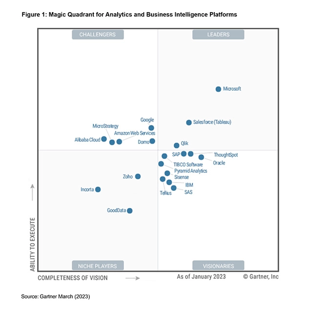

Existen varias soluciones de Business Intelligence (BI) de código abierto que pueden ser una excelente opción para las empresas que buscan flexibilidad y control sobre su software. Por ejemplo [Apache Superset](https://superset.apache.org/), [Redash](https://redash.io/), [Metabase](https://www.metabase.com/), [Grafana](https://grafana.com/), [Kibana](https://www.elastic.co/es/kibana/), entre otras.

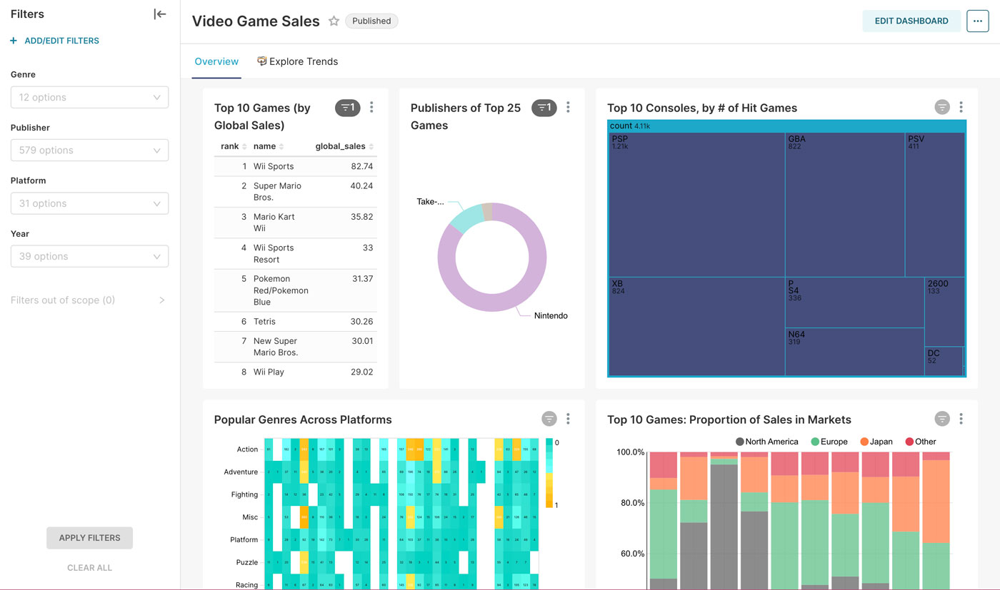

Apache Superset

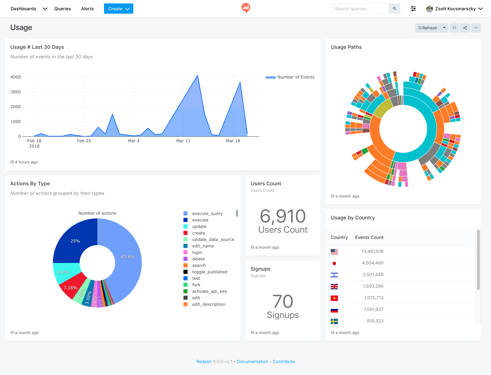

Redash

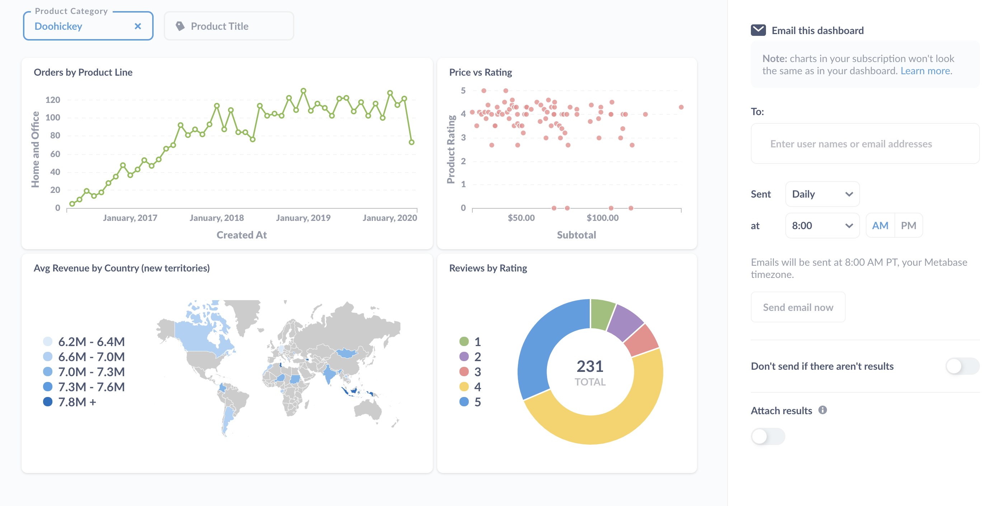

Metabase

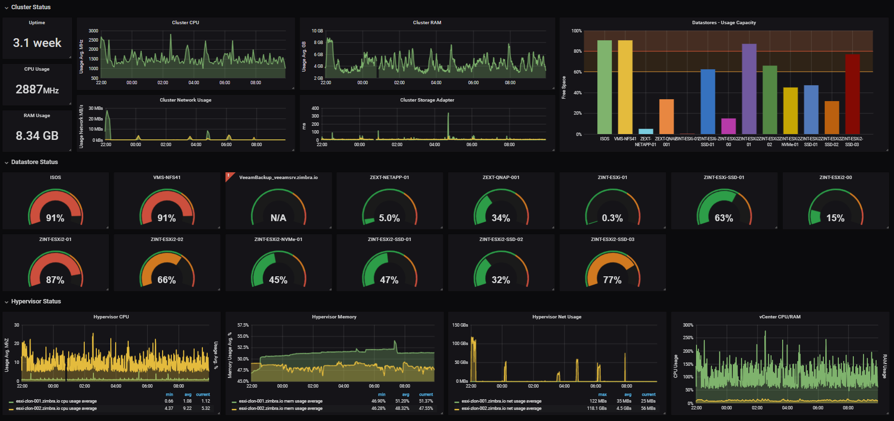

Grafana

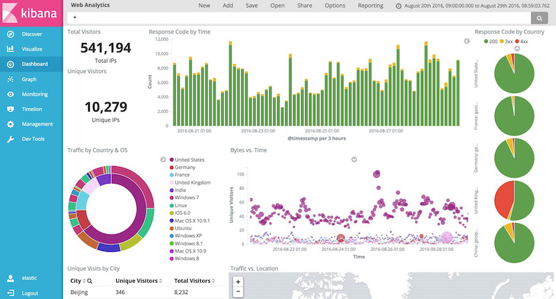

Kibana

## Buenas y malas prácticas de diseño y visualización

El diseño y la visualización son componentes esenciales para la interacción del usuario. El modo en que se presenta la información, el esquema de colores que se utiliza, la elección de la tipografía, la colocación de los botones y muchos otros factores influyen en cómo los usuarios perciben y utilizan una interfaz. Un buen diseño puede facilitar la comprensión, mejorar la usabilidad y aumentar la satisfacción del usuario. Sin embargo, un mal diseño puede frustrar a los usuarios, crear barreras para la accesibilidad y disminuir la eficacia general del producto.

### Uso del color

El color es una de las cosas más importantes para entender en la visualización de datos y con frecuencia se utiliza incorrectamente. No debe usar el color solo para darle vida a una visualización aburrida. De hecho, muchas visualizaciones de datos excelentes no usan color en absoluto y son informativas y hermosas.
En la Figura 1.15, vemos la visualización de Shine Pulikathara que ganó la competencia Tableau Iron Viz de 2015. Notar el simple uso del color.

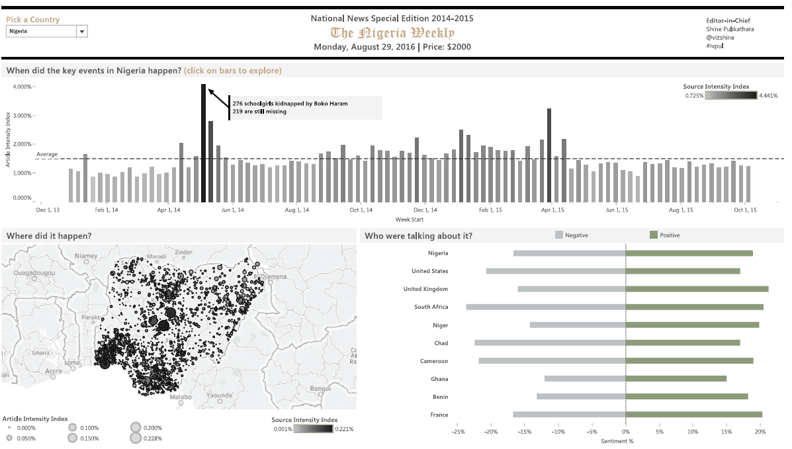

Figure 1.15 Winning visualization by Shine Pulikathara during the 2015 Tableau Iron Viz competition. Source: Used with permission from Shine Pulikathara.

El color debe usarse con un propósito. Por ejemplo, el color se puede utilizar para llamar la atención del lector, resaltar una parte de los datos o distinguir entre diferentes categorías. El color debe usarse en la visualización de datos de tres formas principales: secuencial, divergente y categórico. Además, a menudo existe la necesidad de resaltar datos o alertar al lector de algo importante. La Figura 1.16 ofrece un ejemplo de cada uno de estos esquemas de color.

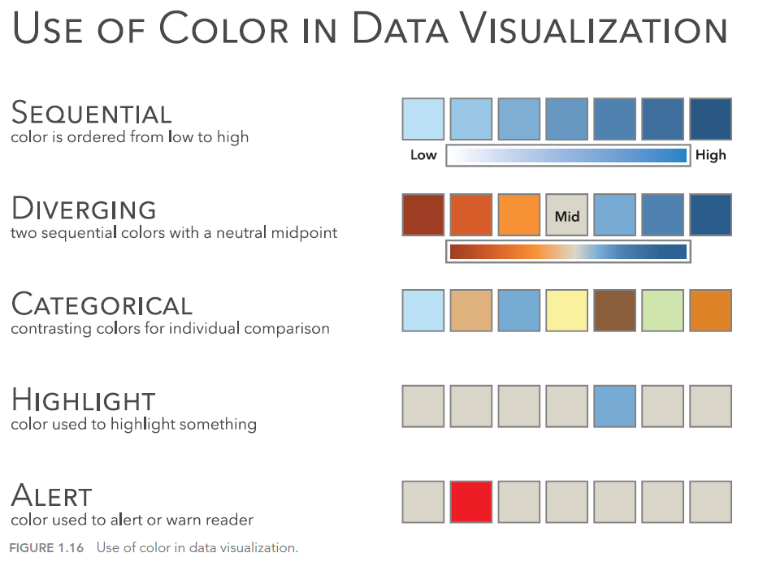

### **Contraste**

La pauta de contraste de color más utilizada es la WCAG. Hay dos niveles de contraste de color más utilizados: AA (contraste mínimo) y AAA (contraste mejorado):

El nivel AA requiere una relación de contraste de al menos 4.5:1 para el texto normal y 3:1 para el texto grande. WCAG 2.1 requiere una relación de contraste de al menos 3:1 para gráficos y componentes de la interfaz de usuario.
El nivel AAA requiere una relación de contraste de al menos 7:1 para el texto normal y 4.5:1 para el texto grande.
Hay muchos comprobadores de contraste de color que pueden ayudarte a seguir las pautas: [Colorable](https://colorable.jxnblk.com/000000/ffffff), [WebAIM](https://webaim.org/resources/contrastchecker/), [Coolors](https://coolors.co/contrast-checker/000000-ffffff), [ColorContrast](https://colourcontrast.cc/), y muchos más. Pero recuerda hacer una revisión manual y probarlo con los usuarios, porque las pautas a veces pueden ser defectuosas.

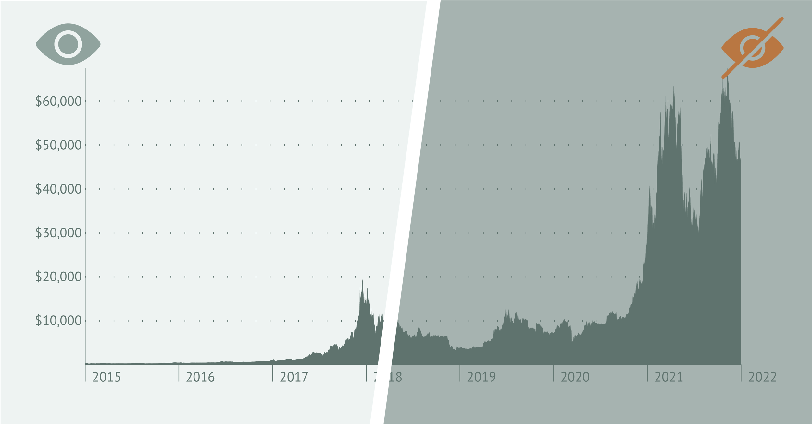

### Tamaño del texto y tipos de letra

No hay directrices oficiales sobre el tamaño mínimo del texto, pero generalmente se recomienda utilizar fuentes de tamaño 12pt (16px) para el texto del cuerpo al utilizar tamaños de monitor tradicionales. El tamaño mínimo de la fuente es de 9pt (12px). Por debajo de este tamaño, la fuente puede volverse técnicamente ilegible para algunas plataformas. Según las pautas WCAG, debería haber una opción para redimensionar el texto sin pérdida de contenido o funcionalidad.

Los tipos de letra que se utilizan en la visualización también pueden tener un gran impacto en la accesibilidad. Puede hacer una diferencia para las personas con mala visión, discapacidades de aprendizaje, afasia, dislexia o bajo alfabetismo adulto. [Gareth Ford Williams](https://garethfordwilliams.medium.com/about) seleccionó 8 puntos que deberías considerar al elegir un tipo de letra.

1. Usa una fuente apropiada para tu público. Si se trata de niños o personas con baja visión, es mejor elegir una fuente sans serif y si tu público lee rápido, las fuentes serif serán una mejor elección.
2. Evita usar formas similares para diferentes símbolos. La "i" mayúscula, la "L" minúscula y el "1" deben verse diferentes.
3. Evita las letras espejo. Por ejemplo, la "p" y la "q" deben contener diferencias además del espejo.
4. Las letras deben ser fácilmente distinguibles. Un ejemplo es la "o" y la "c". En este caso, la "c" necesita estar notablemente abierta para que sea difícil confundirla con la "o" para las personas con baja visión.
5. Usar tipos de letra [Humanistas en lugar de Grotescas,](https://es.wikipedia.org/wiki/Clasificaci%C3%B3n_Vox-ATypI) ya que tienden a tener más variación en las formas de las letras y son más legibles en tamaños más pequeños.
6. Usar fuentes con un espaciado más definido entre las letras, ya que el espaciado compacto tiende a parecer pegado, lo que tiene una mala influencia en la legibilidad.
7. La altura de las letras mayúsculas y los ascendentes deben variar. Como ejemplo, la "i" mayúscula y la "l" minúscula deben tener una altura diferente.
8. Probar el tipo de letra en el contexto en el que lo vayas a utilizar.

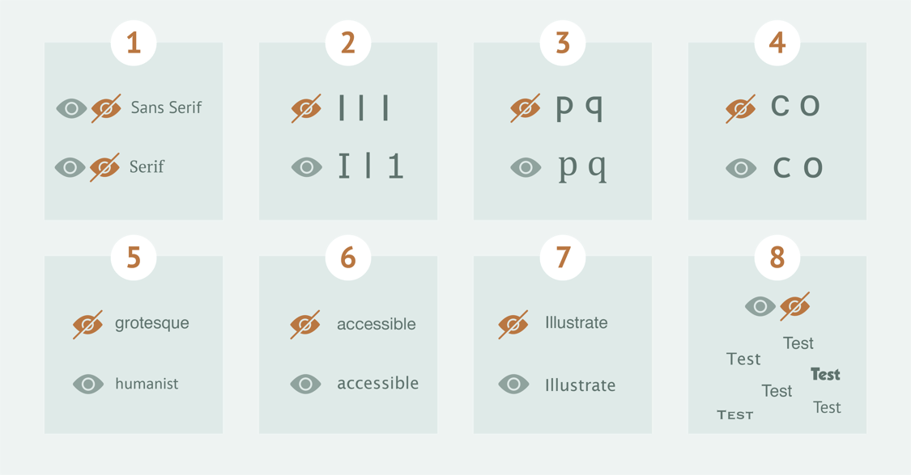

### Generar información accesible para todo el público

No todo el mundo procesa la información de la misma manera y con ciertas prácticas de visualización podemos llegar a dejar a grupos de personas “afuera” del análisis. Por ejemplo, sabemos que las personas con daltonismo pueden tener problemas detectando algunos colores o que las personas con Dislexia pueden tener más dificultad para leer ciertas tipografías y tamaños de letras.

A continuación les dejamos unos links con recomendaciones para conseguir visualizaciones más inclusivas:

- [Detección de colores](https://www.tableau.com/blog/examining-data-viz-rules-dont-use-red-green-together#:~:text=Use%20a%20colorblind%2Dfriendly%20palette%20when%20appropriate&text=For%20example%2C%20blue%2Forange%20is,blue%20to%20someone%20with%20CVD.)
- [Dislexia](https://www.bdadyslexia.org.uk/advice/employers/creating-a-dyslexia-friendly-workplace/dyslexia-friendly-style-guide)
- [Consejos para diseñar gráficos accesibles para lectores con discapacidad visual](https://www.datylon.com/blog/data-visualization-for-visually-impaired-users)
- [Do No Harm Guide: Underrpresented Groups](https://www.urban.org/sites/default/files/2022-12/Do) (Guía de Acción Sin Daño: Grupos subrepresentados)

**Deficiencia de la visión del color (daltonismo)**
Según la investigación (Birch 1993), aproximadamente el 8 por ciento de los hombres tienen deficiencia de visión cromática (CVD) en comparación con solo el 0,4 por ciento de las mujeres. Esta deficiencia es causada por la falta de uno de los tres tipos de conos dentro del ojo necesarios para ver todos los colores. La deficiencia comúnmente se conoce como "daltonismo", pero ese término no es del todo exacto.
De hecho, las personas que padecen CVD pueden ver el color, pero no pueden distinguir los colores de la misma manera que el resto de la población. El término más preciso es "deficiencia de la visión del color". Dependiendo del cono que falte, puede ser muy difícil para las personas con CVD distinguir entre ciertos colores debido a la forma en que ven el espectro de colores. Hay tres tipos de deficiencia de visión cromática:

1. Protanopia es la falta de conos de onda larga (rojo débil).
2. La deuteranopía es la falta de conos de onda media (verde débil).
3. Tritanopia es la falta de conos de onda corta (azul).
(Esto es muy raro y afecta a menos del 0,5 por ciento de la población).

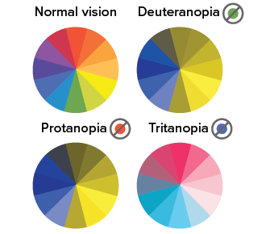

La CVD es principalmente hereditaria y, como puede ver en los números, afecta principalmente a los hombres. En empresas más grandes o cuando se presenta una visualización de datos al público en general, los diseñadores deben comprender el CVD y diseñar con eso en mente.
El principal problema entre las personas con CVD es con los colores rojo y verde. Por eso es mejor evitar el uso conjunto de rojo y verde y, en general, evitar los colores de semáforo de uso común.

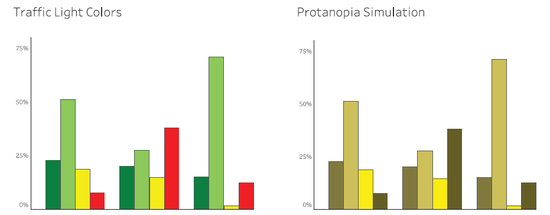

Figura 1.24 Gráfico de barras usando los colores del semáforo y una simulación de protanopia. Observe que las barras rojas y verdes en el panel de la derecha son muy difíciles de diferenciar entre sí para una persona con protanopia.

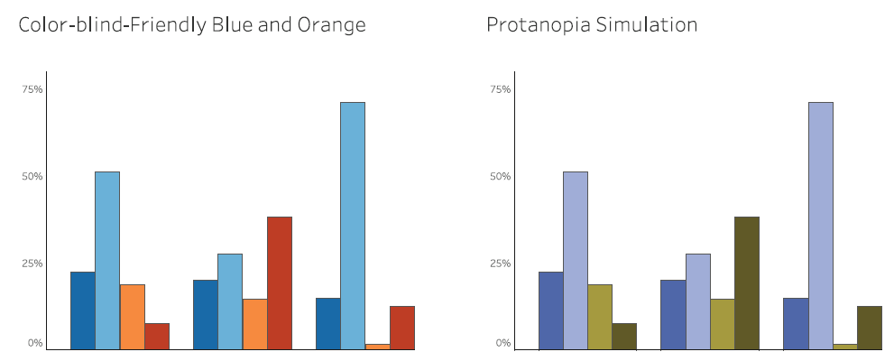

Figura 1.25 Gráfico de barras que usa una paleta azul y naranja para daltónicos y una simulación de protanopia.

**Pautas de accesibilidad al contenido web**

[Las Web Content Accessibility Guidelines (WCAG)](https://www.w3.org/TR/WCAG21/) son un conjunto de recomendaciones para hacer el contenido web más accesible, principalmente para las personas con discapacidades. Estas pautas son publicadas por el World Wide Web Consortium (W3C), una organización internacional que establece estándares para la web. Las WCAG se desarrollan a través del proceso W3C en cooperación con individuos y organizaciones de todo el mundo, y tienen el objetivo de proporcionar un estándar compartido para la accesibilidad del contenido web que satisfaga las necesidades de individuos, organizaciones y gobiernos a nivel internacional.

Las WCAG se aplican a una amplia gama de tecnologías web y se pueden aplicar a cualquier información o servicio que utilice tecnologías web. Cubren cosas como texto, imágenes, sonido, código (como HTML y CSS), etc.

Las pautas WCAG sirven para varios propósitos:

1. Ayudar a hacer la web más inclusiva: Las WCAG permiten que las personas con discapacidades, incluyendo discapacidades visuales, auditivas, físicas, del habla, cognitivas, del lenguaje, de aprendizaje y neurológicas, puedan usar y contribuir en la web.
2. Proporcionar una referencia estándar: Las WCAG son utilizadas por desarrolladores, diseñadores, administradores de sitios web y otros profesionales para asegurarse de que sus sitios web y aplicaciones sean accesibles.
3. Cumplimiento legal: En muchos países, tener un sitio web accesible es un requisito legal, y las WCAG a menudo se utilizan como base para estas leyes.

### **Bibliografía ampliatoria**

- Data Visualization: A practical introduction (Kieran Healy)
- Do No Harm Guide Centering Accessibility in Data Visualization (Jonathan Schwabish, Sue Popkin, Alice Feng)
- Fundamentals of Data Visualization (Claus O. Wilke)