# Unidad 5 - Transformación de datos

## Introducción

En esta unidad, exploraremos algunas técnicas esenciales y avanzadas de preprocesamiento de datos, aplicables en el análisis exploratorio de datos, y en la mejora de la eficiencia de los modelos de aprendizaje automático. Estos métodos nos permiten transformar los datos brutos en un formato más útil y comprensible, facilitando la extracción de patrones significativos y la generación de predicciones más precisas.

Comenzaremos discutiendo la estandarización y la normalización, dos técnicas fundamentales para re-escalar los datos. Hablaremos sobre el método min-max y la transformación de rango 0-1, que son formas populares de normalización para garantizar que todas las características estén en la misma escala. Además, exploraremos cómo y cuándo utilizar la transformación logarítmica para reducir la asimetría en los datos y cómo la expansión en funciones base puede ayudar a modelar relaciones no lineales.

A continuación, abordaremos la dicotomización de variables y la codificación de variables categóricas. Estos conceptos son esenciales cuando trabajamos con datos no numéricos o cuando queremos transformar variables continuas en variables binarias. Examinaremos varias técnicas de codificación y discutiremos sus ventajas y desventajas.

Después, nos centraremos en las operaciones con datos temporales. Estudiaremos cómo el suavizado y la media móvil pueden ayudar a manejar la volatilidad en los datos de series temporales y a resaltar las tendencias subyacentes. Estas técnicas son especialmente útiles en campos como el análisis financiero y el pronóstico del tiempo.

Finalmente, exploraremos las operaciones con datos de texto. La tokenización, es un proceso fundamental en el procesamiento del lenguaje natural. Veremos cómo esta técnica nos permite descomponer textos en unidades más pequeñas (tokens), permitiendo un análisis más detallado.

## Estandarización, min-max, rango 0-1, logaritmo

La normalización de variables es importante en el aprendizaje automático y la estadística.  El éxito de un algoritmo de aprendizaje automático depende en gran medida de la calidad de los datos que se alimentan al modelo. Los datos del mundo real a menudo están sucios y contienen valores atípicos, valores faltantes, tipos de datos incorrectos, características irrelevantes o datos no estandarizados. La presencia de cualquiera de estos impedirá que el modelo de aprendizaje automático aprenda adecuadamente. Por esta razón, transformar los datos brutos en un formato útil es una etapa esencial en el proceso de aprendizaje automático. Una técnica que encontrarás múltiples veces al pre-procesar los datos es la normalización.

La normalización consiste en transformar las columnas numéricas a una escala común. En el aprendizaje automático, algunos valores de las características difieren de otros en varias veces su magnitud. Las características con valores más altos dominarán el proceso de aprendizaje. Sin embargo, esto no significa que esas variables sean más importantes para predecir el resultado del modelo. La normalización de datos transforma los datos de múltiples escalas a la misma escala. Después de la normalización, todas las variables tienen una influencia similar en el modelo, mejorando la estabilidad y el rendimiento del algoritmo de aprendizaje.

Existen múltiples técnicas de normalización en estadística. En este artículo, cubriremos las más importantes:

- La escala máxima absoluta (**absolute maximum)**
- La escala de características mín-máx
- El método de la puntuación Z (**Z-score)**
- La estandarización robusta (**robust standardization)**

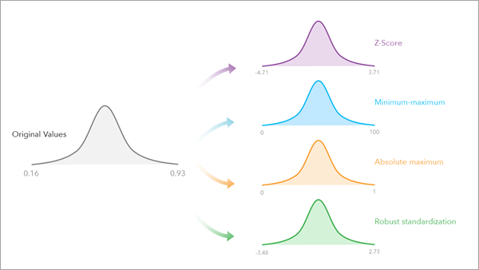

Además, explicaremos cómo implementarlos con Pandas y Scikit-Learn.

El siguiente marco de datos contiene las entradas (variables independientes) de un modelo de regresión para predecir el precio de un auto usado: (1) la lectura del odómetro (km) y (2) la economía de combustible (km/l). En este artículo, utilizamos un pequeño conjunto de datos con fines de aprendizaje. Sin embargo, en el mundo real, los conjuntos de datos empleados serán mucho más grandes.

```python
import pandas as pd

# data frame containing the odometer reading (km) and the fuel economy (km/l) of second-hand cars
df_cars = pd.DataFrame([[120000, 11], [250000, 11.5], [175000, 15.8], [350000, 17], [400000, 10]],
                       columns=['odometer_reading', 'fuel_economy'])

df_cars
```

El resultado es el siguiente:

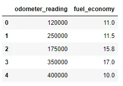

Si realizamos la gráfica de los datos, obtendremos:

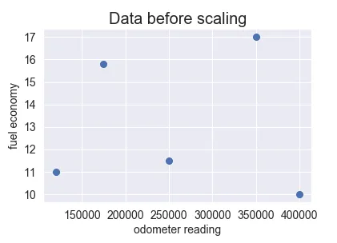

Como se puede observar, la lectura del odómetro varía de 120000 a 400000, mientras que la economía de combustible varía de 10 a 17. Un modelo predictivo de regresión lineal múltiple ponderará más la variable de lectura del odómetro, que el atributo de economía de combustible, debido a sus valores más altos. Sin embargo, esto no significa que el atributo de lectura del odómetro sea más importante como predictor. Para resolver este problema, tenemos que normalizar los valores de ambas variables.

### La escala máxima absoluta

La escala máxima absoluta vuelve a escalar cada característica entre -1 y 1 dividiendo cada observación por su valor absoluto máximo.

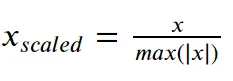

Podemos aplicar el escalado absoluto máximo en Pandas usando los métodos .max() y .abs(), como se muestra a continuación.

```python
# apply the maximum absolute scaling in Pandas using the .abs() and .max() methods
def maximum_absolute_scaling(df):
    # copy the dataframe
    df_scaled = df.copy()
    # apply maximum absolute scaling
    for column in df_scaled.columns:
        df_scaled[column] = df_scaled[column]  / df_scaled[column].abs().max()
    return df_scaled
    
# call the maximum_absolute_scaling function
df_cars_scaled = maximum_absolute_scaling(df_cars)

df_cars_scaled
```

Y el resultado obtenido es:

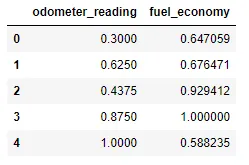

Alternativamente, podemos usar la biblioteca Scikit-learn para calcular la escala absoluta máxima. Primero, creamos un objeto abs_scaler con la clase `MaxAbsScaler`. Luego, usamos el método de ajuste (`fit`) para conocer los parámetros necesarios para escalar los datos (el valor absoluto máximo de cada característica). Finalmente, transformamos los datos usando esos parámetros.

```python
from sklearn.preprocessing import MaxAbsScaler

# create an abs_scaler object
abs_scaler = MaxAbsScaler()

# calculate the maximum absolute value for scaling the data using the fit method
abs_scaler.fit(df_cars)

# the maximum absolute values calculated by the fit method
abs_scaler.max_abs_
# array([4.0e+05, 1.7e+01])

# transform the data using the parameters calculated by the fit method (the maximum absolute values)
scaled_data = abs_scaler.transform(df_cars)

# store the results in a data frame
df_scaled = pd.DataFrame(scaled_data, columns=df_cars.columns)

# visualize the data frame
df_scaled
```


Como se puede observar, obtenemos los mismos resultados utilizando Pandas y Scikit-learn. El siguiente gráfico muestra los datos transformados después de realizar el escalado absoluto máximo.

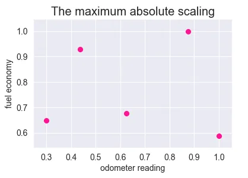

<aside>
💡 Es importante destacar que esta técnica es útil cuando los datos tienen valores tanto positivos como negativos y se desea mantener esta distinción después de la normalización.

</aside>

### La normalización mín-máx

El enfoque min-max (a menudo llamado normalización) vuelve a escalar la característica a un rango fijo de [0,1] al restar el valor mínimo de la característica y luego dividirlo por el rango.

$$
X_{\text{norm}} = \frac{X - X_{\text{min}}}{X_{\text{max}} - X_{\text{min}}}
$$

Podemos aplicar la escala min-max en Pandas usando los métodos .min() y .max().

```python
# apply the min-max scaling in Pandas using the .min() and .max() methods
def min_max_scaling(df):
    # copy the dataframe
    df_norm = df.copy()
    # apply min-max scaling
    for column in df_norm.columns:
        df_norm[column] = (df_norm[column] - df_norm[column].min()) / (df_norm[column].max() - df_norm[column].min())
        
    return df_norm
    
# call the min_max_scaling function
df_cars_normalized = min_max_scaling(df_cars)

df_cars_normalized
```

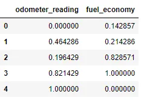

Alternativamente, podemos usar la clase `MinMaxScaler` disponible en la biblioteca Scikit-learn. Primero, creamos un objeto escalador. Luego, ajustamos los parámetros del escalador, lo que significa que calculamos el valor mínimo y máximo para cada función. Finalmente, transformamos los datos usando esos parámetros.

```python
from sklearn.preprocessing import MinMaxScaler

# create a scaler object
scaler = MinMaxScaler()
# fit and transform the data
df_norm = pd.DataFrame(scaler.fit_transform(df_cars), columns=df_cars.columns)

df_norm
```

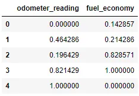

Además, podemos obtener los valores mínimos y máximos calculados por la función de ajuste para normalizar los datos con los atributos data_min_ y data_max_.

```python
# minimum values for normalizing the data
scaler.data_min_
# array([1.2e+05, 1.0e+01])

# maximum values for normalizing the data
scaler.data_max_
# array([4.0e+05, 1.7e+01])
```

La siguiente gráfica muestra los datos después de aplicar la escala de características min-max. Como puede observar, esta técnica de normalización vuelve a escalar todos los valores de características para que estén dentro del rango de [0, 1].

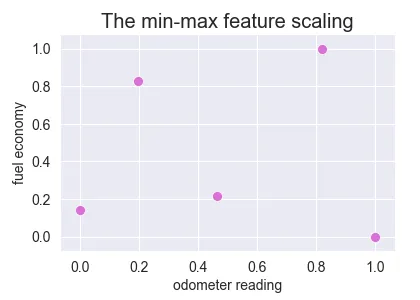

Como puede observar, obtenemos los mismos resultados utilizando Pandas y Scikit-learn. Sin embargo, si desea realizar muchos pasos de transformación de datos, se recomienda utilizar `MinMaxScaler` como entrada en un constructor de Pipeline en lugar de realizar la normalización con Pandas.

Además, es importante tener en cuenta que el escalado absoluto máximo y el escalado mínimo-máximo son muy sensibles a los valores atípicos porque un solo valor atípico puede influir en los valores mínimo y máximo y tener un gran efecto en los resultados.

### El método de puntaje z

El método de puntuación z (a menudo llamado estandarización) transforma los datos en una distribución con una media de 0 y una desviación estándar de 1. Cada valor estandarizado se calcula restando la media de la característica correspondiente y luego dividiendo por la desviación estándar.

$$
z = \frac{X - \mu}{\sigma}
$$

A diferencia de la escala mínima-máxima, la puntuación z no vuelve a escalar la característica a un rango fijo. La puntuación z suele oscilar entre -3,00 y 3,00 (más del 99 % de los datos) si la entrada tiene una distribución normal. Sin embargo, los valores estandarizados también pueden ser más altos o más bajos, como se muestra en la imagen a continuación.


Es importante tener en cuenta que las puntuaciones z no tienen necesariamente una distribución normal. Simplemente escalan los datos y siguen la misma distribución que la entrada original. Esta distribución transformada tiene una media de 0 y una desviación estándar de 1 y será la distribución normal estándar (vea la imagen de arriba) solo si la característica de entrada sigue una distribución normal.

Podemos calcular el puntaje z en Pandas usando los métodos .mean() y std().

```python
# apply the z-score method in Pandas using the .mean() and .std() methods
def z_score(df):
    # copy the dataframe
    df_std = df.copy()
    # apply the z-score method
    for column in df_std.columns:
        df_std[column] = (df_std[column] - df_std[column].mean()) / df_std[column].std()
        
    return df_std
    
# call the z_score function
df_cars_standardized = z_score(df_cars)

df_cars_standardized
```


Alternativamente, podemos usar la clase `StandardScaler` disponible en la biblioteca Scikit-learn para realizar el puntaje z. Primero, creamos un objeto standard_scaler. Luego, calculamos los parámetros de la transformación (en este caso la media y la desviación estándar) usando el método .fit(). A continuación, llamamos al método .transform() para aplicar la estandarización al marco de datos. El método .transform() utiliza los parámetros generados a partir del método .fit() para realizar la puntuación z.

```python
from sklearn.preprocessing import StandardScaler

# create a scaler object
std_scaler = StandardScaler()
std_scaler
# fit and transform the data
df_std = pd.DataFrame(std_scaler.fit_transform(df_cars), columns=df_cars.columns)

df_std
```

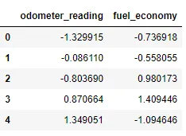

Para simplificar el código, hemos utilizado el método .fit_transform() que combina ambos métodos (ajuste y transformación).

Como puede observar, los resultados difieren de los obtenidos con Pandas. La función `StandardScaler` calcula la desviación estándar de la población donde la suma de los cuadrados se divide por N (número de valores en la población).


Por el contrario, el método .std() calcula la desviación estándar de la muestra donde el denominador de la fórmula es N-1 en lugar de N.

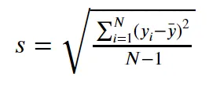

Para obtener los mismos resultados con Pandas, establecemos el parámetro ddof igual a 0 (el valor predeterminado es ddof=1) que representa el divisor utilizado en los cálculos (N-ddof).

```python
# population standard deviation with Pandas
df_cars.std(ddof=0)
```

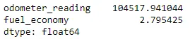

Podemos obtener los parámetros calculados por la función de ajuste para estandarizar los datos con los atributos mean_ y scale_. Como puede observar, obtenemos los mismos resultados en Scikit-learn y Pandas al establecer el parámetro ddof igual a 0 en el método .std().

```python
# standard deviation for standardizing the data
std_scaler.scale_
# array([1.04517941e+05, 2.79542483e+00])

# mean for standardizing the data
std_scaler.mean_
# array([2.590e+05, 1.306e+01])
```

La siguiente gráfica muestra los datos después de aplicar el método de puntuación z que se calcula utilizando la desviación estándar de la población (dividida por N).

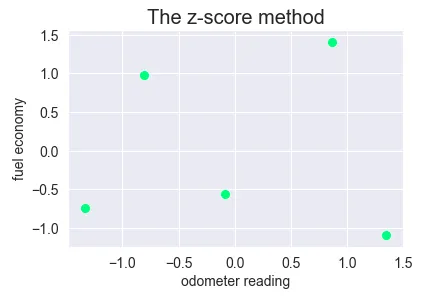

La normalización de puntaje Z, es una técnica comúnmente utilizada en estadística y ciencia de datos por varias razones:

- **Comparabilidad**: Permite comparar medidas que provienen de diferentes escalas o distribuciones. Por ejemplo, si tienes dos conjuntos de datos con diferentes escalas, como la estatura en centímetros y el peso en kilogramos, puedes usar el puntaje z para estandarizarlos y hacerlos comparables.
- **Manejo de outliers**: Los puntajes z pueden ser útiles para identificar y manejar valores atípicos (outliers). Por lo general, se considera que un valor es un outlier si su puntaje z es mayor que 3 o menor que -3.
- **Requisito para ciertos algoritmos de aprendizaje automático**: Algunos algoritmos de aprendizaje automático asumen que todas las características tienen la misma escala y distribución. Por lo tanto, se utiliza la normalización del puntaje z para cumplir con este requisito. Por ejemplo, en algoritmos de aprendizaje automático como k-nearest neighbors (k-NN), support vector machines (SVM) y redes neuronales, donde la escala de las características puede afectar a los resultados del modelo.
- **Componentes Principales (PCA)**: En el análisis de componentes principales, que es una técnica de reducción de la dimensionalidad, se recomienda estandarizar las características para garantizar que todas ellas tengan el mismo peso.

### El escalado robusto

En el escalado robusto, escalamos cada característica del conjunto de datos restando la mediana y luego dividiendo por el rango intercuartílico. El rango intercuartílico (RIC) se define como la diferencia entre el tercer y el primer cuartil y representa el 50% central de los datos. Matemáticamente, el escalador robusto se puede expresar como:


donde Q1(x) es el primer cuartil del atributo x, Q2(x) es la mediana y Q3(x) es el tercer cuartil.

Este método es útil cuando se trabaja con conjuntos de datos que contienen muchos valores atípicos porque utiliza estadísticas que son sólidas para los valores atípicos (mediana y rango intercuartílico), en contraste con los escaladores anteriores, que utilizan estadísticas que se ven muy afectadas por los valores atípicos como el máximo, el mínimo, la media y la desviación estándar.

Veamos cómo los valores atípicos afectan los resultados después de escalar los datos con escalado mínimo-máximo y escalado robusto.

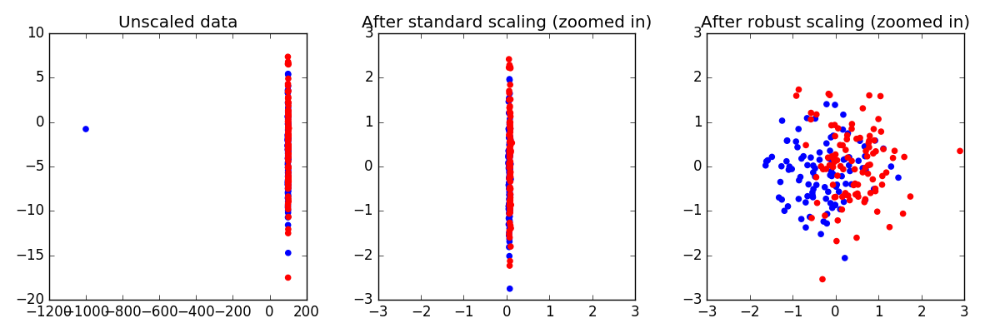

Otro ejemplo: El siguiente conjunto de datos contiene 10 puntos de datos, uno de ellos es un valor atípico (variable1 = 30).

```python
# the data frame contains one outlier
df_data = pd.DataFrame({'variable1':[1,2,3,4,5,6,7,30], 'variable2':[1,2,3,4,5,6,7,8]})

df_data
```

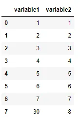

La escala min-max desplaza la variable 1 hacia 0 debido a la presencia de un valor atípico en comparación con la variable 2 donde los puntos se distribuyen uniformemente en un rango de 0 a 1.

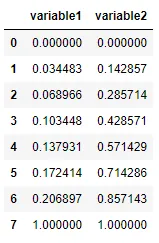

```python
# scatter plot of the data after applying min-max scaling
sns.scatterplot(x='variable1', y='variable2', data=df_min_max, s=100, color='blue')

# xticks and yticks
plt.xticks(fontsize=14)
plt.yticks(fontsize=14)

# labels and title
plt.xlabel('variable1', fontsize=14)
plt.ylabel('variable2', fontsize=14)
plt.title('The min-max scaling', fontsize=20)
```

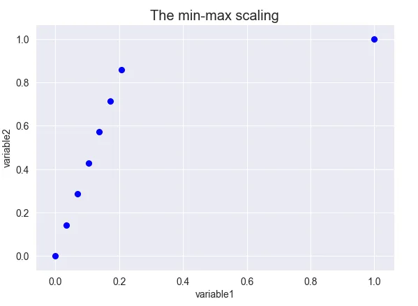

Antes de escalar, el primer punto de datos tiene un valor de (1,1), tanto la variable 1 como la variable 2 tienen valores iguales. Una vez transformado, el valor de la variable 2 es mucho mayor que el de la variable 1 (0,034, 0,142). Esto se debe a que la variable 1 tiene un valor atípico.

Por el contrario, si aplicamos un escalado robusto, ambas variables tienen los mismos valores (-1.00,-1.00) después de la transformación, ya que ambas características tienen la misma mediana y rango intercuartílico, siendo el valor atípico el que se desplaza.

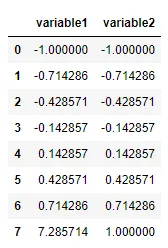

```python
# scatter plot of the data after applying min-max scaling
sns.scatterplot(x='variable1', y='variable2', data=df_robust, s=100, color='salmon')

# xticks and yticks
plt.xticks(fontsize=14)
plt.yticks(fontsize=14)

# labels and title
plt.xlabel('variable1', fontsize=14)
plt.ylabel('variable2', fontsize=14)
plt.title('The robust scaling', fontsize=20)
```

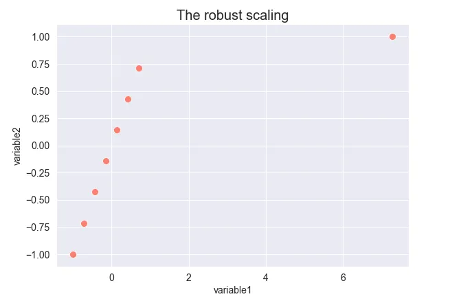

Ahora es el momento de aplicar la escala robusta al conjunto de datos de automóviles.
Como hicimos anteriormente, podemos realizar un escalado robusto usando Pandas.

```python
# apply the robust scaling in Pandas using the .median() and .quantile() methods
def robust_scaling(df):
    # copy the dataframe
    df_robust = df.copy()
    # apply robust scaling
    for column in df_robust.columns:
        df_robust[column] = (df_robust[column] - df_robust[column].median())  / (df_robust[column].quantile(0.75) - df_robust[column].quantile(0.25))
    return df_robust
    
# call the robust_scaling function
df_cars_robust = robust_scaling(df_cars)

df_cars_robust
```

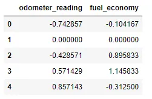

La mediana se define como el punto medio de la distribución, lo que significa que el 50% de los valores de la distribución son más pequeños que la mediana. En Pandas, podemos calcularlo con los métodos .median() o .quantile(0.5). El primer cuartil es la mediana de la mitad inferior del conjunto de datos (el 25 % de los valores se encuentran por debajo del primer cuartil) y se puede calcular con el método .quantile(0.25). El tercer cuartil representa la mediana de la mitad superior del conjunto de datos (75 % de los valores se encuentran por debajo del tercer cuartil) y se puede calcular con el método .quantile(0.75).

Como alternativa a Pandas, también podemos realizar un escalado robusto utilizando la biblioteca Scikit-learn.

```python
from sklearn.preprocessing import RobustScaler

# create a scaler object
scaler = RobustScaler()
# fit and transform the data
df_robust = pd.DataFrame(scaler.fit_transform(df_cars), columns=df_cars.columns)

df_robust
```

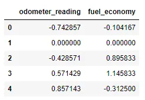

Como se muestra arriba, obtenemos los mismos resultados que antes.

El siguiente gráfico muestra los resultados después de transformar los datos con un escalado robusto.


### Resumen

La normalización de datos consiste en transformar columnas numéricas a una escala común. En Python podemos implementar la normalización de datos de una forma muy sencilla. La biblioteca de Pandas contiene múltiples métodos integrados para calcular las funciones estadísticas descriptivas más comunes que hacen que las técnicas de normalización de datos sean realmente fáciles de implementar. Como otra opción, podemos usar la biblioteca Scikit-Learn para transformar los datos en una escala común. En esta biblioteca ya están implementados los métodos de escalado más frecuentes.

Además de la normalización de datos, existen múltiples técnicas de preprocesamiento de datos que debemos aplicar para garantizar el rendimiento del algoritmo de aprendizaje. 

### Transformación Logarítmica

La transformación logarítmica es una técnica de transformación de datos comúnmente utilizada en estadísticas, ciencia de datos y aprendizaje automático. Es una operación matemática que toma un número y devuelve el logaritmo de ese número, generalmente utilizando la base 10 o la base e (el número de Euler, aproximadamente igual a 2.71828). Resulta particularmente útil para tratar con datos que abarcan varios órdenes de magnitud. Puede ayudar a manejar varias situaciones, como por ejemplo:

- **Sesgo o asimetría en la distribución**: Cuando los datos están sesgados, la transformación logarítmica puede ayudar a hacer que los datos sean más simétricos y, por lo tanto, más manejables para el análisis. Esto puede hacer que los supuestos de muchos modelos estadísticos (como la normalidad) sean más apropiados.
- **Relaciones no lineales**: Si la relación entre dos variables es exponencial en lugar de lineal, tomar el logaritmo de una o ambas variables puede convertir la relación en una relación lineal, lo que facilita su análisis.
- **Manejo de grandes rangos de valores**: En muchos conjuntos de datos, algunos valores pueden ser muy grandes en comparación con otros. En estos casos, la transformación logarítmica puede comprimir los valores más grandes más que los pequeños, lo que permite un manejo más fácil de los datos.

<aside>
💡 Es importante tener en cuenta que la transformación logarítmica solo puede aplicarse a números positivos.

</aside>

Para entender mejor estos conceptos, es necesario entender qué es una distribución normal y la función logarítmica.

**¿Qué es una distribución normal?**
Antes de entrar en la transformación de registros, hablemos rápidamente sobre la distribución normal. La distribución normal es un concepto estadístico y de probabilidad ampliamente utilizado en estudios científicos por sus muchos beneficios. Solo por nombrar algunos de estos beneficios, la distribución normal es simple. Su media, mediana y moda tienen el mismo valor y se puede definir con solo dos parámetros: media y varianza. También tiene importantes implicaciones matemáticas como el Teorema del Límite Central.

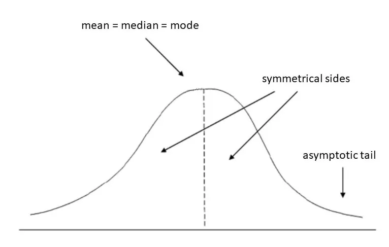

Distribución normal

Desafortunadamente, nuestros conjuntos de datos de la vida real no siempre siguen la distribución normal. A menudo son tan sesgados que invalidan los resultados de nuestros análisis estadísticos. Ahí es donde entra Transformación Logarítmica.

**¿Qué es el logaritmo?**
Los logaritmos son herramientas esenciales en el modelado estadístico y el análisis estadístico. Se puede definir un logaritmo con respecto a una base (b) donde el logaritmo en base b de X es igual a y porque X es igual a b elevado a y (log(X) =y porque X = b ʸ). Puede tomar cualquier número positivo como la base del logaritmo, pero las bases más utilizadas son:

Base 2: el logaritmo en base 2 de 8 es 3, porque 2³ = 8
Base 10: el logaritmo en base 10 de 100 es 2, porque 10² = 100
Logaritmo natural: la base del logaritmo natural es la constante matemática "e" o el número de Euler, que es igual a 2,718282. Entonces, el logaritmo natural de 7,389 es 2, porque e² = 7,389.


**¿Qué es la transformación de registros?**
La transformación de registro es un método de transformación de datos en el que reemplaza cada variable x con un registro (x). La elección de la base del logaritmo generalmente se deja en manos del analista y dependería de los propósitos del modelado estadístico. Por ahora, nos centraremos en la transformación del logaritmo natural. El registro de la naturaleza se denota como ln.

Cuando nuestros datos continuos originales no siguen la curva de campana, podemos transformar estos datos para que sean lo más "normales" posibles, de modo que los resultados del análisis estadístico de estos datos sean más válidos. En otras palabras, la transformación de registro reduce o elimina la asimetría de nuestros datos originales. La advertencia importante aquí es que los datos originales deben si o si seguir aproximadamente una distribución logarítmica normal. De lo contrario, la transformación de registro no funcionará.

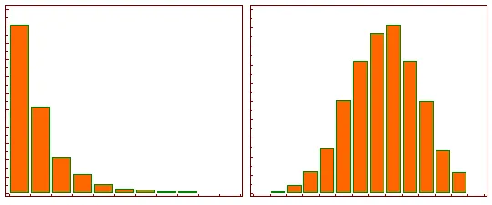

Izquierda: Distribución de la muestra original. Derecha: Distribución luego de la transformación logarítmica.

Para ver un ejemplo, usaremos un dataset de precios de viviendas del condado de King (publicado [aquí](https://www.kaggle.com/code/gabriellima/house-sales-in-king-county-usa/input)) como ejemplo. Graficaremos las distribuciones antes y después de la transformación.

```python
import pandas as pd
import numpy as np
import matplotlib.pyplot as plt
import seaborn as sns
import scipy.stats as stats

df = pd.read_csv("kc_house_data.csv")

df['price_log'] = np.log(df['price'])

sns.distplot(df['price_log'])

fig = plt.figure()
```

Los resultados obtenidos son:

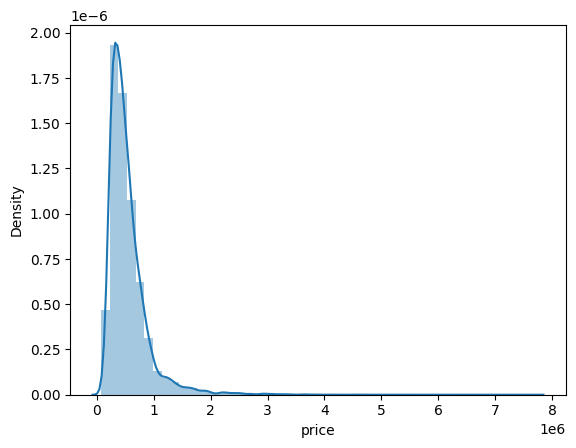

Dataset original

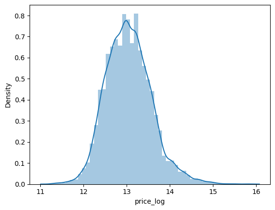

Precios transformados logarítmicamente

Es importante tener en cuenta que la transformación logarítmica solo debe aplicarse a datos positivos, ya que el logaritmo natural no está definido para valores menores o iguales a cero. Además, es importante tener en cuenta que la transformación del registro no hace que los datos sean normales, solo reduce la asimetría.

## Dicotomización de variables, codificación de variables categóricas

### **Dicotomización (Dichotomization)**

La Dicotomización consiste en tomar una variable y dividirla en dos grupos, a menudo basándose en un punto de corte. Por ejemplo, podrías tener una variable continua, como la edad, y podrías querer dividirla en dos grupos: aquellos menores de 30 y aquellos de 30 o más. Estos grupos se convierten luego en categorías binarias: 0 (menor de 30) y 1 (30 o más). La dicotomización se utiliza a menudo cuando queremos convertir una variable continua en una variable categórica binaria para su análisis.

Este proceso a menudo implica establecer un punto de corte y asignar categorías según si los valores están por encima o por debajo de este punto.

Supongamos que tienes un DataFrame de pandas **`df`** con una columna "Edad" y deseas dicotomizarla en dos grupos: menores de 18 y 18 o más. Aquí mostramos cómo hacerlo:

```python
import pandas as pd

# Supongamos que este es tu DataFrame original
df = pd.DataFrame({
    'Nombre': ['Ana', 'Juan', 'Pedro', 'Maria', 'Luis', 'Elena'],
    'Edad': [14, 22, 18, 35, 16, 20]
})

# Creamos una nueva columna "Mayor_de_18" utilizando la función where de numpy
df['Mayor_de_18'] = pd.np.where(df['Edad'] >= 18, 1, 0)

df
```

Obtendremos el siguiente DataFrame:

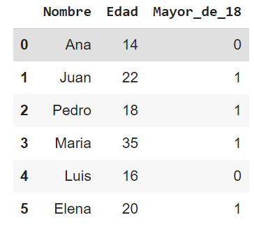

### **Binning (**o "bucketing")

Esta es una técnica más general que la dicotomización. En lugar de dividir los datos en dos grupos, los datos se dividen en varios grupos o "bins" o “buckets”. Por ejemplo, podrías tomar una variable continua, como la edad, y dividirla en varios grupos: menores de 18, de 18 a 24, de 25 a 34, de 35 a 44, etc. Al igual que con la dicotomización, los grupos se convierten en categorías. El binning puede ser útil por varias razones:

- **Reducción de ruido**: El bucketing puede suavizar las fluctuaciones menores en los datos que podrían ser ruido aleatorio en lugar de señales significativas.
- **Manejo de valores atípicos**: Al agrupar los datos en buckets, los valores extremadamente altos o bajos (valores atípicos) se colocan en el bucket superior o inferior, lo que puede hacer que los modelos sean más robustos a estos valores atípicos.
- **Conversión de variables continuas en categóricas**: Algunas técnicas de modelado funcionan mejor con variables categóricas que con variables continuas. El bucketing permite convertir variables continuas en categóricas.
- **Facilita la interpretación**: Al agrupar los valores en categorías más amplias, puede facilitar la interpretación de los resultados, especialmente en el caso de variables con un amplio rango de valores.

El bucketing debe usarse con cuidado, ya que también tiene desventajas. Puede llevar a una pérdida de información, ya que los valores dentro de cada bucket se tratan de la misma manera, aunque pueden ser bastante diferentes. Además, el rendimiento del modelo puede ser muy sensible a cómo se definen los buckets.

El binning o "bucketing" en pandas se puede realizar utilizando varias funciones, como **`cut`** y **`qcut`**. Aquí muestramos cómo hacerlo:

```python
import pandas as pd

# Supongamos que este es tu DataFrame original
df = pd.DataFrame({
    'Nombre': ['Ana', 'Juan', 'Pedro', 'Maria', 'Luis', 'Elena'],
    'Edad': [14, 22, 18, 35, 16, 20]
})

# Creas una nueva columna "Grupo_Edad" utilizando la función cut de pandas
bins = [0, 18, 30, 100]  # Define los rangos de edad que desees
labels = ['Menor de 18', '18-30', 'Mayor de 30']  # Define las etiquetas para cada bin
df['Grupo_Edad'] = pd.cut(df['Edad'], bins=bins, labels=labels)

df
```

Obtendremos el siguiente DataFrame:


### Codificación de variables categóricas

La mayoría de los algoritmos de aprendizaje automático no pueden manejar variables categóricas a menos que las convirtamos en valores numéricos. El rendimiento de muchos algoritmos varía en función de cómo se codifican las variables categóricas.

Las variables categóricas se pueden dividir en dos categorías: nominales (sin orden particular) y ordinales (algunas ordenadas).

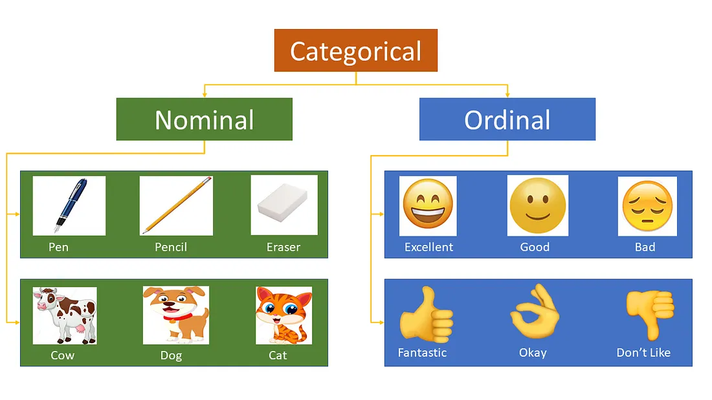

Algunos ejemplos como a continuación para la variable Nominal:

- Rojo, amarillo, rosa, azul
- Singapur, Japón, Estados Unidos, India, Corea
- Vaca, Perro, Gato, Serpiente

Ejemplo de variables ordinales:

- Alto, medio, bajo
- "Totalmente de acuerdo", de acuerdo, neutral, en desacuerdo, y "totalmente en desacuerdo".
- Excelente, Bien, Malo

Hay muchas maneras en que podemos codificar estas variables categóricas como números y usarlas en un algoritmo. Veremos algunos de métodos de codificación:

1. Codificación activa
2. Codificación de etiquetas
3. Codificación ordinal
4. Codificación Helmert
5. Codificación binaria

Para la explicación, usaremos este marco de datos, que tiene dos variables o características independientes (Temperatura y Color) y una etiqueta (Objetivo). También tiene Rec-No, que es un número de secuencia del registro. Hay un total de 10 registros en este marco de datos. El código de Python se vería como se muestra a continuación.


```python
import pandas as pd
import numpy as np

data = {'Temperature': ['Hot', 'Cold', 'Very Hot', 'Warm', 'Hot', 'Warm', 'Warm', 'Hot', 'Hot', 'Cold'],
         'Color': ['Red', 'Yellow', 'Blue', 'Blue', 'Red', 'Yellow', 'Red', 'Yellow', 'Yellow', 'Yellow'],
         'Target': ['1', '1', '1', '0', '1', '0', '1', '0', '1', '1']}

df = pd.DataFrame(data, columns=['Temperature', 'Color', 'Target'])

df
```

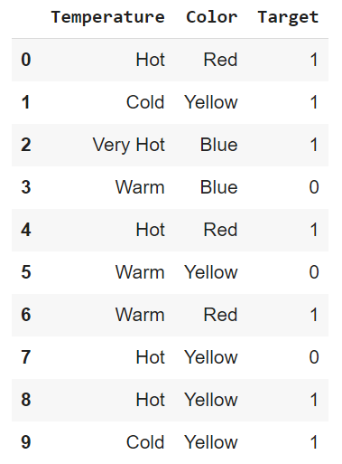

Usaremos Pandas y Scikit-learn y [`category_encoders`](https://github.com/scikit-learn-contrib/category_encoders) (biblioteca de contribución de Scikit-learn) para mostrar diferentes métodos de codificación en Python.

**One Hot Encoding**
En este método, asignamos cada categoría a un vector que contiene 1 y 0, lo que denota la presencia o ausencia de la característica. El número de vectores depende del número de categorías de características. Este método produce muchas columnas que ralentizan significativamente el aprendizaje si el número de la categoría es muy alto para la función. Pandas tiene la función get_dummies, que es bastante fácil de usar. El código del marco de datos de muestra sería el siguiente:


Scikit-learn tiene OneHotEncoder para este propósito, pero no crea una columna de función adicional (se necesita otro código, como se muestra en el ejemplo de código a continuación).

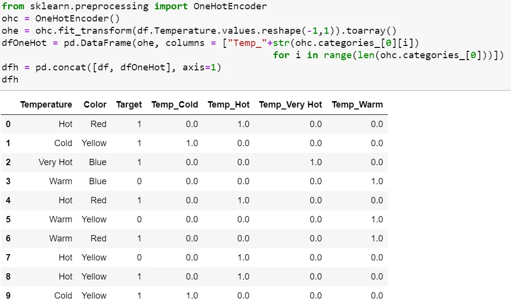

One Hot Encoding es muy popular. Podemos representar todas las categorías por N-1 (N= Nro de Categoría) como suficiente para codificar la que no está incluida. Por lo general, para la regresión, usamos N-1 (eliminar la primera o la última columna de la nueva función One Hot Coded). Aún así, para la clasificación, la recomendación es usar todas las N columnas, ya que la mayoría de los algoritmos basados en árboles construyen un árbol basado en todas las variables disponibles. Se debe usar One Hot Encoding con N-1 variables binarias en la regresión lineal para garantizar el número correcto de grados de libertad (N-1). La regresión lineal tiene acceso a todas las funciones a medida que se entrena y, por lo tanto, examina todo el conjunto de variables ficticias. Esto significa que N-1 variables binarias brindan información completa sobre (representan completamente) la variable categórica original de la regresión lineal. Este enfoque se puede adoptar para cualquier algoritmo de aprendizaje automático que analice TODAS las características simultáneamente durante el entrenamiento, por ejemplo, máquinas de vectores de soporte (SVM) y redes neuronales, así como algoritmos de clustering.

**Codificación de etiquetas (Label Encoding)**
En esta codificación, a cada categoría se le asigna un valor de 1 a N (donde N es el número de categorías para la función. Un problema importante con este enfoque es que no hay relación ni orden entre estas clases, pero el algoritmo podría considerarlas como algún orden o alguna relación En el siguiente ejemplo, puede verse como (Cold<Hot<Very Hot<Warm….0 < 1 < 2 < 3) .Scikit-learn código para el marco de datos de la siguiente manera:

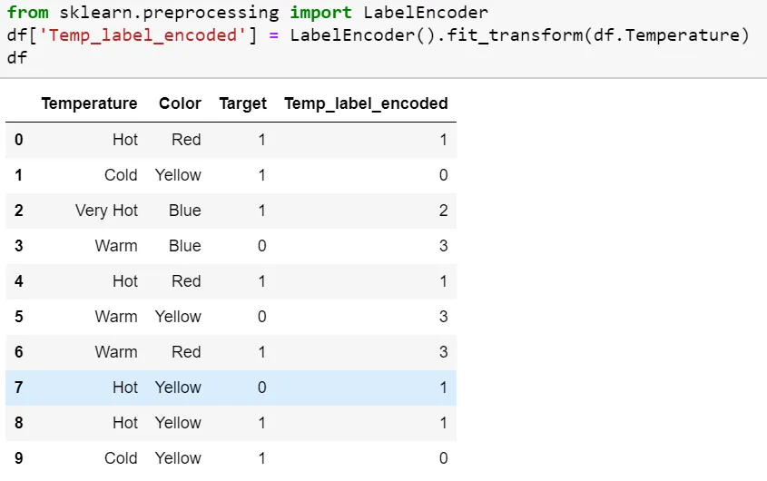

`factorize` de Pandas también realizan la misma función:

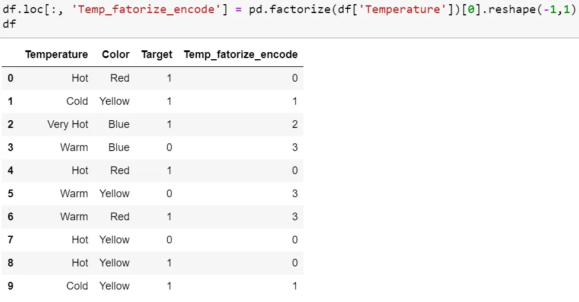

**Codificación ordinal**
Realizamos la codificación ordinal para garantizar que la codificación de las variables conserve la naturaleza ordinal de la variable. Esto es razonable solo para variables ordinales, como mencionamos al principio de este artículo. Esta codificación se ve casi similar a la codificación de etiquetas, pero ligeramente diferente, ya que la codificación de etiquetas no consideraría si la variable es ordinal o no, y asignará una secuencia de números enteros.

Según el orden de los datos (Pandas asigna Hot (0), Cold (1), “Very Hot” (2) and Warm (3)) o según el orden alfabético (scikit-learn asigna Cold(0), Hot(1), “Very Hot” (2) and Warm (3)).
Si consideramos la escala de temperatura como el orden, entonces el valor ordinal debería ir de Cold a “Very Hot”. “ La codificación ordinal asignará valores como ( Cold(1) <Warm(2)<Hot(3)<”Very Hot(4)). Por lo general, la codificación ordinal se realiza a partir de 1.

Consulte este código usando Pandas, donde primero debemos asignar el orden original de la variable a través de un diccionario. Luego podemos mapear cada fila para la variable según el diccionario.

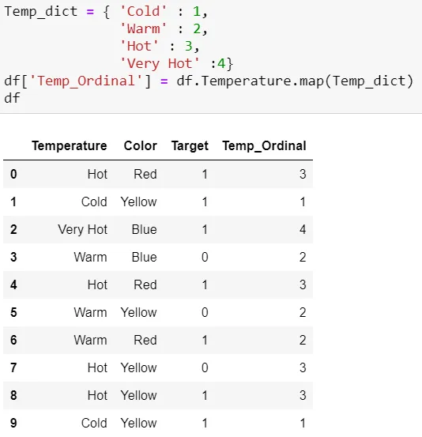

Aunque es muy sencillo, requiere codificación para indicar los valores ordinales y la asignación real de texto a un número entero según el orden.

**Codificación [Helmert](https://stats.oarc.ucla.edu/r/library/r-library-contrast-coding-systems-for-categorical-variables/#HELMERT)**
La versión en `category_encoders` a veces se denomina Codificación Helmert inversa. En esta codificación, la media de la variable dependiente de un nivel se compara con la media de la variable dependiente de todos los niveles anteriores. Por lo tanto, el nombre 'inverso' se usa para diferenciar la codificación directa de Helmert.

Esta codificación contrasta cada nivel de una variable categórica con el promedio de los niveles siguientes. Esta es una forma de codificación "contraste", que compara cada nivel de la variable categórica con un estándar de algún tipo.

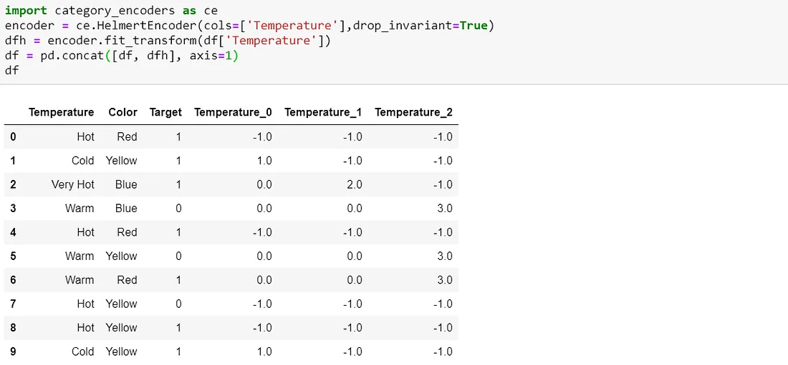

**Codificación binaria**
La codificación binaria convierte una categoría en dígitos binarios. Cada dígito binario crea una columna de características. Si hay n categorías únicas, la codificación binaria da como resultado las únicas funciones de registro (base 2)ⁿ. En este ejemplo, tenemos cuatro características; por lo tanto, las características codificadas en binario serán tres características. En comparación con One Hot Encoding, esto requerirá menos columnas de funciones (para 100 categorías, One Hot Encoding tendrá 100 funciones, mientras que para la codificación binaria, necesitaremos solo siete funciones).

Para la codificación binaria, se deben seguir los siguientes pasos:

Las categorías se convierten primero en orden numérico a partir de 1 (el orden se crea a medida que las categorías aparecen en un conjunto de datos y no significan ninguna naturaleza ordinal)
Luego, esos números enteros se convierten en código binario, por ejemplo, 3 se convierte en 011, 4 se convierte en 100
Luego, los dígitos del número binario forman columnas separadas.
Consulte el siguiente diagrama para una mejor intuición.

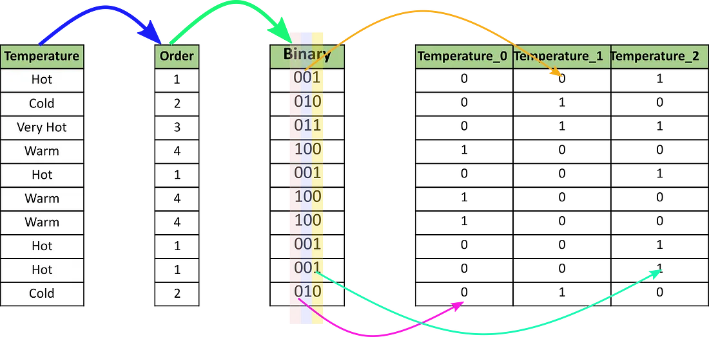

Usaremos el paquete `category_encoders` para esto, y el nombre de la función es BinaryEncoder.

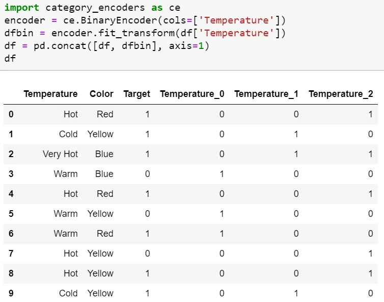

## Operaciones con datos temporales

### Suavizado de variables temporales

El suavizado de variables temporales es una técnica estadística de transformación de datos, que se utiliza en el análisis de series de tiempo. Se utiliza para eliminar el ruido y las fluctuaciones aleatorias en los datos, y para revelar patrones subyacentes como las tendencias y la estacionalidad. Al suavizar los datos, se puede obtener una representación más clara de lo que realmente está sucediendo.
Suavizar una serie temporal elimina ciertas frecuencias o componentes para obtener una vista de la estructura subyacente de la serie temporal. Por ejemplo, queremos eliminar el ruido para enfatizar la señal en la serie temporal antes de comenzar nuestro análisis. Eliminar el ruido mejora la calidad de nuestros datos y, a su vez, los resultados de nuestro análisis. Piensa en las famosas palabras "basura que entra, basura que sale".

El suavizado de datos básicamente no es más que promediar puntos de datos con sus vecinos en una serie de tiempo, lo que resulta en un desenfoque de los bordes nítidos en nuestra serie de tiempo. Por lo tanto, el suavizado de datos es similar al filtrado, en el que se suprimen las altas frecuencias para extraer las señales de baja frecuencia. Con esto, generamos un nuevo punto de datos suavizado para cada punto de datos en la serie temporal.

Para suavizar nuestra serie temporal, podemos elegir entre diferentes enfoques, que difieren principalmente en cómo se calcula el promedio alrededor de un punto de datos. Los enfoques más utilizados son:

- Media móvil simple **(Simple Moving Average)**
- Suavizado por kernel **(Kernel Smoothing)**
- (Simple, Doble, Triple) Suavizado Exponencial (**Simple/Double/Triple Exponential Smoothing)**

El enfoque que elijamos depende de la cantidad de ruido y de los componentes, como la tendencia y la estacionalidad, en nuestra serie temporal.

### **Media móvil simple(Simple Moving Average)**

La media móvil es el enfoque más sencillo que podemos utilizar. Dentro de una ventana deslizante de una longitud fija, todos los puntos de datos se promedian con el mismo peso.

El enfoque es adecuado para datos con poco ruido y para resaltar tendencias a largo plazo. Sin embargo, el promedio móvil no puede capturar la estacionalidad y, por lo tanto, no debe usarse para series de tiempo con estacionalidad y no linealidad compleja. Además, el enfoque no puede calcular valores al principio y/o al final de la serie temporal, dependiendo de si se calcula una media móvil unilateral o bilateral.

La ventana deslizante se coloca alrededor de un punto de datos y los valores dentro de la ventana se promedian antes de que la ventana se deslice al siguiente punto de datos. Esto se repite hasta que se suaviza la serie temporal. El grado de suavidad está determinado por el ancho de la ventana deslizante. Cuanto más ancha sea la ventana, más fuerte será el suavizado.

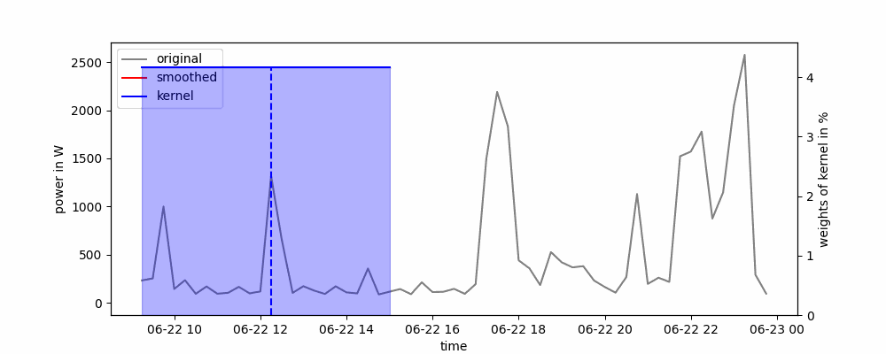

Animación de una media móvil centrada (de dos caras).

Dependiendo de cómo se coloque la ventana deslizante alrededor del punto de datos, se pueden distinguir dos tipos de medias móviles: unilateral o bilateral. En un enfoque de un solo lado, el punto de datos se coloca al principio o al final de la ventana deslizante, mientras que en un enfoque de dos lados, el punto de datos se coloca en el centro de la ventana deslizante.

La media móvil para un enfoque unilateral se puede calcular mediante

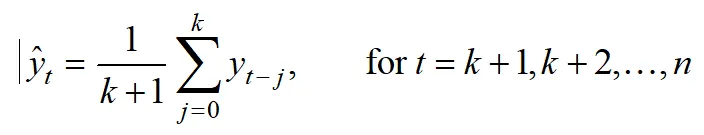

mientras que para un enfoque de dos lados o centrado, la media móvil se puede calcular mediante


en el que *y* es el punto de datos de la serie de tiempo que queremos suavizar, *k* es el ancho de la ventana deslizante y *n* el número de pasos de tiempo en la serie de tiempo.

La media móvil se puede implementar fácilmente en Python utilizando el método rolling() de panda. Solo necesitamos pasar el ancho de la ventana deslizante y si queremos usar un enfoque de un solo lado (center=False) o de dos lados (center=True).

```python
smoothed_time_series = time_series.rolling(window=24, center=True).mean()
```

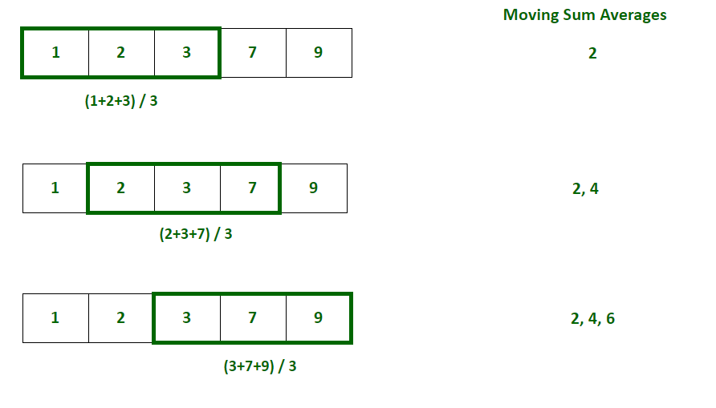

Ejemplo de cálculo del promedio móvil

La aplicación de la Media Móvil con diferentes anchos de la Ventana Deslizante en una serie de tiempo de carga de electricidad muestra que el suavizado aumenta cuanto más ancha es la Ventana Deslizante. También vemos que cuanto más ancha es la ventana deslizante, más reducimos la longitud de la serie temporal.

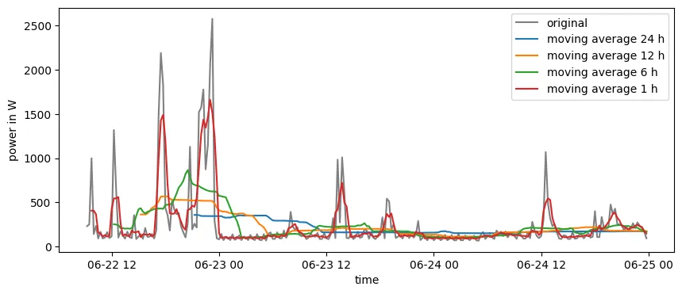

Efecto de suavizado de diferentes anchos de ventana deslizante en una media móvil.

Un ejemplo en Pandas completo podría ser:

```python
import pandas as pd
import matplotlib.pyplot as plt
import seaborn

# Seaborn para tener estilos de gráficos más bonitos
seaborn.set()

# Cargamos el dataset
url = 'https://raw.githubusercontent.com/jbrownlee/Datasets/master/airline-passengers.csv'
df = pd.read_csv(url, parse_dates=['Month'], index_col='Month')

# Imprimimos las primeras filas para ver los datos
print(df.head())

# Calculamos el promedio móvil con una ventana de 12 meses
df['12_Month_SMA'] = df['Passengers'].rolling(window=12).mean()

# Graficamos los datos originales y el promedio móvil
df[['Passengers', '12_Month_SMA']].plot(figsize=(10,8))
plt.show()
```

Este script carga un conjunto de datos de pasajeros de aerolíneas, calcula un promedio móvil con una ventana de 12 meses, y luego traza los datos originales y el promedio móvil. Observarás cómo el promedio móvil suaviza las fluctuaciones en los datos y ayuda a resaltar la tendencia a largo plazo. Al visualizar el resultado obtenemos:

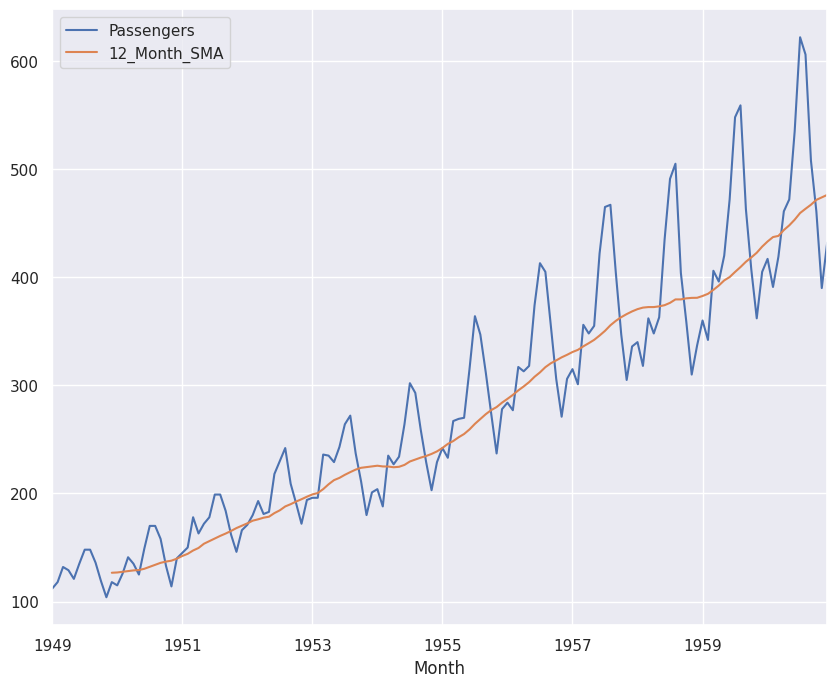

### **Suavizado por kernel (Kernel Smoothing)**

El suavizado por kernel es muy similar a la media móvil. La única diferencia es que usamos diferentes pesos para promediar en la ventana deslizante. Los pesos dependen de la forma de la función kernel. Debido a la similitud con la media móvil, las ventajas y desventajas también son similares.

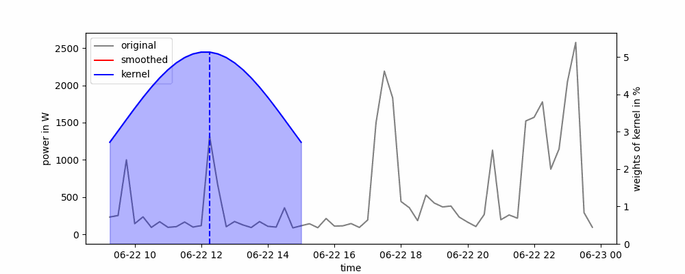

Animación de un suavizado de kernel gaussiano.

El ancho de la ventana deslizante se puede definir en función del ancho completo a la mitad del máximo (FWHM). Con esto, cortamos los extremos posteriores del kernel que tienen valores menores a la mitad de la altura máxima de la curva.

A menudo se utiliza un núcleo gaussiano, que representa una distribución gaussiana. Con esto, los puntos de datos cercanos al punto de datos en el que queremos suavizar la serie temporal obtienen un mayor peso. La ecuación para una distribución gaussiana es:

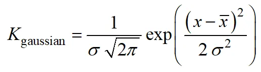

Podemos determinar la desviación estándar dependiendo del ancho de nuestra Ventana Deslizante o FWHM por:

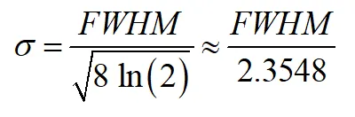

El suavizado por kernel se puede implementar fácilmente en Python utilizando el método rolling() de panda. Solo necesitamos definir el kernel que queremos usar como parámetro win_type. Aquí, podemos elegir entre las funciones de ventana de scipy. Según el kernel que elijamos, es posible que debamos pasar parámetros adicionales, como la desviación estándar del kernel gaussiano.

```python
std = fwhm2std(window_size)
smoothed_time_series = time_series.rolling(window=24, win_type="gaussian", center=True).mean(std=std))
```

Al observar los resultados de suavizado de la serie temporal de carga de electricidad, vemos resultados similares a los de la media móvil.


Efecto de suavizado de diferentes FWHM en un suavizado de kernel gaussiano.

Un ejemplo completo de este tipo de suavizado en Python, sería:

```python
import pandas as pd
import matplotlib.pyplot as plt
import seaborn

def fwhm2std(fwhm):
    return fwhm / np.sqrt(8 * np.log(2))

# Seaborn para tener estilos de gráficos más bonitos
seaborn.set()

# Cargamos el dataset
url = 'https://raw.githubusercontent.com/jbrownlee/Datasets/master/airline-passengers.csv'
df = pd.read_csv(url, parse_dates=['Month'], index_col='Month')

# Definimos el tamaño de la ventana y la convertimos a desviación estándar
window_size = 12
std = fwhm2std(window_size)

# Aplicamos el suavizado Gaussiano con una ventana de 12 meses
df['Gaussian_Smoothed'] = df['Passengers'].rolling(window=window_size, win_type="gaussian", center=True).mean(std=std)

# Graficamos los datos originales y los datos suavizados
df[['Passengers', 'Gaussian_Smoothed']].plot(figsize=(10,8))
plt.show()
```

Y el resultado será:

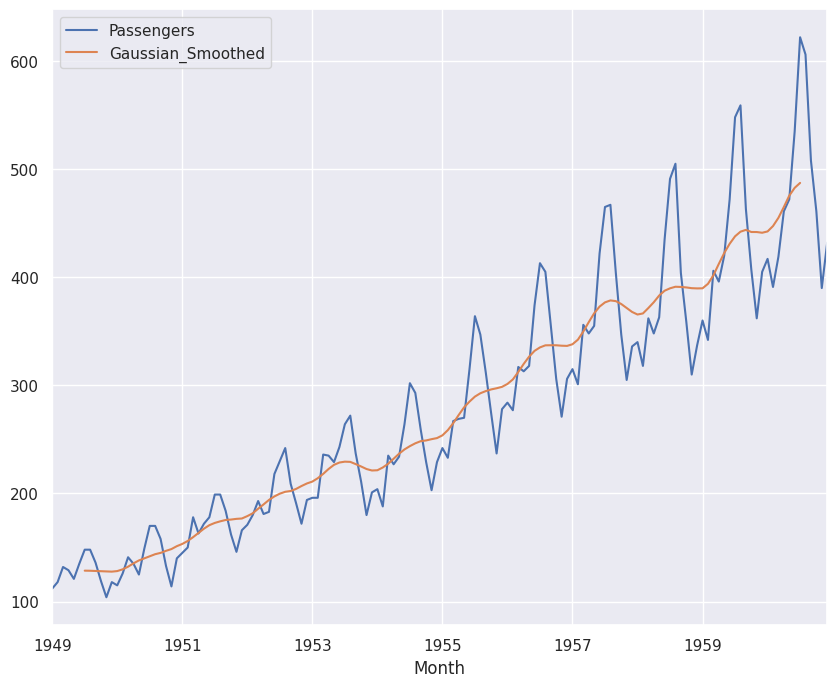

### **Suavizado exponencial (Exponential Smoothing)**

Como la Media Móvil y el Suavizado por Kernel no pueden capturar una no linealidad compleja y no pueden calcular valores al inicio y/o al final de la serie temporal, se desarrolló una alternativa llamada [Suavizado Exponencial](https://es.wikipedia.org/wiki/Suavizamiento_exponencial).

Aquí, todas las observaciones pasadas se ponderan en función de una función exponencialmente decreciente. Para esto, no se usa una ventana deslizante y los puntos de datos más recientes tienen un mayor peso que los más antiguos.

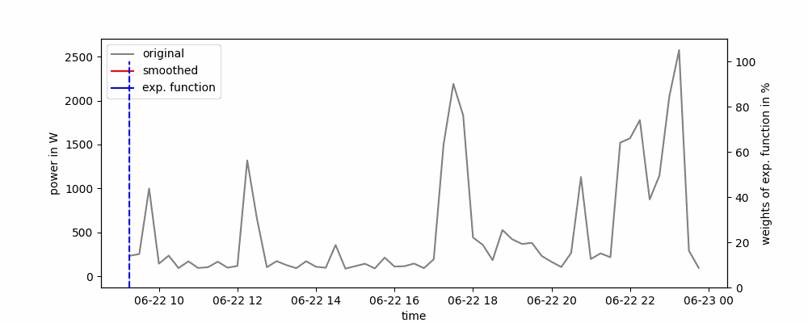

Animación del Suavizado Exponencial Simple.

Al igual que la media móvil y el suavizado de kernel, una parte desafiante del suavizado es elegir los factores de suavizado correctos y los hiperparámetros del modelo. Esto se puede hacer manualmente o mediante una optimización.

Podemos elegir entre tres tipos, que difieren en qué componentes de la serie temporal pueden manejar: Suavizado exponencial simple, doble y triple. A continuación, los tres tipos están ordenados por su complejidad, comenzando por el más simple.

**Suavizado exponencial simple (SES)**
El suavizado exponencial simple, se puede utilizar para series de tiempo estacionarias que no tienen una tendencia o estacionalidad.

El suavizado está controlado por un factor de suavizado *α*. El factor de suavizado puede variar entre 0 y 1 y controla la disminución exponencial de los pesos. Cuanto mayor sea el factor de suavizado, menor será el peso de los puntos de datos anteriores y, por lo tanto, menor será el suavizado.

El punto de datos suavizado está determinado por:

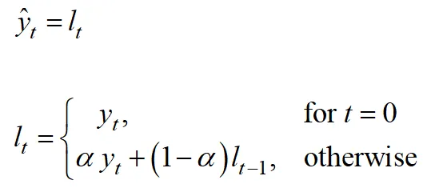

Podemos implementar el suavizado exponencial único en Python usando el paquete `statsmodel`. Para ello, importamos la clase `SimpleExpSmoothing` desde `statsmodels.tsa.api`.

Pasamos nuestra serie de tiempo a la clase y luego usamos el método fit() para suavizar la serie de tiempo en función de un nivel de suavizado determinado. Para ello, pasamos el *α* a `smoothing_level`. Luego podemos extraer la serie de tiempo suavizada usando `fittedvalues`.

```python
from statsmodels.tsa.api import SimpleExpSmoothing
smoother = SimpleExpSmoothing(time_series)
smoothed_time_series = smoother.fit(smoothing_level=0.5, optimized=False).fittedvalues
```

La clase también puede ayudarnos a encontrar un factor de suavizado óptimo *α*. Para esto, no le pasaremos un valor al parámetro `smoothing_level`. En su lugar, podemos elegir un [método de optimización](https://www.statsmodels.org/dev/generated/statsmodels.tsa.holtwinters.SimpleExpSmoothing.fit.html#statsmodels.tsa.holtwinters.SimpleExpSmoothing.fit).

```python
smoothed_time_series = smoother.fit(method="basinhopping").fittedvalues
```

Comparando diferentes factores de suavizado podemos ver que el suavizado tiene una disminución exponencial después de una fuerte disminución de la serie de tiempo original. Cuanto menor sea el factor de suavizado, más lenta será la descomposición.


Efecto de suavizado de diferentes factores de suavizado en un suavizado exponencial simple.

<aside>
💡 En el suavizado exponencial simple, las observaciones más recientes tienen un mayor impacto en el cálculo del promedio. Es útil cuando los datos no tienen una tendencia o estacionalidad fuertes.

</aside>

Un ejemplo completo en Python podría ser:

```python
import pandas as pd
import matplotlib.pyplot as plt
import seaborn
from statsmodels.tsa.api import SimpleExpSmoothing

# Seaborn para tener estilos de gráficos más bonitos
seaborn.set()

# Cargamos el dataset
url = 'https://raw.githubusercontent.com/jbrownlee/Datasets/master/airline-passengers.csv'
df = pd.read_csv(url, parse_dates=['Month'], index_col='Month')

# Aplicamos el suavizado exponencial simple
model = SimpleExpSmoothing(df['Passengers']).fit(smoothing_level=0.2)
df['SES_Smoothed'] = model.fittedvalues

# Graficamos los datos originales y los datos suavizados
df[['Passengers', 'SES_Smoothed']].plot(figsize=(10,8))
plt.show()
```

Y el resultado será:

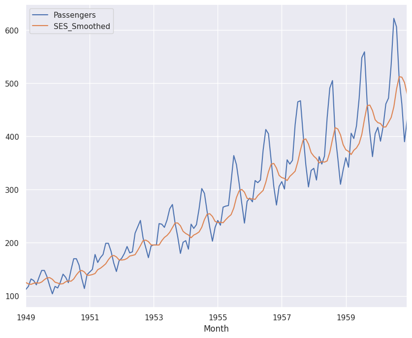

**Suavizado exponencial doble (DES)**
El suavizado exponencial doble extiende el suavizado exponencial simple repitiendo el suavizado. Esto permite capturar la tendencia de una serie temporal, pero no se captura la estacionalidad.

Para ello se añade otro factor de suavizado *β* que controla el suavizado de la tendencia. Similar a *α*, *β* puede variar entre 0 y 1 y controla la disminución exponencial de los pesos.

Como la tendencia puede ser aditiva (es decir, una tendencia lineal) o multiplicativa (es decir, una tendencia exponencial), el suavizado y su implementación en Python difieren ligeramente. Por lo tanto, antes de aplicar un suavizado exponencial doble, debemos identificar qué tipo de tendencia está presente en la serie de tiempo.

En el caso de una tendencia aditiva, el Suavizado Exponencial Doble se puede calcular mediante:

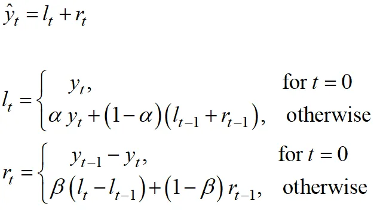

El suavizado exponencial doble para una tendencia aditiva se puede implementar en Python utilizando la clase Holt del paquete `statsmodels`. El uso es similar al suavizado exponencial simple. La única diferencia es que pasamos un factor de suavizado adicional.

donde l representa el nivel de la serie temporal y r representa la tendencia.

```python
from statsmodels.tsa.api import Holt
smoother = Holt(time_series)
smoothed_time_series = smoother.fit(smoothing_level=0.5, smoothing_trend=0.02, optimized=False).fittedvalues
```

De manera similar al suavizado exponencial único, también podemos usar `statsmodel` para encontrar valores de suavizado óptimos.

Si queremos suavizar una serie de tiempo con una tendencia multiplicativa, necesitamos usar la clase `ExponentialSmoothing`, que se describe en la siguiente sección cuando discutimos el triple suavizado exponencial.

Aunque no hay tendencia en la serie de tiempo de carga de electricidad, podemos ver el efecto del factor de suavizado *β*. Si el factor es cero, básicamente usamos un suavizado exponencial simple.

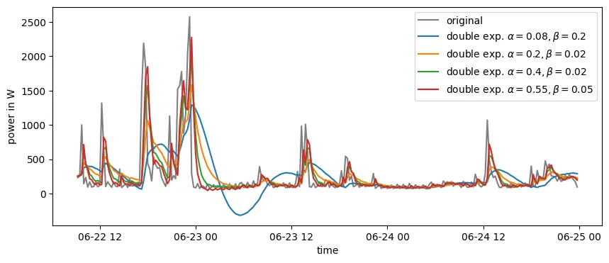

Efecto de suavizado de diferentes factores de suavizado en un Suavizado Exponencial Doble.

Un ejemplo completo en Python podría ser:

```python
import pandas as pd
import matplotlib.pyplot as plt
import seaborn
from statsmodels.tsa.api import Holt

# Seaborn para tener estilos de gráficos más bonitos
seaborn.set()

# Cargamos el dataset
url = 'https://raw.githubusercontent.com/jbrownlee/Datasets/master/airline-passengers.csv'
df = pd.read_csv(url, parse_dates=['Month'], index_col='Month')

# Aplicamos el suavizado exponencial doble
model = Holt(df['Passengers']).fit(smoothing_level=0.2, smoothing_trend=0.1)
df['Holt_Smoothed'] = model.fittedvalues

# Graficamos los datos originales y los datos suavizados
df[['Passengers', 'Holt_Smoothed']].plot(figsize=(10,8))
plt.show()
```

Y el resultado será:


<aside>
💡 El Suavizado exponencial doble extiende el suavizado exponencial simple para incluir la tendencia en los datos. Es útil cuando los datos tienen una tendencia pero no estacionalidad.

</aside>

**Suavizado exponencial triple (TES)**
El suavizado exponencial triple es el método de suavizado exponencial más sofisticado. El método puede capturar la tendencia y la estacionalidad de una serie temporal. El enfoque también se denomina Suavizado exponencial de Holt-Winters.

Para esto, se agrega otro factor de suavizado γ para capturar la estacionalidad. Similar a la tendencia, la estacionalidad puede ser aditiva o multiplicativa.

El suavizado exponencial triple se puede implementar en Python mediante el uso de la clase `ExponentialSmoothing` del paquete `statsmodel`. Aquí, agregamos el parámetro γ y también podemos indicar si la tendencia o estacionalidad será aditiva o multiplicativa.

```python
from statsmodels.tsa.api import ExponentialSmoothing
smoother = ExponentialSmoothing(time_series)
smoothed_time_series = smoother.fit(smoothing_level=0.5, smoothing_trend=0.02, smoothing_seasonal=0, trend="additive", seasonal="additive", optimized=False).fittedvalues
```

Si establecemos `smoothing_trend`  o `smoothing_seasonal` en cero, obtenemos un suavizado exponencial simple o doble.

Como no existe una tendencia o estacionalidad clara en la serie temporal de carga eléctrica, el efecto del factor de suavizado γ en este caso también es muy pequeño.


Efecto de suavizado de diferentes factores de suavizado en un suavizado exponencial triple.

Un ejemplo completo en Python podría ser:

```python
import pandas as pd
import matplotlib.pyplot as plt
import seaborn
from statsmodels.tsa.api import ExponentialSmoothing

# Seaborn para tener estilos de gráficos más bonitos
seaborn.set()

# Cargamos el dataset
url = 'https://raw.githubusercontent.com/jbrownlee/Datasets/master/airline-passengers.csv'
df = pd.read_csv(url, parse_dates=['Month'], index_col='Month')

# Crea el modelo de suavizado exponencial
smoother = ExponentialSmoothing(df['Passengers'], trend='add', seasonal='add', seasonal_periods=12)

# Ajusta el modelo con los parámetros de suavizado especificados
model = smoother.fit(smoothing_level=0.5, smoothing_trend=0.02, smoothing_seasonal=0.1, optimized=False)

# Agrega la serie suavizada al DataFrame
df['Holt_Winters_Smoothed'] = model.fittedvalues

# Graficamos los datos originales y los datos suavizados
df[['Passengers', 'Holt_Winters_Smoothed']].plot(figsize=(10,8))
plt.show()
```

Y el resultado será:

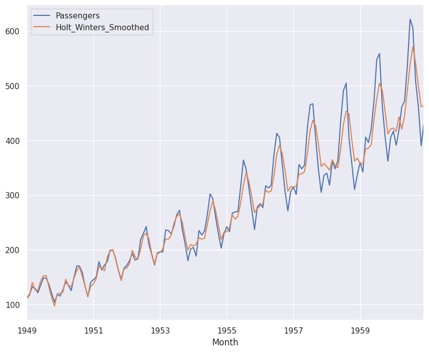

<aside>
💡 El suavizado exponencial triple extiende aún más el suavizado exponencial para incluir la estacionalidad en los datos. Es útil cuando los datos tienen tanto una tendencia como un componente estacional.

</aside>

**Resumen**
Para eliminar ciertas frecuencias o componentes de una serie de tiempo para obtener una vista de la estructura subyacente, podemos elegir entre diferentes enfoques de suavizado.

En los casos donde tenemos tendencia o estacionalidad, debemos elegir un enfoque de suavizado diferente. Además de elegir el enfoque correcto, también debemos tener mucho cuidado al elegir los factores de suavizado. Si los elegimos demasiado pequeños, podríamos suavizar demasiado la serie temporal y, por lo tanto, suavizar la estructura subyacente. Si elegimos los factores demasiado grandes, es posible que suavicemos la serie temporal y, por lo tanto, no obtengamos una buena visión de la estructura subyacente.

Sin embargo, implementar los diferentes enfoques es sencillo, por lo que podemos probar fácilmente el efecto de diferentes enfoques de suavizado y factores de suavizado para encontrar la combinación más adecuada.

## Operaciones con datos de texto (*tokenización*)

La tokenización es una tarea común con la que se encuentra un científico de datos cuando trabaja con datos de texto. Consiste en dividir un texto completo en pequeñas unidades, también conocidas como tokens. La mayoría de los proyectos de procesamiento de lenguaje natural (NLP) tienen tokenización como primer paso porque es la base para desarrollar buenos modelos y ayuda a comprender mejor el texto que tenemos.

Aunque la tokenización en Python podría ser tan simple como escribir .split(), ese método podría no ser el más eficiente en algunos proyectos. Por eso, veremos diferentes formas que nos ayudarán a tokenizar textos pequeños, un corpus grande o incluso texto escrito en un idioma diferente al inglés.

### Tokenización simple con .split

Como mencionamos antes, este es el método más simple para realizar la tokenización en Python. Si escribe .split(), el texto se separará en cada espacio en blanco.

Para este y los siguientes ejemplos, utilizaremos un texto narrado por Steve Jobs en el comercial de Apple “Think Different”.

```python
text = """Here’s to the crazy ones, the misfits, the rebels, the troublemakers, the round pegs in the square holes. The ones who see things differently — they’re not fond of rules. You can quote them, disagree with them, glorify or vilify them, but the only thing you can’t do is ignore them because they change things. They push the human race forward, and while some may see them as the crazy ones, we see genius, because the ones who are crazy enough to think that they can change the world, are the ones who do."""
text.split()
```

Si escribimos el código anterior, obtendremos el siguiente resultado.

```python
['Here’s', 'to', 'the', 'crazy', 'ones,', 'the', 'misfits,', 'the', 'rebels,', 'the', 
'troublemakers,', 'the', 'round', 'pegs', 'in', 'the', 'square', 'holes.', 'The', 
'ones', 'who', 'see', 'things', 'differently', '—', 'they’re', 'not', 'fond', 'of', 
'rules.', 'You', 'can', 'quote', 'them,', 'disagree', 'with', 'them,', 'glorify', 'or', 
'vilify', 'them,', 'but', 'the', 'only', 'thing', 'you', 'can’t', 'do', 'is', 'ignore', 
'them', 'because', 'they', 'change', 'things.', 'They', 'push', 'the', 'human', 'race', 
'forward,', 'and', 'while', 'some', 'may', 'see', 'them', 'as', 'the', 'crazy', 'ones,', 
'we', 'see', 'genius,', 'because', 'the', 'ones', 'who', 'are', 'crazy', 'enough', 'to', 
'think', 'that', 'they', 'can', 'change', 'the', 'world,', 'are', 'the', 'ones', 'who', 
'do.']
```

Como podemos ver arriba, el método split() no considera los símbolos de puntuación como un token separado. Esto podría cambiar los resultados de su proyecto.

### Tokenización simple con expresiones regulares

La tokenización utilizando expresiones regulares en Python puede realizarse con el módulo **`re`**. Este método es altamente flexible ya que podemos definir una expresión regular propia para dividir el texto. Aquí vemos un ejemplo simple de cómo hacerlo:

```python
import re

# Definimos el texto
text = "Aquí tenemos, un ejemplo de texto para tokenizar. ¡Esto incluye varias oraciones, algunas puntuaciones y palabras!"

# Usamos la función findall() de re para encontrar todas las palabras y caracteres de puntuación
tokens = re.findall(r'\b\w+\b|[\.\,\!\¡\¿\?]', text)

print(tokens)
```

El resultado será:

```python
['Aquí', 'tenemos', ',', 'un', 'ejemplo', 'de', 'texto', 'para', 'tokenizar', '.', '¡', 'Esto', 'incluye', 'varias', 'oraciones', ',', 'algunas', 'puntuaciones', 'y', 'palabras', '!']
```

En este caso, la función **`re.findall(r'\b\w+\b|[\.\,\!\¡\?]', text)`** busca todas las secuencias de caracteres alfanuméricos delimitadas por bordes de palabra (es decir, las palabras) y los caracteres de puntuación especificados (. , ! ¡ ?). El resultado es una lista de palabras y caracteres de puntuación como tokens separados.

### **Tokenization con NLTK**

NLTK significa Kit de herramientas de lenguaje natural. Este es un conjunto de bibliotecas y programas para el procesamiento estadístico del lenguaje natural escrito en Python.

NLTK contiene un módulo llamado `tokenize` con un método `word_tokenize()` que nos ayudará a dividir un texto en tokens. Una vez que haya instalado NLTK, escribir el siguiente código para tokenizar el texto.

```python
from nltk.tokenize import word_tokenize
word_tokenize(text)
```

En este caso, la salida predeterminada es ligeramente diferente del método .split que se muestra arriba.

```python
['Here', '’', 's', 'to', 'the', 'crazy', 'ones', ',', 'the', 'misfits', ',', 'the', 'rebels', ',', 'the', 'troublemakers', ',', 
...]
```

En este caso, el apóstrofe (') en "Here’s" y la coma (,) en "ones" se consideraron como tokens.

Para tokenizar en otros idiomas, por ejemplo español, podemos hacer:

```python
import nltk
from nltk.tokenize import word_tokenize

nltk.download('punkt')

text = "Aquí está una frase en español."
tokens = word_tokenize(text, language='spanish')
print(tokens)
```

En este caso, **`word_tokenize`** utilizará el modelo de tokenización de Punkt para el español.

Otra opción es usar la biblioteca **`spaCy`**, que proporciona modelos de tokenización específicos para varios idiomas, incluyendo inglés, alemán, francés, español, portugués, italiano, holandés y otros.

### Count Vectorizer (sklearn)

Convierta un corpus en un vector con `CountVectorizer` (sklearn): Los métodos anteriores se vuelven menos útiles cuando se trata de un corpus grande porque necesitará representar los tokens de manera diferente. `CountVectorizer` nos ayudará a convertir una colección de documentos de texto en un vector de conteo de tokens. Al final, obtendremos una representación vectorial de los datos de texto.

Para este ejemplo, agregaremos una cita de Bill Gates al texto anterior para construir un marco de datos que será un ejemplo de un corpus.

```python
import pandas as pd
texts = [
"""Here’s to the crazy ones, the misfits, the rebels, the troublemakers, the round pegs in the square holes. The ones who see things differently — they’re not fond of rules. You can quote them, disagree with them, glorify or vilify them, but the only thing you can’t do is ignore them because they change things. They push the human race forward, and while some may see them as the crazy ones, we see genius, because the ones who are crazy enough to think that they can change the world, are the ones who do.""" ,
 
'I choose a lazy person to do a hard job. Because a lazy person will find an easy way to do it.'
]
df = pd.DataFrame({'author': ['jobs', 'gates'], 'text':texts})
```

Ahora usaremos `CountVectorizer` para transformar estos textos en un vector de conteo de tokens.

```python
from sklearn.feature_extraction.text import CountVectorizer

# Crea un objeto CountVectorizer
vectorizer = CountVectorizer()

# Aprende el vocabulario de los textos y transforma los textos en una matriz de recuentos de tokens
X = vectorizer.fit_transform(df['text'])

# Para ver las características (tokens) que se han extraído de los textos, puedes usar vocabulary_
print(vectorizer.vocabulary_)

# Para ver la matriz de recuentos de tokens, puedes convertir X a una matriz dense y luego a un DataFrame
# Usa sorted(vectorizer.vocabulary_) para obtener los tokens ordenados alfabéticamente
df_tokens = pd.DataFrame(X.toarray(), columns=sorted(vectorizer.vocabulary_))

df_tokens
```

Si ejecuta ese código, obtendrá un marco que cuenta la cantidad de veces que se menciona una palabra en ambos textos.


Esto se vuelve extremadamente útil cuando el marco de datos contiene un gran corpus porque proporciona una matriz con palabras codificadas como valores enteros, que se utilizan como entradas en los algoritmos de aprendizaje automático.

`CountVectorizer` puede tener diferentes parámetros como stop_words que definimos anteriormente. Sin embargo, tengamos en cuenta que la expresión regular predeterminada utilizada por `CountVectorizer` selecciona tokens de 2 o más caracteres alfanuméricos (la puntuación se ignora por completo y siempre se trata como un separador de token)

### Tokenización de texto en diferentes idiomas con [spaCy](https://spacy.io/)

Cuando necesitemos tokenizar texto escrito en un idioma que no sea inglés, puede usar [spaCy](https://spacy.io/). Esta es una biblioteca para procesamiento avanzado de lenguaje natural, escrita en Python y Cython, que admite tokenización para más de 65 idiomas.

Vamos a tokenizar el mismo texto de Steve Jobs pero ahora traducido al español.

```python
from spacy.lang.es import Spanish
nlp = Spanish()

text_spanish = """Por los locos. Los marginados. Los rebeldes. Los problematicos. 
Los inadaptados. Los que ven las cosas de una manera distinta. A los que no les gustan
las reglas. Y a los que no respetan el “status quo”. Puedes citarlos, discrepar de ellos,
ensalzarlos o vilipendiarlos. Pero lo que no puedes hacer es ignorarlos… Porque ellos
cambian las cosas, empujan hacia adelante la raza humana y, aunque algunos puedan
considerarlos locos, nosotros vemos en ellos a genios. Porque las personas que están
lo bastante locas como para creer que pueden cambiar el mundo, son las que lo logran."""

doc = nlp(text_spanish)

tokens = [token.text for token in doc]

print(tokens)
```

En este caso, importamos español de [`spacy.lang.es`](http://spacy.lang.es/) pero si está trabajando con texto en inglés, simplemente importe inglés de `spacy.lang.en`. Se puede consultar la lista de idiomas disponibles [aquí](https://spacy.io/usage/models). Si ejecutamos este código, obtendremos el siguiente resultado:

```python
['Por', 'los', 'locos', '.', 'Los', 'marginados', '.', 'Los', 'rebeldes', '.', 'Los', 'problematicos', '.', '\n', 'Los', 'inadaptados', '.', 'Los', 'que', 'ven', 'las', 'cosas', 'de', 'una', 'manera', 'distinta', '.', 'A', 'los', 'que', 'no', 'les', 'gustan', '\n', 'las', 'reglas', '.', 'Y', 'a', 'los', 'que', 'no', 'respetan', 'el', '“', 'status', 'quo', '”', '.', 'Puedes', 'citarlos', ',', 'discrepar', 'de', 'ellos', ',', '\n', 'ensalzarlos', 'o', 'vilipendiarlos', '.', 'Pero', 'lo', 'que', 'no', 'puedes', 'hacer', 'es', 'ignorarlos', '…', 'Porque', 'ellos', '\n', 'cambian', 'las', 'cosas', ',', 'empujan', 'hacia', 'adelante', 'la', 'raza', 'humana', 'y', ',', 'aunque', 'algunos', 'puedan', '\n', 'considerarlos', 'locos', ',', 'nosotros', 'vemos', 'en', 'ellos', 'a', 'genios', '.', 'Porque', 'las', 'personas', 'que', 'están', '\n', 'lo', 'bastante', 'locas', 'como', 'para', 'creer', 'que', 'pueden', 'cambiar', 'el', 'mundo', ',', 'son', 'las', 'que', 'lo', 'logran', '.']
```

Como podemos ver, spaCy considera los símbolos de puntuación como un token separado (incluso se incluyeron las nuevas líneas\n).

Pero, ¿por qué necesitamos un tokenizador para cada idioma?

Aunque para idiomas como el español y el inglés, la tokenización será tan simple como separar por espacios en blanco, para otros idiomas como el chino y el japonés, la ortografía podría no tener espacios para delimitar "palabras" o "tokens". En tales casos, una biblioteca como spaCy será útil. [Aquí puede consultar más sobre la importancia de la tokenización en diferentes idiomas.](https://stackoverflow.com/questions/17314506/why-do-i-need-a-tokenizer-for-each-language)

### Tokenización con Gensim

Gensim es una biblioteca para modelado de temas no supervisados y procesamiento de lenguaje natural y también contiene un tokenizador. Una vez que instalemos Gensim, tokenizar el texto será tan simple como escribir el siguiente código.

```python
from gensim.utils import tokenize
list(tokenize(text))
```

El resultado de este código es este:

```python
['Here', 's', 'to', 'the', 'crazy', 'ones', 'the', 'misfits', 'the', 'rebels', 'the', 'troublemakers', 'the', 'round', 'pegs', 'in', 'the', 'square', 'holes', 'The', 'ones', 'who', 'see', 'things', 'differently', 'they', 're', 'not', 'fond', 'of', 'rules', 'You', 'can', 'quote', 'them', 'disagree', 'with', 'them', 'glorify', 'or', 'vilify', 'them', 'but', 'the', 'only', 'thing', 'you', 'can', 't', 'do', 'is', 'ignore', 'them', 'because', 'they', 'change', 'things', 'They', 'push', 'the', 'human', 'race', 'forward', 'and', 'while', 'some', 'may', 'see', 'them', 'as', 'the', 'crazy', 'ones', 'we', 'see', 'genius', 'because', 'the', 'ones', 'who', 'are', 'crazy', 'enough', 'to', 'think', 'that', 'they', 'can', 'change', 'the', 'world', 'are', 'the', 'ones', 'who', 'do']
```

Como se puede ver, Gensim separa cada vez que encuentra con un símbolo de puntuación, por ejemplo: Here, s, can, t

### Tokenización de oraciones (Sentence Tokenization)

La tokenización de oraciones, como la que se realiza con **`sent_tokenize`** de NLTK, se utiliza a menudo como un paso de preprocesamiento en diversas tareas de Procesamiento del Lenguaje Natural (NLP). Algunas aplicaciones incluyen:

- **Análisis de sentimientos**: En este contexto, podrías querer dividir un texto en oraciones para analizar los sentimientos de cada oración por separado. Por ejemplo, en una crítica de película, una oración puede expresar un sentimiento positivo ("La actuación fue excelente") y la siguiente puede expresar un sentimiento negativo ("La trama era predecible").
- **Traducción automática**: Los sistemas de traducción automática a menudo traducen textos oración por oración, ya que las oraciones suelen ser unidades de significado independientes.
- **Resumen automático**: Algunos algoritmos de resumen automático de textos operan a nivel de oraciones. Por ejemplo, el algoritmo puede seleccionar un subconjunto de oraciones del texto original que cubran la mayor parte del contenido.
- **Extracción de información**: La extracción de entidades nombradas, las relaciones entre entidades y los eventos a menudo se realiza a nivel de oraciones.
- **Límite de tokens en los LLM**: Los grandes modelos de lenguaje (LLM) como BERT, GPT-3, GPT-4, etc., tienen un límite en la longitud máxima de tokens que aceptan como prompt de entrada. Si tenemos un texto que es más largo que este límite, necesitaremos dividirlo en pedazos más pequeños para poder pasar cada pedazo (chunk) al modelo.

Aquí vemos un ejemplo de uso de `sent_tokenize`:

```python
import requests
from nltk.tokenize import sent_tokenize
import nltk

# Se requiere el paquete punkt para que funcione el ejemplo
nltk.download('punkt')

# Descarga el archivo de texto
url = 'https://raw.githubusercontent.com/hwchase17/chat-your-data/master/state_of_the_union.txt'
response = requests.get(url)
text = response.text

# Tokeniza el texto en oraciones
sent_tokens = sent_tokenize(text)

# Imprime los tokens
print("Sentence Tokens:", sent_tokens[:5])  # Imprime las primeras 5 oraciones tokenizadas
```

Y el resultado es:

```
Sentence Tokens: ['Madam Speaker, Madam Vice President, our First Lady and Second Gentleman.', 'Members of Congress and the Cabinet.', 'Justices of the Supreme Court.', 'My fellow Americans.', 'Last year COVID-19 kept us apart.']
```