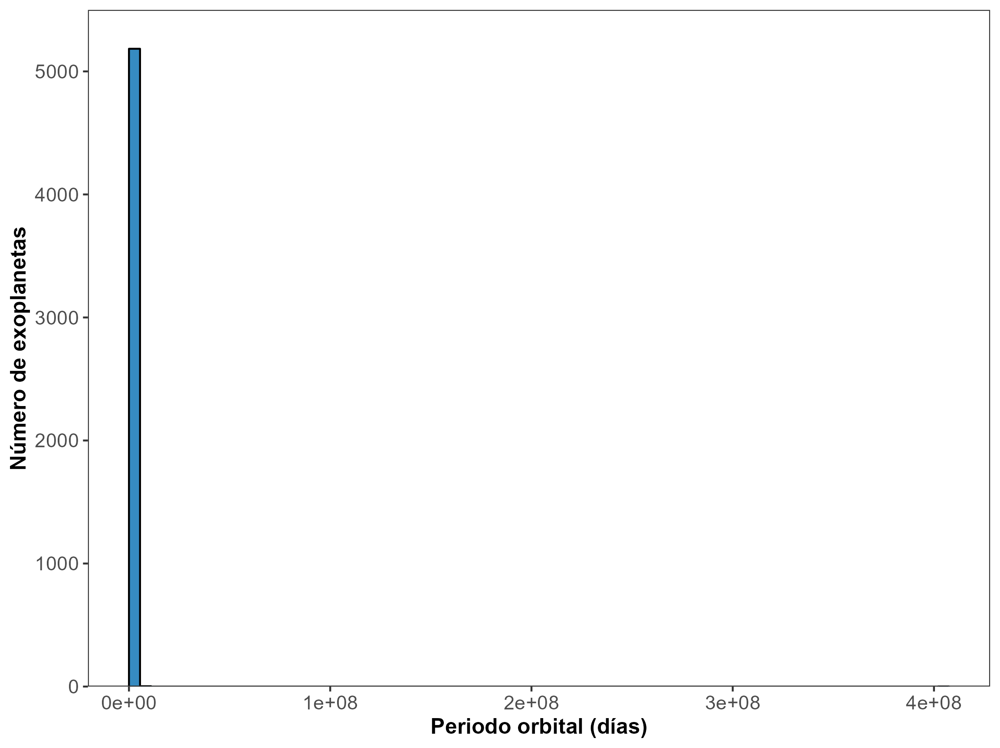

# Unidad 5 - Transformación de datos

```{admonition} 📂 Descargar archivos  
[Descargar los archivos para la práctica desde el Campus Virtual](https://campusv.fceia.unr.edu.ar/course/view.php?id=471)
```

**Ejercicio N° 1**

Los **exoplanetas o planetas extrasolares** son planetas que orbitan alrededor de otras estrellas que se encuentran más allá de nuestro sistema solar. El dataset `exoplanets.csv` , extraído del [**Archivo de Exoplanetas de la NASA**](https://exoplanetarchive.ipac.caltech.edu/cgi-bin/TblView/nph-tblView?app=ExoTbls&config=PSCompPars), registra los descubrimientos de exoplanetas que han sido reportados a la fecha en publicaciones científicas revisadas por pares y confirmados utilizando varios métodos de detección y/o técnicas analíticas.

1. El **periodo orbital** de un exoplaneta (`pl_orbper`) es el tiempo que tarda dicho planeta en dar una vuelta completa alrededor de la estrella que orbita (en días terrestres). 
    
    a) Realice una descripción general de dicha variable que incluya tipo de variable, valores mínimo y máximo que toma y presencia de datos faltantes. 
    
    b) Un astrónomo se propone estudiar la distribución del periodo orbital de los exoplanetas descubiertos hasta la fecha y decide, en primera instancia, representar todos los registros a través de un histograma. Utilizando los valores observados de la variable de interés y unas pocas líneas de código obtiene el siguiente gráfico:
    



**i.** ¿Considera que el gráfico anterior es representativo de la distribución real de la variable bajo estudio? ¿Qué podría hacer para mejorarlo?

**ii.** Teniendo en cuenta su respuesta a la pregunta del ítem anterior, realice un histograma para representar la distribución de la variable **introduciendo las modificaciones que considere adecuadas**. ¿Qué puede decir acerca de la distribución del periodo orbital de los exoplanetas descubiertos?

**iii.** Represente el periodo orbital de nuestro planeta en el gráfico realizado en el ítem anterior y calcule el porcentaje de exoplanetas que poseen años más extensos que el año terrestre.

1. Construya un gráfico que permita visualizar la distribución del número de planetas extrasolares encontrados según año y método de descubrimiento, **en el que la variable temporal se encuentre categorizada en lustros** (periodos de 5 años). Comente brevemente lo observado.
2. Tomando en cuenta únicamente los exoplanetas descubiertos mediante las técnicas de velocidad radial, tránsito y detección directa, construya un gráfico que le permita visualizar, en forma conjunta, el periodo orbital y la masa (`pl_bmasse`) de los planetas según el método a través del cual se detectaron. ¿Encuentra alguna diferencia en las características de los exoplanetas descubiertos por las distintas técnicas?
3. Johannes Kepler fue un astrónomo y matemático alemán cuya principal contribución científica fue el descubrimiento las leyes que rigen el movimiento de los planetas. Según la Tercera Ley de Kepler del movimiento planetario, el cubo de la distancia media de un planeta a la estrella que éste orbita (D, o semi-eje mayor de la órbita, que equivale a la mitad de la suma de la distancia más grande y la más pequeña a la estrella) es directamente proporcional al cuadrado de su periodo orbital (P):

$$D^3 = kP^2$$
    
Realizando las transformaciones que considere necesarias sobre las variables, verifique gráficamente el cumplimiento de dicha ley para los planetas extrasolares.
    

**Ejercicio N° 2**

El dataset `data_variables.xlsx` contiene 2500 observaciones de 5 variables cuantitativas `X1` , `X2` , `X3` , `X4` y `X5`.

1. Represente las distribuciones de las variables del dataset en un único gráfico y describa brevemente las características gráficas de cada una de ellas.
2. En función a la respuesta al ítem anterior, ¿qué medidas de posición y dispersión le parecen más adecuadas para describir a cada uno de estos conjuntos de datos?
3. Realice el escalado de este grupo de variables a través de cada una de las técnicas presentadas en clases (**Z-Score, escalado min-max, escalado máximo absoluto y escalado robusto**). En cada caso, represente gráficamente las variables transformadas y comente brevemente lo observado.

**Ejercicio N° 3**

El archivo `202207_PAX15min-ABC.csv` contiene información sobre la cantidad de pasajeros por molinete y por estación en rangos de a 15 minutos de las líneas A, B y C de la red de Subtes de la Ciudad Autónoma de Buenos Aires (CABA). 

1. Realice el *binning* de la variable que corresponde a la hora inicial del intervalo de 15 minutos (columna `DESDE`) en los siguientes periodos a lo largo del día: de 5-9 hs., 9.15-12 hs., 12.15-15 hs., 15.15 - 18 hs., 18.15-21 hs., 21.15 -24 hs. Luego, represente gráficamente el total de pasajeros para cada día en cada rango horario y para cada una de las líneas de subte (un gráfico para cada línea de subte por separado). 
¿Hay algún rango horario en el que, en general, se observen más pasajeros respecto de otros rangos? ¿Presentan un comportamiento similar las 3 líneas de subte respecto a la cantidad total de pasajeros en cada rango horario?
2. Para cada línea, analice si los datos muestran alguna diferencia respecto de la cantidad total de pasajeros por rango horario entre días de semana (lunes a viernes) y fines de semana (sábado y domingo). Para ello, puede utilizar `weekday()` de la librería `datetime` , que indica los días de la semana con un número entero (*0 para lunes y 6 para domingo, por ejemplo).*
3. Finalmente, consideraremos períodos de tiempo semanales sólo teniendo en cuenta los días hábiles:
    
    Semana 1: 4 al 8 Julio 2022
    
    Semana 2: 11 al 15 Julio 2022
    
    Semana 3: 18 al 22 Julio 2022
    
    Semana 4: 25 al 29 Julio 2022
    
    Teniendo en cuenta que las semanas 3 y 4 corresponden a las semanas de vacaciones de invierno en CABA, ¿se observa alguna diferencia en la cantidad de pasajeros totales en los distintos rangos horarios en cada línea para estas semanas respecto a las 2 primeras? 
    

**Ejercicio N° 4**

En este ejercicio exploraremos  la serie de tiempo de llegada de totales a la Argentina para un período de 20 años  `llegadas_turistas.csv` , y  otra serie con las variaciones de salidas ****de turistas para un período menor  `var_salidas.csv` .

1. Grafique ambas series de tiempo.
2. Aplique dos métodos de suavizado simple para cada serie y grafique cada serie con sus dos suavizados correspondientes. 
3. Según lo explicado en clase, ¿qué tipo de suavizado recomendaría para modelizar cada serie? ¿Por qué?
4. Según su respuesta anterior genere los suavizados que considere pertinentes.
5. Escriba un diagnóstico de la dinámica de turismo de nuestro país en los períodos estudiados, desarrollando las características que puede describir el fenómeno, apoyándose en los métodos utilizados en los puntos anteriores. 

**Ejercicio N° 5**

Una empresa quiere evaluar la respuesta de los clientes al lanzamiento de un nuevo producto. Para ello, ha recopilado comentarios de diferentes redes sociales que fueron guardados en el archivo `comentarios.txt`. Utilizando la función `word_tokenize()` de `nltk.tokenize` y el módulo `SentimentIntensityAnalyzer` de `nltk.sentiment`, analice el sentimiento de cada comentario. Obtenga un sentimiento general promedio para definir si los usuarios del producto respondieron positiva o negativamente a su lanzamiento. 

(***Nota:** un valor negativo indica una tendencia hacia sentimientos negativos en general, mientras que un valor positivo indicaría una tendencia hacia sentimientos positivos. Cuanto más cercano a 0 sea el valor de sentimiento promedio, más neutral o equilibrada sería la tendencia de los sentimientos expresados en los comentarios*).
