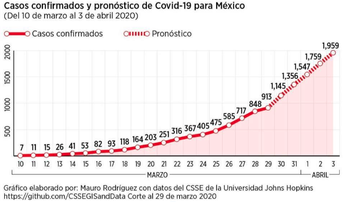

# Unidad 6 - Ajustes y Modelos

Los modelos se utilizan para representar fenómenos de la realidad que queremos estudiar/entender. Al realizar una abstracción del fenómeno en un modelo, nos es más simple ver relaciones entre las diferentes partes del mismo que si miramos al fenómeno en todo su contexto puesto que muchas veces ese contexto genera ruido y no tiene que ver con el fenómeno en sí. Algunos ejemplos de modelos pueden ser:

- Modelo de predicción de selección modal de una persona en base a sus atributos.
- Modelo de abandono de la universidad en base a los atributos de la persona y desempeño durante el primer semestre
- Predicción de casos de Covid



- Modelo de Gaudí para diseñar arcos

Incluso. probablemente, ya hayan estado usando modelos en alguna otra clase de la carrera, como por ejemplo en Cálculo. El ejemplo de abajo lo copiamos del libro “Cálculo de una Variable” de J. Stewart


Probablemente, antes de obtener el modelo para T que se muestra arriba, la situación era como la imagen de abajo, mediciones de temperatura del aire a diferentes alturas sobre el nivel del suelo. Luego, se realizó un modelo lineal para predecir la temperatura del aire, variable dependiente, en función de la altura con respecto al suelo, variable independiente.


En este capítulo vamos a ver uno de los modelos más básicos de estadística, pero no menos importante, el modelo de regresión lineal. 

# Regresión Lineal

Supongamos que tenemos dos variables, x e y, que presentan una relación lineal visible entre ellas. Si queremos modelar el fenómeno de la imagen de abajo, podríamos usar una recta como vemos en la imagen de abajo.


Pero cómo sabemos si una recta es mejor que otra? 

## Método de los mínimos cuadrados

Para realizar el ajuste del modelo, en este caso una recta, a los datos vamos a utilizar un método llamado “mínimos cuadrados”. El objetivo del mismo es encontrar la recta que produzca el menor error general.


El procedimiento para calcular el error general de una recta es el siguiente:

1. Tomamos una de las rectas candidatas a ser elegidas
2. Calculamos el error que hay entre el valor medido/real y el valor del modelo/estimado, al cuál llamamos residuo
3. Elevamos esta diferencia/error al cuadrado
4. Obtenemos el error total sumando los errores cuadrados para cada punto

$$
L = (\hat{y}_1 - (a + b x_1))^2 + (\hat{y}_2 - (a + b x_2))^2 + ... + (\hat{y}_n - (a + b x_n))^2
$$


Entonces, en nuestro caso, probaríamos con diferentes rectas y calcularíamos el error general que cada una produce. 


En nuestro ejemplo, vemos que a medida que rotamos la recta en sentido horario, el error disminuya hasta un punto y luego vuelve a aumentar. Lo que estamos observando es que el error comienza a disminuir a medida que la pendiente aumenta, hasta cierto punto, donde alcanzamos un error mínimo. A partir de este punto el error vuelve a aumentar.  


Esto nos indica que estamos frente a un problema de optimización. Si consiguiéramos la ecuación de la parábola que estamos viendo arriba, podríamos buscar el mínimo de la misma usando la primer derivada. Resulta que esa ecuación si la conocemos y es la que vimos más arriba:

$$
L = (\hat{y}_1 - (a + b x_1))^2 + (\hat{y}_2 - (a + b x_2))^2 + ... + (\hat{y}_n - (a + b x_n))^2
$$

La cuál podemos rescribir como:

$$
L = \sum_{i = 1}^{n}[y_i - (a + bx_i)]^2
$$

Entonces, para obtener los valores de a y b solo debemos realizar las correspondientes derivadas parciales:³

$$
\frac{\partial L}{\partial b} = \sum_{i = 1}^{n}(-2) x_i[y_i - (a + bx_i)] = 0
$$

$$
\frac{\partial L}{\partial a} = \sum_{i = 1}^{n}(-2)[y_i - (a + bx_i)] = 0
$$

Si despejamos la ecuaciones anteriores obtenemos los siguientes valores para a y b:

$$
b = \frac{n\sum_{i = 1}^{n}{x_i y_i} - (\sum_{i = 1}^{n}{x_i})(\sum_{i = 1}^{n}{y_i})}{n(\sum_{i = 1}^{n}{x_i^2})-(\sum_{i = 1}^{n}{x_i})^2}
$$

$$
a = \frac{\sum_{i = 1}^{n}{y_i} - b\sum_{i = 1}^{n}{x_i}}{n} = \bar{y} - b\bar{x}
$$

Donde:

$\bar{y_i}$ = media de los valores de y

$\bar{x_i}$ = media de los valores de x

### Interpretación de los coeficientes

El término “a” es la ordenada al origen y nos indica el valor de la variable dependiente cuando la independiente es 0

El término “b” es la pendiente de la recta y nos indica cómo es la variación de la variable dependiente con respecto a la independiente


## Ejemplo

Ir a la notebook que preparamos sobre el tema

## Residuos

El residuo es la diferencia entre el valor medido de la variable dependiente, y, el valor estimado por nuestro modelo. La suma de residuos fue el valor que minimizamos para obtener la mejor recta que representaba a nuestros datos. 

$$
Y = \hat{Y} + Residuos
$$

Estudiar los residuos es muy importante para verificar si un modelo lineal es el adecuado para nuestros datos. Cuando graficamos los residuos para los diferentes valores de la variable independiente, x, los mismos deben presentar una distribución aleatoria como en la figura de abajo (1) a la izquierda. Sin embargo, si los residuos se distribuyen de alguna forma en particular, como la parábola de la imagen de la derecha, entonces el modelo no es el adecuado. En este último caso, lo que sucede es que para valores bajos y altos de la variable independiente, el modelo subestima a la variable dependiente, mientras que para los valores intermedios el modelo sobrestima a la variable dependiente. Al ver el gráfico de residuos concluimos que el modelo debe ser revisado.


Variables Categóricas

Las variables categóricas también pueden ser incluidas como variables explicativas en la regresión lineal. Algunos ejemplos pueden ser:

- Género de la persona (Femenino-Masculino)
- Barrio de la propiedad (Martin - La Sexta - Centro)
- Tiene pileta? (Tiene - No tiene)

Cuando usamos variables categóricas no se incluyen todas las categorías sino, n-1, puesto que con esa cantidad, ya estamos representando todas las opciones posibles. Por ejemplo:

Género:

- Femenino:
    - 0 - No
    - 1 - Sí

Barrio:

- Martin:
    - 0 - No
    - 1 - Sí
- La Sexta:
    - 0 - No
    - 1 - Sí

Tiene pileta:

- Tiene:
    - 0 - No
    - 1 - Sí
    
    
    

Entonces, las ecuaciones con los diferentes casos se ven de esta forma:


# Suavizado y Splines

## Suavizado

El material de esta sección fue extraído de: [http://rafalab.dfci.harvard.edu/dsbook/smoothing.html](http://rafalab.dfci.harvard.edu/dsbook/smoothing.html)

El suavizado es una técnica muy poderosa utilizada en todo el análisis de datos. Otro nombre dado a esta técnica es ajuste de curva. Está diseñado para detectar tendencias en presencia de datos ruidosos en casos en los que la forma de la tendencia es desconocida. El nombre de suavizado proviene del hecho de que, para lograr este objetivo, asumimos que la tendencia es suave, como en una superficie suave. En contraste, el ruido o desviación de la tendencia es impredeciblemente irregular:


Para explicar estos conceptos, nos centraremos primero en un problema con solo un predictor. Específicamente, intentamos estimar la tendencia temporal en el margen de la encuesta de voto popular de EE.UU. en 2008 (diferencia entre Obama y McCain).

Para los fines de este ejemplo, no lo consideremos como un problema de pronóstico. En cambio, simplemente estamos interesados en aprender la forma de la tendencia después de que las elecciones hayan terminado.

Suponemos que para cualquier día dado x, hay una preferencia real entre el electorado $f(x)$, pero debido a la incertidumbre introducida por las encuestas, cada punto de datos viene con un error $\epsilon$. Un modelo matemático para el margen de encuesta observado $Y_i$ es:

$$
Y_i = f(x_i) + \epsilon_i
$$

Consideremos que queremos predecir Y para un día x. Si supiéramos la probabilidad condicional $f(x) = E(Y| X = x)$, la usaríamos. Pero dado que no conocemos esta expectativa condicional, tenemos que estimarla. Utilicemos regresión, ya que es el método que hemos aprendido hasta ahora.


La línea que vemos no parece describir muy bien la tendencia. Por ejemplo, el 4 de septiembre (día -62) se llevó a cabo la Convención Republicana y los datos sugieren que le dio un impulso a John McCain en las encuestas. Sin embargo, la línea de regresión no captura esta posible tendencia. Para ver la falta de ajuste con mayor claridad, observamos que los puntos por encima de la línea ajustada (azul) y los puntos por debajo (rojo) no están distribuidos de manera uniforme a lo largo de los días. Por lo tanto, necesitamos un enfoque alternativo y más flexible.

### Suavizado por segmentos

La idea general del suavizado es agrupar los puntos de datos en estratos en los cuales se puede suponer que el valor de $f(x)$ es constante. Podemos hacer esta suposición porque pensamos que  $f(x)$ cambia lentamente y, como resultado, $f(x)$ es casi constante en pequeñas ventanas de tiempo. Un ejemplo de esta idea para los datos de encuesta_2008 es asumir que la opinión pública se mantuvo aproximadamente igual durante una semana. Con esta suposición en su lugar, tenemos varios puntos de datos con el mismo valor esperado.

Si fijamos un día para que esté en el centro de nuestra semana, llamémoslo $x_0$, entonces para cualquier otro día $x$ tal que, asumimos que $f(x)$ es una constante $f(x) = \mu$. Esta suposición implica que:

$$
E[Y_i|X_i = x_i] \approx \mu if |x_i - x_0| \le 3.5
$$

En el suavizado, llamamos al tamaño del intervalo que satisface $|x_i - x_0| \le 3.5$ el tamaño de la ventana, ancho de banda o rango. Más adelante veremos que intentamos optimizar este parámetro.

Esta suposición implica que una buena estimación para $f(x)$ es el promedio de los valores $Y_i$ en la ventana. Si definimos $A_0$ como el conjunto de índices $i$ tal que $|x_i - x_0| \le 3.5$ y $N_0$ como el número de índices en $A_0$, entonces nuestra estimación es:

$$
\hat{f}(x_0) = \frac{1}{N_0} \sum_{i\in A_0}{}{Y_i}
$$

La idea detrás del suavizado por segmento es realizar este cálculo con cada valor de $x$ como centro. En el ejemplo de la encuesta, para cada día, calcularíamos el promedio de los valores dentro de una semana con ese día en el centro. Aquí hay dos ejemplos: $x_0 = -125$ y $x_0 = -55$. El segmento azul representa el promedio resultante.


Al calcular esta media para cada punto, formamos una estimación de la curva subyacente $f(x)$. A continuación, mostramos el procedimiento a medida que nos desplazamos desde -155 hasta 0. En cada valor de $x_0$, mantenemos la estimación y pasamos al siguiente punto, el resultado final es el siguiente


### Kernels

El resultado final del suavizado por segmento es bastante irregular. Una razón de esto es que cada vez que la ventana se mueve, dos puntos cambian. Podemos atenuar esto en cierta medida tomando promedios ponderados que otorgan más peso al punto central que a los puntos lejanos, y los dos puntos en los extremos reciben muy poco peso.

Podemos pensar en el enfoque del suavizado por segmentos como un promedio ponderado:

$$
\hat{f}(x_0) = \sum_{i=1}^{N}{w_0 (x_i)Y_i}
$$

en el cual cada punto recibe un peso de 0 o $1/N_0$, siendo $N_0$ el número de puntos en la semana. Las imágenes de abajo muestran dos maneras de ponderar los datos, a la izquierda vemos una forma uniforme o sin ponderación y a la derecha una forma normal.

Si usamos la ponderación normal obtenemos una imagen como la de abajo:


A continuación un ejemplo de suavizado por Kernel, usando la forma Box y Normal:

```python
import numpy as np
import matplotlib.pyplot as plt
from sklearn.neighbors import KernelDensity

# Creamos algunos datos
np.random.seed(0)
X = np.concatenate((np.random.normal(0, 1, 100), np.random.normal(5, 1, 100)))[:, np.newaxis]

# Creamos los modelos de suavizado por kernel
kde_gauss = KernelDensity(kernel='gaussian', bandwidth=0.75).fit(X)
kde_box = KernelDensity(kernel='tophat', bandwidth=0.75).fit(X)  # 'tophat' es un kernel box

# Creamos una serie de puntos donde evaluaremos las densidades
X_plot = np.linspace(-5, 10, 1000)[:, np.newaxis]

# Calculamos las densidades
dens_gauss = np.exp(kde_gauss.score_samples(X_plot))  # Usamos exp porque score_samples devuelve el logaritmo de la densidad
dens_box = np.exp(kde_box.score_samples(X_plot))

# Graficamos los resultados
plt.figure(figsize=(10, 6))
plt.plot(X_plot[:, 0], dens_gauss, label="Kernel Gaussiano", color='blue')
plt.plot(X_plot[:, 0], dens_box, label="Kernel Box", color='red')
plt.hist(X, bins=30, density=True, alpha=0.5)
plt.legend()
plt.title("Comparación de suavizado por kernel: Gaussiano vs. Box")
plt.show()
```

En este ejemplo, generamos dos conjuntos de datos a partir de distribuciones normales con medias 0 y 5. Luego creamos dos modelos de s44uavizado por kernel, uno con un kernel Gaussiano y otro con un kernel box, y calculamos las densidades en un conjunto de puntos que abarcan el rango de los datos. Por último, graficamos las densidades calculadas junto con un histograma de los datos.


### Regresión Local Ponderada (loess)

Una limitación del enfoque del suavizado por bin descrito anteriormente es que necesitamos ventanas pequeñas para que las suposiciones de aproximada constancia se cumplan. Como resultado, terminamos con un pequeño número de puntos de datos para promediar y obtener estimaciones imprecisas $\hat{f}(x)$. Aquí describimos cómo la regresión ponderada local (loess) nos permite considerar tamaños de ventana más grandes. Para hacer esto, utilizaremos un resultado matemático conocido como el teorema de Taylor, que nos dice que si examinas lo suficientemente de cerca cualquier función suave $f(x)$, se verá como una línea. 

<aside>
💡 LOESS (LOcally Estimated Scatterplot Smoothing) y LOWESS (LOcally WEighted Scatterplot Smoothing) son esencialmente lo mismo. Ambos son métodos de suavizado que utilizan regresiones lineales ponderadas localmente para suavizar datos. La única diferencia entre los dos términos es más bien histórica y proviene de diferentes comunidades de investigación. LOESS se utiliza a menudo en el campo de la estadística, mientras que LOWESS se utiliza a menudo en el campo de la informática.

</aside>

En lugar de asumir que la función es aproximadamente constante en una ventana, asumimos que la función es localmente lineal. Podemos considerar tamaños de ventana más grandes con la suposición lineal que con una constante. En lugar de la ventana de una semana, consideramos una más grande en la cual la tendencia es aproximadamente lineal. Comenzamos con una ventana de tres semanas y luego consideramos y evaluamos otras opciones.

$$
E[Y_i| X_i = x_i] = \beta_0 + \beta_1 (x_i - x_0) \;\; if \;\; |x_i - x_0| \le 21
$$

Para cada punto $/x_0$, loess define una ventana y ajusta una línea dentro de esa ventana. Aquí hay un ejemplo que muestra los ajustes para x0 = -125 y x0 = -55:


El valor estimado para $x_0$ se convierte en nuestra estimación $\hat{f}(x_0)$. Abajo se muestran los resultados para diferentes spans:


<aside>
💡 La principal ventaja de LOESS sobre el suavizado por segmentos es su flexibilidad. Puede manejar relaciones más complejas y no lineales entre las variables, mientras que el suavizado por segmentos puede estar limitado en este aspecto, especialmente si la elección de los puntos de quiebre o segmentos no es adecuada. Además, LOESS tiende a ser menos susceptible al sobreajuste que el suavizado por segmentos, especialmente si se elige un valor adecuado para el parámetro de suavizado.

</aside>

A continuación se muestra un ejemplo de suavizado con LOESS, usando **`statsmodels`** y utilizando el conjunto de datos de iris incorporado en **`seaborn`**:

```python
from statsmodels.nonparametric.smoothers_lowess import lowess
import matplotlib.pyplot as plt
import seaborn as sns

# Cargamos el conjunto de datos de iris
iris = sns.load_dataset('iris')

# Establecemos nuestros valores x e y
x = iris['sepal_length']
y = iris['petal_length']

# Realizamos el ajuste de la regresión LOWESS con diferentes valores para frac
smoothed_1 = lowess(y, x, frac=0.2)  # 20% de los datos para el ajuste
smoothed_2 = lowess(y, x, frac=0.5)  # 50% de los datos para el ajuste

# Creamos la gráfica
plt.figure(figsize=(10, 6))
plt.scatter(x, y, label='Datos originales', color='blue')
plt.plot(smoothed_1[:, 0], smoothed_1[:, 1], color='red', label='LOWESS 0.2')
plt.plot(smoothed_2[:, 0], smoothed_2[:, 1], color='green', label='LOWESS 0.5')
plt.legend()
plt.xlabel('sepal_length')
plt.ylabel('petal_length')
plt.title('Ejemplo de ajuste de LOWESS con diferentes factores de suavizado en Python')
plt.show()
```

El resultado es el siguiente:


### Parábolas de ajuste

El teorema de Taylor también nos dice que si observas una función matemática lo suficientemente de cerca, se parece a una parábola. El teorema también establece que no es necesario observar tan de cerca al aproximar con parábolas como cuando se aproxima con líneas. Esto significa que podemos hacer nuestras ventanas aún más grandes y ajustar parábolas en lugar de líneas.

$$
E[Y_i|X_i = x_i] = \beta_0 + \beta_1 (x_i - x_0) + \beta_2 (x_i - x_0)^2 \;\; if \;\; |x_i - x_0| \le h
$$

La imagen de abajo muestra una comparación de las líneas de ajuste (rojo discontinuo) y las parábolas de ajuste (naranja sólido):


## Splines polinómicas

Una spline polinómica es una función matemática que está definida de a segmentos. Esto último quiere decir que para cada intervalo de datos vamos a tener una función polinómica de grado k que los represente. Esta función es continua y suave, es decir, tiene derivadas continuas en los órdenes k-1. Si bien pueden generarse splines de diferentes grados, la más utilizada es la cúbica. 

Las splines se utilizan en interpolación, splines de interpolación, ya que nos permiten obtener una función que pase por todos los puntos de interés. En la imagen de abajo, [link](https://www.youtube.com/watch?v=queK1reC-ac&ab_channel=BrianZaharatos), vemos en línea de trazos una spline que puede servirnos para interpolación. Sin embargo, esta función, probablemente, no será muy útil para modelar nuestros datos puesto que claramente esta haciendo un overfitting de los mismos. Para el modelado de los datos se utiliza una spline suave, dibujado con un trazo lleno abajo.


Para obtener la spline suave vamos a minimizar la siguiente función:

$$
L = \sum_{i = 1}^{n}[y_i - f(x)]^2 + \lambda \int [f''(x)]^2dx 
$$

La primera parte de la función son los mínimos cuadrados que utilizamos para estimar los parámetros de la regresión lineal. La segunda parte de la función, es un término de regulación o penalización. Nosotros queremos tener una función $f(x)$ que tenga cierta curvatura pero no queremos que la misma sea demasiado grande para que no copie los datos y produzca un overfit. Entonces, incorporamos este término al loss/costo, funciones con mayor curvatura van a generar más loss/costo. El parámetro $\lambda$ regula la importancia del término de penalización:

- $\lambda = 0$, implica que no vamos a realizar una penalización por curvatura y por lo tanto el resultado que obtenemos es una spline de interpolación
- $\lambda > 0$, implica que vamos a considerar cierta penalización sobre las funciones con mayor curvatura
- $\lambda = \infty$, implica que la penalización es lo más importante y por lo tanto tendremos una recta horizontal

Para poder estimar las splines en python podemos usar el paquete scipy, [el ejemplo de su documentación](https://docs.scipy.org/doc/scipy/reference/generated/scipy.interpolate.UnivariateSpline.html)

```python
import numpy as np
import matplotlib.pyplot as plt
from scipy.interpolate import UnivariateSpline

# Generamos los datos de prueba, agregando ruido aleatorio
rng = np.random.default_rng()
x = np.linspace(-3, 3, 50)
y = np.exp(-x**2) + 0.1 * rng.standard_normal(50)
plt.plot(x, y, 'ro', ms=5)

spl = UnivariateSpline(x, y) # s = len data, the default
xs = np.linspace(-3, 3, 1000)
plt.plot(xs, spl(xs), 'g', lw=3)

spl.set_smoothing_factor(2)
plt.plot(xs, spl(xs), 'pink', lw=3)

spl.set_smoothing_factor(0.5)
plt.plot(xs, spl(xs), 'orange', lw=3)

spl.set_smoothing_factor(0)
plt.plot(xs, spl(xs), 'b', lw=3)
plt.show()
```

Cuando usamos un $\lambda$, también llamado término de suavizado, igual a 0, obtenemos la spline de interpolación, en azul. A medida que vamos incrementando el valor de $\lambda$ obtenemos una función con cada vez menos curvatura.


Esto que vimos arriba se llama regresión **no paramétrica** puesto que nosotros no sabemos cuál va a ser la función antes de la estimación, en contraste con la regresión lineal, paramétrica, donde sabíamos la forma de nuestra función y los parámetros que íbamos a estimar. 

## Evaluación del modelo

La regresión es importante y conocer las métricas que se utilizan nos ayudan a entender su comportamiento y saber que tan correcta es. Lamentablemente mucha gente sólo usa un par de métricas, muchas veces debido al desconocimiento de todas las que tenemos disponibles. Ahora veremos diferentes métricas en regresión para que podamos usarlas en nuestros proyectos.

El error es un concepto muy sencillo, simplemente es la diferencia que existe entre el valor que nuestro modelo ha predicho y el valor real de la observación con la que estamos haciendo el test.


### $R^2$  **(R cuadrado)**

Existen diferentes métricas para conocer el error. Veremos las más importantes y cuando debemos de usarlas.

El $R^2$  o coeficiente de determinación se define como: 

$$
R^2 = 1 - \frac{SSR}{SST}
$$

Donde:

$SSR$: es la suma de los residuos cuadrados. Es decir, sumamos los cuadrados de la diferencia entre el valor real y estimado de la variable

$$
SSR = \sum_{i=1}^{n}{(yi - \hat{yi})^2}
$$

$SST$: se denomina suma de los cuadrados totales. Se calcula como la suma de los cuadrados de la diferencia entre el valor real de la variable y el valor medio de la misma.

$$
SST = \sum_{i = 1}^{n}{(yi - \bar{y})^2}
$$

El valor de $R^2$  varía entre 0 y 1. Cuando es 0 significa que el modelo no está explicando nada de la variación de la variable $y$. Cuando es 1, significa que los datos se encuentran todos sobre la recta del modelo, algo que no sucede en la vida real. 

Este coeficiente explica qué porcentaje de la variación de la variable dependiente $y$  es explicado por el modelo. 

Para visualizar mejor como se obtiene el $R^2$ , veamos la siguiente gráfica:


También les recomendamos mirar este [video](https://www.youtube.com/watch?v=2AQKmw14mHM&ab_channel=StatQuestwithJoshStarmer) que puede ayudar a interpretar la fórmula de $R^2$

### $R^2 - ajustado$

Cuando tenemos más de una variable independiente es recomendable utilizar el $R^2 - ajustado$. La razón para esto último se debe a que a medida que incorporamos más variables explicativas, el $R^2$ va a aumentar, aunque sea de modo marginal, y puede confundir nuestra percepción. Es decir, puede parecernos que el modelo tiene un buen ajuste, pero este no se debe a que se seleccionaron buenas variables sino, a que se incorporaron muchas variables. 

$$
R^2-ajustado = 1-[\frac{(1-R^2)(n-1)}{n-p-1}]
$$

Donde:

$R^2$: coeficiente de determinación

$n$: número de datos en la muestra

$p$: cantidad de variables independientes

En la fórmula de arriba podemos observar que cuando aumentamos el número de variables explicativas en nuestro modelo, más se penalizará el valor del $R^2$. 

### Valor-p (p-value) e Intervalo de confianza

El valor p nos sirve para determinar si una variable es estadísticamente significativa o no. Cuando estimamos el coeficiente de una variable en realidad estamos estimando el valor esperado del mismo, osea, ese coeficiente tiene una distribución normal con su media y su varianza. No vamos a entrar en detalles sobre porqué sucede esto porque está fuera del alcance de nuestro curso. Sin embargo, la siguiente imagen puede darnos una intuición sobre lo que sucede. Los datos que nosotros obtenemos para realizar nuestro modelo son una muestra de la realidad. Por ejemplo, si tenemos un dato de precio de alquiler donde un departamento de 60$[m^2]$ cuesta 100.000 $[\$]$ eso no quiere decir que todos los departamentos de 60 $[m^2]$ van a costar lo mismo. Probablemente, haya otros departamentos con la misma superficie que cuesten más o menos, y tal vez, en nuestra muestra no tenemos esos datos recolectados. Por esa razón, cuando estimamos nuestro modelo, en lugar de estimar un valor para cada coeficiente estimamos su media y alguna información sobre su distribución.

image from: An Introduction to Mathematical Statistics and Its Applications. Larsen, R. and Marx, M. 2012


Esta situación nos permite hacer inferencias sobre los coeficientes que estamos estimando, es decir, podemos calcular un intervalo de confianza para los mismos. Si dentro de nuestro intervalo encontramos al valor 0, entonces, puede ser que nuestro coeficiente sea 0, y por lo tanto, no sea de gran valor para explicar a nuestra variable dependiente y. 

Por otro lado, el valor p indica la probabilidad de haber obtenido un coeficiente diferente de cero para cierta variable independiente, cuando en efecto, el coeficiente debía ser cero, y por lo tanto, la variable en cuestión, no es un buen predictor para nuestra variable dependiente. Si bien es un poco más difícil de entender, este valor es más rápido de evaluar.

En el ejemplo de abajo vemos que la probabilidad de que el coeficiente para la variable `fem_dummy` sea igual a 0 es 3.2%.


Los valores p en un modelo de regresión lineal tienen una importancia significativa, ya que ofrecen una forma de evaluar si las variables independientes en el modelo tienen un efecto estadísticamente significativo en la variable dependiente. Los valores p son importantes principalmente por los siguientes motivos:

**Prueba de Hipótesis:**

Los valores p están relacionados con la [prueba de hipótesis en la estadística](https://es.wikipedia.org/wiki/Contraste_de_hip%C3%B3tesis). Para cada coeficiente en el modelo de regresión, se realiza una prueba de hipótesis para evaluar si el coeficiente es diferente de cero.

- **Hipótesis Nula**: El coeficiente es igual a cero, lo que significa que la variable independiente correspondiente no tiene ningún efecto en la variable dependiente.
- **Hipótesis Alternativa**: El coeficiente es diferente de cero, lo que significa que la variable independiente correspondiente tiene un efecto en la variable dependiente.

**Significancia Estadística:**

Un valor p es una medida de evidencia en contra de la hipótesis nula. Un valor p pequeño (por lo general, menor que 0.05) indica que hay evidencia fuerte en contra de la hipótesis nula, y por lo tanto, se rechaza.

- Si el valor p es pequeño, concluimos que la variable independiente correspondiente tiene un efecto significativo en la variable dependiente.
- Si el valor p es grande, no hay suficiente evidencia para rechazar la hipótesis nula, y no podemos concluir que la variable independiente tenga un efecto en la variable dependiente.

**Selección de Variables:**

Los valores p pueden ser útiles en la selección de variables en un modelo de regresión. Las variables con valores p bajos son más propensas a ser importantes en la predicción de la variable dependiente. Eliminar variables con valores p altos puede llevar a un modelo más simple y más interpretable sin sacrificar mucho en términos de ajuste.

### **Error absoluto medio, mean absolute error (MAE)**

Esta métrica es una medida de la diferencia entre dos valores, es decir, nos permite saber que tan diferente es el valor predicho y el valor real u observado. Para que un error con valor positivo no cancele a un error con error negativo usamos el valor absoluto de la diferencia. Como nos interesa conocer el comportamiento del error de todas las observaciones y no solamente de una, entonces obtenemos el promedio de los valores absolutos de la diferencia.

$$
MAE = \frac{1}{n}\sum_{i = 1}^{n}|y_i - \hat{y_i}|
$$

Este coeficiente mide la media de la distancia absoluta entre los valores reales y estimados de la variable dependiente $y$

Supongamos que tenemos las siguientes observaciones, representan a los valores reales u observados.

Reales=[3, 2.5, -2, 2.3, 4, 7.2, 8.1]

Y los valores a continuación representan los que nos da nuestro modelo.

Modelo=[3.1, 2.5, -2.5, 2.45, 3.8, 7.8, 7.9]

Ahora calculamos el MAE y el valor que obtenemos es de **0.249**, es decir que de todos los errores en las observaciones, el error promedio es de **0.249**

### **Error medio cuadrado, mean square error (MSE)**

Esta métrica es muy útil para saber que tan cerca es la línea de ajuste de nuestra regresión a las observaciones. Al igual que en caso anterior evitamos que un error con valor positivo anule a uno con valor negativo, pero en lugar de usar el valor absoluto, elevamos al cuadrado la diferencia.

Siempre nos da un valor positivo y entre más cercano sea a cero es mejor. Se define como:

$$
MSE = \frac{1}{n}\sum_{i = 1}^{n}(y_i - \hat{y_i})^2
$$

<aside>
💡 MAE es más robusto cuando los datos tienen outliers o datos atípicos y es la mejor opción a usar en esos casos. Otra ventaja del MAE es que su escala es la misma que la de los datos de destino, lo que hace que sea fácil de interpretar.

</aside>

Este coeficiente mide la media de la distancia cuadrada entre los valores reales y estimados de la variable dependiente $y$. 

<aside>
💡 El MSE da más peso a los errores grandes, es decir, penaliza más los errores grandes.

</aside>

En nuestro ejemplo anterior, al calcular el MSE obtenemos **0.103**, algo que no tenemos que olvidar es que el valor que obtenemos esta en **unidades cuadradas**.

Los coeficientes MAE y MSE dan una medida de la performance del modelo. Valores más altos indican que los datos se encuentran más alejados del modelo, y por lo tanto, este último, puede no ser una buena representación para los mismos. 

## Regresión lineal múltiple

La regresión lineal múltiple es un método estadístico que permite examinar la relación entre dos o más variables explicativas y una variable respuesta. Es una extensión del modelo de regresión lineal simple, que sólo permite una variable explicativa.

El modelo de regresión lineal múltiple se expresa de la siguiente forma:

$$
y = a + b_1 x_1 + b_2x_2 + ...+b_nx_n + \epsilon
$$

En esta ecuación vamos a estimar una constante y un parámetro para cada una de las n variables explicativas.

Donde:

- Y es la variable respuesta (la que queremos predecir o explicar)
- X1, X2, ..., Xn son las variables explicativas o independientes
- b0, b1, ..., bn son los coeficientes de regresión, que se estiman a partir de los datos. Estos indican el efecto que tiene cada variable independiente en la variable dependiente.
- e es el error aleatorio

Los coeficientes de regresión (b0, b1, ..., bn) se interpretan de la siguiente manera:

- b0 es la ordenada en el origen, es decir, el valor esperado de Y cuando todas las variables explicativas son cero.
- b1 es la variación en Y asociada a una variación de una unidad en X1, manteniendo constantes las demás variables explicativas.
- En general, cada coeficiente bi (i>0) es la variación en Y asociada a una variación de una unidad en Xi, manteniendo constantes las demás variables.

Los coeficientes se suelen estimar a través del método de mínimos cuadrados ordinarios (MCO), que minimiza la suma de los cuadrados de las diferencias entre los valores observados y los valores predichos de la variable dependiente.

## Ejemplo

El primer ejemplo que les aconsejamos revisar es el visto en clase, que se encuentra en la notebook, donde predecimos los costos de obra social.

Otro ejemplo en Python, usando stats model, podría ser el siguiente, una predicción de precios de casas a partir de un dataset con múltiples características de viviendas:

- Avg. Area Income: es el ingreso promedio de las personas que viven en esta área.
- Avg. Area House Age: es la edad promedio de las casas ubicadas en el área.
- Avg. Area Number of Rooms: es el número promedio de habitaciones de las casas en esta área.
- Avg. Area Number of Bedrooms: es el número promedio de dormitorios de las casas en esta área.
- Area Population: Población del área.
- Address: es la dirección de la casa.

En nuestro ejemplo, estamos usando esas variables (salvo Address) para entrenar el modelo.

```python
import pandas as pd
import statsmodels.api as sm
from sklearn.model_selection import train_test_split

df = pd.read_csv('https://raw.githubusercontent.com/connectaditya/House-price-prediction/master/USA_Housing.csv')

# Definir las variables independientes y la dependiente
X = df[['Avg. Area Income', 'Avg. Area House Age', 'Avg. Area Number of Rooms', 
        'Avg. Area Number of Bedrooms', 'Area Population']]
Y = df['Price']

# Agregar una constante a las variables independientes (intercepto)
X = sm.add_constant(X)

# Crear y entrenar el modelo usando statsmodels
model = sm.OLS(Y, X).fit()

# Imprimir el resumen del modelo, incluyendo coeficientes y valores-p
print(model.summary())
```

Este código utiliza `summary()`, que nos dará un resumen completo del modelo de regresión, incluyendo estadísticas como los coeficientes, los valores t, los valores p, el R², etc. 

```
OLS Regression Results                            
==============================================================================
Dep. Variable:                  Price   R-squared:                       0.919
Model:                            OLS   Adj. R-squared:                  0.919
Method:                 Least Squares   F-statistic:                     9044.
Date:                Sat, 12 Aug 2023   Prob (F-statistic):               0.00
Time:                        23:16:18   Log-Likelihood:                -51755.
No. Observations:                4000   AIC:                         1.035e+05
Df Residuals:                    3994   BIC:                         1.036e+05
Df Model:                           5                                         
Covariance Type:            nonrobust                                         
================================================================================================
                                   coef    std err          t      P>|t|      [0.025      0.975]
------------------------------------------------------------------------------------------------
const                        -2.647e+06   1.91e+04   -138.228      0.000   -2.68e+06   -2.61e+06
Avg. Area Income                21.6604      0.149    144.946      0.000      21.367      21.953
Avg. Area House Age           1.658e+05   1598.673    103.717      0.000    1.63e+05    1.69e+05
Avg. Area Number of Rooms     1.203e+05   1779.180     67.632      0.000    1.17e+05    1.24e+05
Avg. Area Number of Bedrooms  2193.0956   1461.592      1.500      0.134    -672.440    5058.631
Area Population                 15.2859      0.161     94.837      0.000      14.970      15.602
==============================================================================
Omnibus:                        4.735   Durbin-Watson:                   2.016
Prob(Omnibus):                  0.094   Jarque-Bera (JB):                4.353
Skew:                          -0.034   Prob(JB):                        0.113
Kurtosis:                       2.854   Cond. No.                     9.42e+05
==============================================================================

Notes:
[1] Standard Errors assume that the covariance matrix of the errors is correctly specified.
[2] The condition number is large, 9.42e+05. This might indicate that there are
strong multicollinearity or other numerical problems.
```

Un valor de R² más cercano a 1 indica que el modelo es capaz de explicar una gran proporción de la variación en la variable dependiente. Un valor de R² más cercano a 0, por otro lado, indica que el modelo no puede explicar mucha variación en la variable dependiente. En nuestro caso, hemos obtenido un modelo con R² igual a 0.91 😉

<aside>
💡 Los valores p en particular nos ayudarán a determinar si cada variable independiente es estadísticamente significativa en la predicción de la variable dependiente. Un valor p menor que un nivel de significancia típico (como 0.05) sugiere que hay evidencia fuerte contra la hipótesis nula, lo que indica que la característica es relevante para el modelo.

</aside>

### Representación gráfica

En regresiones lineales múltiples, se vuelve complicado visualizar el modelo en un gráfico debido a que tenemos más de dos dimensiones (cada variable independiente añade una dimensión). En cambio, podríamos visualizar la relación entre la variable dependiente y cada una de las variables independientes individualmente.

Sin embargo, para visualizar la precisión del modelo, se puede usar un gráfico de dispersión que compara los valores reales de la variable dependiente en el conjunto de prueba con los valores predichos por el modelo. Idealmente, estos valores deberían estar cerca de una línea diagonal, que representa la perfección (es decir, la predicción es exactamente igual al valor real). Aquí tenemos un ejemplo de cómo hacer esto en Python con `matplotlib`:

```python
import matplotlib.pyplot as plt

plt.scatter(Y_test, Y_pred)
plt.xlabel('Valores Reales')
plt.ylabel('Predicciones')
plt.title('Valores Reales vs Predicciones')

# Dibujar la línea de perfección
diagonal = np.linspace(min(Y_test.min(), Y_pred.min()), max(Y_test.max(), Y_pred.max()))
plt.plot(diagonal, diagonal, '-r')
plt.show()
```

El resultado será el siguiente:


Este gráfico ayudará a visualizar cómo de cerca están las predicciones de los valores reales. Si el modelo es perfecto, todos los puntos estarían sobre la línea roja. Desviaciones de esta línea representan errores en la predicción.

## Un buen resumen de lo que vimos

Este [post](https://mlu-explain.github.io/linear-regression/) es un buen resumen de todos los temas que estuvimos viendo de regresión lineal en esta unidad. 

# Referencias no listadas anteriormente

(1) Introduction to Modern Statistics Mine Çetinkaya-Rundel and Johanna Hardin

[https://www.youtube.com/watch?v=queK1reC-ac](https://www.youtube.com/watch?v=queK1reC-ac)

LINEAR REGRESSION - A Visual Introduction To (Almost) Everything You Should Know: [https://mlu-explain.github.io/linear-regression/](https://mlu-explain.github.io/linear-regression/)